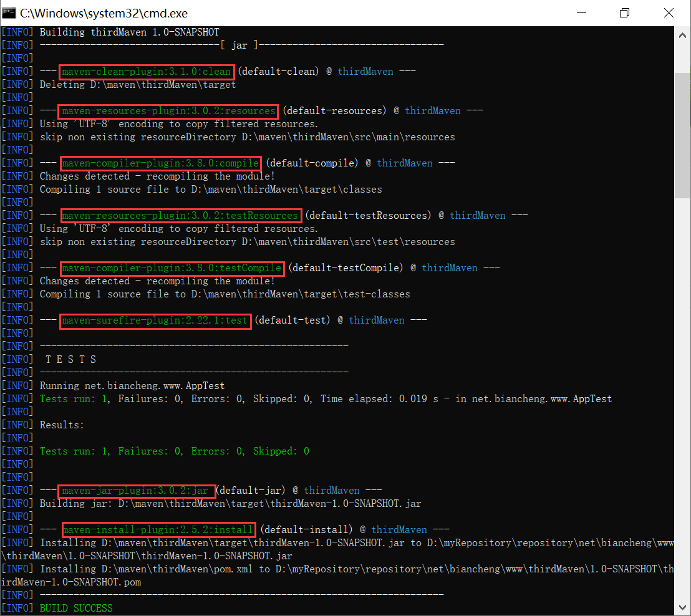

# Maven插件

Maven 实际上是一个依赖插件执行的框架，它执行的每个任务实际上都由插件完成的。Maven 的核心发布包中并不包含任何 Maven 插件，它们以独立构件的形式存在， 只有在 Maven 需要使用某个插件时，才会去仓库中下载。

如下表所示，Maven 提供了如下 2 种类型的插件。

| 插件类型          | 描述                                                       |
| ----------------- | ---------------------------------------------------------- |
| Build plugins     | 在项目构建过程中执行，在 pom.xml 中的 build 元素中配置     |
| Reporting plugins | 在网站生成过程中执行，在 pom.xml 中的 reporting 元素中配置 |

## 插件目标

对于 Maven 插件而言，为了提高代码的复用性，通常一个 Maven 插件能够实现多个功能，每一个功能都是一个插件目标，即 Maven 插件是插件目标的集合。我们可以把插件理解为一个类，而插件目标是类中的方法，调用插件目标就能实现对应的功能。

### 通用写法

插件目标的通用写法如下。

```
[插件名]:[插件目标名]
```

例如，maven-compiler-plugin 插件的 compile 目标的通用写法如下。

```
maven-compiler-plugin:compile
```

### 执行插件目标

使用 Maven 命令执行插件的目标，语法如下。

```
mvn [插件名]:[目标名]
```

例如，调用 maven-compiler-plugin 插件的 compile 目标，命令如下。

```
mvn compiler:compile
```

## 插件绑定

为了完成某个具体的构建任务，Maven 生命周期的阶段需要和 Maven 插件的目标相互绑定。例如，代码编译任务对应了default 生命周期的 compile 阶段，而 maven-compiler-plugin 插件的 compile 目标能够完成这个任务，因此将它们进行绑定就能达到代码编译的目的。

### 内置绑定

Maven 默认为一些核心的生命周期阶段绑定了插件目标，当用户调用这些阶段时，对应的插件目标就会自动执行相应的任务。

| 生命周期               | 阶段                                      | 插件目标                           | 执行的任务             |
| ---------------------- | ----------------------------------------- | ---------------------------------- | ---------------------- |
| clean                  | pre-clean                                 |                                    |                        |
| clean                  | maven-clean-plugin:clean                  | 清理 Maven 的输出目录              |                        |
| post-clean             |                                           |                                    |                        |
| site                   | pre-site                                  |                                    |                        |
| site                   | maven-site-plugin:site                    | 生成项目站点                       |                        |
| post-site              |                                           |                                    |                        |
| site-deploy            | maven-site-plugin:deploy                  | 部署项目站点                       |                        |
| default                | process-resources                         | maven-resources-plugin:resources   | 复制资源文件到输出目录 |
| compile                | maven-compiler-plugin:compile             | 编译代码到输出目录                 |                        |
| process-test-resources | maven-resources-plugin:testResources      | 复制测试资源文件到测试输出目录     |                        |
| test-compile           | maven-compiler-plugin:testCompile         | 编译测试代码到测试输出目录         |                        |
| test                   | maven-surefire-plugin:test                | 执行测试用例                       |                        |
| package                | maven-jar-plugin:jar/maven-jar-plugin:war | 创建项目 jar/war 包                |                        |
| install                | maven-install-plugin:install              | 将项目输出的包文件安装到本地仓库   |                        |
| deploy                 | maven-deploy-plugin:deploy                | 将项目输出的包文件部署到到远程仓库 |                        |

上表中，default 生命周期中只列出了绑定了插件目标的阶段，它还有很多其他的阶段，但这些阶段默认没有绑定任何插件目标，因此它们也没有任何实际的行为。

我们可以直接在执行 Maven 命令看到该构建过程包含了哪些插件目标。例如，在 Maven 项目中执行 mvn clean install 命令，能看到如下输出，图中标记的部分就是执行此命令时所调用的插件目标。



### 自定义绑定

除了内置绑定之外，用户也可以自己选择将某个插件目标绑定到 Maven 生命周期的某个阶段上，这种绑定方式就是自定义绑定。自定义绑定能够让 Maven 在构建过程中执行更多更丰富的任务。

例如，我们想要在 clean 生命周期的 clean 阶段中显示自定义文本信息，则只需要在项目的 POM 中 ，通过 build 元素的子元素 plugins，将 maven-antrun-plugin:run 目标绑定到 clean 阶段上，并使用该插件输出自定义文本信息即可。

```xml
<project>
...
    <build>
        <plugins>
            <!-- 绑定插件 maven-antrun-plugin -->
            <plugin>
                <groupId>org.apache.maven.plugins</groupId>
                <artifactId>maven-antrun-plugin</artifactId>
                <version>1.8</version>
                <executions>
                    <execution>
                        <!--自定义 id -->
                        <id>www.biancheng.net clean</id>
                        <!--插件目标绑定的构建阶段 -->
                        <phase>clean</phase>
                        <!--插件目标 -->
                        <goals>
                            <goal>run</goal>
                        </goals>
                        <!--配置 -->
                        <configuration>
                            <!-- 执行的任务 -->
                            <tasks>
                                <!--自定义文本信息 -->
                                <echo>清理阶段，编程帮 欢迎您的到来，网址：www.biancheng.net</echo>
                            </tasks>
                        </configuration>
                    </execution>               
                </executions>
            </plugin>
        </plugins>
    </build>
...
</project>
```

以上配置中除了插件的坐标信息之外，还通过 executions 元素定义了一些执行配置。executions 下的每一个 executin 子元素都可以用来配置执行一个任务。

execution 下各个元素含义如下：

- id：任务的唯一标识。
- phase：插件目标需要绑定的生命周期阶段。
- goals：用于指定一组插件目标，其子元素 goal 用于指定一个插件目标。
- configuration：该任务的配置，其子元素 tasks 用于指定该插件目标执行的任务。

**当插件目标绑定到生命周期的不同阶段时，其执行顺序由生命周期阶段的先后顺序决定。如果多个目标绑定到同一个生命周期阶段，其执行顺序与插件声明顺序一致，先声明的先执行，后声明的后执行。**