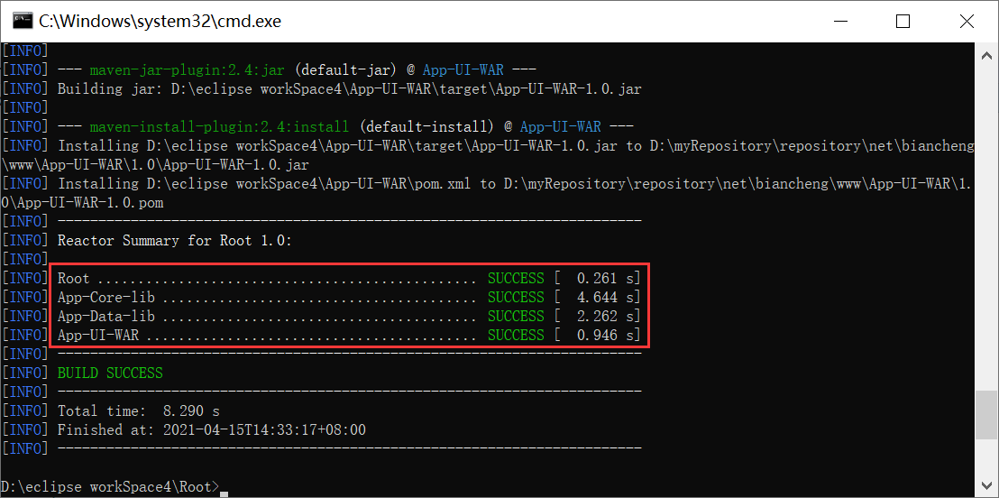

# Maven继承与聚合

## 继承

Maven 在设计时，借鉴了 Java 面向对象中的继承思想，提出了 POM 继承思想。

当一个项目包含多个模块时，可以在该项目中再创建一个父模块，并在其 POM 中声明依赖，其他模块的 POM 可通过继承父模块的 POM 来获得对相关依赖的声明。对于父模块而言，其目的是为了消除子模块 POM 中的重复配置，其中不包含有任何实际代码，因此父模块 POM 的打包类型（packaging）必须是 pom。

如图 1 所示，一个项目中存在如下多个模块。


如上图所示：

- App-UI-WAR 依赖于 App-Core-lib 和 App-Data-lib。
- Root 是 App-Core-lib 和 App-Data-lib 的父模块。
- Root 在它的依赖部分定义了 junit 4.9、mysql-connector-java 5.1.18 以及 c3p0 0.9.1 作为其依赖。
  App-UI-WAR 的 pom.xml 配置如下。

```xml
<project xmlns="http://maven.apache.org/POM/4.0.0"
         xmlns:xsi="http://www.w3.org/2001/XMLSchema-instance"
         xsi:schemaLocation="http://maven.apache.org/POM/4.0.0 https://maven.apache.org/xsd/maven-4.0.0.xsd">
    <modelVersion>4.0.0</modelVersion>
    <groupId>net.biancheng.www</groupId>
    <artifactId>App-UI-WAR</artifactId>
    <version>1.0</version>
    <dependencies>
        <!-- 依赖 App-Core-lib-->
        <dependency>
            <groupId>net.biancheng.www</groupId>
            <artifactId>App-Core-lib</artifactId>
            <version>1.0</version>
        </dependency>
        <!-- 依赖 App-Data-lib-->
        <dependency>
            <groupId>net.biancheng.www</groupId>
            <artifactId>App-Data-lib</artifactId>
            <version>1.0</version>
        </dependency>
    </dependencies>
</project>
```

### 父模块 POM 配置

父模块 Root 的 pom.xml 配置如下。

```xml
<project xmlns="http://maven.apache.org/POM/4.0.0"
         xmlns:xsi="http://www.w3.org/2001/XMLSchema-instance"
         xsi:schemaLocation="http://maven.apache.org/POM/4.0.0 https://maven.apache.org/xsd/maven-4.0.0.xsd">
    <modelVersion>4.0.0</modelVersion>
    <groupId>net.biancheng.www</groupId>
    <artifactId>Root</artifactId>
    <version>1.0</version>
    <!--定义的父类 POM 打包类型使pom  -->
    <packaging>pom</packaging>
   
    <dependencies>
        <dependency>
            <groupId>junit</groupId>
            <artifactId>junit</artifactId>
            <version>4.9</version>
            <scope>test</scope>
        </dependency>
        <dependency>
            <groupId>mysql</groupId>
            <artifactId>mysql-connector-java</artifactId>
            <version>5.1.18</version>
            <scope>runtime</scope>
        </dependency>
        <dependency>
            <groupId>c3p0</groupId>
            <artifactId>c3p0</artifactId>
            <version>0.9.1</version>
        </dependency>
    </dependencies>
</project>
```

在父模块 Root 的 pom.xml 中，其打包类型（packaging）为 pom，并声明了 3 个依赖：junit 4.9、mysql-connector-java 5.1.18 以及 c3p0 0.9.1 。

### 子模块 POM 配置

App-Core-lib 的 pom.xml 配置如下。

```xml
<project xmlns="http://maven.apache.org/POM/4.0.0"
         xmlns:xsi="http://www.w3.org/2001/XMLSchema-instance"
         xsi:schemaLocation="http://maven.apache.org/POM/4.0.0 https://maven.apache.org/xsd/maven-4.0.0.xsd">
    <modelVersion>4.0.0</modelVersion>
    <groupId>net.biancheng.www</groupId>
    <artifactId>App-Core-lib</artifactId>
    <version>1.0</version>
    <parent>
        <groupId>net.biancheng.www</groupId>
        <artifactId>Root</artifactId>
        <version>1.0</version>
        <relativePath>../Root</relativePath>
    </parent>
    <dependencies>
        <dependency>
            <groupId>log4j</groupId>
            <artifactId>log4j</artifactId>
            <version>1.2.17</version>
        </dependency>
    </dependencies>
</project>
```

App-Data-lib 的 pom.xml 配置如下。

```xml
<project xmlns="http://maven.apache.org/POM/4.0.0"
         xmlns:xsi="http://www.w3.org/2001/XMLSchema-instance"
         xsi:schemaLocation="http://maven.apache.org/POM/4.0.0 https://maven.apache.org/xsd/maven-4.0.0.xsd">
    <modelVersion>4.0.0</modelVersion>
    <groupId>net.biancheng.www</groupId>
    <artifactId>App-Data-lib</artifactId>
    <version>1.0</version>
    <parent>
        <groupId>net.biancheng.www</groupId>
        <artifactId>Root</artifactId>
        <version>1.0</version>
        <!-- <relativePath>../Root</relativePath> -->
    </parent>
</project>
```

在子模块 App-Core-lib 和 App-Data-lib 的 pom.xml 中，使用 parent 元素声明父模块，其子元素如下表：

| 元素         | 描述                                                         | 是否必需 |
| ------------ | ------------------------------------------------------------ | -------- |
| groupId      | 父模块的项目组 id。                                          | 是       |
| artifactId   | 父模块 id。                                                  | 是       |
| version      | 父模块版本。                                                 | 是       |
| relativePath | 父模块 POM 的相对路径，默认值为 ../pom.xml。 项目构建时，Maven 会先根据 relativePath 查找父模块 POM，如果找不到，再从本地仓库或远程仓库中查找。 | 否       |

子模块的 POM 中，当前模块的 groupId 和 version 元素可以省略，但这并不意味着当前模块没有 groupId 和 version，子模块会隐式的从父模块中继承这两个元素，即由父模块控制子模块的公司组织 id 以及版本，这样可以简化 POM 的配置。

### 查看继承依赖项

在 App-Core-lib 和 App-Data-lib 两个子模块的 pom.xml 中，只有 App-Core-lib 声明了一个依赖： log4j 1.2.17。那么如何验证子模块是否继承了父模块 POM 中声明的依赖项呢？

下面我们需要用到一个插件：maven-dependency-plugin，它可以帮助我们分析项目依赖，其插件目标 dependency:list 能够列出项目最终解析到的依赖列表，dependency:tree 能够进一步的描绘项目依赖树。

1.打开命令行窗口，跳转到子模块 App-Core-lib 的目录下，执行以下命令，查看该模块依赖列表。

```
mvn dependency:list
```

命令执行结果如下。

```
[INFO] Scanning for projects...
[INFO]
[INFO] -------------------< net.biancheng.www:App-Core-lib >-------------------
[INFO] Building App-Core-lib 1.0
[INFO] --------------------------------[ jar ]---------------------------------
[INFO]
[INFO] --- maven-dependency-plugin:2.8:list (default-cli) @ App-Core-lib ---
[INFO]
[INFO] The following files have been resolved:
[INFO]    junit:junit:jar:4.9:compile
[INFO]    log4j:log4j:jar:1.2.17:compile
[INFO]    c3p0:c3p0:jar:0.9.1:compile
[INFO]    mysql:mysql-connector-java:jar:5.1.18:runtime
[INFO]    org.hamcrest:hamcrest-core:jar:1.1:compile
[INFO]
[INFO] ------------------------------------------------------------------------
[INFO] BUILD SUCCESS
[INFO] ------------------------------------------------------------------------
[INFO] Total time:  0.921 s
[INFO] Finished at: 2021-04-14T15:09:18+08:00
[INFO] ------------------------------------------------------------------------
```

可以看到，App-Core-lib 有 5 个依赖项，其中 junit 4.9、mysql-connector-java 5.1.18 以及 c3p0 0.9.1 是从父模块 Root 中继承的；log4j 1.2.17 是该模块本身的 POM 中声明的；hamcrest 1.1 是 junit 4.9 传递下来的依赖项。 

2.在命令行窗口中，跳转到子模块 App-Data-lib 的目录下，执行以下命令，查看该模块依赖列表。

```
mvn dependency:list
```

命令执行结果如下。

```
[INFO] Scanning for projects...
[INFO]
[INFO] -------------------< net.biancheng.www:App-Data-lib >-------------------
[INFO] Building App-Data-lib 1.0
[INFO] --------------------------------[ jar ]---------------------------------
[INFO]
[INFO] --- maven-dependency-plugin:2.8:list (default-cli) @ App-Data-lib ---
[INFO]
[INFO] The following files have been resolved:
[INFO]    junit:junit:jar:4.9:compile
[INFO]    c3p0:c3p0:jar:0.9.1:compile
[INFO]    mysql:mysql-connector-java:jar:5.1.18:runtime
[INFO]    org.hamcrest:hamcrest-core:jar:1.1:compile
[INFO]
[INFO] ------------------------------------------------------------------------
[INFO] BUILD SUCCESS
[INFO] ------------------------------------------------------------------------
[INFO] Total time:  0.938 s
[INFO] Finished at: 2021-04-14T15:37:28+08:00
[INFO] ------------------------------------------------------------------------
```

可以看到，App-Data-lib 有 4 个依赖项，其中 junit 4.9、mysql-connector-java 5.1.18 以及 c3p0 0.9.1 是从父模块 Root 中继承的；hamcrest 1.1 是 junit 4.9 传递下来的依赖项。 

## 可继承的 POM 元素

在上面的例子中，我们可以看出 groupId、version 以及项目的依赖配置 dependencies 是可以被继承的，除了这 3 个元素之外，还有哪些元素可以被继承呢？

Maven 可通过继承获得 POM 元素，如下表。

| 元素                   | 描述                                                         |
| ---------------------- | ------------------------------------------------------------ |
| groupId                | 项目组 ID，项目坐标的核心元素                                |
| version                | 项目版本，项目坐标的核心元素                                 |
| description            | 项目的描述信息                                               |
| organization           | 项目的组织信息                                               |
| inceptionYear          | 项目的创始年份                                               |
| url                    | 项目的URL地址                                                |
| developers             | 项目的开发者信息                                             |
| contributors           | 项目的贡献者信息                                             |
| distributionManagement | 项目的部署配置                                               |
| issueManagement        | 项目的缺陷跟踪系统信息                                       |
| ciManagement           | 项目的持续集成系统信息                                       |
| scm                    | 项目的版本控制系统信息                                       |
| mailingLists           | 项目的邮件列表信息                                           |
| properties             | 自定义的Maven属性                                            |
| dependencies           | 项目的依赖配置                                               |
| dependencyManagement   | 项目的依赖管理配置                                           |
| repositories           | 项目的仓库配置                                               |
| build                  | 包括项目的源码目录配置、输出目录配置、插件配置、插件管理配置等 |
| reporting              | 包括项目的报告输出目录配置、报告插件配置等                   |

## dependencyManagement：管理Maven依赖

我们知道，子模块可以通过继承获得父模块中声明的全部依赖，这样虽然避免了在各个子模块 POM 中重复进行依赖声明，但也极有可能造成子模块中引入一些不必要的依赖。为此 Maven 引入了 dependencyManagement 来对依赖进行管理。

## 依赖管理

Maven 可以通过 dependencyManagement 元素对依赖进行管理，它具有以下 2 大特性：

- 在该元素下声明的依赖不会实际引入到模块中，只有在 dependencies 元素下同样声明了该依赖，才会引入到模块中。
- 该元素能够约束 dependencies 下依赖的使用，即 dependencies 声明的依赖若未指定版本，则使用 dependencyManagement 中指定的版本，否则将覆盖 dependencyManagement 中的版本。

例如，修改 App-Data-lib 模块的 pom.xml 如下：

```xml
<project xmlns="http://maven.apache.org/POM/4.0.0"
         xmlns:xsi="http://www.w3.org/2001/XMLSchema-instance"
         xsi:schemaLocation="http://maven.apache.org/POM/4.0.0 https://maven.apache.org/xsd/maven-4.0.0.xsd">

    <modelVersion>4.0.0</modelVersion>
    <!--由于不是继承，所以必须重新添加 groupId 和 version-->
    <groupId>net.biancheng.www</groupId>
    <artifactId>App-Data-lib</artifactId>
    <version>1.0</version>

    <!--dependencyManagement 标签用于控制子模块的依赖版本等信息 -->
    <!-- 该标签只用来控制版本，不能将依赖引入 -->
    <dependencyManagement>
        <dependencies>
            <dependency>
                <groupId>log4j</groupId>
                <artifactId>log4j</artifactId>
                <!--引用的properties标签中定义的属性 -->
                <version>1.2.17</version>
            </dependency>

            <dependency>
                <groupId>junit</groupId>
                <artifactId>junit</artifactId>
                <!--引用的properties标签中定义的属性 -->
                <version>4.9</version>
                <!-- <scope>test</scope> -->
            </dependency>

            <dependency>
                <groupId>mysql</groupId>
                <artifactId>mysql-connector-java</artifactId>
                <!--引用的properties标签中定义的属性 -->
                <version>5.1.18</version>
                <scope>runtime</scope>
            </dependency>

            <dependency>
                <groupId>c3p0</groupId>
                <artifactId>c3p0</artifactId>
                <!--引用的properties标签中定义的属性 -->
                <version>0.9.1</version>
            </dependency>
        </dependencies>
    </dependencyManagement>

    <!--声明依赖-->
    <dependencies>
        <dependency>
            <groupId>junit</groupId>
            <artifactId>junit</artifactId>
        </dependency>
    </dependencies>
</project>
```

在以上配置中，由于 dependencyManagement 元素中已经定义完整的依赖声明，所以在 dependencies 元素中声明的依赖只配置了 groupId 和 artifactId，省略了 version 和 scope。

在实际的开发过程中，dependencyManagement 很少会单独使用，通常它需要与 Maven 继承或依赖范围 import 配合使用才能展现它的优势。

## 继承依赖管理

由于 dependencyManagement 元素是可以被继承的，因此我们可以在父模块 POM 中使用 dependencyManagement 元素声明所有子模块的依赖，然后在各个子模块 POM 使用 dependencies 元素声明实际用到的依赖即可。这样既可以让子模块能够继承父模块的依赖配置，还能避免将不必要的依赖引入到子模块中。

1.修改父模块 Root 的 pom.xml 如下：

```xml
<project xmlns="http://maven.apache.org/POM/4.0.0"
         xmlns:xsi="http://www.w3.org/2001/XMLSchema-instance"
         xsi:schemaLocation="http://maven.apache.org/POM/4.0.0 https://maven.apache.org/xsd/maven-4.0.0.xsd">
    <modelVersion>4.0.0</modelVersion>
    <groupId>net.biancheng.www</groupId>
    <artifactId>Root</artifactId>
    <version>1.0</version>
    <!--定义的父类pom.xml 打包类型使pom -->
    <packaging>pom</packaging>
    <properties>
        <!-- 定义一些 maven 变量 -->
        <project.build.sourceEncoding>UTF-8</project.build.sourceEncoding>
        <log4j.version>1.2.17</log4j.version>
        <junit.version>4.9</junit.version>
        <system.version>1.0</system.version>
        <mysql.connector.version>5.1.18</mysql.connector.version>
        <c3p0.version>0.9.1</c3p0.version>
    </properties>

    <!--dependencyManagement 标签用于控制子模块的依赖版本等信息 -->
    <!-- 该标签只用来控制版本，不能将依赖引入 -->
    <dependencyManagement>
        <dependencies>
            <dependency>
                <groupId>log4j</groupId>
                <artifactId>log4j</artifactId>
                <!--引用的properties标签中定义的变量 -->
                <version>${log4j.version}</version>
            </dependency>

            <dependency>
                <groupId>junit</groupId>
                <artifactId>junit</artifactId>
                <!--引用的properties标签中定义的变量 -->
                <version>${junit.version}</version>
                <!-- <scope>test</scope> -->
            </dependency>

            <dependency>
                <groupId>mysql</groupId>
                <artifactId>mysql-connector-java</artifactId>
                <!--引用的properties标签中定义的变量 -->
                <version>${mysql.connector.version}</version>
                <scope>runtime</scope>
            </dependency>

            <dependency>
                <groupId>c3p0</groupId>
                <artifactId>c3p0</artifactId>
                <!--引用的properties标签中定义的变量 -->
                <version>${c3p0.version}</version>
            </dependency>
        </dependencies>
    </dependencyManagement>
</project>
```

注：以上配置中，将所有依赖的版本信息以 Maven 变量（properties）的形式提取出来，这样不仅消除了一些重复，也使得各个依赖的版本信息更加明显，便于管理。

在父模块 Root 中使用 dependencyManagement 元素声明的依赖，既不会给 Root 模块引入依赖，也不会给其子模块引入依赖，但这段配置是可以被继承的。

2.修改子模块 App-Core-lib 的 pom.xml 如下：

```xml
<project xmlns="http://maven.apache.org/POM/4.0.0"
         xmlns:xsi="http://www.w3.org/2001/XMLSchema-instance"
         xsi:schemaLocation="http://maven.apache.org/POM/4.0.0 https://maven.apache.org/xsd/maven-4.0.0.xsd">
    <modelVersion>4.0.0</modelVersion>
    <artifactId>App-Core-lib</artifactId>
    <parent>
        <groupId>net.biancheng.www</groupId>
        <artifactId>Root</artifactId>
        <version>1.0</version>
        <relativePath>../Root</relativePath>
    </parent>
    <dependencies>
        <dependency>
            <groupId>log4j</groupId>
            <artifactId>log4j</artifactId>
        </dependency>

        <dependency>
            <groupId>junit</groupId>
            <artifactId>junit</artifactId>
        </dependency>

        <dependency>
            <groupId>mysql</groupId>
            <artifactId>mysql-connector-java</artifactId>
        </dependency>
        <dependency>
            <groupId>c3p0</groupId>
            <artifactId>c3p0</artifactId>
        </dependency>
    </dependencies>
    <distributionManagement>
        <repository>
            <id>bianchengbang_Release_hosted</id>
            <url>http://localhost:8082/nexus/content/repositories/bianchengbang_Release_hosted/</url>
        </repository>
        <snapshotRepository>
            <id>Snapshot</id>
            <url>http://localhost:8082/nexus/content/repositories/bianchengbang_Snapshot_hosted/</url>
        </snapshotRepository>
    </distributionManagement>
</project>
```

3.修改子模块 App-Data-lib 的 pom.xml 如下。

```xml
<project xmlns="http://maven.apache.org/POM/4.0.0"
         xmlns:xsi="http://www.w3.org/2001/XMLSchema-instance"
         xsi:schemaLocation="http://maven.apache.org/POM/4.0.0 https://maven.apache.org/xsd/maven-4.0.0.xsd">

    <modelVersion>4.0.0</modelVersion>
    <artifactId>App-Data-lib</artifactId>
    <parent>
        <groupId>net.biancheng.www</groupId>
        <artifactId>Root</artifactId>
        <version>1.0</version>
    </parent>
   
    <dependencies>
        <dependency>
            <groupId>junit</groupId>
            <artifactId>junit</artifactId>
        </dependency>
    </dependencies>
</project>
```

在子模块 App-Core-lib 和 App-Data-lib 的 POM 中，所有在 dependencies 元素中声明的依赖都只配置了 groupId 和 artifactId，省去了 version 和 scope。之所以能够省略这些信息，是因为它们继承了父模块 Root 中 dependencyManagement 的配置，其完整的依赖声明已经包含在父模块的 POM 中，子模块只需要配置 groupId 和 artifactId 就能获得相应的依赖信息，从而引入正确的依赖。

使用这种依赖管理机制似乎并不能减少太多 POM 配置，但我们仍然推荐使用这种方式，其原因主要有 2 个：

- 在父模块中使用 dependencyManagement 声明依赖能够统一项目内依赖的版本，子模块无须声明版本，也就不会出现多个子模块使用同一依赖项版本不一致的情况，降低依赖冲突的几率。
- dependencyManagement 声明的依赖不会被实际引入，子模块需要什么依赖就自己引入，增加了灵活性，避免引入一些不必要的依赖。

## 导入依赖管理

在 **Maven 依赖传递** 一节介绍依赖范围时，提到了一个名为 import 的依赖范围，之所以要放在这介绍是因为 import 依赖范围只能与 dependencyManagement 元素配合使用才会有效，其功能是将目标 pom.xml 中的 dependencyManagement 配置导入合并到当前 pom.xml 的 dependencyManagement 中。

例如，App-Data-lib 模块想要使用 Root 模块中的 dependencyManagement 配置，除了通过继承或者直接复制这两种方式之外，还可以使用 import 依赖范围将其导入，具体配置如下。

```xml
<project xmlns="http://maven.apache.org/POM/4.0.0"
         xmlns:xsi="http://www.w3.org/2001/XMLSchema-instance"
         xsi:schemaLocation="http://maven.apache.org/POM/4.0.0 https://maven.apache.org/xsd/maven-4.0.0.xsd">

    <modelVersion>4.0.0</modelVersion>
    <!--由于不是继承，所以必须重新添加 groupId 和 version-->
    <groupId>net.biancheng.www</groupId>
    <artifactId>App-Data-lib</artifactId>
    <version>1.0</version>
    <!--定义依赖管理-->
    <dependencyManagement>
        <dependencies>
            <!--导入依赖管理配置-->
            <dependency>
                <groupId>net.biancheng.www</groupId>
                <artifactId>Root</artifactId>
                <version>1.0</version>
                <!--依赖范围为 import-->
                <scope>import</scope>
                <!--类型一般为pom-->
                <type>pom</type>
            </dependency>
        </dependencies>
    </dependencyManagement>

    <!--声明依赖-->
    <dependencies>
        <dependency>
            <groupId>junit</groupId>
            <artifactId>junit</artifactId>
        </dependency>
    </dependencies>
</project>
```

以上配置中，由于 import 依赖范围的特殊性，一般都是指向打包类型为 pom 的模块，所以 type 元素的值一般为 pom。

若存在多个模块，它们使用的依赖版本都是一致的，则就可以定义一个使用 dependencyManagement 专门管理依赖的 POM，然后在各个模块中导入这些依赖管理配置。

在实际的开发过程中，我们所接触的项目一般都由多个模块组成。在构建项目时，如果每次都按模块一个一个地进行构建会十分得麻烦，Maven 的聚合功能很好的解决了这个问题。

## 聚合

使用 Maven 聚合功能对项目进行构建时，需要在该项目中额外创建一个的聚合模块，然后通过这个模块构建整个项目的所有模块。聚合模块仅仅是帮助聚合其他模块的工具，其本身并无任何实质内容，因此聚合模块中只有一个 POM 文件，不像其他的模块一样包含 src/main/java、src/test/java 等多个目录。

与父模块相似，聚合模块的打包方式（packaging）也是 pom，用户可以在其 POM 中通过 modules 下的 module 子元素来添加需要聚合的模块的目录路径。

修改 Root 模块 POM 的配置如下：

```xml
<project xmlns="http://maven.apache.org/POM/4.0.0"
         xmlns:xsi="http://www.w3.org/2001/XMLSchema-instance"
         xsi:schemaLocation="http://maven.apache.org/POM/4.0.0 https://maven.apache.org/xsd/maven-4.0.0.xsd">
    <modelVersion>4.0.0</modelVersion>
    <groupId>net.biancheng.www</groupId>
    <artifactId>Root</artifactId>
    <version>1.0</version>
    <!--定义的父类pom.xml 打包类型使pom -->
    <packaging>pom</packaging>
    <properties>
        <!-- 定义一些属性 -->
        <project.build.sourceEncoding>UTF-8</project.build.sourceEncoding>
        <log4j.version>1.2.17</log4j.version>
        <junit.version>4.9</junit.version>
        <system.version>1.0</system.version>
        <mysql.connector.version>5.1.18</mysql.connector.version>
        <c3p0.version>0.9.1</c3p0.version>
    </properties>

    <!--dependencyManagement 标签用于控制子模块的依赖版本等信息 -->
    <!-- 该标签只用来控制版本，不能将依赖引入 -->
    <dependencyManagement>
        <dependencies>
            <dependency>
                <groupId>log4j</groupId>
                <artifactId>log4j</artifactId>
                <!--引用的properties标签中定义的属性 -->
                <version>${log4j.version}</version>
            </dependency>

            <dependency>
                <groupId>junit</groupId>
                <artifactId>junit</artifactId>
                <!--引用的properties标签中定义的属性 -->
                <version>${junit.version}</version>
                <!-- <scope>test</scope> -->
            </dependency>

            <dependency>
                <groupId>mysql</groupId>
                <artifactId>mysql-connector-java</artifactId>
                <!--引用的properties标签中定义的属性 -->
                <version>${mysql.connector.version}</version>
                <scope>runtime</scope>
            </dependency>

            <dependency>
                <groupId>c3p0</groupId>
                <artifactId>c3p0</artifactId>
                <!--引用的properties标签中定义的属性 -->
                <version>${c3p0.version}</version>
            </dependency>
        </dependencies>
    </dependencyManagement>

    <!--添加需要聚合的模块-->
    <modules>
        <module>../App-Core-lib</module>
        <module>../App-Data-lib</module>
        <module>../App-UI-WAR</module>
    </modules>
</project>
```

打开命令行窗口，跳转到 Root 模块所在目录，执行以下 Maven 命令，对 Root 进行构建。

```
mvn clean install
```

命令直接结果如下图：



聚合模块在构建时，Maven 会先解析聚合模块的 POM、分析需要构建的模块，并根据这些模块之间的关系计算出构建顺序，然后根据这个顺序依次构建各个模块。

构建完成后输出的是一个项目构建的小结报告，该报告中包括各个模块构建成功与否、构建花费的时间、以及整个构建构成所花费的时间等信息。

## 继承和聚合的关系

在实际的项目中，一个模块往往既是聚合模块又是其他项目的父模块，那么 Maven 的继承和聚合的关系是如何的呢？

Maven 的继承和聚合的目的不同，继承的目的是为了消除 POM 中的重复配置，聚合的目的是为了方便快速的构建项目。

对于继承中的父模块来说，它跟本不知道那些模块继承了它，但子模块都知道自己的父模块是谁。

对于聚合模块来说，它知道哪些模块被聚合了，但那些被聚合的模块根本不知道聚合模块的存在。

两者在结构和形式上还是有一定的共同点的，最直观的就是两者的打包方式都是 pom，两者除了 POM 外都没有实际的代码内容。