# RabbitMQ 入门

## 同步通讯和异步通讯

微服务间有两种通讯方式：

- **同步通讯**：就像打电话，需要实时响应。
- **异步通讯**：就像发邮件，不需要马上回复。


两种方式各有其优缺点：

打电话你可以立即得到响应，但是却不能同时跟多个人通话。

发送邮件可以允许我们同时与多个人收发邮件，但是响应往往会有延迟。

### 同步通讯

微服务间基于 Feign 的调用就属于同步方式，虽然调用可以实时得到结果，但存在下面的问题：

- **耦合度高**：每次加入新的需求，都要修改原来的代码
- **性能下降**：调用者需要等待服务提供者响应，如果调用链过长则响应时间等于每次调用的时间之和
- **资源浪费**：调用链中的每个服务在等待响应过程中，不能释放请求占用的资源，高井发场景下会极度浪费系统资源
- **级联失败**：如果服务提供者出现问题，所有调用方都会跟着出问题（如同多米诺骨牌一样）迅速导致整个微服务群故障

### 异步通讯

异步调用常见实现就是事件驱动模式。

以购买商品为例，用户支付后需要调用 **订单服务** 完成订单状态修改，调用 **物流服务**，从仓库分配响应的库存并准备发货。

在事件驱动模式中，支付服务是事件发布者（Publisher），在支付完成后只需要发布一个支付成功的事件（Event），事件中带上订单 id。

订单服务和物流服务是事件订阅者（Consumer），订阅支付成功的事件，监听到事件后完成自己业务即可。

为了解除事件发布者与订阅者之间的耦合，两者并不是直接通信，而是有一个中间人（Broker）。

发布者发布事件到 Broker，不关心谁来订阅事件。订阅者从 Broker 订阅事件，不关心谁发来的消息。


Broker 是一个像数据总线一样的东西，所有的服务要接收数据和发送数据都发到这个总线上，这个总线就像协议一样，让服务间的通讯变得标准和可控。

好处：

- **吞吐量提升**：无需等待订阅者处理完成，响应更快速

- **故障隔离**：服务没有直接调用，不存在级联失败问题
- **调用间没有阻塞**：不会造成无效的资源占用
- **耦合度极低**：每个服务都可以灵活插拔，可替换
- **流量削峰**：不管发布事件的流量波动多大，都由 Broker 接收，订阅者可以按照自己的速度去处理事件

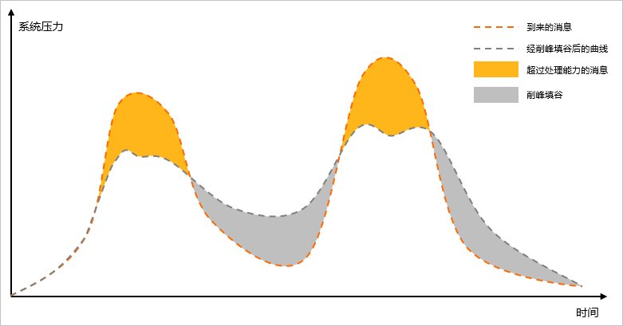

缺点：

- 依赖于 Broker 的可靠性、安全性、吞吐neng'l
- 架构复杂了，业务没有明显的流程线，不好管理

好在现在开源软件或云平台上 Broker 的软件是非常成熟的，比较常见的一种就是 MQ 技术。

## MQ 技术对比

MQ，中文是消息队列（Message Queue），字面来看就是存放消息的队列。也就是事件驱动架构中的 Broker。

几种常见 MQ 的对比：

|            | **RabbitMQ**                  | **ActiveMQ**                            | **RocketMQ** | **Kafka**    |
| ---------- | ----------------------------- | --------------------------------------- | ------------ | ------------ |
| 公司/社区  | Rabbit                        | Apache                                  | 阿里         | Apache       |
| 开发语言   | Erlang                        | Java                                    | Java         | Scala & Java |
| 协议支持   | AMQP，XMPP，<br />SMTP，STOMP | OpenWire，STOMP，<br />REST，XMPP，AMQP | 自定义协议   | 自定义协议   |
| 可用性     | 高                            | 一般                                    | 高           | 高           |
| 单机吞吐量 | 一般                          | 差                                      | 高           | 非常高       |
| 消息延迟   | 微秒级                        | 毫秒级                                  | 毫秒级       | 毫秒以内     |
| 消息可靠性 | 高                            | 一般                                    | 高           | 一般         |

追求可用性：Kafka、 RocketMQ 、RabbitMQ

追求可靠性：RabbitMQ、RocketMQ

追求吞吐能力：RocketMQ、Kafka

追求消息低延迟：RabbitMQ、Kafka

## 安装 RabbitMQ

RabbitMQ 是基于 Erlang 语言开发的开源消息通信中间件，官网地址：[https://www.rabbitmq.com](https://www.rabbitmq.com)

我们使用 Docker 来安装，在线拉取镜像：`docker pull rabbitmq:3.8-management`

再运行 MQ 容器，映射端口：

```shell
docker run \
 -e RABBITMQ_DEFAULT_USER=itcast \
 -e RABBITMQ_DEFAULT_PASS=123321 \
 -v mq-plugins:/plugins \
 --name mq \
 --hostname mq \
 -p 15672:15672 \
 -p 5672:5672 \
 -d \
 rabbitmq:3.8-management
```

## RabbitMQ 架构

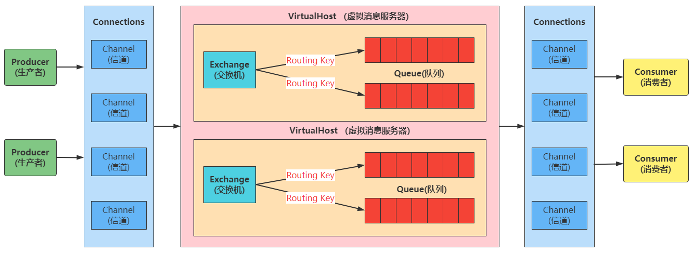

RabbitMQ 中的一些概念：

- **Message Broker**：消息代理服务器，一个虚拟的概念，RabbitMQ 是 Message Broker 的一个实例
- **Message**：消息由消息头（Header）和消息体（Body）组成。消息体的内容对于消息队列系统来说是不透明的，意味着系统不会试图解释其内容。而消息头包含了多个可选属性，用于控制消息的处理方式。这些属性包括：
  - **routing-key**（路由键）：用于指定消息应该被送往哪个或哪些队列。
  - **priority**（优先级）：定义了消息相对于队列中其他消息的处理优先级。
  - **delivery-mode**：指示消息是否需要持久化存储，以防服务器故障时消息丢失。
- **Publisher**：消息生产者，向交换器发布消息
- **Consumer**：消息消费者，从队列中获取消息。
- **Connection**：生产者与消费者通过 TCP 协议与消息代理服务器（Message Broker）创建的连接
- **Channel**：信道，创建在 Connection 中的虚拟连接，类似于连接数据库时的 **连接池** 的概念，生产者和消费者并不是直接与 MQ 通过 Connection 进行通讯的，而是通过 Channel 进行连接通讯的，数据的流动是在 Channel 中进行的。
- **Virtual Host**：虚拟主机，就像数据库中的数据库实例，可以指定用户对库和表等操作的设置权限。也可以类别成 Linux 系统中的不同用户，不同用户之间是相互独立的。每个 VirtualHost 相当于一个相对独立的 RabbitMQ 服务器，用来对资源做逻辑分组，隔离不同租户的 exchange、queue、message
- **Exchange**：交换机，直接与 Channel 连接，接收来自于消息生产者产生的数据，再由 Exchange 将消息路由到一个或多个 Queue 中（或者丢弃）。Exchange 并不存储消息。RabbitMQ 的交换机有多种类型，对应着不同的路由规则，根据不同的路由规则，交换机会将消息路由到不同的队列中。
- **Queue**：队列，用于存放消息
- **Routing Key**：路由键，用于匹配路由规则的依据，生产者在将消息发送到 Exchange 时，一般会指定一个 Routing Key，交换机会根据 Routing Key 来匹配 Binding 中设置的路由规则，将符合规则的消息发送到指定的队列中。
- **Binding**：交换机与队列之间的虚拟连接，在这个绑定中可以设置 Binding Key，一个绑定就是用一个 Binding Key 将交换器和队列连接起来，设置的 Binding Key 存在着一定的规则，Exchange 会将消息中携带的 Routing Key 与 Binding Key 中设置的规则进行匹配，将消息发送到相应的队列中。Binding 信息被保存到 Exchange 中的查询表中，用于 Exchange 将消息分发到队列的依据。
- **Channel**：信道，多路复用连接中的一条独立的双向数据流通道。信道是建立在真实的 TCP 连接内的虚拟连接，AMQP 命令都是通过信道发出去的，不管是发布消息、订阅队列还是接收消息，这些动作都是通过信道完成。因为对于操作系统来说建立和销毁 TCP 都是非常昂贵的开销，所以引入了信道的概念，以复用一条 TCP 连接。

## 常见消息模型

RabbitMQ 官方提供了 5 个不同的 Demo 示例，对应了不同的消息模型和用法：

- 基本消息队列（Basic Queue）：生产者、消费者模式

  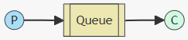

- 任务消息队列（Work Queue）：生产者、竞争消费者模式

  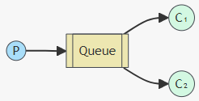

- 发布订阅模式（Publish、Subscribe），又根据交换机类型的不同分为三种：

  - Fanout Exchange：广播，一次向多个消费者发送消息

    

  - Direct Exchange：路由，选择性接收消息

    

  - Topic Exchange：主题，根据模式（主题）接收消息

    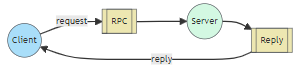

## 入门案例

简单队列模式的模型图：


官方的 HelloWorld 案例是基于最基础的消息队列模型来实现的，只包括三个角色：

- publisher：消息发布者，将消息发送到队列 queue

- queue：消息队列，负责接受并缓存消息

- consumer：订阅队列，负责处理队列中的消息

### 工程结构

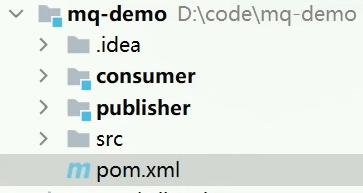

包括三部分：

- mq-demo：父工程，管理项目依赖
- publisher：消息发送者
- consumer：消息消费者

### publisher 实现

思路：

- 建立连接

- 开启信道

- 声明队列
- 发送消息
- 关闭连接和信道

代码实现：

```java
import com.rabbitmq.client.Channel;
import com.rabbitmq.client.Connection;
import com.rabbitmq.client.ConnectionFactory;
import org.junit.Test;

import java.io.IOException;
import java.util.concurrent.TimeoutException;

public class PublisherTest {
    @Test
    public void testSendMessage() throws IOException, TimeoutException {
        // 1. 创建 ConnectionFactory，用于配置和管理 RabbitMQ 连接
        ConnectionFactory factory = new ConnectionFactory();
        // 1.1 设置连接 RabbitMQ 的主要参数
        factory.setHost("192.168.150.101"); // 设置服务器地址
        factory.setPort(5672);              // 设置 RabbitMQ 服务端口，默认为5672
        factory.setVirtualHost("/");        // 设置虚拟主机，默认为“/”
        factory.setUsername("itcast");      // 设置连接用户名
        factory.setPassword("123321");      // 设置连接密码

        // 1.2 通过配置好的工厂创建与 RabbitMQ 的连接
        Connection connection = factory.newConnection();

        // 2. 开启一个通道，所有的消息发送都需要通过通道完成
        Channel channel = connection.createChannel();

        // 3. 声明（创建）队列，如果队列不存在，将会被创建
        String queueName = "simple.queue";
        // 参数解释：
        // - queueName: 队列名称
        // - durable: 是否持久化，true 表示 RabbitMQ 重启后队列仍然存在
        // - exclusive: 是否独占，true 表示该队列仅对首次声明它的连接可见，连接关闭后自动删除
        // - autoDelete: 是否自动删除，true 表示服务器将在不再使用时删除该队列
        // - arguments: 队列的其他属性（构造参数）
        channel.queueDeclare(queueName, false, false, false, null);
        
        // 4. 发送消息到队列中
        String message = "hello, rabbitmq!";
        // 参数解释：
        // - exchange: 交换机名称，这里用默认的（空字符串表示默认交换机）
        // - routingKey: 路由键，这里指定为队列名
        // - props: 消息的其他属性，如头信息
        // - body: 消息内容的字节数组
        channel.basicPublish("", queueName, null, message.getBytes());
        System.out.println("发送消息成功：【" + message + "】");
        
        // 5. 发送完成后关闭通道和连接，释放资源
        channel.close();
        connection.close();
    }
}
```

### consumer 实现

思路：

- 建立连接
- 开启信道
- 声明队列
- 订阅消息

代码实现：

```java
import com.rabbitmq.client.*;
import java.io.IOException;
import java.util.concurrent.TimeoutException;

public class ConsumerTest {

    public static void main(String[] args) throws IOException, TimeoutException {
        // 1. 创建 ConnectionFactory 对象用于连接 RabbitMQ 服务器
        ConnectionFactory factory = new ConnectionFactory();
        // 1.1 设置 RabbitMQ 的连接参数
        factory.setHost("192.168.150.101"); // 设置服务器的 IP 地址
        factory.setPort(5672);              // 设置服务器的端口号，默认端口为5672
        factory.setVirtualHost("/");        // 设置虚拟主机，若未进行特别设置，默认为 "/"
        factory.setUsername("itcast");      // 设置登录用户名
        factory.setPassword("123321");      // 设置登录密码
        
        // 1.2 建立到代理服务器的连接
        Connection connection = factory.newConnection();

        // 2. 创建Channel，通道是进行消息读写的通道
        Channel channel = connection.createChannel();

        // 3. 声明（创建）一个队列
        String queueName = "simple.queue";
        // 参数解释：
        // - queueName: 队列名称
        // - durable: 是否持久化，false 表示不持久化，即 RabbitMQ 重启后队列不再存在
        // - exclusive: 是否独占，false 表示不是独占队列
        // - autoDelete: 是否自动删除，false 表示不自动删除
        // - arguments: 队列的其他属性（构造参数）
        channel.queueDeclare(queueName, false, false, false, null);

        // 4. 订阅队列，自动确认消息
        // 使用 Lambda 表达式定义消费者行为
        DeliverCallback deliverCallback = (consumerTag, delivery) -> {
            String message = new String(delivery.getBody(), "UTF-8");
            System.out.println("接收到消息：【" + message + "】");
        };
        
        CancelCallback cancelCallback = consumerTag -> {
            System.out.println("消息消费被中断");
        };
        
        channel.basicConsume(queueName, true, deliverCallback, cancelCallback);
        
        System.out.println("等待接收消息。。。。");
    }
}
```

### channel.queueDeclare()

用于声明一个队列，如果该队列已经存在，这个方法会简单地连接到这个现有的队列。如果不存在，RabbitMQ会创建一个新的队列。

这是在消息队列系统中定义队列的一个基本操作，确保发送消息的通道或接收消息的消费者有一个确定的队列可用，避免消息被发送到不存在的队列中造成消息丢失。

入参解释：

1. **queue**：队列的名称。如果想让 RabbitMQ 为队列命名，可以留空。
2. **durable**：如果设置为 `true`，队列将在服务器重启后依然存在。持久化的队列会存储在磁盘上，而非持久化的队列存储在内存中，并在服务器重启时丢失。
3. **exclusive**：如果设置为 `true`，队列将被声明为此连接的专用队列，连接关闭时队列会自动删除。这意味着该队列只能由声明它的连接访问，并且该队列在连接关闭时自动删除。
4. **autoDelete**：如果设置为 `true`，一旦队列不再被使用，将自动删除。具体来说，最后一个消费者取消订阅后队列会被删除。
5. **arguments**：这是一个队列的可选参数，用于扩展队列的一些特性，例如消息的 TTL（生存时间），队列的最大长度等。

### channel.basicConsume()

用于启动对指定队列的消费，即接收来自队列的消息。这个方法基本上告诉 RabbitMQ 服务器，消费者（consumer）准备好接收并处理来自特定队列的消息了。

入参解释：

1. **queue**：要从中接收消息的队列名称。
2. **autoAck**：是否自动确认消息。如果设置为 `true`，服务器会认为一旦消息被发送给消费者就立即标记为确认。设置为 `false`，则消费者需要显式地发送确认信号给服务器，这有助于防止消息在处理中丢失（例如，如果消费者处理消息过程中发生故障）。
3. **callback**：一个实现了 `DeliverCallback` 接口的对象，用于定义当消息被投递时如何处理这些消息。这是消费者接收到消息后的回调处理逻辑。
4. **cancelCallback**（可选）：一个实现了 `CancelCallback` 接口的对象，用于定义当消费者被取消时的处理逻辑，比如当队列被删除或消费者由于其他原因被服务器取消时。

## Spring AMQP

Spring AMQP 是基于 RabbitMQ 封装的一套模板，并且还利用 SpringBoot 对其实现了自动装配，使用起来非常方便。

Spring AMQP 的官方地址：[https://spring.io/projects/spring-amqp](https://spring.io/projects/spring-amqp)

AMQP（Advanced Message Queuing Protocol）：高级消息队列协议，是用于在应用程序之间传递业务消息的开放标准。该协议与语言和平台无关，更符合微服务中独立性的要求。

Spring AMQP：Spring 基于 AMQP 协议定义的一套 API 规范，提供了模板来发送和接收消息。包含两部分，其中 spring-amqp 是基础抽象，spring-rabbit 是底层的默认实现。

Spring AMQP 提供了三个功能：

- 封装了 RabbitTemplate 工具，用于发送和接受消息
- 实现了基于注解的监听器模式，用于异步接收消息
- 提供了 RabbitAdmin 用于自动声明队列、交换机及其绑定关系

**注意：消息一旦消费就会从队列中删除，RabbitMO 没有消息回溯的功能**

### 引入 AMQP 依赖

在父工程 mq-demo 中引入依赖：

```xml
<!--AMQP依赖，包含RabbitMQ-->
<dependency>
    <groupId>org.springframework.boot</groupId>
    <artifactId>spring-boot-starter-amqp</artifactId>
</dependency>
```

### 编写配置文件

在 publisher 和 consumer 服务中都编写一份 `application.yml`，添加 MQ 连接信息：

```yaml
spring:
  rabbitmq:
    host: 192.168.150.101 # 主机名
    port: 5672 # 端口
    virtual-host: / # 虚拟主机
    username: itcast # 用户名
    password: 123321 # 密码
```

### Basic Queue 简单队列模型

#### 消息发送

然后在 publisher 服务中编写测试类 SpringAmqpTest，并利用 RabbitTemplate 实现消息发送：

```java
import org.junit.Test;
import org.junit.runner.RunWith;
import org.springframework.amqp.rabbit.core.RabbitTemplate;
import org.springframework.beans.factory.annotation.Autowired;
import org.springframework.boot.test.context.SpringBootTest;
import org.springframework.test.context.junit4.SpringRunner;

@RunWith(SpringRunner.class)
@SpringBootTest
public class SpringAmqpTest {

    @Autowired
    private RabbitTemplate rabbitTemplate;

    @Test
    public void testSimpleQueue() {
        // 队列名称
        String queueName = "simple.queue";
        // 消息
        String message = "hello, spring amqp!";
        // 发送消息
        rabbitTemplate.convertAndSend(queueName, message);
    }
}
```

#### 消息接收

然后在 consumer 服务的 `cn.itcast.mq.listener` 包中新建一个类 SpringRabbitListener，代码如下：

```java
import org.springframework.amqp.rabbit.annotation.RabbitListener;
import org.springframework.stereotype.Component;

@Component
public class SpringRabbitListener {

    @RabbitListener(queues = "simple.queue")
    public void listenSimpleQueueMessage(String msg) throws InterruptedException {
        System.out.println("spring 消费者接收到消息：【" + msg + "】");
    }
}
```

#### 工作流程

启动 consumer 服务，然后在 publisher 服务中运行测试代码，发送 MQ 消息。

### Work Queue 工作队列模型

Work queues，也被称为（Task queues），任务模型。简单来说就是 **让多个消费者绑定到一个队列，共同消费队列中的消息**。

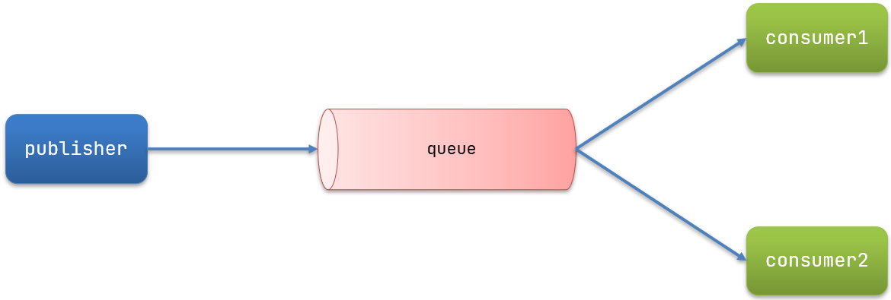

若消息处理是一个比较耗时的操作，则可能会出现一种情况：消息生产的速度会远远大于消息的消费速度，长此以往，就会造成 **消息堆积**。

>消息堆积的产生原因有很多，这里只是其中一种可能。

此时就可以使用 work 模型，多个消费者共同处理消息，提高处理速度，避免消息堆积。

#### 消息发送

这次我们采用循环来发送消息，模拟大量消息堆积现象。

在 publisher 服务中的 SpringAmqpTest 类中添加一个测试方法：

```java
/**
 * workQueue
 * 向队列中不停发送消息，模拟消息堆积。
 */
@Test
public void testWorkQueue() throws InterruptedException {
    // 队列名称
    String queueName = "simple.queue";
    // 消息
    String message = "hello, message_";
    for (int i = 0; i < 50; i++) {
        // 发送消息
        rabbitTemplate.convertAndSend(queueName, message + i);
        Thread.sleep(20);
    }
}
```

#### 消息接收

要模拟多个消费者绑定同一个队列，我们在 consumer 服务的 SpringRabbitListener 中添加 2 个新的方法：

```java
@RabbitListener(queues = "simple.queue")
public void listenWorkQueue1(String msg) throws InterruptedException {
    System.out.println("消费者1接收到消息：【" + msg + "】" + LocalTime.now());
    Thread.sleep(20);
}

@RabbitListener(queues = "simple.queue")
public void listenWorkQueue2(String msg) throws InterruptedException {
    System.err.println("消费者2........接收到消息：【" + msg + "】" + LocalTime.now());
    Thread.sleep(200);
}
```

我们让两个消费者处理任务时 sleep 不同的时间，模拟消费者的消费能力强弱。

启动 ConsumerApplication 后，在执行 publisher 服务中刚刚编写的发送测试方法 testWorkQueue 时，可以看到消费者 1 很快完成了自己的 25 条消息。消费者 2 却在缓慢的处理自己的 25 条消息。

而且消息是平均分配给了每个消费者，也就是说，消费者的处理能力差异在这里并没有被考虑到，性能被浪费了。

这种现象的产生与 RabbitMQ 的消息分发机制有关：

#### 默认的消息分发

默认情况下，RabbitMQ 在分发消息时是轮询（round-robin）的方式，这意味着每个消费者轮流接收队列中的消息。

当有多个消费者监听同一个队列时，RabbitMQ 会按顺序将每条新消息发送给下一个消费者，不考虑各消费者当前的负载或处理速度。

**这种方法确保了消息在所有消费者之间的初步公平分配。**

#### 消息预取（Prefetch Count）

RabbitMQ 默认将 `basicQos` 的预取值设为 1，这意味着 RabbitMQ 每次会向每个消费者发送一条消息，直到该消息被确认后才会发送下一条。如果消费者 1 迅速处理并确认消息，它将比消费者 2 接收到更多消息。由于消费者 2 处理消息较慢，导致它在相同时间内接收并处理的消息数量少于消费者 1。

但在 Spring AMQP 中，`prefetch` 默认值为 `250`。这是因为 Spring AMQP 的目标是提供合理的默认设置，以便在不牺牲性能的前提下进行合理的消息处理。

>### 消息预取机制
>
>在 RabbitMQ 中，消息预取（Prefetch Count）是一个关键的性能调整参数，它定义了消费者从队列中预先取得的消息的最大数量。这个设置决定了在消息被确认前，消费者可以保持多少未确认的消息。通过调整这个值，你可以控制消费者的工作负载和提高消息处理的效率。
>
>#### 功能和目的
>
>**提高效率**：通过允许消费者预先拉取多条消息，RabbitMQ可以减少等待服务器发送消息的时间，从而提高整体的消息处理速度。
>
>**负载均衡**：预取设置帮助在多个消费者间更公平地分配消息，特别是在高负载的情况下。确保没有单一消费者被过载，而其他消费者空闲。
>
>**可靠性增强**：通过限制未确认消息的数量，可以避免消费者在失败时丢失大量消息。这有助于系统更可靠地处理消息。
>
>#### 配置方式
>
>RabbitMQ中的预取值可以通过AMQP协议的 `basic.qos` 方法来设置，它可以在Channel层面进行设置。这意味着预取设置是按通道（Channel）而非按连接（Connection）进行配置的。
>
>当多个消费者订阅同一个Queue时，这时Queue中的消息会被平均分摊给多个消费者进行处理

#### 能者多劳

在 Spring 中有一个简单的配置，可以解决这个问题。在 consumer 服务的 `application.yml` 文件中添加配置：

```yaml
spring:
  rabbitmq:
    listener:
      simple:
        prefetch: 1 # 每次只能获取一条消息，处理完成才能获取下一个消息
```

### 发布（Publish）、订阅（Subscribe）模型

发布订阅模式与之前案例的区别就是允许将同一消息发送给多个消费者。实现方式是加入了 exchange（交换机）：

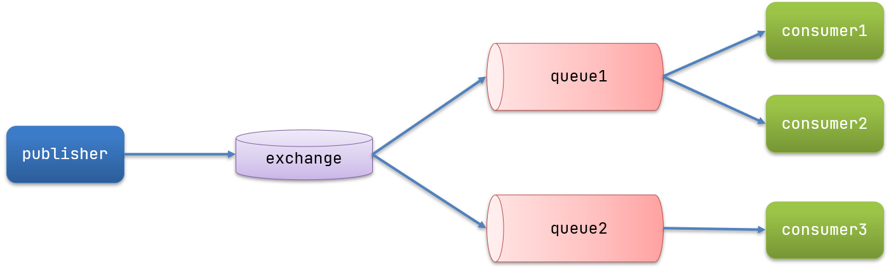

在发布订阅模型中，多了一个 exchange 角色，而且过程略有变化：

- **Publisher**：生产者，将消息发送给交换机
- **Exchange**：交换机。一方面接收生产者发送的消息，另一方面按照不同的路由规则来传递消息，例如递交给某个特别队列、递交给所有队列、或是将消息丢弃。具体如何操作，取决于 Exchange 的类型。Exchange 有以下 3 种类型：
  - **Fanout**：广播，将消息交给所有绑定到交换机的队列

  - **Direct**：定向，把消息交给符合指定 routing key 的队列

  - **Topic**：主题，把消息交给符合 routing pattern（路由模式） 的队列
- **Consumer**：消费者，订阅队列
- **Queue**：消息队列，存放消息

注意：**Exchange（交换机）只负责转发消息，其不具备存储消息的能力**，因此，如果没有任何队列与 Exchange 绑定，或者没有符合路由规则的队列，那么消息将会丢失！

### Fanout Exchange

Fanout Exchange 会将接收到的消息路由到每一个跟其绑定的 queue。

Fanout，英文翻译是扇出，但在 MQ 中叫 **广播** 也许更合适。

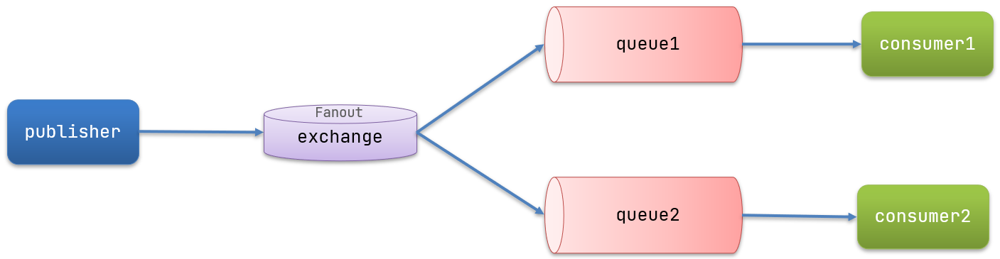

广播模式下的消息发送流程：

1. 可以有多个队列
2. 每个队列都要绑定到交换机
3. 生产者将消息发送到交换机，交换机来决定将消息转发到哪个队列
4. 交换机把消息发送给绑定过的所有队列
5. 订阅队列的消费者都能拿到消息

#### 操作实例

思路：

- 创建一个交换机 `itcast.fanout`，类型是 Fanout

- 创建两个队列 `fanout.queue1` 和 `fanout.queue2`，绑定到交换机 `itcast.fanout`


#### 编写配置类

Spring 提供了一个接口 Exchange，来表示所有不同类型的交换机：

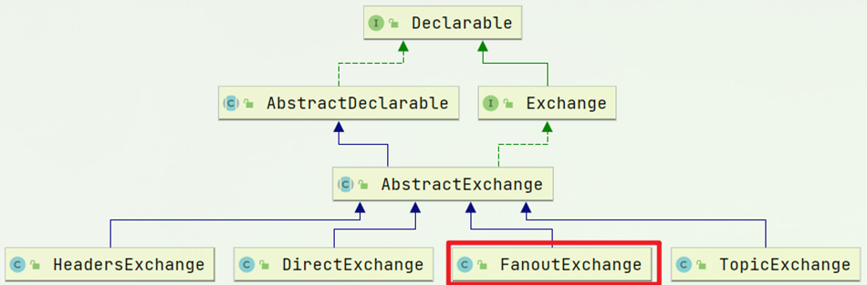

在 consumer 中创建一个类，添加 @Configuration 注解，并声明 FanoutExchange、Queue 和绑定
关系对象 Binding，代码如下：

```java
import org.springframework.amqp.core.Binding;
import org.springframework.amqp.core.BindingBuilder;
import org.springframework.amqp.core.FanoutExchange;
import org.springframework.amqp.core.Queue;
import org.springframework.context.annotation.Bean;
import org.springframework.context.annotation.Configuration;

@Configuration
public class FanoutConfig {
    /**
     * 声明交换机
     * @return Fanout类型交换机
     */
    @Bean
    public FanoutExchange fanoutExchange(){
        return new FanoutExchange("itcast.fanout");
    }

    /**
     * 第1个队列
     */
    @Bean
    public Queue fanoutQueue1(){
        return new Queue("fanout.queue1");
    }

    /**
     * 绑定队列1和交换机
     */
    @Bean
    public Binding bindingQueue1(Queue fanoutQueue1, FanoutExchange fanoutExchange){
        return BindingBuilder.bind(fanoutQueue1).to(fanoutExchange);
    }

    /**
     * 第2个队列
     */
    @Bean
    public Queue fanoutQueue2(){
        return new Queue("fanout.queue2");
    }

    /**
     * 绑定队列2和交换机
     */
    @Bean
    public Binding bindingQueue2(Queue fanoutQueue2, FanoutExchange fanoutExchange){
        return BindingBuilder.bind(fanoutQueue2).to(fanoutExchange);
    }
}
```

#### 消息发送

在 publisher 服务的 SpringAmqpTest 类中添加测试方法，现在消息不再发送给队列，而是发送给交换机：

```java
@Test
public void testFanoutExchange() {
    // 交换机名称
    String exchangeName = "itcast.fanout";
    // 消息
    String message = "hello, everyone!";
    // 发送消息到交换机，该方法有三个参数：
    // - exchange：消息将发送到的交换机的名称。
    // - routingKey：用于路由消息的键。这里被设置为空字符串，因为扇出交换机会忽略路由键。
    // - object：要发送的消息本身。
    rabbitTemplate.convertAndSend(exchangeName, "", message);
}
```

#### 消息接收

在 consumer 服务的 SpringRabbitListener 中添加两个方法，作为消费者：

```java
@RabbitListener(queues = "fanout.queue1")
public void listenFanoutQueue1(String msg) {
    System.out.println("消费者1接收到Fanout消息：【" + msg + "】");
}

@RabbitListener(queues = "fanout.queue2")
public void listenFanoutQueue2(String msg) {
    System.out.println("消费者2接收到Fanout消息：【" + msg + "】");
}
```

### Direct Exchange

在 Fanout 模式中，一条消息，会被所有订阅该交换机的队列都消费。

但在某些场景下，我们希望不同的消息被不同的队列所消费，这时就要用到 Direct 类型的 Exchange 了。

Direct Exchange 会将接收到的消息根据规则路由到指定的 Queue，因此被称为路由模式（routes）。


 在 Direct 模型下：

- 队列与交换机的绑定，不能是任意绑定了，而是要指定一个`RoutingKey`（路由 key ）
- 消息的发送方在向 Exchange 发送消息时，也必须指定消息的 `RoutingKey`
- Exchange 不再把消息交给每一个绑定的队列，而是根据消息的 `Routing Key` 进行判断，只有队列的 `Routingkey` 与消息的 `Routing key` 完全一致，才会接收到消息

#### 操作实例

思路：

1. 利用注解 `@RabbitListener` 声明 Exchange、Queue、RoutingKey

2. 在 consumer服务中，编写两个消费者方法，分别监听 `direct.queue1` 和 `direct.queue2`
3. 在 publisher 中编写测试方法，向 `itcast.direct`发送消息

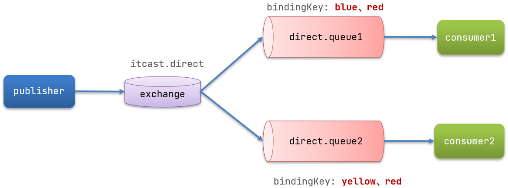

#### 消息发送

在 publisher 服务的 SpringAmqpTest 类中添加测试方法：

```java
@Test
public void testSendDirectExchange() {
  // 交换机名称
  String exchangeName = "itcast.direct";
  // 消息
  String message = "红色警报！日本乱排核废水，导致海洋生物变异，惊现哥斯拉！";
  // 发送消息
  rabbitTemplate.convertAndSend(exchangeName, "red", message);
}
```

#### 消息接收（基于注解来声明队列、交换机）

使用配置类来声明队列和交换机比较麻烦，Spring 其实还提供了更简单的基于注解 `@RabbitListener` 的方式。

在 consumer 的 SpringRabbitListener 类中添加两个消费者，同时使用注解 `@RabbitListener` 来声明队列和交换机：

```java
@RabbitListener(bindings = @QueueBinding(
    value = @Queue(name = "direct.queue1"),
    exchange = @Exchange(name = "itcast.direct", type = ExchangeTypes.DIRECT),
    key = {"red", "blue"}
))
public void listenDirectQueue1(String msg){
    System.out.println("消费者接收到direct.queue1的消息：【" + msg + "】");
}

@RabbitListener(bindings = @QueueBinding(
    value = @Queue(name = "direct.queue2"),
    exchange = @Exchange(name = "itcast.direct", type = ExchangeTypes.DIRECT),
    key = {"red", "yellow"}
))
public void listenDirectQueue2(String msg){
    System.out.println("消费者接收到direct.queue2的消息：【" + msg + "】");
}
```

#### 注解说明

- **@RabbitListener**：该注解用于标记方法，使其作为消息监听器，即这个方法会自动处理符合条件的消息。
- **@QueueBinding**：这个注解定义了队列、交换机和路由键之间的绑定关系。
  - **@Queue**：定义了一个队列。`name = "direct.queue1"` 设置了队列的名称。
  - **@Exchange**：定义了一个交换机。`name = "itcast.direct"` 设置了交换机的名称，`type = ExchangeTypes.DIRECT` 指定了交换机类型为直接（Direct）。
  - **key**：定义了路由键，比如设置为 `red` 和`blue`，意味着只有这些路由键的消息会被路由到这个队列。

**注意：如果多个队列具有相同的 RoutingKey，则与 Fanout 功能类似**

### Topic Exchange

`Topic` 类型的 `Exchange` 与 `Direct` 相比，都是可以根据 `RoutingKey` 把消息路由到不同的队列。

区别在于 `Topic` 的 routingKey 可以是多个单词的列表，并且以 `.` 分割，例如 `item.insert`。

`Topic` 类型的 `Exchange` 可以让队列在绑定 `Routing key` 的时候使用通配符。

通配符规则：

- `#`：匹配一个或多个词
- `*`：匹配恰好 1 个词

举例：

`item.#`：能够匹配 `item.spu.insert`  或者 `item.spu`

`item.*`：只能匹配 `item.spu`

图示：


解释：

- Queue1 绑定的是 `china.#` ，因此凡是以 `china.` 开头的 `routing key` 都会被匹配到，包括 `china.news` 和 `china.weather`

- Queue2 绑定的是 `#.news` ，因此凡是以 `.news `结尾的 `routing key` 都会被匹配，包括 `china.news` 和 `japan.news`

#### 操作实例

思路：

1. 利用注解 `@RabbitListener` 声明Exchange、Queue、RoutingKey
2. 在 consumer 服务中，编写两个消费者方法，分别监听 `topic.queue1` 和 `topic.queue2`

3. 在 publisher 中编写测试方法，向 `itcast.topic` 发送消息

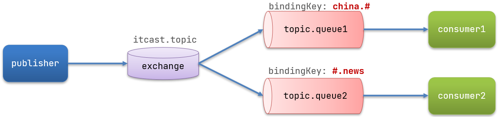

#### 消息发送

在 publisher 服务的 SpringAmqpTest 类中添加测试方法：

```java
/**
 * topicExchange
 */
@Test
public void testSendTopicExchange() {
    // 交换机名称
    String exchangeName = "itcast.topic";
    // 消息
    String message = "喜报！孙悟空大战哥斯拉，胜!";
    // 发送消息
    rabbitTemplate.convertAndSend(exchangeName, "china.news", message);
}
```

#### 消息接收

在 consumer 服务的 SpringRabbitListener 中添加方法：

```java
@RabbitListener(bindings = @QueueBinding(
    value = @Queue(name = "topic.queue1"),
    exchange = @Exchange(name = "itcast.topic", type = ExchangeTypes.TOPIC),
    key = "china.#"
))
public void listenTopicQueue1(String msg){
    System.out.println("消费者接收到topic.queue1的消息：【" + msg + "】");
}

@RabbitListener(bindings = @QueueBinding(
    value = @Queue(name = "topic.queue2"),
    exchange = @Exchange(name = "itcast.topic", type = ExchangeTypes.TOPIC),
    key = "#.news"
))
public void listenTopicQueue2(String msg){
    System.out.println("消费者接收到topic.queue2的消息：【" + msg + "】");
}
```

### 消息转换器

在 Spring AMQP 中，消息转换器（Message Converter）是处理消息内容的转换逻辑，将 Java 对象转换为消息体（通常是字节流）以便发送，或将接收到的消息体转换回 Java 对象。

这对于保证消息可以在生产者和消费者之间正确地传递和识别至关重要。

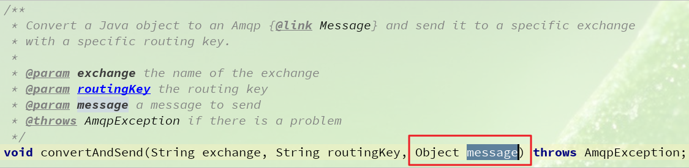

默认情况下 Spring 采用的序列化方式是 JDK 序列化（ Java 的内置序列化机制），虽然是一种快速实现对象持久化的方式，但在实际应用中，尤其是在高性能和高可扩展性的分布式系统中，存在一些显著的问题和局限性：

1. **效率低下**
   - **空间效率**：JDK 序列化后的数据通常比其他序列化框架（如Protocol Buffers、JSON等）生成的数据大得多。这是因为它存储了大量的元数据（包括类结构、签名、类版本等），增加了网络传输的负担。
   - **时间效率**：序列化和反序列化的过程较慢，尤其是在涉及复杂对象图时。这在性能敏感的应用中可能成为瓶颈。

2. **跨语言能力差**：JDK 序列化是 Java 特有的，它不支持跨语言调用，这限制了其在多语言环境下的应用。与之相比，如 JSON、XML、Protocol Buffer s等格式则广泛支持多种编程语言。

3. **版本兼容性问题**
   - 当对象的版本发生变化时（例如，类的字段被添加或移除），原来序列化的数据可能无法被正确反序列化，除非特别小心地管理类的版本（通过 `serialVersionUID` 等）。
   - 需要在类中显式管理 `serialVersionUID` 以处理类定义的变化，这增加了维护成本。

4. **安全性问题**
   - JDK 序列化机制已知存在一些安全漏洞，特别是在反序列化时容易受到攻击，如攻击者可以利用类路径上的恶意类触发漏洞（例如，通过构造恶意的序列化数据）。
   - 常见的攻击如反序列化漏洞，可能导致远程代码执行（RCE），这是在 Java 应用中一个非常严重的安全风险。

#### 测试默认转换器

修改消息发送的代码，这次不发送 String 而是发送一个 Map 对象：

```java
@Test
public void testSendMap() throws InterruptedException {
    // 准备消息
    Map<String,Object> msg = new HashMap<>();
    msg.put("name", "Jack");
    msg.put("age", 21);
    // 发送消息
    rabbitTemplate.convertAndSend("simple.queue","", msg);
}
```

在不启动 consumer 服务的情况下，发送消息后查看控制台：

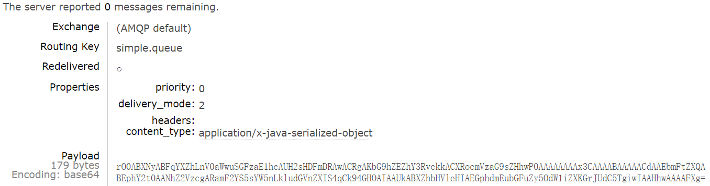

#### 配置 JSON 转换器

显然，JDK 序列化方式并不合适。我们希望消息体的体积更小、可读性更高，因此可以使用 JSON 方式来做序列化和反序列化。

步骤如下:

1. 在 publisher 和 consumer 两个服务中都引入依赖：

   ```xml
   <dependency>
       <groupId>com.fasterxml.jackson.core</groupId>
       <artifactId>jackson-databind</artifactId>
       <version>2.13.0</version>  <!-- 使用最新的可用版本 -->
   </dependency>
   ```

2. 在 Spring 的配置类中配置 `RabbitTemplate` 的 bean：

   ```java
   import org.springframework.amqp.rabbit.connection.ConnectionFactory;
   import org.springframework.amqp.rabbit.core.RabbitTemplate;
   import org.springframework.amqp.support.converter.Jackson2JsonMessageConverter;
   import org.springframework.context.annotation.Bean;
   import org.springframework.context.annotation.Configuration;
   
   @Configuration
   public class RabbitConfig {
   
       @Bean
       public RabbitTemplate rabbitTemplate(ConnectionFactory connectionFactory) {
           RabbitTemplate template = new RabbitTemplate(connectionFactory);
           template.setMessageConverter(jsonMessageConverter()); // 设置消息转换器
           return template;
       }
   
       @Bean
       public Jackson2JsonMessageConverter jsonMessageConverter() {
           return new Jackson2JsonMessageConverter();
       }
   }
   ```

   在这个配置中，`RabbitTemplate `被配置为使用 `Jackson2JsonMessageConverter`，这样发送和接收的所有消息都将自动以 JSON 的形式进行序列化和反序列化。

3. 配置 `@RabbitListener` 使用 `Jackson2JsonMessageConverter`：

   ```java
   import org.springframework.amqp.rabbit.config.SimpleRabbitListenerContainerFactory;
   import org.springframework.amqp.rabbit.listener.RabbitListenerContainerFactory;
   import org.springframework.context.annotation.Bean;
   
   @Bean
   public RabbitListenerContainerFactory<?> rabbitListenerContainerFactory(ConnectionFactory connectionFactory) {
       SimpleRabbitListenerContainerFactory factory = new SimpleRabbitListenerContainerFactory();
       factory.setConnectionFactory(connectionFactory);
       factory.setMessageConverter(jsonMessageConverter());
       return factory;
   }
   ```

   如果使用 `@RabbitListener `来接收消息，并希望这些消息被自动转换为 Java 对象，就需要配置上述的消息监听器容器工厂（`SimpleRabbitListenerContainerFactory`），以使用同样的消息转换器
