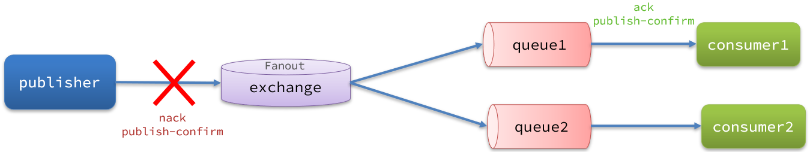
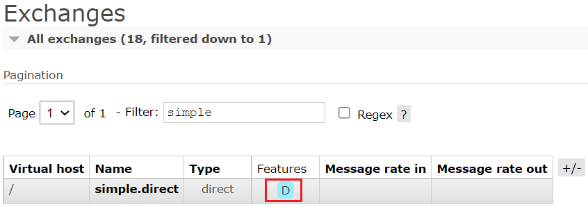
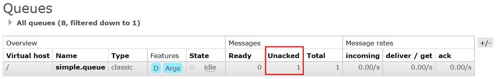
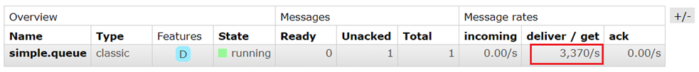
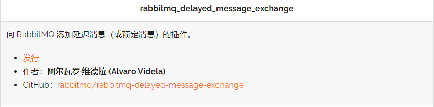
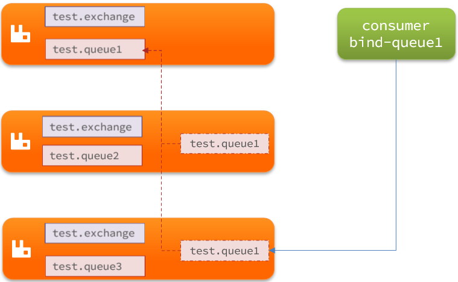
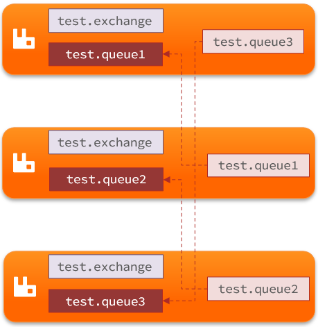

# RabbitMQ 进阶

消息队列在使用过程中，面临着很多实际问题需要思考：

- **消息可靠性**：如何确保发送的消息至少被消费一次
- **延迟消息**：如何实现消息的延迟投递
- **消息堆积**：如何解决数百万消息堆积，无法及时消费的问题
- **高可用**：如何避免单点 MQ 故障而导致的不可用问题

## 消息可靠性

从生产者发送消息到消费者接收消息，消息的流转会经过多个步骤：


其中每一步出问题都可能导致消息丢失，常见的丢失原因有：

- 发送时丢失：
  - publisher 发送的消息未送达 exchange
  - 消息到达 exchange 后未到达 queue
- MQ 宕机，queue 将消息丢失
- consumer 接收到消息后未消费就宕机

针对这些潜在的问题，RabbitMQ 给出了各阶段的解决方案：

- **开启生产者确认机制**：确保每条消息都成功到达 RabbitMQ。
- **启用消息持久化**：设置消息和队列的持久化属性，确保消息在服务器重启后不会丢失。
- **采用自动确认机制（Auto ACK）**：让 Spring 自动管理消息的确认，只有在处理成功时才发送 ACK。
- **配置消费者失败重试机制**：并结合 `MessageRecoverer` 实现，确保多次重试失败后将消息安全地转移到专用的异常处理队列。

下面通过案例来演示每一个步骤。

项目结构如下：


### 生产者确认机制

生产者确认机制（Publisher Confirms）是 RabbitMQ 提供的一个功能，它允许生产者知道其消息是否已成功被RabbitMQ服务器接收。

使用这种机制的前提是必须给每个消息指定唯一 id。消息发送到 MQ 以后，会返回一个结果给发送者，来表示消息是否处理成功。

返回结果有两种方式：

- publisher-confirm，生产者确认
  - 消息成功投递到交换机，返回 ACK（Acknowledgement）
  - 消息未投递到交换机，返回 NACK（Negative Acknowledgement）
- publisher-return，生产者回执
  - 消息投递到交换机了，但是没有路由到队列，则返回 ACK，及路由失败原因。



**注意：在生产者确认机制中，发送消息时需要给每个消息设置一个全局唯一 id，以区分不同的消息，避免 ACK 冲突**

#### 修改配置

首先，修改 publisher 服务中的 `application.yml` 文件，添加配置信息：

```yaml
spring:
  rabbitmq:
    publisher-confirm-type: correlated
    publisher-returns: true
    template:
      mandatory: true
```

配置说明：

- **publish-confirm-type**：启用 publisher-confirm 机制，这里支持两种类型：
  - **simple**：同步等待 confirm 结果，直到超时（不推荐）
  - **correlated**：异步回调，定义 ConfirmCallback，MQ 返回结果时会回调这个 ConfirmCallback
- **publish-returns**：启用 publish-return 功能，同样是基于 callback 机制，不过是定义 ReturnCallback
- **template.mandatory**：定义消息路由失败时的策略：
  - **true**：则调用 ReturnCallback
  - **false**：则直接丢弃消息

#### ReturnCallback

ReturnCallback 用于处理那些无法被路由到任何队列的消息。

在 RabbitMQ 中，如果消息不能根据路由键被路由到任何匹配的队列，并且消息的 `mandatory` 标志被设置为 `true`，则消息会被返回给生产者。

**每个 RabbitTemplate 只能配置一个 ReturnCallback**，因此需要在项目加载时就配置好。

修改 publisher 服务，添加一个配置：

```java
import lombok.extern.slf4j.Slf4j;
import org.springframework.amqp.rabbit.core.RabbitTemplate;
import org.springframework.beans.BeansException;
import org.springframework.context.ApplicationContext;
import org.springframework.context.ApplicationContextAware;
import org.springframework.context.annotation.Configuration;

@Slf4j
@Configuration
public class CommonConfig implements ApplicationContextAware {
    @Override
    public void setApplicationContext(ApplicationContext applicationContext) throws BeansException {
        // 获取RabbitTemplate
        RabbitTemplate rabbitTemplate = applicationContext.getBean(RabbitTemplate.class);
        // 设置ReturnCallback
        rabbitTemplate.setReturnCallback((message, replyCode, replyText, exchange, routingKey) -> {
            // 投递失败，记录日志
            log.info("消息发送失败，应答码{}，原因{}，交换机{}，路由键{},消息{}",
                     replyCode, replyText, exchange, routingKey, message.toString());
            // 如果有业务需要，可以重发消息
        });
    }
}
```

#### ConfirmCallback

ConfirmCallback 用于告诉生产者消息是否已成功被 RabbitMQ 服务器接收。

这种确认是基于消息到达服务器的通知，不保证消息已被持久化到磁盘或已投递到消费者。

因为每个业务处理 confirm 成功或失败的逻辑可能不同，所以 ConfirmCallback 可以在发送消息时单独指定。

在 publisher 服务中，定义一个单元测试方法：

```java
public void testSendMessage2SimpleQueue() throws InterruptedException {
    // 1.消息体
    String message = "hello, spring amqp!";
    // 2.全局唯一的消息 ID，需要封装到 CorrelationData 中
    CorrelationData correlationData = new CorrelationData(UUID.randomUUID().toString());
    // 3.添加 callback
    correlationData.getFuture().addCallback(
        result -> {
            if(result.isAck()){ // 3.1.ACK，消息成功
                log.debug("消息发送成功, ID:{}", correlationData.getId());
            }else{              // 3.2.NACK，消息失败
                log.error("消息发送失败, ID:{}, 原因{}",correlationData.getId(), result.getReason());
            }
        },
        ex -> log.error("消息发送异常, ID:{}, 原因{}",correlationData.getId(),ex.getMessage())
    );
    // 4.发送消息
    rabbitTemplate.convertAndSend("task.direct", "task", message, correlationData);

    // 休眠一会儿，等待 ACK 回执
    Thread.sleep(2000);
}
```

- CorrelationData 对象用于维护消息的元数据，其中最重要的是包含一个全局唯一的消息 ID，这里使用 `UUID.randomUUID().toString()` 生成。这个 ID 用于追踪消息的状态，并在消息确认机制中识别具体的消息。
- UUID（Universally Unique Identifier）确保在所有时间和空间中的唯一性，非常适合用作消息的唯一标识符。
- `correlationData.getFuture()` 返回一个 `ListenableFuture<Confirm>` 对象，它是一个异步结果的表示，可以添加回调来处理消息发送的确认结果。
  - 成功回调：如果消息被 RabbitMQ 服务器确认接收（ACK），则执行成功回调，记录一个调试信息表示消息发送成功。
  - 失败回调：如果消息发送失败，也就是消息被拒绝（NACK），则执行失败回调，记录错误日志包含失败原因。
  - 异常回调：另外一个回调用于处理在发送过程中可能发生的异常，如网络问题等。

### 消息持久化

尽管生产者确认机制确保了消息能够成功到达 RabbitMQ，但由于 MQ 默认情况下仅在内存中存储消息，所以消息发送到 RabbitMQ 以后，如果服务器突然宕机，就可能导致消息丢失。

要想确保在发生故障时，消息在 RabbitMQ 中也不会丢失，应采用以下的持久化策略：

- 交换机持久化
- 队列持久化
- 消息持久化

#### 交换机持久化

创建持久的交换机可以确保在 RabbitMQ 重启后 **交换机的配置不会丢失**。虽然这不直接影响消息的持久化，但它是保持消息路由稳定性的重要部分。

在声明交换机时，应设置其为持久化：

```java
@Bean
public DirectExchange simpleExchange(){
    String exchangeName = "simple.direct"; // 交换机的名称
    boolean durable = true; // 交换机是否持久化
    boolean autoDelete = false; // 当没有队列绑定到交换机时，交换机是否自动删除

    // 创建DirectExchange对象，使用明确命名的参数以增强代码可读性
    return new DirectExchange(exchangeName, durable, autoDelete);
}
```

事实上，默认情况下，由 SpringAMQP 声明的交换机都是持久化的，在 RabbitMQ 控制台中可以看到持久化的交换机都会带上 D（durable）的标示：



#### 队列持久化

持久化队列可以确保队列的元数据（例如队列名、绑定关系等）和状态在服务器重启后依然保持，这对于确保与该队列相关联的消息的安全尤为重要，尽管 **这种持久化并不直接涉及到队列中的消息**。

声明持久队列的方式如下：

```java
@Bean
public Queue simpleQueue(){
    
    String queueName  = "simple.queue"; // 队列的名称
    
    // 使用 QueueBuilder 构建队列，durable 就是持久化的
    return QueueBuilder.durable(queueName ).build();
}
```

事实上，默认情况下，由 SpringAMQP 声明的队列都是持久化的，在 RabbitMQ 控制台中可以看到看到持久化的队列都会带上 D（durable）的标示：


#### 消息持久化

即使队列本身被设置为持久化，消息本身也需要被明确设置为持久化，才能保证其在服务器宕机时不丢失。

可以通过设置消息属性（Message Properties）中的 Delivery Mode 来实现消息持久化，确保消息存储在磁盘上，直到被消费。

代码实例：

```java
// @Test
public void testDurableMessage(){
    // 创建消息
    Message message = MessageBuilder
        .withBody("hello, ttl queue".getBytes(standardcharsets.UTF_8))
        .setDeliveryMode(MessageDeliveryMode.PERSISTENT)
        .build();
    // 消息 ID，需要封装到 CorrelationData 中
    CorrelationData correlationData = new CorrelationData(UUID.randomUUID().tostring()); 
    // 发送消息
    rabbitTemplate.convertAndSend( routingKey: "simple.queue", message, correlationData);
    // 记录日志
    log.debug("发送消息成功");
}
```

事实上，默认情况下，SpringAMQP 发出的任何消息都是持久化的，无需特意指定。

#### 持久化的实际过程

当消息和队列都被正确配置为持久化后，消息的持久化过程为：

- **消息到达**：当消息发送到 RabbitMQ 时，它首先被接收到内存中。
- **写入磁盘**：消息在被路由到相应的持久化队列后，RabbitMQ 将尽快将这些消息写入磁盘以保证它们的持久性。这个写入操作通常是异步进行的，以提高性能。
- **确认写入**：一旦消息成功写入磁盘，如果配置了消息确认机制（Publisher Confirms），生产者可以接收到一个确认消息，表明消息已被持久化存储。

### 消费者确认机制

在 RabbitMQ 中，消息处理遵循 **阅后即焚** 的机制，即一旦消息被确认消费，RabbitMQ 便会从队列中删除该消息。

消息的确认通常依赖于消费者发回的确认信号（ACK），表明消息已经被成功接收并处理。

考虑以下场景以理解此机制的重要性：

1. **消息投递**：RabbitMQ 向消费者投递一条消息。
2. **消息确认**：消费者处理消息并向 RabbitMQ 发送 ACK，确认消息已接收。
3. **消息删除**：收到 ACK 后，RabbitMQ 从队列中删除该消息。
4. **潜在风险**：如果消费者在发送 ACK 后但 **在消息完全处理前** 宕机，那么该消息将丢失。

因此，考虑返回 ACK 信号的时机是至关重要的。

理想的做法是，消费者应在确保消息被完全处理并且不会因任何故障而丢失后，才发送 ACK。这样可以显著降低消息丢失的风险，确保消息处理的可靠性。

SpringAMQP 允许配置三种消息确认模式：

- **manual**（手动确认）：消费者需要在业务逻辑处理完后，显式地调用 API 发送 ACK 或 NACK。这种模式提供了最高的灵活性，允许开发者基于业务的成功或失败精确控制消息的确认或重新队列。
- **auto**（自动确认）：Spring AMQP 会监控 listener（消息监听器）的执行情况。如果监听器的执行未抛出异常，系统将自动发送 ACK；如果抛出异常，则发送 NACK。这种模式类似于事务机制，确保了处理过程中发生错误时，消息可以被 **重新投递**，防止消息的丢失。
- **none**（无确认）：消息队列假设所有消息在投递给消费者后都被成功处理，因此消息会在投递后立即从队列中删除。这种模式虽然处理效率最高，但也最不安全，因为一旦在消费过程中发生错误，消息就会丢失。

**默认情况下，许多应用选择使用自动确认（auto）模式**，因为它平衡了效率和可靠性。在大多数情况下，这种模式可以满足需要自动错误恢复的场景，而无需在代码中显式处理消息确认。

#### none 模式演示

修改 consumer 服务的 `application.yml` 文件，添加下面内容：

```yaml
spring:
  rabbitmq:
    listener:
      simple:
        acknowledge-mode: none # 无确认模式
```

修改 consumer 服务的 SpringRabbitListener 类中的方法，模拟一个消息处理异常：

```java
@RabbitListener(queues = "simple.queue")
public void listenSimpleQueue(String msg) {
    log.info("消费者接收到simple.queue的消息：【{}】", msg);
    // 模拟异常
    System.out.println(1 / 0);
    log.debug("消息处理完成！");
}
```

测试可以发现，当消息处理抛异常时，消息依然被 RabbitMQ 删除了。

#### auto 模式演示

把确认机制修改为auto:

```yaml
spring:
  rabbitmq:
    listener:
      simple:
        acknowledge-mode: auto # 自动确认模式
```

在异常位置打断点，再次发送消息，程序卡在断点时，可以发现此时消息状态为 Nnacked（未确定状态）：



抛出异常后，因为 Spring 会自动返回 NACK，所以消息恢复至 Ready 状态，并且没有被 RabbitMQ 删除：


### 消费者失败重试机制

当消费者在处理消息时遇到异常，且消息系统配置为 **消息失败后重新入队**（requeue），这将导致该消息被不断发送回队列并重新分发给消费者。

如果同一消息每次处理都因相同的错误而失败，这将触发一个循环：消息处理失败、重新入队、再次处理，以此类推。

这种循环可能导致消息队列的处理负载急剧增加，并给系统带来不必要的压力：



那么，面对这种情况，我们有哪些解决方案呢？

#### 本地重试

我们可以通过配置Spring的重试机制，在消费者遇到处理异常时进行本地重试，而不是无限制地将消息重新入队到MQ。

修改 consumer 服务的 `application.yml` 文件，添加以下配置：

```yaml
spring:
  rabbitmq:
    listener:
      simple:
        retry:
          enabled: true # 开启消费者失败重试机制
          initial-interval: 1000 # 初始失败等待时长为1秒
          multiplier: 1.5 # 失败等待时长倍数，下次等待时长 = multiplier * last-interval
          max-attempts: 3 # 设置最大重试次数
          stateless: true # 设置重试模式为无状态；如果业务包含事务操作，应设置为false
```

重启 consumer 服务，并重新执行之前的测试。可以发现：

- 当本地重试触发时，如果连续失败达到设定的最大次数（本例中为 3 次），Spring AMQP 将抛出 `AmqpRejectAndDontRequeueException` 异常
- 根据配置，消息将不会重新入队，而是在本地重试
- RabbitMQ 控制台显示，经过连续失败后，队列中的消息被删除了，说明消息最终被 Spring AMQP 确认，返回的是 ACK

结论：

- 启用本地重试后，消息处理过程中遇到的异常不会导致消息被重新入队到 MQ。相反，消息会在消费者本地进行重试。
- **当重试次数达到最大限制后，如果仍未成功处理消息，Spring 将发送 ACK 信号，消息随后被删除。**

**注意**：在事务性业务场景中，应将重试模式设置为有状态（`stateless: false`），以确保在整个事务过程中重试行为的一致性。

#### 失败策略

在开启 Spring AMQP 的重试机制后，如果消费者在达到最大重试次数后仍然无法成功处理消息，Spring 提供了 MessageRecoverer 接口，包含了几种不同的实现类，提供了相应的策略来处理这些失败的消息：

- **RejectAndDontRequeueRecoverer**
  - 重试次数耗尽后，会拒绝消息并且不将其重新入队。
  - 这是默认的处理方式，适用于那些不希望消息被重新投递的场景。
- **ImmediateRequeueMessageRecoverer**
  - 重试次数耗尽后，使消息被立即返回到队列中重新处理。
  - 这可能导致消息在没有解决原因的情况下不断被重新处理。
- **RepublishMessageRecoverer**
  - 重试次数耗尽后，将失败的消息 **重新发布到指定的交换机**（这里不再是重新入队了）。
  - 这是一种更优雅的处理方式，允许将失败的消息重定向到一个专门的错误处理队列，便于后续的异常处理和分析。

建议使用 RepublishMessageRecoverer，以下是具体的配置步骤：

1. 在 consumer 服务中定义处理失败消息的交换机、队列及其绑定关系

   ```java
   @Configuration
   public class ErrorMessageConfig {
       @Bean
       public DirectExchange errorMessageExchange() {
           return new DirectExchange("error.direct");
       }
   
       @Bean
       public Queue errorQueue() {
           return new Queue("error.queue", true);
       }
   
       @Bean
       public Binding errorBinding(Queue errorQueue, DirectExchange errorMessageExchange) {
           // .bind() 声明这个绑定将从指定的队列开始
           // .to() 指定这个绑定应该关联到哪一个交换机
           // .with() 设置这个绑定的路由键
           return BindingBuilder.bind(errorQueue).to(errorMessageExchange).with("error");
       }
   }
   ```

2. 配置 RepublishMessageRecoverer

   ```java
   @Bean
   public MessageRecoverer republishMessageRecoverer(RabbitTemplate rabbitTemplate) {
       // rabbitTemplate 用于操作 RabbitMQ 的实例
       // error.direct 要将消息重新发布到的目标交换机的名称
       // error 用于重新发布消息的路由键，消息将根据这个路由键被路由到与之绑定的队列。
       return new RepublishMessageRecoverer(rabbitTemplate, "error.direct", "error");
   }
   ```

## 死信交换机

### 死信

**死信**（Dead Letter）指的是那些因为一些特定原因无法被正常消费或路由的消息。

这些消息会被发送到配置的 **死信交换机**（Dead Letter Exchange, DLX），并最终被发送到特定的 **死信队列**（Dead Letter Queue, DLQ），以便可以对它们进行进一步的处理或分析。

死信的产生通常是由以下几种情况引起的：

- **消息被拒绝（NACK）**：当消费者接收到消息后，如果决定不接受这条消息而不是使用 ACK（确认）反馈，且同时设置了消息不重新进入队列的标志，这条消息就会变成死信。
- **消息过期**：如果消息设置了 TTL（Time-To-Live，生存时间），并且在队列中的存活时间超过了这个 TTL 值，消息就会过期而变成死信。
- **队列长度限制**：如果队列设置了长度限制，而新的消息到达时队列已满，那么最早的消息可能会被移除并成为死信。

**死信交换机** 是一种特殊的交换机，用于接收 **来自其他队列的死信消息**。

死信交换机提供了一种机制，允许这些消息被重新路由到另一个或多个队列，而不是简单地丢弃它们。

#### 死信交换机的作用

1. **异常处理与隔离**：它使得系统能够将处理失败的消息重新路由到一个专门的队列（即死信队列），从而隔离这些消息，防止它们影响主业务流程。
2. **故障诊断和监控**：通过分析死信队列中的消息，开发者可以更容易地识别和诊断系统中的问题，比如为什么消息会失败，是否存在特定的错误模式等。
3. **消息审计和合规**：在某些应用场景中，记录和审计所有无法处理的消息可能是一个合规要求，死信交换机和队列使得这种需求的实现变得可行。
4. **灵活的消息处理策略**：在某些情况下，可以通过死信交换机将消息重新投入到业务流程中，进行再次处理，或者根据需要进行其他类型的处理。

#### 死信交换机的使用

在 RabbitMQ 中配置死信交换机涉及到以下步骤：

1. **声明死信交换机**：首先需要声明一个交换机作为死信交换机。
2. **设置队列参数**：在声明 **业务队** 列时，需要设置参数 `x-dead-letter-exchange`，其值为死信交换机的名称。可选地，还可以设置 `x-dead-letter-routing-key` 来指定死信被路由到死信队列的特定路由键。
3. **绑定死信队列**：声明一个或多个队列，并将它们绑定到死信交换机，以接收来自死信交换机的消息。


代码实例：

```java
import org.springframework.amqp.core.*;
import org.springframework.context.annotation.Bean;
import org.springframework.context.annotation.Configuration;

@Configuration
public class RabbitMQConfig {

    // 声明死信交换机
    @Bean
    public DirectExchange deadLetterExchange() {
        return new DirectExchange("dlx.exchange");
    }

    // 声明死信队列
    @Bean
    public Queue deadLetterQueue() {
        return QueueBuilder.durable("dlx.queue")
                           .build();
    }

    // 绑定死信队列到死信交换机
    @Bean
    public Binding dlxBinding(Queue deadLetterQueue, DirectExchange deadLetterExchange) {
        return BindingBuilder.bind(deadLetterQueue.to(deadLetterExchange.with("dlx.routing.key");
    }

    // 声明业务队列
    @Bean
    public Queue myQueue() {
        return QueueBuilder.durable("my.queue") // 持久化队列
                           .withArgument("x-dead-letter-exchange", "dlx.exchange") // 指定死信交换机
                           .withArgument("x-dead-letter-routing-key", "dlx.routing.key") // 指定死信路由键
                           .build();
    }
}
```

#### 死信交换机的应用场景

配置死信交换机非常适合需要高可靠性消息处理的应用，如金融服务、电子商务订单处理系统和大规模分布式系统，这些系统不能允许消息无故丢失或未经处理。

通过合理利用死信交换机，可以极大地增强 RabbitMQ 消息处理的健壮性和灵活性，确保系统在面对各种异常情况时仍能保持高效和稳定运行。

### TTL（生存时间）

TTL（Time-To-Live）是指队列中消息的生存时间。TTL 可以被设置在 **消息级别** 或 **队列级别**，其目的是控制消息存活的最长时间。超过这段时间后，消息将被自动删除或移动到死信队列（如果配置了死信交换机和路由键）。

**注意：TTL 计时开始的时间点是消息被投入队列的那一刻。**

#### 消息级别的 TTL

消息级别的 TTL 通过消息属性来设置。这种方法允许为每条消息单独指定生存时间。这在发送消息时通过设置消息属性中的 `expiration` 字段来实现，单位为毫秒。

#### 队列级别的 TTL

队列级别的 TTL 为队列中的所有消息设置一个统一的生存时间。这是通过在队列创建时设置 `x-message-ttl` 参数来实现的。

#### 使用实例

声明指定超时时间的死信队列：

```java
@Bean
public Queue ttlQueue(){
    return QueueBuilder.durable("ttl.queue") // 指定队列名称，并持久化
        .ttl(10000) // 设置队列的超时时间，10秒
        .deadLetterExchange("dl.ttl.direct") // 指定死信交换机
        .build();
}
```

声明死信交换机，绑定死信队列，并将路由键设置为 ttl：

```java
@Bean
public DirectExchange ttlExchange(){
    return new DirectExchange("ttl.direct");
}
@Bean
public Binding ttlBinding(Queue ttlQueue, DirectExchange ttlExchange{
    return BindingBuilder.bind(ttlQueue.to(ttlExchange.with("ttl");
}
```

声明一个消费者，专门消费死信队列内的消息：

```java
@RabbitListener(bindings = @QueueBinding(
    value = @Queue(name = "dl.ttl.queue", durable = "true"),
    exchange = @Exchange(name = "dl.ttl.direct"),
    key = "ttl"
))

public void listenDlQueue(String msg){
    log.info("接收到 dl.ttl.queue的延迟消息：{}", msg);
}
```

生产者发送消息，但是不设定消息级别的 TTL：

```java
@Test
public void testTTLQueue() {
    // 创建消息
    String message = "hello, ttl queue";
    // 消息ID，需要封装到CorrelationData中
    CorrelationData correlationData = new CorrelationData(UUID.randomUUID().toString());
    // 发送消息
    rabbitTemplate.convertAndSend("ttl.direct", "ttl", message, correlationData);
    // 记录日志
    log.debug("发送消息成功");
}
```

发送消息的日志：


查看下接收消息的日志：


因为队列的 TTL 值是 10 秒，所以这里可以看到消息发送与接收之间的时差是 10 秒。

在发送消息时，也可以指定 TTL：

```java
@Test
public void testTTLMsg() {
    // 创建消息
    Message message = MessageBuilder
        .withBody("hello, ttl message".getBytes(StandardCharsets.UTF_8))
        .setExpiration("5000") // 设定过期时间为5s
        .build();
    // 消息ID，需要封装到CorrelationData中
    CorrelationData correlationData = new CorrelationData(UUID.randomUUID().toString());
    // 发送消息
    rabbitTemplate.convertAndSend("ttl.direct", "ttl", message, correlationData);
    log.debug("发送消息成功");
}
```

查看发送消息日志：


接收消息日志：


这次消息发送与消息接收的延迟只有 5 秒。因为 **当队列、消息都设置了 TTL 时，任意一个到期了，消息就会成为死信。**

#### 使用场景

TTL 设置在许多应用场景中非常有用，包括：

- **缓存失效**：在类似缓存的应用中，TTL 可以帮助自动清理过期的数据。
- **任务延迟处理**：通过设置 TTL 和死信队列，可以实现延时任务的处理。
- **资源管理**：防止消息队列中的消息因长时间未被处理而堆积。

#### 注意事项

- **头部阻塞**：在带有 TTL 的队列中，即使某些消息还未到期，位于它们前面的已过期消息也可能阻止它们被消费，因为 RabbitMQ 只会从队列头部开始检查和移除过期消息。
- **性能考虑**：频繁地对消息设置不同的TTL可能会影响 RabbitMQ 的性能，因为每条消息的过期时间需要单独计算和跟踪。

### 延迟队列

利用 TTL 结合死信交换机，我们实现了消息发出后，消费者延迟收到消息的效果。这种消息模式就称为 **延迟队列**（Delay Queue）模式。

延迟队列的使用场景：

- **推迟发送通知**：应用程序可能不希望立即发送通知（如邮件、短信等），而是希望在用户完成某个操作一段时间后再发送。延迟队列可以存储这些通知请求，并在预定时间后发送。
- **订单自动取消**：在电子商务平台上，用户下单后可能有一个30分钟的支付窗口，如果在这个时间内未支付，系统可以自动取消订单。延迟队列可以用来实现这种自动取消机制，通过在订单创建时发送一个延时消息到队列，时间到后触发取消操作。
- **延迟任务执行**：在许多应用中，某些任务需要在指定时间后执行，如发送未来某一时间点的提醒、执行延迟的数据处理等。延迟队列可以作为一个简单的任务调度器来使用。
- ··· ···

延迟队列与定时任务（如使用 cron 作业或定时执行器）都可以用于在预定时间后执行特定任务，但 **定时任务** 更适合于周期性任务的执行，如每日报告生成、数据库维护作业等。**延迟队列** 更适合于需要延迟处理的消息驱动应用，例如订单处理、支付超时、事件通知等。

在处理大规模、高并发的延时消息方面，延迟队列具有无法比拟的优势，特别是在需要高度可靠和可扩展的分布式系统中。

#### 延迟交换机

死信交换机通常用于错误处理和异常情况的管理，而不是设计用来作为延迟处理的首选方案。尽管可以通过设置消息的 TTL 和使用死信交换机来实现延迟功能，但这种方法有几个限制：

- **复杂性**：需要为每个需要延迟的消息设置 TTL，这可能会导致配置上的复杂性和难以管理。
- **不灵活**：消息一旦发送，其延迟时间（TTL）就固定了，无法动态调整。
- **资源利用**：使用死信交换机和 TTL 可能会导致队列头阻塞，即使某些消息已到期，如果它们前面的消息还未到期，则不能继续处理队列中后续的消息。

专门的延迟交换机（如 `DelayExchange`）为延迟消息处理提供了更专业的支持：

- **直接支持延迟**：可以直接在消息级别设置延迟时间，更加直观和易于管理。
- **灵活性**：允许为每条消息设置不同的延迟时间，更加灵活。
- **效率**：延迟交换机直接管理消息的延迟和投递，不会导致队列头阻塞的问题，提高了处理效率。

因为延迟队列的需求非常多，所以 RabbitMQ 的官方也推出了一个插件 DelayExchange，原生支持延迟队列效果。

参考 RabbitMQ 的插件列表页面：https://www.rabbitmq.com/community-plugins.html



使用方式可以参考官网地址：https://blog.rabbitmq.com/posts/2015/04/scheduling-messages-with-rabbitmq

#### DelayExchange 的原理

`DelayExchange` 本质上是一种自定义的交换机类型，名为 `x-delayed-message`。

工作原理：

- 当消息被发送到 `DelayExchange` 时，消息需要包含一个额外的头信息 `x-delay`，这个头信息定义了消息延迟的时间（单位为毫秒）。`x-delay` 描述了消息在被路由到目标队列前需要等待的时间。
- 交换机接收到消息后，它不会立即将消息路由到绑定的队列，而是根据 `x-delay` 指定的延迟，**持有消息 **直到延迟时间结束（普通交换机并不具备持有消息的功能）。
- 延时结束，交换机就会将消息路由到正确的队列，此时消息就可被消费者处理。

#### DelayExchange 的使用

首先，确保在 RabbitMQ 服务器安装了 `rabbitmq-delayed-message-exchange` 插件。然后在 Spring AMQP中配置 `DelayExchange` 如下：

DelayExchange  的使用也非常简单：声明一个交换机，交换机的类型可以是任意类型，只需要设定 delayed 属性为 true 即可，然后声明队列与其绑定即可。

**1. 声明 DelayExchange 交换机**

基于注解方式（推荐）：


也可以基于`@Bean` 的方式：


**2. 发送消息**

发送消息时，一定要携带 `x-delay` 属性，指定延迟的时间：


## 惰性队列

### 消息堆积

消息堆积是指在消息队列系统中，消息在队列中的数量迅速增长并超出了消费者处理能力的现象。

这种情况通常发生在生产者的消息发送速率超过了消费者的处理速率，导致消息在队列中长时间等待被处理。


#### 消息堆积的原因

1. **生产速率大于消费速率**：当消息的生产速度持续超过消费速度时，队列中未处理的消息数量会逐渐增加。
2. **消费者性能问题**：消费者处理消息的效率低下，可能因为算法效率低、系统资源不足（如 CPU、内存限制）、外部依赖响应慢（如数据库或网络延迟）等问题。
3. **突发流量**：在特定事件或促销活动期间，可能会出现突然增加的流量，短时间内大量消息涌入系统。
4. **消费者故障或下线**：消费者由于故障或维护需要暂时下线，无法处理消息。
5. **错误处理和重试策略不当**：不恰当的错误处理和消息重试策略可能导致消费者反复尝试处理难以解决的消息，进而影响整体的消息处理能力。

#### 消息堆积的影响

1. **响应时间延迟**：随着队列中消息的积累，消息的平均响应时间会增加，影响用户体验和系统性能。
2. **系统资源压力**：长时间的消息堆积可能导致系统资源（如内存）被大量占用，进而影响系统的稳定性和可用性。
3. **数据时效性问题**：在某些业务场景中，如实时计算和决策支持系统，消息处理的延迟可能导致数据不再具有时效性，影响决策的准确性。
4. **丢失消息的风险**：在极端情况下，如果队列溢出或系统崩溃，未处理的消息可能会丢失。

#### 解决和缓解策略

1. **扩展消费者数量**：增加消费者的数量可以提高处理能力，特别是在分布式系统中，可以水平扩展消费者来处理更多的消息。
2. **优化消费者性能**：通过优化代码、升级硬件或优化外部依赖的访问，提高单个消费者的处理效率。
3. **合理配置消息重试和错误处理**：通过设置合理的消息重试策略和错误处理机制，避免因少数问题消息影响整体消费速度。
4. **使用消息队列监控和报警**：实施监控系统以监控消息队列的状态，一旦发现异常积压立即报警，及时处理。
5. **流量控制和消息分级**：对不同优先级的消息进行分类处理，对于低优先级的消息采取降级处理策略。
6. **消息队列扩容**：扩展消息队列的能力，这可能包括增加队列数、使用更多的交换机和路由键来分散负载，或在物理上增加消息队列服务器。

要实现消息队列扩容，把消息保存在内存中显然是不行的，因为内存是非常有限的。

### 惰性队列

惰性队列（Lazy Queues）是一种特殊配置的队列，其主要目的是优化处理大量消息的场景，特别是当这些消息不需要立即处理时。

惰性队列的主要特点是它将消息尽可能长时间地保留在磁盘上，而不是常规队列那样尽量保持在内存中。

**适用场景**：惰性队列特别适合于那些对消息处理实时性要求不高，但需要保证数据不丢失并且系统运行在资源受限（尤其是内存）环境下的应用。

#### 惰性队列的特征

- **消息存储**：**接收到消息后直接存入磁盘而非内存**，这减少了内存的使用并增加了消息的持久性。
- **消息消费**：**消费者要消费消息时才会从磁盘中读取并加载到内存**，这一过程涉及到的磁盘 I/O，可能会导致比常规队列更高的延迟。
- **容量支持**：**支持数百万条的消息存储**，不受内存大小的限制。这使得惰性队列非常适合于需要处理大量数据但对实时性要求不高的应用场景。

#### 基于命令行设置

而要设置一个队列为惰性队列，只需要在声明队列时，指定x-queue-mode属性为lazy即可。可以通过命令行将一个运行中的队列修改为惰性队列：

```sh
rabbitmqctl set_policy Lazy "^lazy-queue$" '{"queue-mode":"lazy"}' --apply-to queues  
```

命令解读：

- `rabbitmqctl` ：RabbitMQ 的命令行工具
- `set_policy` ：添加一个策略
- `Lazy` ：策略名称，可以自定义
- `"^lazy-queue$"` ：用正则表达式匹配队列的名字
- `'{"queue-mode":"lazy"}'` ：设置队列模式为 lazy 模式
- `--apply-to queues  `：策略的作用对象，是所有的队列

#### 基于 @Bean 声明


#### 基于 @RabbitListener 声明


#### 惰性队列和消息持久化的异同

- **共同点**：惰性队列和消息持久化都涉及将消息数据写入磁盘，这有助于保护数据不因服务器故障而丢失，并可以管理大量的数据流。
- **不同点**：
  - **目标不同**：惰性队列的主要目的是减少内存使用，适用于处理大量或大型消息的场景；而消息持久化的目标是确保数据的持久安全，即使在服务重启后也能恢复消息。
  - **行为差异**：惰性队列中，所有消息都被写入磁盘，无论其持久化设置如何；而在非惰性队列中，只有被标记为持久化的消息才会被保存到磁盘上。
  - **性能影响**：惰性队列可能导致更高的磁盘I/O，因为每条消息都需要从磁盘读取，这可能影响消息的消费速度；持久化消息则 **主要影响** 的是消息发送的速度，因为需要把信息同步写入磁盘，消费的时候大部分情况下已经预先把数据从磁盘读入到内存中了。

## MQ 集群

### 集群分类

RabbitMQ 是基于 Erlang 编写的，而 Erlang 是一种专为并发而设计的编程语言，这使得 RabbitMQ 天然支持集群模式。

RabbitMQ 支持两种类型的集群配置：

- **普通集群**：这是一种分布式集群模式，其中队列分布在多个节点上，以增强集群的并发处理能力。
- **镜像集群**：在普通集群的基础上增加了队列的主从备份功能，从而提高集群的数据可用性。

尽管镜像集群提高了数据的可用性和安全性，但它的一个缺点是主从同步可能不是实时的，即数据在节点间的同步存在延迟。这种非实时同步在极端情况下可能会导致数据的不一致或丢失。

为了解决这一问题，从 RabbitMQ 3.8 版本开始，引入了 **仲裁队列** 功能，它使用 Raft 协议来确保数据的一致性，有效地提升了数据同步的可靠性。这种新机制旨在替代传统的镜像集群，提供更为强大和稳定的数据一致性保障。

### 普通集群

普通集群，或者叫标准集群（Classic Cluster），具备以下核心特征：

- **数据共享**：在集群的各个节点间共享 **交换机** 和 **队列元信息**，但不包括队列中的消息。
- **消息路由**：当客户端连接到某一节点访问非本地队列时，消息会从包含数据的节点路由到请求节点并返回（利用队列元信息）。
- **容错性**：如果存储队列的节点宕机，该队列中的消息将丢失。

结构如图：



### 镜像集群（已弃用）

镜像集群（Mirrored Cluster）的本质是主从模式，具备下面的特征：

- **数据同步**：交换机、队列及其消息在集群内的所有镜像节点之间同步，确保数据的一致性。
- **角色定义**：每个队列在一个节点上有一个主副本（主节点），其他节点存储镜像副本（镜像节点）。
- **读写操作**：所有的写操作首先在主节点上进行，然后同步到所有镜像节点。
- **故障转移**：在主节点失败的情况下，一个镜像节点将被提升为新的主节点，保证服务的连续性。

结构如图：



### 仲裁队列

自 RabbitMQ 3.8 版本起引入的仲裁队列（Quorum Queues）是为了替代镜像队列，提供更为高效和一致的数据同步方式：

- **主从同步**：仲裁队列维护主从关系，实现数据的持续同步。
- **简化配置**：使用仲裁队列无需复杂配置，易于管理和部署。
- **一致性保证**：基于 Raft 协议，仲裁队列提供了比传统镜像队列更强的数据一致性保证。

#### 仲裁队列的设计原理

仲裁队列的设计依赖于以下几个关键概念和技术：

- **Raft 协议**：
  - Raft 是一个为管理复制日志而设计的共识算法，用于在分布式系统的节点之间安全地复制日志条目。在仲裁队列中，Raft 协议用于确保所有更改（如消息入队和出队操作）都在多个节点之间一致地复制和应用。
  - Raft 通过选举出一个领导者来协调日志条目的复制。领导者负责接收客户端的操作请求，将其转换为日志条目，并确保这些条目在集群的大多数节点上被复制和提交。

- **日志复制**：
  - 在仲裁队列中，每个队列的操作都被记录在一个持久化的日志中。这个日志包含了所有入队和出队的详细记录，确保了队列状态的完整性和一致性。
  - 当一个消息被发送到仲裁队列时，它首先被添加到领导者节点的日志中。然后，领导者负责将这个日志条目复制到其他跟随者节点的日志中。

- **数据持久性和一致性**：
  - 仲裁队列要求所有的数据更改在被认为是“已提交”之前，必须被复制到集群中大多数节点的日志上。这一过程确保了即使在面临节点故障的情况下，也不会丢失任何已提交的数据。
  - 这种基于多数的复制策略使得仲裁队列具有很高的数据一致性和容错能力。

#### 使用实例

1. 创建仲裁队列

   ```java
   @Bean
   public Queue quorumQueue() {
       return QueueBuilder
           .durable("quorum.queue") // 持久化
           .quorum() // 仲裁队列
           .build();
   }
   ```

2. SpringAMQP 连接 MQ 集群

   ```yaml
   spring:
     rabbitmq:
       addresses: 192.168.150.105:8071, 192.168.150.105:8072, 192.168.150.105:8073
       username: itcast
       password: 123321
       virtual-host: /
   ```

   注意，这里用 address 来代替了 host、port 方式
