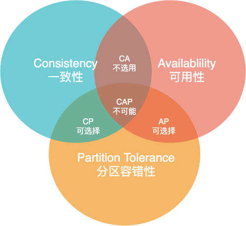

# 分布式中的 CAP 理论

## 什么是 CAP

CAP 理论是指在一个分布式计算系统中，当涉及读写操作时，特别是在网络分区（即网络中断）发生时，系统只能同时满足以下 3 个属性中的 2 个：一致性（**C**onsistency）、可用性（**A**vailability）和分区容错性（**P**artition tolerance），另外 1 个必须被牺牲。

**一致性（Consistency）**：

- 指的是所有节点在同一时间看到的数据是相同的。
- 换句话说，一旦数据更新成功，所有的客户端都应该只能读取到最新的值。
- 这与传统的数据库事务中强一致性的概念相似。
- 通俗的讲：要么返回一个错误，要么返回绝对一致的最新数据，其强调的是数据正确。

**可用性（Availability）**：

- 指系统每个请求都能在有限的时间内得到响应，无论系统的状态如何。
- 这意味着系统必须保证响应客户端的请求，即使某些节点出现故障。
- 通俗的讲：系统一定会给出响应，不会返回错误或者超时，但不保证数据是最新的，强调的是不出错。

**分区容错性（Partition tolerance）**：

- 指系统即使在某些信息的传递失败的情况下（例如网络问题导致一部分节点与系统其他部分失去联系），也能继续运行。
- 在实际的分布式系统中，**网络分区**（网络断开或某些节点之间无法通信，导致系统内部的通信受阻）几乎是必然的，因此分区容忍通常是必须要保证的。
- 通俗的讲：不管系统内部出现何种数据同步问题，系统也要一直运行，强调的是不挂掉。

## 为什么三者不可得兼

首先，**网络分区的不可避免性**：分布式系统是避免不了网络分区的，如果分布式系统不满足分区容错性，系统可能会遇到一系列问题，导致严重的服务中断和数据一致性问题，所以分区容错性（P）是一定要满足的。

在此基础上，**一致性与可用性的冲突**：

- **保持一致性**

  当网络分区发生，保持一致性（C）意味着任何节点在执行读写操作时必须保证数据的一致性。

  例如，如果数据更新在一个分区中进行，其他分区必须等待更新完成才能进行读取，这样可以**保证读取的数据是最新且一致的**。

  然而，在等待的期间，系统的这部分可能无法对外提供服务，这就牺牲了可用性（A）。

- **保持可用性**

  如果优先保持系统的可用性，即使在网络分区发生时也能确保每个请求都能得到响应，这可能**导致不同分区之间数据不一致**。

  某个分区可能只能访问到旧的数据，或者不同分区中的数据更新无法即时同步。

由此可知，在满足分区容错性的前提下，一致性和可用性的反应几乎是矛盾的。

## CAP 的权衡

CAP三者不可同得，那么必须得做一些权衡：

- **CA - 一致性和可用性**：如果一个系统设计为在网络分区未发生时优先保证一致性和可用性，那么一旦出现网络分区，系统将无法继续提供服务（**不考虑这种方案**）
- **CP - 一致性和分区容忍性**：系统在网络分区发生时依然保持数据一致性，但可能无法对外提供服务，牺牲了可用性。
- **AP - 可用性和分区容忍性**：系统即使在网络分区发生的情况下也能对外提供服务，但系统的一些数据可能不是最新的，牺牲了一致性。

## 具体的方案选择

具体的方案选择，取决于实际的业务场景。

**金融系统（如银行和交易平台）**：

- **一致性（C）**：金融系统强调交易的精确性和一致性，确保账目准确无误，因此通常优先考虑一致性。
- **分区容错性（P）**：同时，为了保证服务的连续性，这些系统也需要能够处理网络分区。
- 这些系统可能牺牲一定程度的 **可用性**，接受在极端情况下部分服务可能会暂时不可用，以保证数据的一致性和系统的整体稳定。

**电子商务平台**：

- **可用性（A）**：用户体验通常是电商平台的首要考虑因素，需要确保用户随时都能浏览商品和下单。
- **分区容错性（P）**：电商平台还必须处理网络分区的问题，确保即使某些组件失联，仍能提供服务。
- 电商平台可能在数据 **一致性** 上做出一些妥协，例如允许数据最终一致性，以提高系统的可用性。

**社交媒体和内容分发网络（CDN）**：

- **可用性（A）**：这类应用强调内容的快速加载和高响应速度，因此通常优先考虑可用性。
- **分区容错性（P）**：同时，它们也需要能够在部分网络故障的情况下继续运行。
- 社交媒体平台可能接受一定程度的 **数据不一致**（如帖子的延迟显示或更新），以确保用户界面的响应性和快速访问。

**实时数据处理和分析系统**：

- **一致性（C）**：如果涉及到关键决策支持或数据精度要求高的业务，一致性可能是首选。
- **分区容错性（P）**：这些系统也需要能够应对网络分区，保证数据处理的连续性。
- 在某些情况下，这类系统可能会牺牲一些 **可用性**，以确保数据处理的准确性。