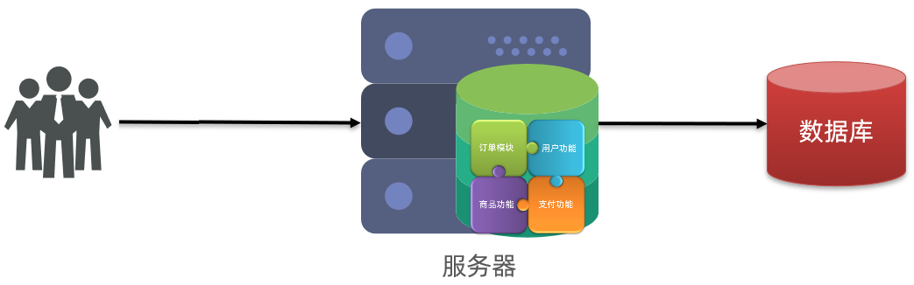
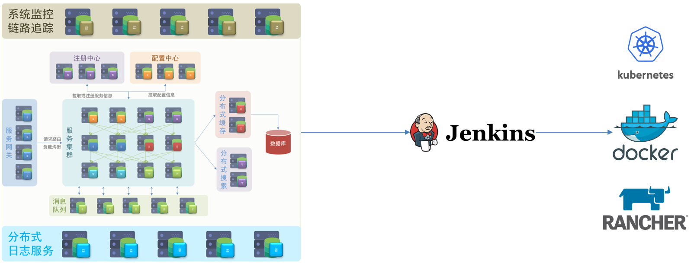
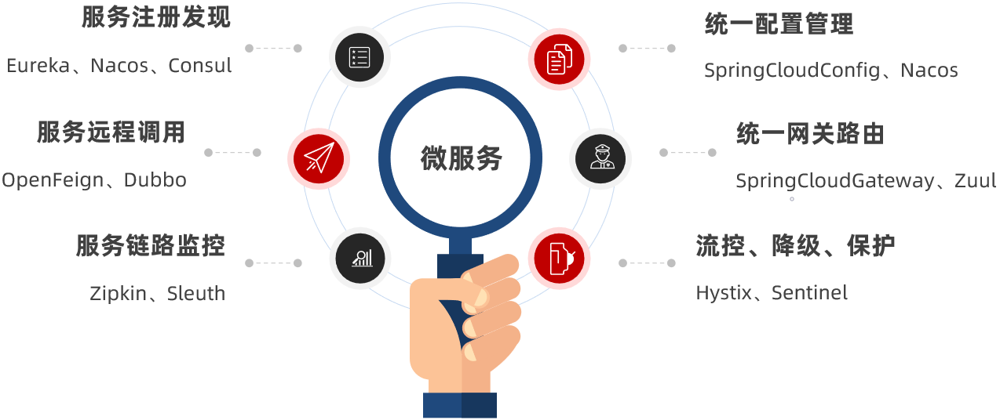

# 初识微服务

## 单体架构

**单体架构** 就是将业务的所有功能都集中在一个项目中进行开发，并且最终打成一个包进行部署。

**优点：**

- 架构简单
- 部署成本低
- 适合小型项目

**缺点：**

- 耦合度高（维护困难、升级困难）

## 分布式架构

**分布式架构** 是根据业务功能对系统进行拆分，每个业务功能模块都作为独立的项目进行开发，称为一个服务。

**优点：**

- 降低服务耦合
- 有利于服务升级和拓展

**缺点：**

- 服务调用关系错综复杂

## 服务治理

分布式架构虽然相对于单体架构来说，降低了服务间的耦合度，但是服务拆分时有了很多新的问题需要思考：

- 服务拆分的细粒度该如何界定？
- 服务之间以何种方式进行远程调用？
- 服务的调用关系如何进行统一管理？
- 服务的健康状态该如何感知？

显然，人们需要制定一套行之有效的标准来约束分布式架构，而近几年最火爆的分布式架构方案就是 **微服务**。

## 微服务

微服务是一种经过良好架构设计的 **分布式架构** 方案，其架构特征有：

- 单一职责：微服务拆分粒度更小，每一个服务都对应唯一的业务能力，做到单一职责，避免重复的业务开发
- 面向服务：微服务对外暴露统一标准的业务接口，与语言和技术无关
- 自治：团队独立、技术独立、数据独立，部署独立
- 隔离性强：服务调用做好隔离、容错、降级，避免出现级联问题

## 微服务结构

微服务的上述特性其实是在给分布式架构制定一个标准，进一步降低服务之间的耦合度，提供服务的独立性和灵活性，做到高内聚，低耦合。

因此， **微服务** 是一种经过良好架构设计的 **分布式架构方案** 。

但方案该怎么落地？选用什么样的技术栈？全球的互联网公司都在积极尝试自己的微服务方案，在国内最知名的就是 SpringCloud 和阿里巴巴的 Dubbo。

## SpringCloud

SpringCloud 是目前国内使用最广泛的微服务框架。官网地址：[https://spring.io/projects/spring-cloud](https://spring.io/projects/spring-cloud)

SpringCloud 集成了各种微服务功能组件，并基于 SpringBoot 实现了这些组件的自动装配，从而提供了良好的开箱即用体验。

其中常见的组件包括：

另外，SpringCloud 底层是依赖于 SpringBoot 的，并且有版本的兼容关系，如下：

| Release Train                                                | Release Train                         |
| ------------------------------------------------------------ | ------------------------------------- |
| [2022.0.x](https://github.com/spring-cloud/spring-cloud-release/wiki/Spring-Cloud-2022.0-Release-Notes) aka Kilburn | 3.0.x, 3.1.x (Starting with 2022.0.3) |
| [2021.0.x](https://github.com/spring-cloud/spring-cloud-release/wiki/Spring-Cloud-2021.0-Release-Notes) aka Jubilee | 2.6.x, 2.7.x (Starting with 2021.0.3) |
| [2020.0.x](https://github.com/spring-cloud/spring-cloud-release/wiki/Spring-Cloud-2020.0-Release-Notes) aka Ilford | 2.4.x, 2.5.x (Starting with 2020.0.3) |
| [Hoxton](https://github.com/spring-cloud/spring-cloud-release/wiki/Spring-Cloud-Hoxton-Release-Notes) | 2.2.x, 2.3.x (Starting with SR5)      |
| [Greenwich](https://github.com/spring-projects/spring-cloud/wiki/Spring-Cloud-Greenwich-Release-Notes) | 2.1.x                                 |
| [Finchley](https://github.com/spring-projects/spring-cloud/wiki/Spring-Cloud-Finchley-Release-Notes) | 2.0.x                                 |
| [Edgware](https://github.com/spring-projects/spring-cloud/wiki/Spring-Cloud-Edgware-Release-Notes) | 1.5.x                                 |
| [Dalston](https://github.com/spring-projects/spring-cloud/wiki/Spring-Cloud-Dalston-Release-Notes) | 1.5.x                                 |
