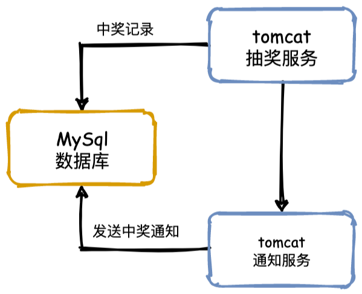
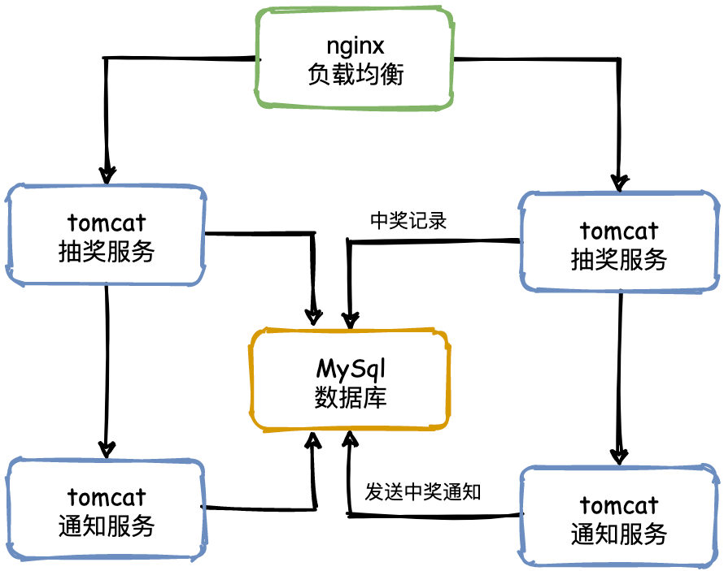

# 如何设计能够应对百万人抽奖的系统

## 前言

**优秀的架构并非一蹴而就，而是在需求不断变化中逐步演化形成的。**

从支持几百人的抽奖系统，到支撑几万甚至几百万人的参与，架构需要不断地迭代、扩展和优化。

最终，归纳总结出一套 **设计理念**，成为一个 **通用模板**，面试中面对任何高并发系统的问题，只需从这些方向进行思考即可。

## V0——单体架构

让我们先实现一个几十人参与的抽奖系统，采用直接明了的单体架构设计，需要包含以下组件：

1. **Web服务器**：使用 Tomcat 作为应用服务器，**Web服务器**：使用 Tomcat 作为应用服务器，
2. **数据库**：使用 MySQL 来持久化存储用户信息、抽奖记录和奖品信息，确保数据的可追溯性和持久性。
3. **抽奖逻辑**：抽奖逻辑集成在 Java 应用中，通过用户请求生成随机数来确定中奖用户和奖品。中奖后，奖品将从数据库中移除，避免重复发放。
4. **中奖处理**：抽奖完成后，将中奖结果写入数据库的抽奖记录表，便于后续查询和分析。
5. **通知服务**：中奖用户将通过短信或邮件接口接收中奖通知，通知服务调用可由 Java 应用集成具体的外部通知接口来实现。

整个抽奖过程非常简单：用户发起抽奖请求，Tomcat 服务器接收请求，执行抽奖逻辑，中奖结果存入数据库，最后通过调用通知接口发送中奖信息，完成整个流程。

这种简单的实现适合用于快速开发和测试，但随着用户数量的增加和需求的复杂化，可以进一步演化为更加模块化和可扩展的架构。

这种简单的实现适合用于快速开发和测试。但随着用户数量的增加和需求的复杂化，想一想，这种单体架构有什么潜在的问题呢：

1. **抗压能力差**：随着参与人数增加，服务器的压力迅速增大，单体服务难以应对高并发场景，容易导致系统崩溃。
2. **恶意刷奖风险**：单体架构很容易被恶意脚本攻击，恶意用户可以通过脚本反复请求抽奖接口，导致服务器过载甚至被操控。
3. **更新和扩展困难**：每次功能更新都需要重新部署整个系统，频繁停机影响用户体验，扩展能力也非常有限。
4. **高耦合性和复杂度**：抽奖逻辑、通知服务等模块高度耦合，修改一个模块可能会影响整个系统，增加维护难度。
5. **单点故障风险**：任何一个模块出现问题都会导致整个系统宕机，单点故障风险非常高。
6. **缺乏弹性和资源浪费**：流量波动大时，单体架构难以实现弹性伸缩，只能整体扩容，导致资源浪费和成本增加。
7. **应对突发请求困难**：抽奖开奖瞬间的突发请求量大，单体架构难以有效应对，可能导致服务器崩溃，用户无法及时获得抽奖结果。

接下来，我们来讨论如何应对这些挑战。

## V1——负载均衡

随着单个服务器的访问量增加，压力不断提升，最终可能超过服务器的承受能力，导致系统崩溃。

为了防止服务器崩溃，并提升用户体验，我们引入 **负载均衡** 来分担服务器的压力。

负载均衡的基本思路是构建一个服务器集群。当用户访问系统时，首先会访问一个中间服务器（类似“管家”角色），由它选择集群中当前压力最小的服务器处理该请求。

通过这种方式，可以确保每个服务器的负载趋于平衡，从而避免单点崩溃。

负载均衡通常通过 **反向代理** 实现。至于具体的负载均衡算法和实现方式，我们将在后文深入探讨。

虽然负载均衡解决了单体架构的单点失效问题，但我们仍需考虑如何在服务器宕机时保障系统的稳定，特别是应对抽奖瞬间的大量请求。接下来就继续探讨这些挑战的解决之道。

## V2——服务限流

**限流**的主要作用是保护服务节点和集群背后的数据节点，防止瞬时流量过大导致服务和数据崩溃（例如前端缓存大量失效），从而引发系统不可用。此外，限流还可以帮助平滑请求，减少服务的瞬时压力峰值。

在上一小节中，我们通过负载均衡保证了集群的可用性，但服务器的成本是公司需要考虑的，无法无限制地增加服务器数量。通常，我们会通过计算来确保日常使用的稳定性。然而，限流的意义在于应对不可预测的突发流量，尤其是在以下场景中：

- **重复抽奖**：用户或脚本重复提交抽奖请求。
- **恶意脚本攻击**：通过自动化脚本频繁调用抽奖接口。
- **热点事件**：例如微博上的热点话题，导致瞬时访问量激增。
- **大量爬虫**：爬虫对系统的大量访问可能影响正常服务。

这些情况往往是不可预知的，可能在某个时间点突然出现10倍甚至20倍的流量。如果真的遇到这种情况，实时扩容是无法及时响应的，因此限流措施非常重要。

### 实现限流的方式

1. **防止用户重复抽奖**
   - 如果同一个用户在1分钟内多次发送请求抽奖，我们可以将其视为恶意重复请求或脚本刷奖。此类流量应直接在负载均衡层被拦截掉，不再继续往下处理。
   - 可以通过 Nginx 配置 IP 访问频率，或者在网关层结合 Sentinel 配置限流策略来实现。
   - 用户的抽奖状态可以通过 Redis 进行存储，用于快速判断请求的有效性。
2. **拦截无效流量**
   - 无论是抽奖还是秒杀，奖品或商品的数量都是有限的，因此后续大量请求在奖品用完之后其实都是无效的。
   - 例如，假设有50万人参与抽奖，但只有100台手机作为奖品，那么前500个请求可能就已经抢完了奖品，后续几十万的请求就无需再继续处理业务逻辑，直接返回“抽奖结束”即可。
   - 前端也可以通过按钮置灰等方式来减少无效请求的提交。
   - 为了实现这一点，需要确保库存和订单数据的同步及时性，确保奖品数量准确无误地反映在系统中。

### 服务降级和服务熔断

以上措施并不能完全杜绝所有问题，因此我们还需要在服务端引入**服务降级**和**服务熔断**机制。

**服务降级**和**服务熔断**这两个概念容易混淆，我们通过一个简单的例子来说明：

假设某条微博因为粉丝数突破100万而冲上热搜，导致大量粉丝同时访问微博查看相关内容。此时，粉丝甲可以正常看到新闻发布会的内容，而粉丝乙看到的则是“系统繁忙”提示。过一段时间后，乙也能正常访问内容。

在这个过程中，热点事件引发大量请求，导致系统启动了**服务熔断**，以保护系统整体的可用性，暂时屏蔽了部分用户（例如粉丝乙）。粉丝乙看到的“系统繁忙”提示即为**服务降级**（Fallback），等系统恢复后，熔断器允许请求重新进入，用户可以继续访问内容。这也是熔断器（例如 Hystrix）的一个特性。

## V3 同步状态

## V4线程优化

## V5业务逻辑

## V6流量削峰

## 答题模板

### 单一职责

### URL动态加密

### 静态资源——CDN

### 服务限流

### 数据预热

### 削峰填谷

## 最后