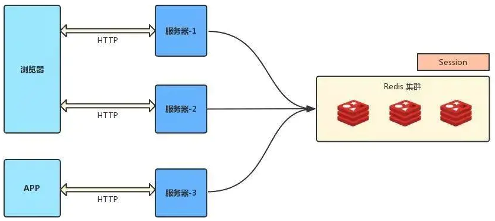

# 负载均衡集群中的Session解决方案

## Session 为啥会出问题

从客户端来解释，我们知道当用户的第一次访问被负载均衡代理到后端服务器 A 并登录后，服务器 A 上会保留用户的登录信息。

当用户再次发送请求时，根据负载均衡策略，该请求可能被代理到后端不同的服务器上，例如服务器 B 。

可是，由于 **Session 不是所有服务器共享的**，所以这台服务器 B 没有用户的登录信息，该用户再发送请求时需要重新登录，这对访问者来说是难以接受的。

所以，在实施负载均衡的时候，我们必须考虑 Session 的问题。

在负载均衡中，针对Session的处理，我们一般有以下几种方法：

1. Session 保持
2. Session 复制
3. Session 共享（最常用）
4. Session 持久化

## 会话保持（Sticky Sessions）

### 如何进行会话保持

Session 保持（会话保持、粘滞会话）是我们见到最多的名词之一。

所谓会话保持，就是让负载均衡进行请求分发的时候 **保证每个客户端固定地访问到后端的同一台应用服务器**。

会话保持方案在所有的负载均衡都有对应的实现，而且这是在负载均衡这一层就解决了 Session 问题的方案。

**采用 Ngnix 中的 ip_hash 机制，将某个 ip的所有请求都定向到同一台服务器上，也就是说将用户与服务器绑定。** 

用户第一次请求时，负载均衡器将用户的请求转发到了 A 服务器上，如果负载均衡器设置了粘性 session 的话，那么用户以后的每次请求都会转发到 A 服务器上，相当于把用户和 A 服务器粘到了一块，这就是粘性 session 机制。

### 会话保持的缺点

会话保持看似解决了 Session 同步的问题，但是却带来的一些其它方面的问题：

- **负载不均衡了**：由于使用了 Session 保持，很显然，根本无法保证负载绝对的均衡了。
- **没有彻底解决问题**：如果当前访问的服务器发生故障，用户被转移到第二个服务器上时，他的 Session 信息都将失效。

## 会话复制

### 如何进行会话复制

既然我们的目标是所有服务器上都要保持用户的 Session，那么 **将每个应用服务器中的 Session 信息复制到其它服务器节点上** 是不是就可以呢？

答案是肯定的。

而这就是 Session 的第二种处理办法：**会话复制**。

- 任何一个服务器上的 Session 发生改变（增删改），该节点会把这个 Session 的所有内容序列化，然后广播给所有其它节点，不管其他服务器需不需要 Session ，以此来保证 Session 同步。

会话复制在 Tomcat 上得到了支持，它是基于 IP 组播（multicast）来完成 Session 的复制（Tomcat 的配置如果有需求可以参考 Tomcat 官方文档），Tomcat 的会话复制分为两种：

- 全局会话复制：利用 Delta Manager 复制会话中的变更信息到集群中的所有其他节点。
- 非全局复制：使用 Backup Manager 进行复制，它会把 Session 复制给一个指定的备份节点。

### 会话复制的缺点

会话复制会对网络负荷造成一定压力，如果 Session 量大的话可能会造成网络堵塞，拖慢服务器性能。

根据笔者在生产的实践案例，在集群超过6个节点之后就会出现各种问题，不推荐生产使用。

## 会话共享（最常用）

### 如何进行会话+共享

既然会话保持和会话复制都不完美，那么我们为什么不 **把 Session 放在一个统一的地方** 呢，这样 **集群中的所有节点都在一个地方进行 Session 的存取** 就可以解决问题。

使用分布式缓存方案比如 Memcached 、Redis 来缓存 session，但是要求 Memcached 或 Redis 必须是集群。

把 Session 放到 Redis 中存储，虽然架构上变得复杂，并且需要多访问一次 Redis ，但是这种方案带来的好处也是很大的：

- 实现了 Session 共享
- 可以水平扩展（增加 Redis 服务器）
- 服务器重启 Session 不丢失（不过也要注意 Session 在 Redis 中的刷新/失效机制）
- 不仅可以跨服务器 Session 共享，甚至可以跨平台（例如网页端和 APP 端）

##  会话持久化

对于 Session 来说，肯定是要频繁使用的，我们可以将 Session 存储到数据库中，保证 Session 的持久化。

这样的话，即使服务器出现问题，Session 也不会丢失。

### 会话持久化的缺点

如果网站的访问量很大，把 Session 存储到数据库中，会对数据库造成很大压力，还需要增加额外的开销维护数据库。

虽然我们可以把 Session 存放在数据库里，但是真正的生产环境中，更推荐把 Session 存放在性能更快的 **分布式 KV 数据** 中，例如： Memcached 和 Redis。

