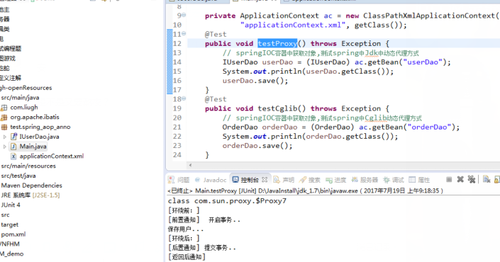

::: tip 为什么会有面向切面编程（AOP）？

我们知道 Java 是一个面向对象（OOP）的语言，但它有一些弊端，比如当我们需要为多个不具有继承关系的对象引入一个公共行为，例如日志、权限验证、事务等功能时，只能在每个对象里引用公共行为，这样做不便于维护，而且有大量重复代码，AOP 的出现则弥补了 OOP 的这点不足。

:::

# Spring-代理模式

## 一、代理模式

**代理模式：为其他对象提供一种代理以控制对这个对象的访问。**

这段话比较官方，但我更倾向于用自己的语言理解：比如A对象要做一件事情，在没有代理前，自己来做，在对 A 代理后，由 A 的代理类 B 来做。代理其实是在原实例前后加了一层处理，这也是 AOP 的初级轮廓。

## 二、静态代理原理及实践

**静态代理模式**：静态代理说白了就是在程序运行前就已经存在代理类的字节码文件，代理类和原始类的关系在 **运行前就已经确定**。

废话不多说，我们看一下代码，为了方便阅读，我把单独的 class 文件合并到接口中，读者可以直接复制代码运行：

```java
// 接口
public interface UserDao {
	void save();
	void find();
}

// 目标对象
class UserDaoImpl implements UserDao{
	@Override
	public void save() {
		System.out.println("模拟：保存用户！");
	}
	@Override
	public void find() {
		System.out.println("模拟：查询用户");
	}
}

 /*
  *  静态代理
  *        特点：
  *	1. 目标对象必须要实现接口
  *	2. 代理对象，要实现与目标对象一样的接口
  */
class UserDaoProxy implements UserDao{
	// 代理对象，需要维护一个目标对象
	private UserDao target;
    // 通过构造函数传入目标对象
    public UserDaoProxy(UserDao target) {
        this.target = target;
    }
    
	@Override
	public void save() {
		System.out.println("代理操作： 开启事务...");
		target.save();   // 执行目标对象的方法
		System.out.println("代理操作：提交事务...");
	}
	@Override
	public void find() {
		target.find();
	}
}
```

测试代码和运行截图：


可以看出，**静态代理 **虽然 **保证了业务类只需关注逻辑本身**，但是代理对象的一个接口只能服务于一种类型的对象，如果要代理的类和方法很多，势必要为每一个类、每一个方法都进行代理。

再者，如果增加一个方法，除了实现类需要实现这个方法外，所有的代理类也要实现此方法，这增加了 **代码的维护成本**。

那么要如何解决这种问题呢？答案是使用动态代理。

## 三、动态代理原理及实践

**动态代理模式**：动态代理类的源码是在程序运行期间通过 JVM 反射等机制动态生成，代理类和委托类的关系是 **运行时才确定** 的。

实例如下：

```java
package test.dynamicProxy;

import java.lang.reflect.InvocationHandler;
import java.lang.reflect.Method;
import java.lang.reflect.Proxy;
// 接口
public interface UserDao {
	void save();
	void find();
}

//目标对象
 class UserDaoImpl implements UserDao{
	@Override
	public void save() {
		System.out.println("模拟：保存用户！");
	}
	@Override
	public void find() {
		System.out.println("查询");
	}
}
/*
 * 动态代理：
 *    代理工厂，给多个目标对象生成代理对象！
 *
 */
class ProxyFactory {
    // 被代理的对象
    private Object target;
	// 接收一个目标对象
	public ProxyFactory(Object target) {
		this.target = target;
	}
	// 返回对目标对象(target)代理后的对象(proxy)
	public Object getProxyInstance() {
		Object proxy = Proxy.newProxyInstance(
			target.getClass().getClassLoader(),  // 目标对象使用的类加载器
			target.getClass().getInterfaces(),   // 目标对象实现的所有接口
			new InvocationHandler() {			 // 执行代理对象方法时候触发此匿名内部类
				@Override
				public Object invoke(Object proxy, Method method, Object[] args) throws Throwable {
					// 获取当前执行的方法的方法名
					String methodName = method.getName();
					// 方法返回值
					Object result = null;
					if ("find".equals(methodName)) {
						// 直接调用目标对象方法
						result = method.invoke(target, args);
					} else {
						System.out.println("开启事务...");
						// 执行目标对象方法
						result = method.invoke(target, args);
						System.out.println("提交事务...");
					}
					return result;
				}
			}
		);
		return proxy;
	}
}
```

### Proxy 类

Proxy 类在 java.lang.reflect 包中，是动态代理中的核心对象，它的静态方法 newProxyInstance() 就可以造一个我们想要的代理对象。

### Proxy.newProxyInstance() 方法

方法原型：

```java
public static Object newProxyInstance(ClassLoader loader,Class<?>[] interfaces,InvocationHandler h) throws IllegalArgumentException
```

此方法需要传入三个参数，返回值是 Object，很明显，返回的 Object 就是我们需要的代理对象。

方法参数：

1. **ClassLoader loader**：类加载器。负责向内存中加载对象，使用反射机制可以获取对象的 classLoader。这里传入的是被代理对象的类加载器，用于定义代理类。
   - 如何获取被代理类的类加载器： **ClassLoader classLoader=obj.getClass().getClassLoader();**

2. **Class<?>[] interfaces**：被代理对象所实现的接口列表。代理类也需要一一实现，这里也是通过反射来获取的。
   - 如何获取被代理类的接口列表：**Class<?>[] interfaces=obj.getClass().getInterfaces();**

3. **InvocationHandler h**：InvocationHandler 是 Proxy 代理实例的调用处理程序实现的一个接口，每一个 Proxy 代理实例都有一个关联的调用处理程序；在代理实例调用方法时，方法调用被编码分派到调用处理程序的invoke方法。

### InvocationHandler

这个接口被称为 **调用处理器**，它只有一个 invoke() 方法。我们需要一个实现了这个接口的对象作为参数传入，只要实现这一个方法就可以了。

invoke()：表示代理对象要执行的功能代码。我们的代理类要完成的功能就写在 invoke() 方法中，方法原型：

```java
public Object invoke(Object proxy, Method method, Object[] args) throws Throwable;
```

invoke() 方法的参数：

1. Object proxy：JKD 创建的代理对象，无需赋值。
2. Method method：被代理对象的方法，JKD 提供的 method 对象
3. Object[] args：被代理对象的方法的参数列表，JKD 提供的

返回值：

- Object：执行的方法的返回值

运行截图：


在运行测试类中创建测试类对象代码中，

```java
UserDao proxy = (UserDao) new ProxyFactory(userDao).getProxyInstance();
```

其实是 JDK 动态生成了一个类去实现接口，只不过它隐藏了这个过程：

```java
class $Proxy0 implements UserDao{}
```

**使用 jdk 生成的动态代理的前提是目标类必须有实现的接口**。但这里又引入一个问题，如果某个类没有实现接口，就不能使用 JDK 动态代理，所以为了解决这个问题，Cglib（Code Generation Library）代理出现了。

Cglib 是 **以动态生成的子类继承目标类** 的方式实现，在运行期间动态地在内存中构建一个子类，如下：

```java
public class UserDaoImpl{}
//Cglib是以动态生成的子类继承目标的方式实现,程序执行时,隐藏了下面的过程
public class $Cglib_Proxy_class  extends UserDaoImpl{}
```

**Cglib 使用的前提是目标类不能为 final 修饰**。因为 final 修饰的类不能被继承。

现在，我们可以看看 AOP 的定义：面向切面编程，核心原理是 **使用动态代理模式在方法执行前后或出现异常时加入相关逻辑。**

通过定义和前面代码我们可以发现3点： 

- AOP 是基于动态代理模式的。

- AOP 是方法级别的。
- AOP 可以 **分离业务代码和关注点代码（重复代码）**，在执行业务代码时，动态的注入关注点代码。切面就是关注点代码形成的类。

## 四、Spring AOP 原理及实战

前文提到了 JDK 代理和 Cglib 代理两种动态代理，优秀的 Spring 框架把两种方式在底层都集成了进去，我们无需担心自己去实现动态生成代理。那么，Spring 是如何生成代理对象的

1、创建容器对象的时候，根据切入点表达式拦截的类，生成代理对象

2、**如果目标对象有实现接口，使用 jdk 代理。如果目标对象没有实现接口，则使用 Cglib 代理**。然后从容器里获取代理后的对象，在运行期植入"切面"类的方法

通过查看 Spring 源码，我们在 DefaultAopProxyFactory 类中，找到这样一段话：


从字面意思看出，如果有接口，则使用 Jdk 代理，反之使用 Cglib，这刚好印证了前文所阐述的内容。Spring AOP 综合两种代理方式的使用前提有会如下结论：**如果目标类没有实现接口，且 class 为 final 修饰的，则不能进行 Spring AOP 编程！**

知道了原理，现在我们尝试自己手动实现 Spring 的 AOP：

```java
import org.aspectj.lang.ProceedingJoinPoint;

public interface IUserDao {
	void save();
}
//用于测试Cglib动态代理
class OrderDao {
	public void save() {
		//int i =1/0;用于测试异常通知
		System.out.println("保存订单...");
	}
}
//用于测试jdk动态代理
class UserDao implements IUserDao {
	public void save() {
		//int i =1/0;用于测试异常通知
		System.out.println("保存用户...");
	}
}
//切面类
class TransactionAop {
	public void beginTransaction() {
		System.out.println("[前置通知]  开启事务..");
	}
	public void commit() {
		System.out.println("[后置通知] 提交事务..");
	}
	public void afterReturing(){
		System.out.println("[返回后通知]");
	}
	public void afterThrowing(){
		System.out.println("[异常通知]");
	}
	public void arroud(ProceedingJoinPoint pjp) throws Throwable{
		System.out.println("[环绕前：]");
		pjp.proceed();    			   // 执行目标方法
		System.out.println("[环绕后：]");
	}
}
```

Spring 的 xml 配置文件：

```java
import org.aspectj.lang.ProceedingJoinPoint;

public interface IUserDao {
	void save();
}
//用于测试Cglib动态代理
class OrderDao {
	public void save() {
		//int i =1/0;用于测试异常通知
		System.out.println("保存订单...");
	}
}
//用于测试jdk动态代理
class UserDao implements IUserDao {
	public void save() {
		//int i =1/0;用于测试异常通知
		System.out.println("保存用户...");
	}
}
//切面类
class TransactionAop {
	public void beginTransaction() {
		System.out.println("[前置通知]  开启事务..");
	}
	public void commit() {
		System.out.println("[后置通知] 提交事务..");
	}
	public void afterReturing(){
		System.out.println("[返回后通知]");
	}
	public void afterThrowing(){
		System.out.println("[异常通知]");
	}
	public void arroud(ProceedingJoinPoint pjp) throws Throwable{
		System.out.println("[环绕前：]");
		pjp.proceed();    			   // 执行目标方法
		System.out.println("[环绕后：]");
	}
}
```

关于切入点表达式，可以看CSDN上这篇 [**Spring AOP 切入点表达式**](https://blog.csdn.net/keda8997110/article/details/50747923)

运行截图：



到这里，我们已经全部介绍完Spring AOP，那我们能拿它做什么？

1、Spring 声明式事务管理配置

2、Controller 层的参数校验

3、使用 Spring AOP 实现 MySQL 数据库读写分离案例分析

4、在执行方法前，判断是否具有权限

5、对部分函数的调用进行日志记录。监控部分重要函数，若抛出指定的异常，可以以短信或邮件方式通知相关人员

6、信息过滤，页面转发等等功能
