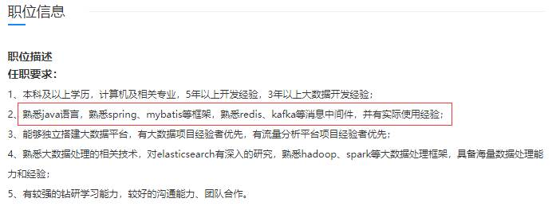
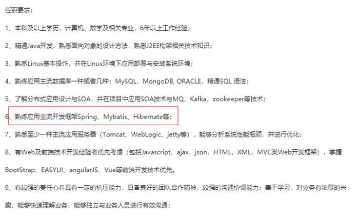

::: tip SSM 框架集

SSM（Spring+SpringMVC+MyBatis）框架集由 Spring、MyBatis 两个开源框架整合而成（SpringMVC 是S pring 中的部分内容），常作为数据源较简单的 web 项目的框架。

:::

# 初识SSM框架

## 为什么要学习框架？

所谓框架，即 framework。其实就是某种项目的半成品，里边有很多功能组件可供你使用来完成自己的项目。简单说就是使用别人搭好的舞台，你来做表演。而且，框架一般是成熟的、不断升级的软件。

框架可以帮助我们完成底层的基础工作，程序员只需要关注项目业务本身，并且框架也在不断更新，逐步提升其稳定性、易用性和安全性。

## 什么是 SSM 框架？

SSM 框架是 **Spring+SpringMVC+MyBatis** 的简称，相比于 SSH（Struts+Spring+Hibernate），SSM 更加轻量化和灵活，是目前比较主流的 JavaWeb 开发框架。

其主要特点有：

1. 简化原始开发流程——提升开发效率；
2. 轻量级易上手——SSM 属于轻量级框架，有 JavaWeB 基础非常容易上手
3. 使用人群多——无论中小企业还是大型企业都会使用到框架或其中一部分
4. 解决方案多——SSM 框架成熟经过千万程序员的洗礼，出 bug 一搜一大片解决方案
5. 稳定、安全——在 N 多版本更新迭代后，框架本身的功能、稳定和安全性都得到了提升

## SSM 框架的组成

### Spring

容器大管家，可管理项目中对象的生命周期，同时 **AOP** 事务大大的优化了事务的操作等；

Spring 是一个开源框架，是于2003 年兴起的一个轻量级的 Java 开发框架，由 Rod Johnson 在其著作Expert One-On-One J2EE Development and Design中阐述的部分理念和原型衍生而来，它是为了解决企业应用开发的复杂性而创建的。

Spring 使用基本的 JavaBean 来完成以前只可能由 EJB 完成的事情。

然而，Spring的用途不仅限于服务器端的开发。从简单性、可测试性和松耦合的角度而言，任何 Java 应用都可以从 Spring 中受益。 简单来说，Spring 是一个轻量级的 控制反转（IoC）和面向切面（AOP）的 **容器框架**。

###  SpringMVC

所属 **web** 层，取代了 **servlet** 技术负责处理请求，成为连接前端的桥梁；

Spring MVC 属于 SpringFrameWork 的后续产品，已经融合在Spring Web Flow里面。

Spring MVC 分离了 控制器、模型对象、分派器以及处理程序对象 的角色，这种分离让它们更容易进行定制。

###  MyBatis

所属 **dao** 层，**简化了数据库操作，使用动态 sql 让程序员只需要关注 sql 语句**。

MyBatis 本是apache的一个开源项目iBatis, 2010年这个项目由 apache software foundation 迁移到了 google code，并且改名为MyBatis 。

MyBatis是一个基于Java的持久层框架。iBATIS提供的持久层框架包括SQL Maps和Data Access Objects（DAO）MyBatis 消除了几乎所有的JDBC代码和参数的手工设置以及结果集的检索。

MyBatis 使用简单的 XML 或注解用于配置和原始映射，将接口和 Java 的POJOs（Plain Old Java Objects，普通的 Java对象）映射成数据库中的记录。

## SSM 框架在 Web 项目中所处的位置

## SSM 框架学习路线

1. 使用 Mybatis 取代 JDBC、dbutils 等原始方法操作数据库
2. 学习 Spring 框架理解 IOC、AOP 思想，使用 Spring 来管理对象、事务
3. 学习 SpringMVC 框架取代 Servlet 技术，整合三大框架

##  学习 SSM 框架预备知识

1. Java 基础
2. JavaWeb 技术

## 企业招聘 Java 程序员框架成为必备技能

