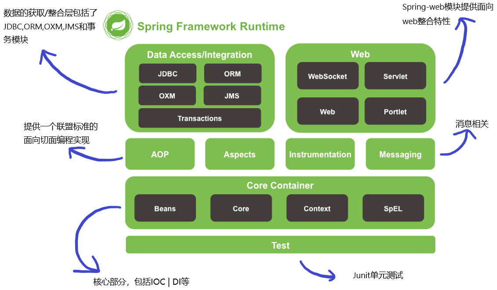
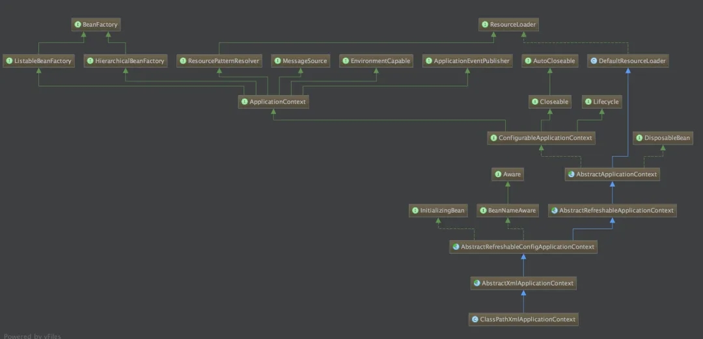

::: tip 

Spring以 `IOC`（Inversoin Of Control，控制反转）和 `AOP`（Aspect Oriented Programming，面向切面编程）为内核，使用基本的JavaBean来完成以前只可能由 `EJB`（Enterprise Java Beans，Java企业Bean）完成的工作。取代了EJB那臃肿、低效的开发模式

:::

# 初识Spring

## 一、Spring是什么？

Spring 是于 2003 年兴起的一个轻量级的 Java 开源框架，它由 Rod Johnson 创建。

传统 J2EE 应用的开发效率低，Spring 作为开源的中间件，提供了 J2EE 应用的各层的解决方案，Spring 贯穿了 **表现层、业务层及持久层**，而不是仅仅专注于某一层的方案。

可以说 Spring 是企业应用开发的 **一站式**（**full-stack**）选择。然而，Spring 并不想取代那些已有的框架，而是与它们无缝地整合。

简单来说，Spring 是一个轻量级 **控制反转**（IoC）和 **面向切面**（AOP）的**容器**框架。

## 二、为什么要使用 Spring?

1. 方便解耦，简化开发

   通过 Spring 提供的 IoC 容器，我们可以将对象之间的依赖关系交由 Spring 进行控制，避免硬编码所造成的过度程序耦合。有了Spring，用户不必再为单实例模式类、属性文件解析等这些很底层的需求编写代码，可以更专注于上层的应用。

2. AOP 编程的支持

   通过 Spring 提供的 AOP 功能，方便进行面向切面的编程，许多不容易用传统 OOP 实现的功能可以通过 AOP 轻松应付。

3. 声明式事务的支持

   在 Spring 中，我们可以从单调烦闷的事务管理代码中解脱出来，通过声明式方式灵活地进行事务的管理，提高开发效率和质量。

4. 方便程序的测试

   可以用非容器依赖的编程方式进行几乎所有的测试工作，在 Spring 里，测试不再是昂贵的操作，而是随手可做的事情。例如：Spring 对 Junit4 支持，可以通过注解方便的测试 Spring 程序。

5. 方便集成各种优秀框架

   Spring 不排斥各种优秀的开源框架，相反，Spring 可以降低各种框架的使用难度，Spring 提供了对各种优秀框架（如 Struts、Hibernate、MyBatis 、Hessian、Quartz）等的直接支持。

6. 降低 Java EE API 的使用难度

   Spring 对很多难用的 Java EE API（如 JDBC，Java Mail，远程调用等）提供了一个薄薄的封装层，通过 Spring 的简易封装，这些 Java EE API 的使用难度大为降低。

## 三、IOC 反转控制（Inversion Of Control）

### 1. Spring是一个基于 IOC 和 AOP 的结构化 J2EE 系统的框架

控制反转就是把创建和管理 bean 的过程转移给了第三方。而这个第三方，就是 Spring IoC Container，对于 IoC 来说，最重要的就是 **容器**。

容器负责创建、配置和管理 bean，也就是它管理着 bean 的生命，控制着 bean 的依赖注入。

通俗点讲，因为项目中每次创建对象是很麻烦的，所以我们使用 Spring IoC 容器来管理这些对象，需要的时候你就直接用，不用管它是怎么来的、什么时候要销毁，只管用就好了。**简单说就是创建对象由以前的程序员自己 new 构造方法来调用，变成了交由 Spring 创建对象**

举个例子，就好像父母没时间管孩子，就把小朋友交给托管所，就安心的去上班而不用管孩子了。托儿所，就是第三方容器，负责管理小朋友的吃喝玩乐；父母，相当于程序员，只管接送孩子，不用管他们吃喝。

**IOC 是 Spring 的基础，也是一种编程思想和一种新的设计模式**

### 2. IoC 容器

容器是 IoC 最重要的部分，Spring 设计容器使用的是 `ApplicationContext`，它是 `BeanFactory` 的子类，更好的补充并实现了 `BeanFactory` 的。

`BeanFactory` 简单粗暴，可以理解为 HashMap：

- Key - bean name

- Value - bean object

但它一般只有 get, put 两个功能，所以称之为 **低级容器**。而  `ApplicationContext` 多了很多功能，因为它继承了多个接口，可称之为**高级容器**

`ApplicationContext` 的里面有两个具体的实现子类，是用来读取配置配件的：

- `ClassPathXmlApplicationContext` - 从 class path 中加载配置文件，更常用一些；

- `FileSystemXmlApplicationContext` - 从本地文件中加载配置文件，不是很常用，如果再到 Linux 环境中，还要改路径，不是很方便。

当我们点开 `ClassPathXmlApplicationContext` 时，发现它并不是直接继承 `ApplicationContext` 的，它有很多层的依赖关系，每层的子类都是对父类的补充实现。

而再往上找，发现最上层的 class 回到了 `BeanFactory`，所以它非常重要。

**要注意，Spring 中还有个 `FactoryBean`，两者并没有特别的关系，只是名字比较接近，所以不要弄混了顺序。**

### 3. 为什么要用 IOC 这种思想呢？IOC 能给我们带来什么好处？

答：**解藕**

它把对象之间的依赖关系转成用配置文件来管理，由 **Spring IoC Container** 来管理。

在项目中，底层的实现都是由很多个对象组成的，对象之间彼此合作实现项目的业务逻辑。但是，很多很多对象紧密结合在一起，一旦有一方出问题了，必然会对其他对象有所影响，所以才有了解藕的这种设计思想。

如上图所示，本来 ABCD 是互相关联在一起的，当加入第三方容器的管理之后，每个对象都和第三方法的 IoC 容器关联，彼此之间不再直接联系在一起了，没有了耦合关系，全部对象都交由容器来控制，降低了这些对象的亲密度，就叫“解耦”。

## 四、DI 依赖注入（Dependency Inject）

**依赖**，是指程序运行需要依赖外部的资源，提供程序内对象的所需要的数据、资源。

**注入**，是指配置文件把资源从外部注入到内部，容器加载了外部的文件、对象、数据，然后把这些资源注入给程序内的对象，维护了程序内外对象之间的依赖关系。

所以说，控制反转是通过依赖注入实现的，**当然，IoC 也可以通过其他的方式来实现，而 DI 只是 Spring 的选择**。

简单地说就是拿到的对象的属性，已经被注入好相关值了，程序员直接使用即可。
