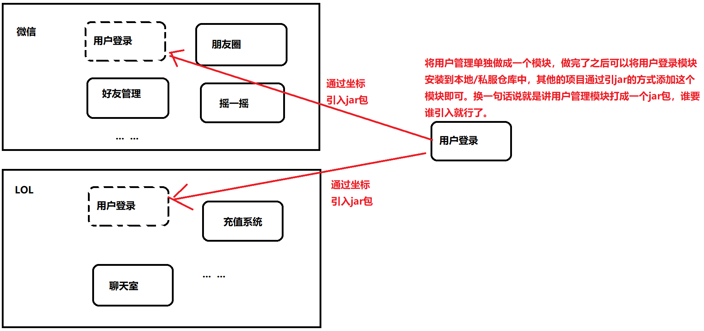
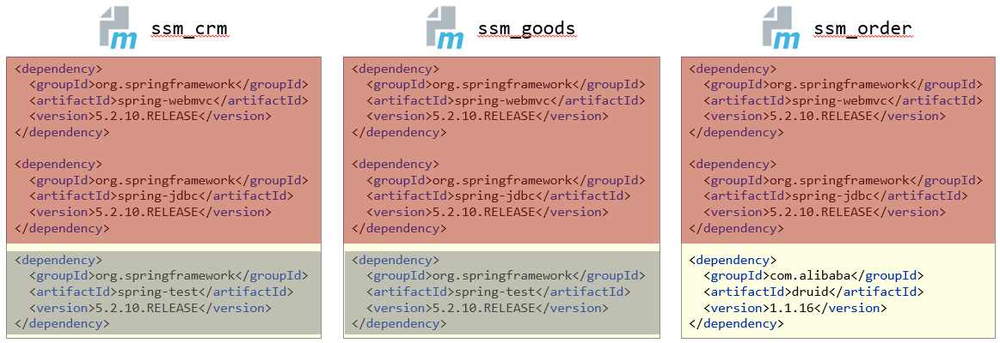
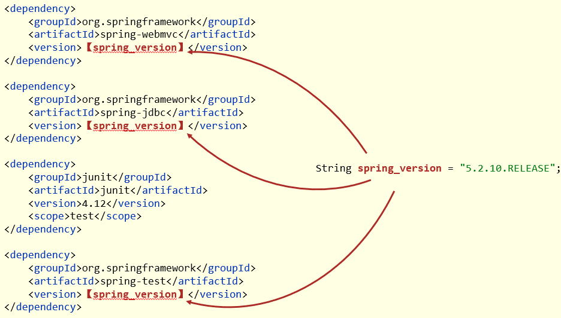
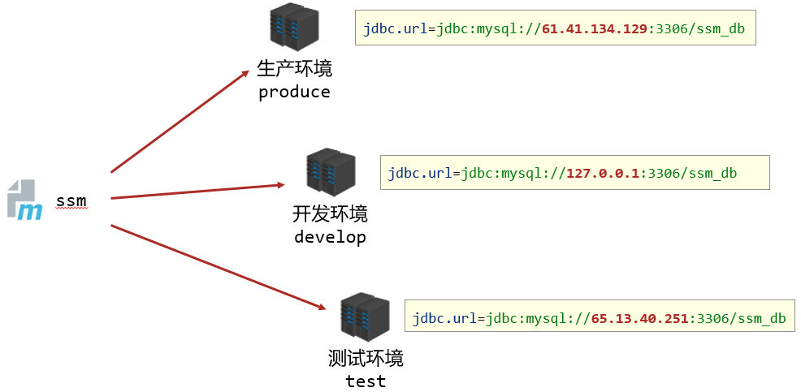

# Maven的进阶使用

## 分模块开发与设计

### 分模块开发的意义

现在一般稍大一点的项目，都是采用多模块管理，如果引入了领域概念，一般分层还有领域层。

所谓分模块开发，就是将原始模块按照功能拆分成若干个子模块，方便模块间的相互调用、接口共享。


### 模块拆分原则

分模块开发对工程的好处是，项目的扩展性变强了，方便其他项目引用相同的功能。



### 分模块开发的步骤

#### 创建 maven 模块

那这样一个分模块的项目我们应该怎么设置 maven 包结构呢。例如：


#### 编写模块代码

分模块开发需要先针对模块功能进行设计，再进行编程，而不是先将工程开发完毕，然后进行拆分。

#### 通过 maven 指令安装模块到本地仓库（install 指令）

```cmd
mvn install
```

注意：团队内部开发需要发布模块功能到团队内部可共享的仓库中（私服）

## 聚合与继承

### 聚合工程

将多个模块组织成一个整体，同时进行项目构建的过程称为 **聚合**。

而 **聚合工程**，通常是一个不具有业务功能的【空工程】（有且仅有一个 pom 文件）。

作用：

- 使用聚合工程可以将多个工程编组，通过对聚合工程进行构建，实现对所包含的模块进行 **同步构建**。

- 当工程中某个模块发生更新（变更）时，必须保障工程中与已更新模块关联的模块 **同步更新**，此时可以使用聚合工程来解决批量模块同步构建的问题。


### 聚合工程开发的步骤

#### 创建父项目的 Maven 模块，设置打包类型为 pom

```xml
<packaging>pom</packaging>
```

注意：每个 maven 工程都有对应的打包方式，默认为 jar，web 工程打包方式为 war

#### 设置当前聚合工程所包含的子模块名称

首先我们会在父项目中定义这些这个项目包含的模块，形成 **聚合工程**：

```xml
<modules>
    <module>alpha-mall-api</module>
    <module>alpha-mall-dao</module>
    <module>alpha-mall-manager</module>
    <module>alpha-mall-service</module>
    <module>alpha-mall-web</module>
    <module>start</module>
</modules>
```

**注意**：

- 聚合工程中所包含的模块在进行构建时会 **根据模块间的依赖关系设置构建顺序**，与聚合工程中模块的配置书写位置无关。
- 参与聚合的工程无法向上感知是否参与聚合，只能向下配置哪些模块参与本工程的聚合。

接着是 dependencyManagement，这个在多模块项目里面非常重要，dependencyManagement 里的配置并不会实际引入，只是为了更好地进行版本管理。

整个项目用到的依赖包的版本都应该在父项目 pom 的 dependencyManagement 里来管理，这样版本不会乱，管理也集中。

```xml
<properties>
    <java.version>1.8</java.version>
    <project.build.sourceEncoding>UTF-8</project.build.sourceEncoding>
    <project.reporting.outputEncoding>UTF-8</project.reporting.outputEncoding>
    <spring-boot.version>2.4.1</spring-boot.version>
    <arthas-spring-boot.version>3.4.8</arthas-spring-boot.version>
</properties>

<dependencyManagement>
    <dependencies>
        <dependency>
            <groupId>org.springframework.boot</groupId>
            <artifactId>spring-boot-dependencies</artifactId>
            <version>${spring-boot.version}</version>
            <type>pom</type>
            <scope>import</scope>
        </dependency>
        <dependency>
            <groupId>com.taobao.arthas</groupId>
            <artifactId>arthas-spring-boot-starter</artifactId>
            <version>${arthas-spring-boot.version}</version>
            <type>jar</type>
        </dependency>
    </dependencies>
</dependencyManagement>
```

一般可以直接在 properties 里面把第三方包的版本定义好，比如 Spring boot 和 Spring cloud 的版本。

**另外大家注意到 `spring-boot-dependencies` 这个包我们 type 使用的是 pom，也就是我们不真实需要引入 `spring-boot-dependencies`。**

这个包里面包含的 jar 基本涵盖了 Spring 全家桶，以及 Spring 和其他匹配的第三方中间件，type 为 pom 的意思是我们只需要 maven 包里的版本信息。

这样做的好处是，比如我们引入一个第三方包，担心用的版本和 Spring 的版本不兼容，不用担心，Spring 早就替你想好了，当你引入 `spring-boot-dependencies` ，他里面基本涵盖了市面上常用的组件，相对应的版本也都给你定义好了：


### 继承工程

继承描述的是两个工程间的关系，与 Java 中的继承相似，子工程可以继承父工程中的配置信息，常见于依赖关系的继承。

作用：

- 简化配置：当多个模块依赖相同的模块的时候，使用继承可以方便管理。

- 减少版本冲突：当想对项目中某个相同的依赖进行版本更替，使用继承可以一劳永逸。



### 聚合工程开发的步骤

#### 创建父项目的 Maven 模块，设置打包类型为 pom

```xml
<packaging>pom</packaging>
```

注意：每个 maven 工程都有对应的打包方式，默认为 jar，web 工程打包方式为 war

#### 在父工程的 pom 文件中配置依赖关系（子工程将沿用父工程中的这部分依赖关系）

```xml
<dependencies>
    <dependency>
        <groupId>org.springframework</groupId>
        <artifactId>spring-webmvc</artifactId>
        <version>5.2.10.RELEASE</version>
    </dependency>
    ……
</dependencies>
```

#### 配置子工程中可选的依赖关系

```xml
<dependencyManagement>
    <dependencies>
        <dependency>
            <groupId>com.alibaba</groupId>
            <artifactId>druid</artifactId>
            <version>1.1.16</version>
        </dependency>
        ……
    </dependencies>
</dependencyManagement>
```

#### 在子工程中配置当前工程所继承的父工程（子工程将沿用父工程中的不可选的那部分依赖关系）

```xml
<!--定义该工程的父工程-->
<parent>
    <groupId>com.itheima</groupId>
    <artifactId>maven_parent</artifactId>
    <version>1.0-SNAPSHOT</version>
    <!--填写父工程的pom文件，根据实际情况填写-->
    <relativePath>../maven_parent/pom.xml</relativePath>
</parent>
```

#### 在子工程中配置使用父工程中可选依赖的坐标

```xml
<dependencies>
    <dependency>
        <groupId>com.alibaba</groupId>
        <artifactId>druid</artifactId>
    </dependency>
</dependencies>
```

注意：

- 子工程中使用父工程中的可选依赖时，仅需要提供群组 id 和项目 id，无需提供版本，版本由父工程统一提供，可以避免版本冲突
- 子工程中还可以定义父工程中没有定义的依赖关系

### 聚合与继承的关系

作用：

- 聚合用于快速构建项目
- 继承用于快速配置，消除 POM 中的重复配置

相同点：

- 聚合与继承的 pom.xml 文件打包方式均为 pom，可以将两种关系制作到同一个 pom 文件中
- 聚合与继承均属于设计型模块，并无实际的模块内容

不同点：

- 聚合是在当前模块中配置关系，聚合可以感知到参与聚合的模块有哪些
- 继承是在子模块中配置关系，父模块无法感知哪些子模块继承了自己

## 属性管理

在 Maven 中，对于有些依赖可能需要保证相同的版本，比如 Spring 相关依赖，那么我们就需要一个机制来保证这些依赖的版本都相同，且方便我们随时修改、不容易漏改或者出现其他错误。那么我们可以使用 Maven 中的属性，类似编程语言的全局变量。



### 属性配置与使用

#### 定义属性

```xml
<!--定义自定义属性-->
<properties>
    <spring.version>5.2.10.RELEASE</spring.version>
    <junit.version>4.12</junit.version>
</properties>
```

#### 引用属性

```xml
<dependency>
    <groupId>org.springframework</groupId>
    <artifactId>spring-context</artifactId>
    <version>${spring.version}</version>
</dependency>
```

### 资源文件引用 maven 属性

#### 定义属性

```xml
<!--定义自定义属性-->
<properties>
    <spring.version>5.2.10.RELEASE</spring.version>
    <junit.version>4.12</junit.version>
    <jdbc.url>jdbc:mysql://127.0.0.1:3306/ssm_db</jdbc.url>
</properties>
```

#### 配置文件中引用 maven 属性

```properties
jdbc.driver=com.mysql.jdbc.Driver
jdbc.url=${jdbc.url}
jdbc.username=root
jdbc.password=root
```

#### 开启资源文件目录加载 maven 属性的过滤器

```xml
<build>
    <resources>
        <resource>
            <directory>${project.basedir}/src/main/resources</directory>
            <filtering>true</filtering>
        </resource>
    </resources>
</build>
```

#### 配置 maven 打 war 包时，忽略 web.xml 检查

```xml
<plugin>
    <groupId>org.apache.maven.plugins</groupId>
    <artifactId>maven-war-plugin</artifactId>
    <version>3.2.3</version>
    <configuration>
        <failOnMissingWebXml>false</failOnMissingWebXml>
    </configuration>
</plugin>
```

### 其他属性（了解）

| 属性分类     | 引用格式                   | 示例                        |
| ------------ | -------------------------- | --------------------------- |
| 自定义属性   | ${自定义属性名}            | ${spring.version}           |
| 内置属性     | ${内置属性名}              | ${basedir}     ${version}   |
| Setting属性  | ${setting.属性名}          | ${settings.localRepository} |
| Java系统属性 | ${系统属性分类.系统属性名} | ${user.home}                |
| 环境变量属性 | ${env.环境变量属性名}      | ${env.JAVA_HOME}            |

## 多环境配置与应用

日常开发过程中，不同的环境下，Maven 的配置可能会不一样，如果每次切换环境都要手动修改文件内容再打包部署，显然非常麻烦。

因此，Maven 提供了配置多种环境的功能，帮助开发者在使用过程中可以快速切换环境。



### 多环境配置的步骤

#### 定义多环境

```xml
<!--定义多环境-->
<profiles>
    <!--定义具体的环境：生产环境-->
    <profile>
        <!--定义环境对应的唯一名称-->
        <id>env_dep</id>
        <!--定义环境中专用的属性值-->
        <properties>
            <jdbc.url>jdbc:mysql://127.0.0.1:3306/ssm_db</jdbc.url>
        </properties>
        <!--设置是否为默认启动的环境-->
        <activation>
            <activeByDefault>true</activeByDefault>
        </activation>
    </profile>
    <!--定义具体的环境：开发环境-->
    <profile>
        <id>env_pro</id>
        ……
    </profile>
</profiles>
```

#### 使用多环境（构建过程）

命令：

```cmd
mvn 指令 –P 环境id
```

范例:

```cmd
mvn install –P pro_env
```

## 跳过测试（了解）

#### 应用场景

- 功能更新中，并且没有开发完毕
- 快速打包，不想浪费时间来测试
- ……

#### 跳过测试命令

```cmd
mvn install –D skipTests
```

注意：执行的项目构建指令必须包含测试生命周期，否则无效果。例如执行 compile 生命周期，不经过 test 生命周期。

#### 细粒度控制跳过测试

```xml
<plugin>
    <artifactId>maven-surefire-plugin</artifactId>
    <version>2.22.1</version>
    <configuration>
        <skipTests>true</skipTests>
        <!--设置跳过测试-->
        <includes>
            <!--包含指定的测试用例-->
            <include>**/User*Test.java</include>
        </includes>
        <excludes>
            <!--排除指定的测试用例-->
            <exclude>**/User*TestCase.java</exclude>
        </excludes>
    </configuration>
</plugin>
```

## Maven 私服

### 概述与用途

Maven 私服是一种特殊的远程仓库，它是架设在局域网内的仓库服务，用来代理位于外部的远程仓库（中央仓库、其他远程公共仓库）。

建立了 Maven 私服后，当局域网内的用户需要某个构件时，会按照如下顺序进行请求和下载。

1. 请求本地仓库，若本地仓库不存在所需构件，则跳转到第 2 步；
2. 请求 Maven 私服，将所需构件下载到本地仓库，若私服中不存在所需构件，则跳转到第 3 步。
3. 请求外部的远程仓库，将所需构件下载并缓存到 Maven 私服，若外部远程仓库不存在所需构件，则 Maven 直接报错。

此外，一些无法从外部仓库下载到的构件，也能从本地上传到私服供其他人使用。

下图中展示了 Maven 私服的用途：


### 私服的优势

1. 节省外网带宽

   大量对于外部远程仓库的重复请求，会消耗很大量的带宽，利用 Maven 私服代理外部仓库后，能够消除对外部仓库的大量重复请求，降低外网带宽压力。

2. 下载速度更快

   Maven 私服位于局域网内，从私服下载构建更快更稳定。

4. 便于部署第三方构件

   有些构件是无法从任何一个远程仓库中获得的（例如，某公司或组织内部的私有构件、Oracle 的 JDBC 驱动等），建立私服之后，就可以将这些构件部署到私服中，供内部 Maven 项目使用。

5. 提高项目的稳定性，增强对项目的控制

   如果不建立私服，那么 Maven 项目的构件就高度依赖外部的远程仓库，若外部网络不稳定，则项目的构建过程也会变得不稳定。
   建立私服后，即使外部网络状况不佳甚至中断，只要私服中已经缓存了所需的构件，Maven 也能够正常运行。

   此外，一些私服软件（如 Nexus）还提供了很多额外控制功能，例如，权限管理、RELEASE/SNAPSHOT 版本控制等，可以对仓库进行一些更加高级的控制。

6. 降低中央仓库的负荷压力

   由于私服会缓存中央仓库得构件，避免了很多对中央仓库的重复下载，降低了中央仓库的负荷。

### 私服搭建

能够帮助我们建立 Maven 私服的软件被称为 Maven 仓库管理器（Repository Manager），主要有以下 3 种：

- Apache Archiva
- JFrog Artifactory
- [Sonatype Nexus](https://help.sonatype.com/repomanager3/download)

### 私服仓库的分类

| 仓库类别 | 英文名称 | 功能                    | 关联操作 |
| -------- | -------- | ----------------------- | -------- |
| 宿主仓库 | hosted   | 保存自主研发+第三方资源 | 上传     |
| 代理仓库 | proxy    | 代理连接中央仓库        | 下载     |
| 仓库组   | group    | 为仓库编组简化下载操作  | 下载     |

