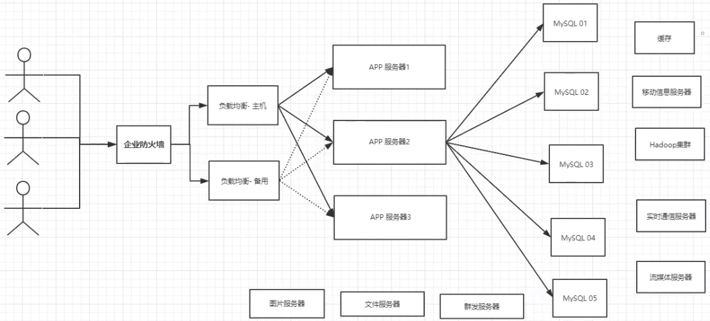
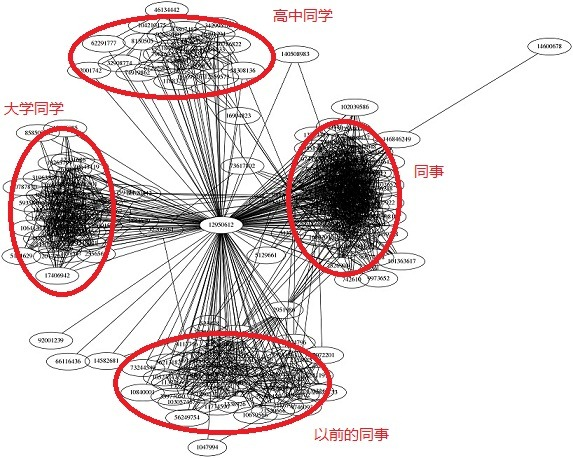
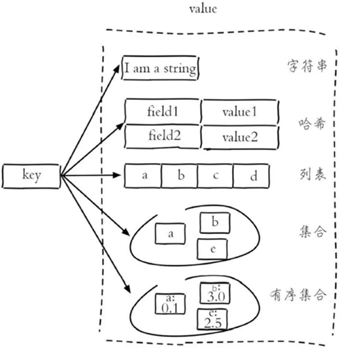
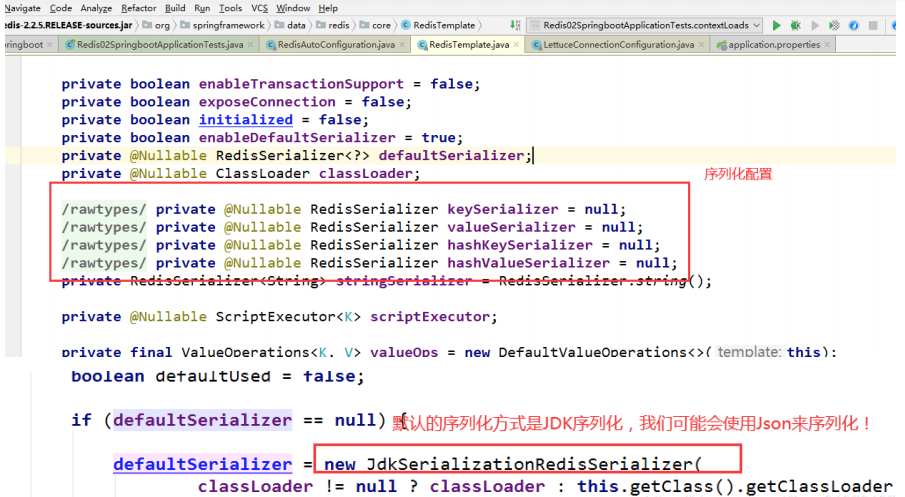

::: tip 

Redis 是现在最受欢迎的 NoSQL 数据库之一，Redis 是一个使用 ANSI C 编写的开源、包含多种数据结构、支持网络、基于内存、可选持久性的键值对存储数据库。

:::

# Redis的基本使用


## NoSQL 概述

### 回顾数据库曾经的时代

#### 单机 MySQL 的时代


90 年代，一个普通网站的访问量一般不会太大，单个数据库完全足够了。

那个时候，网站更多的是在使用静态网页（HTML），服务器根本没有太大的压力。

思考一下，在这种情况下，一个网站的瓶颈是什么？

1. 数据量如果太大，一个机器就放不下了。

2. 数据的索引（B+Tree）如果太多，一个机器内存也放不下。（单表大小超过300万就一定要建立索引了）

3. 访问量（读写混合）如果太大，一个服务器承受不了。

只要你的网站开始出现以上的三种情况之一，那么你就必须要给项目做升级了。

#### Memcached（缓存）+ MySQL + 垂直拆分（读写分离）

一个网站 80% 的情况都是在读数据，如果我们每次读都要去查询数据库的话就十分的麻烦。

所以说我们希望减轻数据库的压力，我们可以使用缓存来保证效率。

使用缓存之前的发展过程： 尝试了优化数据结构和索引--> 尝试了使用文件缓存（IO）--->选择了 Memcached（当时最热门的技术）


#### 分库分表 + 水平拆分 + MySQL 集群

行业内技术和业务在发展的同时，对从业人员的要求也越来越高。

**本质：数据库的读和写**

早些年数据库使用 MyISAM 引擎： **表锁**，十分影响效率，高并发下就会出现严重的锁问题。

后来我们转战了 Innodb 引擎：**行锁**，比表锁效率高得多。

慢慢的我们就开始使用 **分库分表** 来解决写的压力，MySQL 也在当年推出了 **表分区**，但这个技术并没有多少公司使用。

而 MySQL 集群的出现，很好地满足了那个年代的所有需求。


#### 如今最近的年代

2010 到 2020 十年之间，世界已经发生了翻天覆地的变化。

当面对一些数据量很多，数据变化很快的情况时，MySQL 等关系型数据库就不太够用了。

使用 MySQL 来存储一些比较大的文件，比如博客内容，比如图片。数据库的表很大的时候，效率就会变低了。

在一些大数据的 I/O 压力下，关系型数据库的表几乎没法更大（比如我现在突然想给表加 1 列），如果这时候可以有一种数据库来专门处理这种数据，MySQL 的压力就变得十分小。

目前一个基本的互联网项目的架构：



### 为什么要用 NoSQL

在 Web 应用发展的初期，那时关系型数据库受到了较为广泛的关注和应用，原因是因为那时候 Web 站点基本上访问和并发不高、交互也较少。

而在后来，随着访问量的提升，用户的个人信息、社交网络、地理位置信息、用户日志等数据都开始呈现爆发式增长。**使用关系型数据库的 Web 站点多多少少都开始在性能上出现了一些瓶颈**，而瓶颈的源头一般是在磁盘的 I/O 上。

而随着互联网技术的进一步发展，各种类型的应用层出不穷，这导致在当今云计算、大数据盛行的时代，对性能有了更多的需求，主要体现在以下四个方面：

1. 低延迟的读写速度：应用快速地反应能极大地提升用户的满意度
2. 支撑海量的数据和流量：对于 **搜索** 这样大型应用而言，需要利用 PB 级别（1PB=1024TB）的数据和能应对百万级的流量
3. 大规模集群的管理：系统管理员希望分布式的应用能更简单进行地部署和管理
4. 庞大运营成本的考量：IT 部门希望在硬件成本、软件成本和人力成本能够有大幅度地降低

为了克服这一问题，NoSQL 应运而生，它同时具备了 **高性能、可扩展性强、高可用** 等优点，受到广泛开发人员和仓库管理人员的青睐。

### 什么是 NoSQL

关系型数据库：表格 ，行 ，列。

NoSQL = Not Only SQL （不仅仅是 SQL）

泛指非关系型数据库，随着 Web2.0 互联网的诞生，传统的关系型数据库很难对付 Web2.0 时代，尤其是超大规模的高并发的社区，暴露出来了很多难以克服的问题。

而 NoSQL 在当今大数据环境下发展得十分迅速，Redis 是其中发展最快的，而且是我们当下必须要掌握的一个技术。

用户的个人信息，社交网络，地理位置等数据类型的存储不需要一个固定的格式（行，列），也不需多余的操作就可以 **横向扩展**。

`Map<String,Object>` 就是一种非常典型的，使用键值对来控制的 NoSQL 的表现。

### NoSQL 的特点

1. 方便扩展、解耦（数据之间没有关系，很好扩展）

2. 大数据量、高性能（Redis 在 1 秒内可以写入 8 万次，读取 11 万次。NoSQL 的缓存记录级，是一种细粒度的缓存，性能会比较高）

3. 数据类型是多样型的（不需要事先设计数据库，随取随用。如果是数据量十分大的表，很多人是无法设计好的）

4. 传统 RDBMS 和 NoSQL：

   ```
   传统的 RDBMS
   - 结构化组织
   - SQL
   - 数据和关系都存在单独的表中 row col
   - 操作操作，数据定义语言
   - 严格的一致性
   - 基础的事务
   - .....
   ```

   ```
   NoSQL
   - 不仅仅是数据
   - 没有固定的查询语言
   - 键值对存储，列存储，文档存储，图形数据库（社交关系）
   - 最终一致性
   - CAP 定理和 BASE 理论（异地多活）
   - 高性能，高可用，高可扩
   - ....
   ```

### 拓展：3V + 3高

大数据时代的 3V：主要是描述问题的。

1. 海量 Volume

2. 多样 Variety
3. 实时 Velocity

大数据时代的 3高：主要是对程序的要求。

1. 高并发
2. 高可扩

3. 高性能

真正在公司中的实践：NoSQL + RDBMS 结合使用才是最强的。

### NoSQL 的四大分类

**KV 键值对：**

- 新浪：Redis
- 美团：Redis + Tair

- 阿里、百度：Redis + memecache

**文档型数据库（采用 bson 格式，和 json 一样）：**

- MongoDB （必须要掌握）
  - MongoDB 是一个基于分布式文件存储的数据库，由C++ 编写，主要用来处理大量的文档。
  - MongoDB 是一个介于关系型数据库和非关系型数据中中间的产品。
  - MongoDB 是非关系型数据库中功能最丰富、最像关系型数据库的一款产品。

- ConthDB

**列存储数据库：**

- HBase

- 分布式文件系统

**图关系数据库：**




- 图关系数据库存的不是图形，而是关系，比如：朋友圈社交网络、广告推荐。

- Neo4j 
- InfoGrid

### NoSQL 四大类对比

| 分类                  | Examples举例                                       | 典型应用场景                                                 | 数据模型                                        | 优点                                                         | 缺点                                                         |
| --------------------- | -------------------------------------------------- | ------------------------------------------------------------ | ----------------------------------------------- | ------------------------------------------------------------ | ------------------------------------------------------------ |
| **键值（key-value）** | Tokyo Cabinet/Tyrant, Redis, Voldemort, Oracle BDB | 内容缓存，主要用于处理大量数据的高访问负载，也用于一些日志系统等等。 | Key 指向 Value 的键值对，通常用hash table来实现 | 查找速度快                                                   | 数据无结构化，通常只被当作字符串或者二进制数据               |
| **列存储数据库**      | Cassandra, HBase, Riak                             | 分布式的文件系统                                             | 以列簇式存储，将同一列数据存在一起              | 查找速度快，可扩展性强，更容易进行分布式扩展                 | 功能相对局限                                                 |
| **文档型数据库**      | CouchDB, MongoDb                                   | Web应用（与Key-Value类似，Value是结构化的，不同的是数据库能够了解Value的内容） | Key-Value对应的键值对，Value为结构化数据        | 数据结构要求不严格，表结构可变，不需要像关系型数据库一样需要预先定义表结构 | 查询性能不高，而且缺乏统一的查询语法。                       |
| **图形(Graph)数据库** | Neo4J, InfoGrid, Infinite Graph                    | 社交网络，推荐系统等。专注于构建关系图谱                     | 图结构                                          | 利用图结构相关算法。比如最短路径寻址，N度关系查找等          | 很多时候需要对整个图做计算才能得出需要的信息，而且这种结构不太好做分布式的集群 |

## Redis 入门

### Redis 概述

Redis（**R**emote **D**ictionary **S**erver 即远程字典服务）是现在最受欢迎的 NoSQL 数据库之一。

Redis 是一个使用 ANSI C 编写的开源、包含多种数据结构、支持网络、基于内存、可选持久性的 **键值对存储数据库**，其具备如下特性：

- 基于内存运行，性能高效
- 支持分布式，理论上可以无限扩展
- key-value 存储系统
- 开源的使用 ANSI C 语言编写、遵守 BSD 协议、支持网络、可基于内存亦可持久化的日志型、Key-Value 数据库，并提供多种语言的API

### 相比于其他数据库类型，Redis 具备的特点

- **异常快**：Redis 非常快，每秒可执行大约 110000 次的设置（SET）操作，每秒大约可执行 81000 次的读取/获取（GET）操作。
- **支持丰富的数据类型**：Redis 支持开发人员常用的大多数数据类型，例如列表，集合，排序集和散列等等。这使得 Redis 很容易被用来解决各种问题，因为我们知道哪些问题可以更好使用地哪些数据类型来处理解决。
- **操作具有原子性**：所有 Redis 操作都是原子操作，这确保如果两个客户端并发访问，Redis 服务器能接收更新的值。
- **多实用工具**：Redis 是一个多实用工具，可用于多种用例，如：缓存，消息队列（Redis 本地支持发布/订阅），应用程序中的任何短期数据，例如，Web 应用程序中的会话，网页命中计数等。

### Redis 的应用场景


- 缓存（“热点”数据：高频读、低频写）

- 计数器

- 消息队列

- 排行榜

- 社交网络

- 实时系统

### Redis 安装

1. 先去官网下载安装包 **redis-7.0.11.tar.gz**：https://redis.io
2. 将安装包上传到 Linux 服务器
3. 解压安装包，命令：`tar -zxvf redis-4.0.0.tar.gz -C /usr/local`
4. 安装 Redis 的依赖环境 gcc，命令：`yum install gcc-c++`
5. 进入Redis 的目录，进行编译，命令：`make`
6. 进入 Redis 的 src 目录，进行安装，命令：`make install`

安装后的重点文件：

- Redis 服务启动脚本：`/usr/local/redis-7.0.11/src/redis-server`
- Redis 客户端脚本：`/usr/local/redis-7.0.11/src/redis-cli`
- Redis 配置文件：`/usr/local/redis-7.0.11/redis.conf`

Linux 的软件安装目录是也是有讲究的，理解这一点，在对系统进行管理是有益的：

- `/usr`：系统级的目录，可以理解为 `C:/Windows/`，`/usr/lib` 理解为 `C:/Windows/System32`。
- `/usr/local`：用户级的程序目录，可以理解为 `C:/Progrem Files/`，用户自己编译的软件默认会安装到这个目录下。
- `/opt`：用户级的程序目录，可以理解为 `D:/Software`，opt 有可选的意思，这里可以用于放置第三方大型软件（或游戏），当你不需要时，直接 `rm -rf` 掉即可。当硬盘容量不够时，也可将 /opt 单独挂载到其他磁盘上使用。

源码放哪里？

- `/usr/src`：系统级的源码目录
- `/usr/local/src`：用户级的源码目录

### Redis 服务启动与停止

执行 Redis 服务启动脚本文件 `redis-server`

通过启动日志可以看到，Redis 默认端口号为 6379。

Ctrl + C 可以停止 Redis 服务。

通过 **redis-cli** 可以连接到指定的 Redis 服务，取消连接的命令为 **shutdown**。

退出客户端可以输入 **exit** 或者 **quit** 命令。

### Redis 配置文件

前面我们已经启动了 Redis 服务，但 Redis 在默认情况下启动后是在前台运行，而且客户端不需要密码就可以连接到 Redis 服务。

如果我们希望 Redis 服务启动后是在后台运行，同时希望客户端认证通过后才能连接到 Redis 服务，此时就需要修改 Redis 的配置文件：

Linux 系统中 Redis 配置文件：`REDIS_HOME/redis.conf`

- 设置 Redis 服务后台运行：

  将配置文件中的 `daemonize` 配置项改为 yes，默认值为 no。

  注意：Windows 版的 Redis 不支持后台运行。

- 设置 Redis 服务的密码：

  将配置文件中的 `# requirepass foobared` 配置项取消注释，默认为注释状态。`foobared` 为密码，可以根据情况自己指定。

- 设置允许客户端远程连接 Redis 服务：

  Redis 服务默认只能客户端本地连接，不允许客户端远程连接。将配置文件中的 `bind 127.0.0.1` 配置项注释掉。

**注意：**

- Redis 配置文件中 `#` 表示注释
- Redis 配置文件中的配置项前面不能有空格，需要顶格写
- daemonize：用来指定 Redis 是否要用守护线程的方式启动，设置成 yes 时，代表开启守护进程模式。在该模式下，Redis 会在后台运行
- requirepass：设置 Redis 的连接密码
- bind：如果指定了 bind，则说明只允许来自指定网卡的 Redis 请求。如果没有指定，就说明可以接受来自任意一个网卡的 Redis 请求。

修改配置文件后需要重启 Redis 服务配置才能生效，并且启动 Redis 服务时需要显示的指定配置文件：

~~~sh
# 进入 Redis 安装目录
cd /usr/local/redis-4.0.0
# 启动 Redis 服务，指定使用的配置文件
./src/redis-server ./redis.conf
~~~

由于 Redis 配置文件中开启了认证校验，即客户端连接时需要提供密码，此时客户端连接方式变为：

```sh
./src/redis-cli -h 127.0.0.1 -p 6379 -a 123456
```

**参数说明：**

- **-h**：指定连接的 Redis 服务的 ip 地址
- **-p**：指定连接的 Redis 服务的端口号
- **-a**：指定连接的 Redis 服务的密码

### Redis 性能测试

Redis 性能测试是通过同时执行多个命令实现的。

#### 语法

redis 性能测试的基本命令如下：

```shell
redis-benchmark [option] [option value]
```

**注意**：该命令是在 redis 的目录下执行的，而不是 redis 客户端的内部指令。

#### 实例1

以下实例同时执行 10000 个请求来检测性能：

```shell
$ redis-benchmark -n 10000  -q

PING_INLINE: 141043.72 requests per second
PING_BULK: 142857.14 requests per second
SET: 141442.72 requests per second
GET: 145348.83 requests per second
INCR: 137362.64 requests per second
LPUSH: 145348.83 requests per second
LPOP: 146198.83 requests per second
SADD: 146198.83 requests per second
SPOP: 149253.73 requests per second
LPUSH (needed to benchmark LRANGE): 148588.42 requests per second
LRANGE_100 (first 100 elements): 58411.21 requests per second
LRANGE_300 (first 300 elements): 21195.42 requests per second
LRANGE_500 (first 450 elements): 14539.11 requests per second
LRANGE_600 (first 600 elements): 10504.20 requests per second
MSET (10 keys): 93283.58 requests per second
```

redis 性能测试工具可选参数如下所示：

| 选项      | 描述                                       | 默认值    |
| :-------- | :----------------------------------------- | :-------- |
| **-h**    | 指定服务器主机名                           | 127.0.0.1 |
| **-p**    | 指定服务器端口                             | 6379      |
| **-s**    | 指定服务器 socket                          |           |
| **-c**    | 指定并发连接数                             | 50        |
| **-n**    | 指定请求数                                 | 10000     |
| **-d**    | 以字节的形式指定 SET/GET 值的数据大小      | 3         |
| **-k**    | 1=keep alive 0=reconnect                   | 1         |
| **-r**    | SET/GET/INCR 使用随机 key, SADD 使用随机值 |           |
| **-P**    | 通过管道传输  `<numreq> ` 请求             | 1         |
| **-q**    | 强制退出 redis。仅显示 query/sec 值        |           |
| **--csv** | 以 CSV 格式输出                            |           |
| **-l**    | 生成循环，永久执行测试                     |           |
| **-t**    | 仅运行以逗号分隔的测试命令列表。           |           |
| **-I**    | Idle 模式。仅打开 N 个 idle 连接并等待。   |           |

#### 实例2

以下实例我们使用了多个参数来测试 redis 性能：

```shell
$ redis-benchmark -h 127.0.0.1 -p 6379 -t set,lpush -n 10000 -q

SET: 146198.83 requests per second
LPUSH: 145560.41 requests per second
```

以上实例中主机为 127.0.0.1，端口号为 6379，执行的命令为 `set`，`lpush`，请求数为 10000，通过 -q 参数让结果只显示每秒执行的请求数。

### Redis 基础知识

redis 默认有 16 个数据库，默认使用的是第 0 个。

可以使用 `select [index]` 进行数据库的切换。

```shell
127.0.0.1:6379> select 3 # 切换到 3 号数据库
OK
127.0.0.1:6379[3]> dbsize # 查看当前数据库的大小
(integer) 0
127.0.0.1:6379[3]> set name SlovinG # 往 3 号数据库里添加数据
OK
127.0.0.1:6379[3]> dbsize
(integer) 1
127.0.0.1:6379[3]> select 7
OK
127.0.0.1:6379[7]> DBSIZE
(integer) 0
127.0.0.1:6379[7]> get name # 尝试获取当前数据库里的数据
(nil)
127.0.0.1:6379[7]> select 3
OK
127.0.0.1:6379[3]> get name
"SlovinG"
127.0.0.1:6379[3]> keys * # 查看所有的索引
1) "name"
127.0.0.1:6379[3]> flushdb # 清空当前数据库
OK
127.0.0.1:6379[3]> keys *
(empty list or set)
127.0.0.1:6379[9]> select 0
OK
127.0.0.1:6379> keys * # 0 号数据库里的一些默认值
1) "key:__rand_int__"
2) "mylist"
3) "user-login-token:1"
127.0.0.1:6379> flushall # 清空全部数据库
OK
127.0.0.1:6379> keys *
(empty list or set)
```

**在 Redis4.0 之前，Redis 是单线程的：**

- Redis 是很快的，官方表示，Redis 是基于内存操作的，它的性能瓶颈是机器的内存和网络带宽，而不是 CPU。因为在你 CPU 还没达到瓶颈时你的内存可能就先满了、或者带宽达到瓶颈了。因此 CPU 不是主要原因，那么自然就采用单线程了。
- 更何况使用多线程还会面临一些额外的问题，比如共享资源的保护等等，对于一个 CPU 不是主要瓶颈的键值对数据库而言，采用单线程是非常合适的。
- Redis 是 C 语言写的，官方提供的数据为 100000+ 的 QPS，完全不比同样是使用 key-value 的 Memecache 差。

**Redis 在 4.0 之前使用单线程的模式是因为以下三个原因：**

- 使用单线程模式的 Redis，其开发和维护会更简单，因为单线程模型方便开发和调试
- 即使使用单线程模型也能够并发地处理多客户端的请求，因为 Redis 内部使用了基于 epoll 的多路复用
- 对于 Redis 而言，主要的性能瓶颈是内存或者网络带宽，而并非 CPU

**Redis 为什么单线程还这么快？**

- 误区 1 ：高性能的服务器一定是多线程的。

- 误区 2 ：多线程（CPU 上下文会切换）一定比单线程效率高。

速度上，CPU > 内存 > 硬盘 。

**核心：**

- 基于内存操作：Redis 的所有数据都在内存中，因此所有的运算都是内存级别的，所以它的性能比较高
- 数据结构简单：Redis 的数据结构是为自身专门量身打造的，而这些数据结构的查找和操作的时间复杂度都是 O(1)
- 多路复用和非阻塞 I/O：Redis 使用 I/O 多路复用功能来监听多个 socket 连接客户端，这样就可以使用一个线程来处理多个情况，从而减少线程切换带来的开销，同时也避免了 I/O 阻塞操作，从而大大地提高了 Redis 的性能
- 避免上下文切换：因为是单线程模型，因此就避免了不必要的上下文切换和多线程竞争，这就省去了 **多线程切换** 带来的时间和性能上的开销，而且单线程不会导致死锁的问题发生

## 五大常用数据类型

Redis 是一个开源（BSD许可）的，内存中的数据结构存储系统，它可以用作 **数据库**、**缓存** 和 **消息中间件 MQ**。 它支持多种类型的数据结构，如 **字符串（strings）， 散列（hashes）， 列表（lists）， 集合（sets）， 有序集合（sorted sets） 与范围查询， bitmaps， hyperloglogs 和 地理空间（geospatial） 索引半径查询**。



### Redis-key

在 Redis 中无论什么数据类型，在数据库中都是以 key-value 形式保存，通过进行对 Redis-key 的操作，来完成对数据库中数据的操作。

因此 Redis 中存在一些通用命令，主要是针对 key 进行操作：

- `KEYS pattern` 查找所有符合给定模式（pattern）的 key 

- `EXISTS key` 检查给定 key 是否存在
- `TYPE key` 返回 key 所储存的值的类型
- `TTL key` 返回给定 key 的剩余生存时间（TTL，time to live），以秒为单位
- `DEL key` 该命令用于在 key 存在是删除 key
- `MOVE key db`：将键值对移动到指定数据库 db
- `EXPIRE key second`：设置键值对的过期时间

关于 `TTL key` 命令：

- Redis 的 key，通过 TTL 命令返回 key 的过期时间，一般来说有 3 种：
  -  若 key 没有设置过期时间，则返回 -1
  -  若 key 有设置过期时间，但 key 已经过期，则返回 -2
  -  若 key 有设置过期时间，且 key 还没有过期，则返回 key 的正常剩余时间

关于重命名 `RENAME` 和 `RENAMENX`：

- `RENAME key newkey`：修改 key 的名称
- `RENAMENX key newkey`：仅当 newkey 不存在时，将 key 改名为 newkey 

### 字符串类型（String）

它是一个二进制安全的字符串，意味着它不仅能够存储字符串、还能存储图片、视频等多种类型，最大长度支持 512M。

常用的 Redis 字符串命令：

| 命令                               | 描述                                                         |
| :--------------------------------- | :----------------------------------------------------------- |
| **`SET key value`**                | **设置指定 key 的值**                                        |
| **`GET key`**                      | **获取指定 key 的值**                                        |
| `GETRANGE key start end`           | 返回 key 中字符串值的子字符                                  |
| `GETSET key value`                 | 将给定 key 的值设为 value ，并返回 key 的旧值（old value）   |
| `GETBIT key offset`                | 对 key 所储存的字符串值，获取指定偏移量上的位（bit）         |
| `MGET key1 [key2..]`               | 获取所有（一个或多个）给定 key 的值                          |
| `SETBIT key offset value`          | 对 key 所储存的字符串值，设置或清除指定偏移量上的位（bit）   |
| **`SETEX key seconds value`**      | **将值 value 关联到 key ，并将 key 的过期时间设为 seconds（以秒为单位）** |
| **`SETNX key value`**              | **只有在 key 不存在时设置 key 的值**                         |
| `SETRANGE key offset value`        | 用 value 参数覆写给定 key 所储存的字符串值，从偏移量 offset 开始 |
| `STRLEN key`                       | 返回 key 所储存的字符串值的长度                              |
| `MSET key value [key value ...]`   | 同时设置一个或多个 key-value 对                              |
| `MSETNX key value [key value ...]` | 同时设置一个或多个 key-value 对，当且仅当所有给定 key 都不存在 |
| `PSETEX key milliseconds value`    | 这个命令和 SETEX 命令相似，但它以毫秒为单位设置 key 的生存时间，而不是像 SETEX 命令那样，以秒为单位 |
| `INCR key`                         | 将 key 中储存的数字值增一                                    |
| `INCRBY key increment`             | 将 key 所储存的值加上给定的增量值（increment）               |
| `INCRBYFLOAT key increment`        | 将 key 所储存的值加上给定的浮点增量值（increment）           |
| `DECR key`                         | 将 key 中储存的数字值减一                                    |
| `DECRBY key decrement`             | key 所储存的值减去给定的减量值（decrement）                  |
| `APPEND key value`                 | 如果 key 已经存在并且是一个字符串， APPEND 命令将指定的 value 追加到该 key 原来值（value）的末尾 |

应用场景：

1. **缓存**：经典使用场景，把常用信息，字符串，图片或者视频等信息放到 redis 中，mysql 做持久化层，redis 作为缓存层，可以降低 mysql 的读写压力。

2. **计数器**：redis 是单线程模型，一个命令执行完才会执行下一个，同时数据可以一步落地到其他的数据源。

3. **session**：常见方案 spring session + redis 实现 **session 共享**。

### 哈希类型（Hash）

该类型是由 field 和关联的 value 组成的 map。其中，field 和 value 都是 **字符串类型** 的。

Hash 的操作命令如下：

| 命令                                             | 描述                                                  |
| ------------------------------------------------ | :---------------------------------------------------- |
| **`HDEL key field1 [field2]`**                   | **删除一个或多个哈希表字段**                          |
| `HEXISTS key field`                              | 查看哈希表 key 中，指定的字段是否存在                 |
| **`HGET key field`**                             | **获取存储在哈希表中指定字段的值**                    |
| **`HGETALL key`**                                | **获取在哈希表中指定 key 的所有字段和值**             |
| `HINCRBY key field increment`                    | 为哈希表 key 中的指定字段的整数值加上增量 increment   |
| `HINCRBYFLOAT key field increment`               | 为哈希表 key 中的指定字段的浮点数值加上增量 increment |
| **`HKEYS key`**                                  | **获取所有哈希表中的字段**                            |
| `HLEN key`                                       | 获取哈希表中字段的数量                                |
| `HMGET key field1 [field2]`                      | 获取所有给定字段的值                                  |
| `HMSET key field1 value1 [field2 value2]`        | 同时将多个 field-value (域-值)对设置到哈希表 key 中   |
| **`HSET key field value`**                       | **将哈希表 key 中的字段 field 的值设为 value**        |
| `HSETNX key field value`                         | 只有在字段 field 不存在时，设置哈希表字段的值         |
| **`HVALS key`**                                  | **获取哈希表中所有值**                                |
| `HSCAN key cursor [MATCH pattern] [COUNT count]` | 迭代哈希表中的键值对                                  |

应用场景：

1. **缓存**：能更直观，并且相比 String 更节省空间，便于维护缓存信息，如用户信息，视频信息等。

### 列表类型（List）

该类型是一个插入顺序排序的字符串元素集合，基于 **双链表** 实现。

你可以添加一个元素到列表的头部（左边）或者尾部（右边）。

一个列表最多可以包含 $$2^{32} - 1$$ 个元素 （4294967295，每个列表超过40亿个元素）。

List 的操作命令如下：

| 命令                                    | 命令及描述                                                   |
| --------------------------------------- | :----------------------------------------------------------- |
| `BLPOP key1 [key2] timeout`             | 移出并获取列表的第一个元素， 如果列表没有元素会阻塞列表直到等待超时或发现可弹出元素为止 |
| **`BRPOP key1 [key2] timeout]`**        | **移出并获取列表的最后一个元素， 如果列表没有元素会阻塞列表直到等待超时或发现可弹出元素为止** |
| `BRPOPLPUSH source destination timeout` | 从列表中弹出一个值，将弹出的元素插入到另外一个列表中并返回它； 如果列表没有元素会阻塞列表直到等待超时或发现可弹出元素为止 |
| `LINDEX key index`                      | 通过索引获取列表中的元素                                     |
| `LINSERT key BEFORE|AFTER pivot value`  | 在列表的元素前或者后插入元素                                 |
| **`LLEN key`**                          | **获取列表长度**                                             |
| `LPOP key`                              | 移出并获取列表的第一个元素                                   |
| **`LPUSH key value1 [value2]`**         | **将一个或多个值插入到列表头部**                             |
| `LPUSHX key value`                      | 将一个值插入到已存在的列表头部                               |
| **`LRANGE key start stop`**             | **获取列表指定范围内的元素**                                 |
| `LREM key count value`                  | 移除列表元素                                                 |
| `LSET key index value`                  | 通过索引设置列表元素的值                                     |
| `LTRIM key start stop`                  | 对一个列表进行修剪(trim)，就是说，让列表只保留指定区间内的元素，不在指定区间之内的元素都将被删除 |
| **`RPOP key`**                          | **移除列表的最后一个元素，返回值为移除的元素**               |
| `RPOPLPUSH source destination`          | 移除列表的最后一个元素，并将该元素添加到另一个列表并返回     |
| `RPUSH key value1 [value2]`             | 在列表中添加一个或多个值                                     |
| `RPUSHX key value`                      | 为已存在的列表添加值                                         |

应用场景：

1. timeline：例如微博的时间轴，有人发布微博，用 lpush 加入时间轴，展示新的列表信息。
1. 消息队列

### 集合类型（Set）

Set 类型是一种无顺序集合, 它和 List 类型最大的区别是：**集合中的元素没有顺序，且元素是唯一的**。

Set 类型的底层是通过哈希表实现的，其操作命令为：

| 命令                                              | 描述                                                |
| :------------------------------------------------ | --------------------------------------------------- |
| **`SADD key member1 [member2]`**                  | **向集合添加一个或多个成员**                        |
| **`SCARD key`**                                   | **获取集合的成员数**                                |
| **`SDIFF key1 [key2]`**                           | **返回第一个集合与其他集合之间的差集**              |
| `SDIFFSTORE destination key1 [key2]`              | 返回给定所有集合的差集并存储在 destination 中       |
| **`SINTER key1 [key2]`**                          | **返回给定所有集合的交集**                          |
| `SINTERSTORE destination key1 [key2]`             | 返回给定所有集合的交集并存储在 destination 中       |
| `SISMEMBER key member`                            | 判断 member 元素是否是集合 key 的成员               |
| **`SMEMBERS key`**                                | **返回集合中的所有成员**                            |
| `SMOVE source destination member`                 | 将 member 元素从 source 集合移动到 destination 集合 |
| `SPOP key`                                        | 移除并返回集合中的一个随机元素                      |
| `SRANDMEMBER key [count]`                         | 返回集合中一个或多个随机数                          |
| **`SREM key member1 [member2]`**                  | **移除集合中一个或多个成员**                        |
| **`SUNION key1 [key2]`**                          | **返回所有给定集合的并集**                          |
| `SUNIONSTORE destination key1 [key2]`             | 所有给定集合的并集存储在 destination 集合中         |
| `SSCAN key cursor [MATCH pattern\] [COUNT count]` | 迭代集合中的元素                                    |

应用场景：在某些场景，如社交场景中，通过交集、并集和差集运算，通过 Set 类型可以非常方便地查找共同好友、共同关注和共同偏好等社交关系。

### 顺序集合类型（sorted Set）

ZSet 是一种有序集合类型，每个元素都会关联一个 double 类型的分数权值，通过这个权值来为集合中的成员进行从小到大的排序。

有序集合的成员是唯一的，但分数是可以重复的。

与 Set 类型一样，其底层也是通过哈希表实现的。

ZSet 命令：

| 命令                                             | 描述                                                         |
| :----------------------------------------------- | ------------------------------------------------------------ |
| **`ZADD key score1 member1 [score2 member2]`**   | **向有序集合添加一个或多个成员，或者更新已存在成员的分数**   |
| `ZCARD key`                                      | 获取有序集合的成员数                                         |
| `ZCOUNT key min max`                             | 计算在有序集合中指定区间分数的成员数                         |
| **`ZINCRBY key increment member`**               | **有序集合中对指定成员的分数加上增量 increment**             |
| `ZINTERSTORE destination numkeys key [key ...]`  | 计算给定的一个或多个有序集的交集并将结果集存储在新的有序集合 destination 中 |
| `ZLEXCOUNT key min max`                          | 在有序集合中计算指定字典区间内成员数量                       |
| **`ZRANGE key start stop [WITHSCORES]`**         | **通过索引区间返回有序集合指定区间内的成员**                 |
| `ZRANGEBYLEX key min max [LIMIT offset count]`   | 通过字典区间返回有序集合的成员                               |
| `ZRANGEBYSCORE key min max [WITHSCORES] [LIMIT]` | 通过分数返回有序集合指定区间内的成员                         |
| `ZRANK key member`                               | 返回有序集合中指定成员的索引                                 |
| **`ZREM key member [member ...]`**               | **移除有序集合中的一个或多个成员**                           |
| `ZREMRANGEBYLEX key min max`                     | 移除有序集合中给定的字典区间的所有成员                       |
| `ZREMRANGEBYRANK key start stop`                 | 移除有序集合中给定的排名区间的所有成员                       |
| `ZREMRANGEBYSCORE key min max`                   | 移除有序集合中给定的分数区间的所有成员                       |
| `ZREVRANGE key start stop [WITHSCORES]`          | 返回有序集中指定区间内的成员，通过索引，分数从高到低         |
| `ZREVRANGEBYSCORE key max min [WITHSCORES]`      | 返回有序集中指定分数区间内的成员，分数从高到低排序           |
| `ZREVRANK key member`                            | 返回有序集合中指定成员的排名，有序集成员按分数值递减(从大到小)排序 |
| `ZSCORE key member`                              | 返回有序集中，成员的分数值                                   |
| `ZUNIONSTORE destination numkeys key [key ...]`  | 计算给定的一个或多个有序集的并集，并存储在新的 key 中        |
| `ZSCAN key cursor [MATCH pattern] [COUNT count]` | 迭代有序集合中的元素（包括元素成员和元素分值）               |

应用场景：

1. set 排序、存储班级成绩表、工资表排序
2. 普通消息、重要消息，带权重进行判断
3. 排行榜应用实现，取 Top N 测试

## 三种特殊数据类型

### geospatial

**应用**：存储位置信息，可以很方便计算和管理位置信息

主要的命令有：geoadd、geopos、geodist、geohash、georadius、georadiusbymember

**geoadd**：添加一个或多个位置到一个 key 中

语法：`geoadd key longitude latitude member [longitude latitude member ...]`

```shell
localhost:6379> geoadd China:city 116.40 39.9 北京    # 添加一个位置
(integer) 1
localhost:6379> geoadd China:city 121.47 31.23 上海 120.15 30.28 杭州 113.27 23.13 广东    # 添加多个位置
(integer) 3
localhost:6379> zrange China:city 0 -1    # 查看用zrange，因为geo本质是一个有序集合
1) "\xe5\xb9\xbf\xe4\xb8\x9c"
2) "\xe6\x9d\xad\xe5\xb7\x9e"
3) "\xe4\xb8\x8a\xe6\xb5\xb7"
4) "\xe5\x8c\x97\xe4\xba\xac"
localhost:6379> exit
[root@VM_0_2_centos bin]# redis-cli -h localhost -p 6379 --raw    # --raw 解决中文乱码问题
localhost:6379> zrange China:city 0 -1
广东
杭州
上海
北京
localhost:6379> zrange China:city 0 -1 withscores
广东
4046533759716104
杭州
4054134257390783
上海
4054803462927619
北京
4069885360207904
```

**geopos**：查看某个key成员的地理位置

语法：`geopos key member [member ...]`

```shell
localhost:6379> geopos China:city 北京
116.39999896287918091
39.90000009167092543
localhost:6379> geopos China:city 北京 上海
116.39999896287918091
39.90000009167092543
121.47000163793563843
31.22999903975783553
```

**geodist**：计算两点之间的距离，可以选择计算单位，默认单位是m

语法：`geodist key member1 member2 [m|km|ft|mi]`

```shell
localhost:6379> geodist China:city 北京 上海
1067378.7564
localhost:6379> geodist China:city 北京 上海 m
1067378.7564
localhost:6379> geodist China:city 北京 上海 km
1067.3788
```

**geohash**：获取元素的 hash 值

geohash 可以获取元素的经纬度编码字符串，上面已经提到，它是 base32 编码。 你可以使用这个编码值去 [http://geohash.org/$](https://links.jianshu.com/go?to=http%3A%2F%2Fgeohash.org%2F%24){hash}中进行直接定位，它是 geohash 的标准编码值.

`语法：geohash key member [member ...]`

```shell
localhost:6379> geohash China:city 上海
wtw3sj5zbj0
```

**georadius**：给定一个坐标点，查找附近指定距离范围内的元素，相当于附近的人

语法：`georadius key longitude latitude radius m|km|ft|mi [withcoord] [withdist] [withhash] [COUNT count] [ASC|DESC] [STORE key] [STOREDIST key]`

先查找安徽的坐标：117.25 ， 31.83

```shell
localhost:6379> georadius China:city 117.25 31.83 500 km    # 查看方圆500km内的城市
杭州
上海
localhost:6379> georadius China:city 117.25 31.83 500 km withcoord  # withcoord  结果带上坐标
杭州
120.15000075101852417
30.2800007575645509
上海
121.47000163793563843
31.22999903975783553
localhost:6379> georadius China:city 117.25 31.83 500 km withdist    # withdist 带上距离
杭州
325.6740
上海
405.5792
localhost:6379> georadius China:city 117.25 31.83 500 km withdist count 1 asc    # 由近到远取一个
杭州
325.6740
```

**georadiusbymember**：与georadius功能相同，不同的是georadiusbymember的中心点是geo中的成员而不是经纬度

语法：`georadiusbymember key longitude latitude radius m|km|ft|mi [withcoord] [withdist] [withhash] [COUNT count] [ASC|DESC] [STORE key] [STOREDIST key]`

```shell
localhost:6379> georadiusbymember China:city 上海 500 km withdist
杭州
164.5694
上海
0.0000
```

**zrem**：应为geo的本质是zset，所以删除也是用zrem

```shell
localhost:6379> zrange China:city 0 -1 
杭州
上海
北京
localhost:6379> zrem China:city 北京
1
localhost:6379> zrange China:city 0 -1 
杭州
上海
```

### bitmaps

Redis 提供的 Bitmaps 这个“数据结构”可以实现对位的操作。Bitmaps本身不是一种数据结构，实际上就是字符串，但是它可以对字符串的位进行操作。

可以把 Bitmaps 想象成一个以位为单位数组，数组中的每个单元只能存0或者1，数组的下标在 bitmaps 中叫做偏移量。单个 bitmaps 的最大长度是512MB，即$2^{32}$个比特位。

**setbit**：设置值

语法：`setbit key offset value`

理解：key是数组，offset是数组的下标，value是这个下标位置的状态值（0或1）

```shell
localhost:6379> setbit sign 0 0
0
localhost:6379> setbit sign 1 1
0
localhost:6379> setbit sign 2 1
0
localhost:6379> setbit sign 2 0    # 支持覆盖
1
localhost:6379> setbit sign 3 1
0
localhost:6379> setbit sign 4 0
0
localhost:6379> setbit sign 5 1
0
localhost:6379> setbit sign 6 0
0
```

**getbit**：获取key中一个下标的状态

语法：`getbit key offset`

```shell
localhost:6379> getbit sign 2
0
```

**bitcount**：统计一个key中状态为1的下标数量

语法：`bitcount key [start end]`

```bash
localhost:6379> bitcount sign    # 默认统计全部
3
localhost:6379> bitcount sign 0 3    # 统计指定下标范围
3
```

**bitop**：用来做bitmaps之间的运算

语法：`bitop operation destkey key [key ...]`

operation：表明操作类型，有四个可选值

- and：与
- or：或
- not：非
- xor：异或

destkey：目标key，运算的结果会存到这里

key [key ...] 被运算的一个或多个bitmaps的key

```shell
localhost:6379> setbit sign 0 1
0
localhost:6379> setbit sign 1 1
0
localhost:6379> setbit sign2 0 1
0
localhost:6379> setbit sign2 1 0
0
localhost:6379> bitop and and-result sign sign2    # 获取sign和sign2的交集存入and-result
1
localhost:6379> getbit and-result 0
1
localhost:6379> bitop or or-result sign sign2    # 获取sign和sign2的并集存入or-result
1
localhost:6379> getbit or-result 0
1
localhost:6379> getbit or-result 1
1
localhost:6379> bitop not not-result sign2    # 将sign2中是0的值存入not-result
1
localhost:6379> getbit not-result 0
0
localhost:6379> getbit not-result 1
1
localhost:6379> bitop xor xor-result sign sign2    # 将sign和sign2的异或值存入xor-result
1
localhost:6379> getbit xor-result 0
0
localhost:6379> getbit xor-result 1
1
```

**bitpos**：计算 Bitmaps 中第一个值为 targetBit 的偏移量：

语法：`bitpos key bit [start] [end]`

```bash
localhost:6379> bitpos sign 1    # sing中第一个状态为1的下标
0
localhost:6379> bitpos sign 0    # sing中第一个状态为0的下标
2
```

小结：我们在生活中，或编程中，只要只有两个标志位（0 1）我们都可以考虑使用 bitmaps 来进行操作，这 样的话，十分方便，还有就是能够极大的节约内存！

### hyperloglogs

hyperloglog 是用来做 **基数统计** 的，其优点是：输入的提及无论多么大，那 hyperloglog 使用的空间总是固定的12KB ，利用12KB，它可以计算 $2^{64}$ 个不同元素的基数！ 非常节省空间！

应用例子：网页统计 UV （浏览用户数量，同一天同一个ip多次访问算一次访问，目的是计数，而不是保存用户）

**pfadd**：添加元素

**pfcount**：统计基数

**pfmerge**: 合并多个数据集

```shell
localhost:6379> pfadd mykey a b c c c c c c d e
1
localhost:6379> pfadd mykey2 e f e d f c d s f d d d d d d
1
localhost:6379> pfcount mykey
5
localhost:6379> pfcount mykey2
5
localhost:6379> pfcount mykey mykey2
7
localhost:6379> pfmerge mergekey  mykey mykey2    # 合并mykey和mykey2写入到mergekey
OK
localhost:6379> pfcount mergekey
7
```

在需要对大数据进行不重复数统计时推荐用hyperloglogs，但是如果需要精确统计的话就不要使用，因为hyperloglogs存在1%左右的误差。

## 事务

### Redis 的事务是什么

- 可以一次执行多个命令，本质是一组命令的集合。

- 一个事务中的所有命令都会被序列化，可以按顺序串行化的执行，而不会被其他命令插入。

### Redis 的事务能干什么

- 一个队列中，**一次性**、**顺序性**、**排他性** 的执行一系列命令（要和 pipeline 区分开）

### Redis 的事务没有隔离级别的概念

- 所有的命令在事务中，并没有直接被执行，只有发起执行命令的时候才会执行。

### Redis 的事务有以下三个重要的保证

- 批量操作在发送 `EXEC` 命令前被放入队列缓存。
- 收到 `EXEC` 命令后进入事务执行，事务中任意命令执行失败，其余的命令依然被执行。
- 在事务执行过程，其他客户端提交的命令请求不会插入到事务执行命令序列中。

### 一个事务从开始到执行会经历以下三个阶段

- 开始事务（**MULTI**）
- 命令入队
- 执行事务（**EXEC**）

实例：

先以 **MULTI** 开始一个事务， 然后将多个命令入队到事务中， 最后由 **EXEC** 命令触发事务， 一并执行事务中的所有命令：

```shell
127.0.0.1:6379> MULTI
OK

127.0.0.1:6379> SET book-name "Mastering C++ in 21 days"
QUEUED

127.0.0.1:6379> GET book-name
QUEUED

127.0.0.1:6379> SADD tag "C++" "Programming" "Mastering Series"
QUEUED

127.0.0.1:6379> SMEMBERS tag
QUEUED

127.0.0.1:6379> EXEC
1) OK
2) "Mastering C++ in 21 days"
3) (integer) 3
4) 1) "Mastering Series"
   2) "C++"
   3) "Programming"
```

**单个 Redis 命令的执行是原子性的，但 Redis 没有在事务上增加任何维持原子性的机制，所以 Redis 事务的执行并不是原子性的。**

事务可以理解为一个打包的批量执行脚本，但批量指令并非原子化的操作，**中间某条指令的失败不会导致前面已做指令的回滚，也不会造成后续的指令不做。**

比如：

```shell
redis 127.0.0.1:7000> multi
OK
redis 127.0.0.1:7000> set a aaa
QUEUED
redis 127.0.0.1:7000> set b bbb
QUEUED
redis 127.0.0.1:7000> set c ccc
QUEUED
redis 127.0.0.1:7000> exec
1) OK
2) OK
3) OK
```

如果在 `set b bbb` 处失败，`set a` 已成功不会回滚，`set c` 还会继续执行。

### Redis 事务命令

| 命令                  | 描述                                                         |
| :-------------------- | ------------------------------------------------------------ |
| `DISCARD`             | 取消事务，放弃执行事务块内的所有命令                         |
| `EXEC`                | 执行所有事务块内的命令                                       |
| `MULTI`               | 标记一个事务块的开始                                         |
| `UNWATCH`             | 取消 WATCH 命令对所有 key 的监视                             |
| `WATCH key [key ...]` | 监视一个（或多个） key ，如果在事务执行之前这个（或这些） key 被其他命令所改动，那么事务将被打断 |

使用 `watch` 可以当做 redis 的 **乐观锁** 操作。

## Jedis

在 Java 程序中操作 Redis 需要使用 Redis 的 Java 客户端，就如同我们使用 JDBC 操作 MySQL 数据库一样。

Redis 的 Java 客户端很多，官方推荐的有三种：

- Jedis
- Lettuce
- Redisson

**1 、导入对应的依赖**

```xml
<!--Jedis-->
<dependency>
    <groupId>redis.clients</groupId>
    <artifactId>jedis</artifactId>
    <version>3.3.0</version>
</dependency>

<!--fastjson-->
<dependency>
    <groupId>com.alibaba</groupId>
    <artifactId>fastjson</artifactId>
    <version>1.2.73</version>
</dependency>
```

**2 、编码测试：**

- 获取连接，连接数据库

- 执行操作命令

- 关闭连接

```java
import redis.clients.jedis.Jedis;

public class TestPing {
    public static void main(String[] args) {
        //连接本地的 Redis 服务
        Jedis jedis = new Jedis("127.0.0.1", 6379);
        // 如果 Redis 服务设置来密码，需要下面这行，没有就不需要
        // jedis.auth("123456");
        System.out.println("连接成功");
        //查看服务是否运行
        System.out.println("服务正在运行: " + jedis.ping());
    }
}
```

**3、运行结果：**

```
连接成功
服务正在运行: PONG
```

**4、常用的 API：**

所有的 api 命令，就是我们对应的上面学习的 Redis 指令，一个都没有变化。

**5、Jedis 事务：**

```java
public class TestTX {
    public static void main(String[] args) {
        Jedis jedis = new Jedis("127.0.0.1", 6379);

        JSONObject jsonObject = new JSONObject();
        jsonObject.put("hello", "world");
        jsonObject.put("name", "SlovinG");
        // 开启事务
        Transaction multi = jedis.multi();
        String result = jsonObject.toJSONString();
        // jedis.watch(result)
        try {
            multi.set("user1", result);
            multi.set("user2", result);
            // 执行事务
            multi.exec();
        }catch (Exception e){
            // 放弃事务
            multi.discard();
        } finally {
            // 关闭连接
            System.out.println(jedis.get("user1"));
            System.out.println(jedis.get("user2"));
            jedis.close();
        }
    }
}
```

## SpringBoot 整合 Redis

### 介绍

Spring Data Redis 是 Spring 的一部分，提供了在 Spring 应用中通过简单的配置就可以访问 Redis 服务，对 Redis 底层开发包进行了高度封装。在 Spring 项目中，可以使用 Spring Data Redis 来简化 Redis 操作。

SpringBoot 操作数据：`spring-data jpa jdbc mongodb redis`。

SpringData 是和 SpringBoot 齐名的项目。

注意，在 SpringBoot2.x 之后，原来使用的 Jedis 被替换为了 lettuce

- jedis : 采用的直连，多个线程操作的话，是不安全的，如果想要避免不安全，就要使用 jedis pool 连接池， 更像 **BIO 模式**
- lettuce : 采用 netty，实例可以再多个线程中进行共享，不存在线程不安全的情况，可以减少线程数据了，更像 **NIO 模式**

我们在学习 SpringBoot 自动配置的原理时，整合一个组件并进行配置一定会有一个自动配置类 `xxxAutoConfiguration`，并且在 `spring.factories` 中也一定能找到这个类的完全限定名。Redis 也不例外。

那么就一定还存在一个 `RedisProperties` 类


之前我们说 `SpringBoot2.x` 后默认使用 Lettuce 来替换 Jedis，现在我们就能来验证了。

先看 Jedis:


`@ConditionalOnClass` 注解中有两个类是默认不存在的，所以 Jedis 是无法生效的

然后再看 Lettuce：


完美生效。

Spring Data Redis 中提供了一个高度封装的类：**RedisTemplate**，针对 Redis 客户端中大量 api 进行了归类封装，将同一类型操作封装为 operation 接口，具体分类如下：

- ValueOperations：简单 K-V 操作
- SetOperations：set 类型数据操作
- ZSetOperations：zset 类型数据操作
- HashOperations：针对 hash 类型的数据操作
- ListOperations：针对 list 类型的数据操作

源码分析：

```java
/* RedisAutoConfiguration.java */
@Bean
@ConditionalOnMissingBean(name = "redisTemplate") // 我们可以自己定义一个redisTemplate来替换这个默认的
public RedisTemplate<Object, Object> redisTemplate(RedisConnectionFactory redisConnectionFactory)
     throws UnknownHostException {
    // 默认的 RedisTemplate 没有过多的设置，redis 对象都是需要序列化的
    // 两个泛型都是 Object, Object 的类型，我们后使用需要强制转换 <String, Object>
    RedisTemplate<Object, Object> template = new RedisTemplate<>();
    template.setConnectionFactory(redisConnectionFactory);
    return template;
}

@Bean
@ConditionalOnMissingBean //由于String是redis中最常使用的类型，所以说单独提出来了一个bean
public StringRedisTemplate stringRedisTemplate(RedisConnectionFactory redisConnectionFactory)
    throws UnknownHostException {
    StringRedisTemplate template = new StringRedisTemplate();
    template.setConnectionFactory(redisConnectionFactory);
    return template;
}
```

### 使用方式

1、导入依赖

```xml
<!-- 操作 redis -->
<dependency>
    <groupId>org.springframework.boot</groupId>
    <artifactId>spring-boot-starter-data-redis</artifactId>
</dependency>
```

2、配置连接信息

```yaml
# 配置 Redis
spring:
  redis:
    host: 127.0.0.1
    port: 6379
    password: 123456
    database: 0 # 操作的是0号数据库
    ......
```

3、测试

```java
@SpringBootTest
class Redis02SpringbootApplicationTests {
    @Autowired
    private RedisTemplate redisTemplate;
    @Test
    void contextLoads() {
        // redisTemplate 操作不同的数据类型，api 和我们的指令是一样的
        // opsForValue 操作字符串 类似 String
        // opsForList 操作 List 类似 List
        // opsForSet
        // opsForHash
        // opsForZSet
        // opsForGeo
        // opsForHyperLogLog
        // 除了基本的操作，我们常用的方法都可以直接通过 redisTemplate 操作，比如事务，和基本的CRUD
        // 获取 redis 的连接对象
        // RedisConnection connection = redisTemplate.getConnectionFactory().getConnection();
        // connection.flushDb();
        // connection.flushAll();
        redisTemplate.opsForValue().set("mykey","SlovinG");
        System.out.println(redisTemplate.opsForValue().get("mykey"));
    }
}
```

4、测试结果：

IDEA 的控制台中可以正常输出 mykey 字段的内容，但如果 **我们回到 Redis 客户端中查看数据，会发现全是乱码**。

这时候就关系到存储对象的序列化问题，在网络中传输的对象也是一样需要序列化，否者就全是乱码。

我们转到看那个默认的 RedisTemplate 内部什么样子：



RedisTemplate 中默认的序列化机制是采用 JDK 序列化器（JdkSerializationRedisSerializer），该序列化器将对象转化成 byte 数组进行存储，这种方式需要存入对象必须实现 Serializable 接口，而且转化效率低、数据可读性差、有可能会造成字符串的转义，所以我们可以定制自己的 RedisTemplate 对其进行修改。

通常大部分项目会改用 Jackson2JsonRedisSerializer 或 FastJsonRedisSerializer 将对象转化为 json 进行序列化及反序列化。

关于对象的保存：**所有的对象都需要序列化**

我们来编写一个自己的 RedisTemplete：

```java
import com.fasterxml.jackson.annotation.JsonAutoDetect;
import com.fasterxml.jackson.annotation.PropertyAccessor;
import com.fasterxml.jackson.databind.ObjectMapper;
import org.springframework.context.annotation.Bean;
import org.springframework.context.annotation.Configuration;
import org.springframework.data.redis.connection.RedisConnectionFactory;
import org.springframework.data.redis.core.RedisTemplate;
import org.springframework.data.redis.serializer.Jackson2JsonRedisSerializer;
import org.springframework.data.redis.serializer.StringRedisSerializer;

@Configuration
public class RedisConfig {
    // 这是我给大家写好的一个固定模板，大家在企业中，拿去就可以直接使用！
    // 自己定义了一个 RedisTemplate
    @Bean
    public RedisTemplate<String, Object> redisTemplate(RedisConnectionFactory factory) {
        // 我们为了自己开发方便，一般直接使用 <String, Object>
        RedisTemplate<String, Object> template = new RedisTemplate<String,Object>();
        template.setConnectionFactory(factory);
        // Json序列化配置
        Jackson2JsonRedisSerializer jackson2JsonRedisSerializer = new Jackson2JsonRedisSerializer(Object.class);
        ObjectMapper om = new ObjectMapper();
        om.setVisibility(PropertyAccessor.ALL, JsonAutoDetect.Visibility.ANY);
        om.enableDefaultTyping(ObjectMapper.DefaultTyping.NON_FINAL);
        jackson2JsonRedisSerializer.setObjectMapper(om);
        // String 的序列化
        StringRedisSerializer stringRedisSerializer = new  StringRedisSerializer();
        // key 采用 String 的序列化方式
        template.setKeySerializer(stringRedisSerializer);
        // hash 的 key 也采用 String 的序列化方式
        template.setHashKeySerializer(stringRedisSerializer);
        // value 序列化方式采用 jackson
        template.setValueSerializer(jackson2JsonRedisSerializer);
        // hash 的 value 序列化方式采用 jackson
        template.setHashValueSerializer(jackson2JsonRedisSerializer);
        template.afterPropertiesSet();
        return template;
    }
}
```

3.0 版本的 RedisTemplete：

```java
import com.fasterxml.jackson.annotation.JsonAutoDetect;
import com.fasterxml.jackson.annotation.JsonTypeInfo;
import com.fasterxml.jackson.annotation.PropertyAccessor;
import com.fasterxml.jackson.databind.ObjectMapper;
import com.fasterxml.jackson.databind.jsontype.impl.LaissezFaireSubTypeValidator;
import org.springframework.context.annotation.Bean;
import org.springframework.context.annotation.Configuration;
import org.springframework.data.redis.connection.RedisConnectionFactory;
import org.springframework.data.redis.core.RedisTemplate;
import org.springframework.data.redis.serializer.Jackson2JsonRedisSerializer;
import org.springframework.data.redis.serializer.StringRedisSerializer;

@Configuration
public class RedisConfig {
    // 自己定义了一个 RedisTemplate
    @Bean
    public RedisTemplate<String, Object> redisTemplate(RedisConnectionFactory factory) {
        // 我们为了开发方便，一般直接使用 <String, Object>
        // 创建RedisTemplate实例，并设置连接工厂
        RedisTemplate<String, Object> redisTemplate = new RedisTemplate<>();
        redisTemplate.setConnectionFactory(factory);
        // Json序列化配置
        ObjectMapper objectMapper = new ObjectMapper();
        // 方法设置JavaBean的可见性
        objectMapper.setVisibility(PropertyAccessor.ALL, JsonAutoDetect.Visibility.ANY);
        // 设置默认类型
        objectMapper.activateDefaultTyping(LaissezFaireSubTypeValidator.instance, ObjectMapper.DefaultTyping.NON_FINAL, JsonTypeInfo.As.PROPERTY);
        // 创建一个FastJson序列化器，用于将Java对象序列化成JSON格式存储到Redis中
        Jackson2JsonRedisSerializer<Object> jackson2JsonRedisSerializer = new Jackson2JsonRedisSerializer<>(objectMapper, Object.class);
        // String 的序列化
        StringRedisSerializer stringRedisSerializer = new StringRedisSerializer();
        // key 采用 String 的序列化方式
        redisTemplate.setKeySerializer(stringRedisSerializer);
        // hash 的 key 也采用 String 的序列化方式
        redisTemplate.setHashKeySerializer(stringRedisSerializer);
        // value 序列化方式采用 jackson
        redisTemplate.setValueSerializer(jackson2JsonRedisSerializer);
        // hash 的 value 序列化方式采用 jackson
        redisTemplate.setHashValueSerializer(jackson2JsonRedisSerializer);
        redisTemplate.afterPropertiesSet();
        return redisTemplate;
    }
}
```

### 自定义 Redis 工具类

使用 RedisTemplate 需要频繁调用 `.opForxxx` 然后才能进行对应的操作，这样使用起来代码效率低下，工作中一般不会这样使用，而是将这些常用的公共 API 抽取出来封装成为一个工具类，然后直接使用工具类来间接操作 Redis，不但效率高并且易用。

工具类参考博客：[java redisUtils工具类很全 - 静静别跑 - 博客园](https://www.cnblogs.com/zhzhlong/p/11434284.html)

所有的 Redis 操作，其实对于 Java 开发人员来说，十分的简单，更重要的是去理解 Redis 的思想和每一种数据结构的用处和应用场景！

