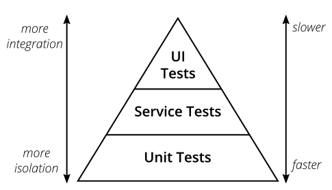
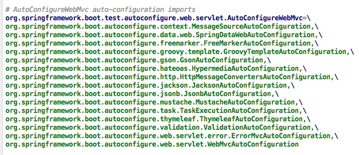

# SpringBootTest详解

提起“**单元测试**”这几个字，一般开发者会条件反射般想起：“工作忙，没时间”，这是一个客观上的事实，在急于求成的大环境下，规范的单元测试却需要一些明确的代码产出及覆盖率指标，这的确很让人头疼。早几年的关于单元测试的文章，不停的鼓吹其好处，却对时间成本的问题视而不见。

而与此相对的，对于开发者而言，其编写的代码是否需要经过测试，经过几轮测试才能让开发者安心？相信大多数开发者会说需要，且测试次数越多越好，毕竟上线时求神拜佛的滋味其实并不好受。

所以这其实是自相矛盾的，我们身处其中，有时候只能抱测试哥哥的大腿以求生路。但是仅仅靠测试人员把关，有些细节和异常流程不可避免会被漏掉。

## 单元测试的缺点

回到单元测试本身的概念上来，单元测试强调剥离所有外部依赖的影响，对类中的每个方法都写一个测试 case，这里面本身存在一些现实问题：

1. 为每个方法写测试 case，时间成本太高
2. 有些方法的操作本身非常简单，只是一些简单的赋值等操作，没有必要写测试
3. 团队开发能力参差不齐，**解耦做的不好的情况下，单元测试越发困难**
4. 有些依赖非常难以剥离（进行 mock），或者剥离的代价比较大，比如 mvc 中 Controller 需要web容器，数据库访问需要真实数据库（使用内存数据库，初始化的工作量也非常大），Redis 等

单元测试，仅适合那些逻辑复杂，逻辑分叉较多且较少依赖外部环境的方法，这些方法使用 unit test 再合适不过。除此之外的其他业务场景，建议舍弃 **单元测试**，投入到“**功能测试**”的怀抱。

## 功能测试

在本文中，我们对功能测试做一下约定：在单个 Java 虚拟机内部的，mock 大部分外部依赖的影响，针对业务功能（通常是 Controller 或对外公开的 Service）的测试，称之为“**功能测试**”，把单个服务内部的业务功能综合在一起，每一个测试 case 都是一个小业务流程。



测试金字塔中的第二层是我们重点关注的，unit test 虽好，但常规的业务开发中用的不多。

功能测试不同于集成测试（UI 测试），集成测试原意是强调端到端的完整链路测试，期望环境尽可能是真实的，每一个测试 case 都是一个完整的业务流程，本文不讨论集成测试相关内容。

用测试代码安安心心的写出一条功能测试 case，确保它能够正确执行，每个核心业务功能一条测试 case。这样仍需做一些 mock 工作，但 mock 工作量变小了很多，再加上 Spring 框架支持，进一步减轻了测试工作量。

## Spring Boot Test 简介

Spring Test 与 JUnit 等其他测试框架结合起来，提供了便捷高效的测试手段。而 Spring Boot Test 是在 Spring Test 之上的再次封装，增加了 **切片测试**，增强了mock 能力。

整体上，Spring Boot Test 支持的测试种类，大致可以分为如下三类：

| 类别     | 描述                                                         | 涉及的注解                       |
| :------- | :----------------------------------------------------------- | :------------------------------- |
| 单元测试 | 一般面向方法，编写一般业务代码时，测试成本较大（理由见上文） | `@Test`                          |
| 切片测试 | 一般面向难于测试的边界功能，介于单元测试和功能测试之间       | `@RunWith`、`@WebMvcTest` 等     |
| 功能测试 | 一般面向某个完整的业务功能，同时也可以使用切面测试中的mock能力，推荐使用 | `@RunWith`、`@SpringBootTest` 等 |

**功能测试** 过程中的几个关键要素及支撑方式如下：

| 要素         | 实现方式                                              |
| :----------- | :---------------------------------------------------- |
| 测试运行环境 | 通过 `@RunWith` 和 `@SpringBootTest` 启动 spring 容器 |
| mock能力     | Mockito 提供了强大 mock 功能                          |
| 断言能力     | AssertJ、Hamcrest、JsonPath 提供了强大的断言能力      |

## 快速开始

增加 `spring-boot-starter-test` 依赖，使用 `@RunWith`和 `@SpringBootTest` 注解，即可开始测试。

### 添加依赖

```xml
<dependency>
    <groupId>org.springframework.boot</groupId>
    <artifactId>spring-boot-starter-test</artifactId>
    <scope>test</scope>
</dependency>
```

一旦依赖了 `spring-boot-starter-test`，下面这些类库将被一同依赖进去：

| 名称                           | 简介                                                         |
| :----------------------------- | :----------------------------------------------------------- |
| JUnit                          | Java 测试事实上的标准，默认依赖版本是4.12（JUnit5 和 JUnit4 差别比较大，集成方式有不同） |
| Spring Test & Spring Boot Test | Spring 的测试支持                                            |
| AssertJ                        | 提供了流式的断言方式                                         |
| Hamcrest                       | 提供了丰富的 matcher                                         |
| Mockito                        | mock 框架，可以按类型创建 mock 对象，可以根据方法参数指定特定的响应，也支持对于 mock 调用过程的断言 |
| JSONassert                     | 为 JSON 提供了断言功能                                       |
| JsonPath                       | 为 JSON 提供了 XPATH 功能                                    |

### 测试类

```java
package com.example.learn.springboottestlearn.ttt;

import com.example.learn.springboottestlearn.entity.User;
import com.example.learn.springboottestlearn.service.UserService;
import org.junit.Test;
import org.junit.runner.RunWith;
import org.springframework.beans.factory.annotation.Autowired;
import org.springframework.boot.test.context.SpringBootTest;
import org.springframework.test.context.junit4.SpringRunner;

@RunWith(SpringRunner.class)
@SpringBootTest
public class SpringBootTestLearnApplicationTests {

    @Autowired
    private UserService userService;

    @Test
    public void testAddUser() {
        User user = new User();
        user.setName("john");
        user.setAddress("earth");
        userService.add(user);
    }

}
```

`@RunWith`  是 Junit4 提供的注解，将 Spring 和 Junit 链接了起来。

假如使用Junit5，不再需要使用 `@ExtendWith` 注解，`@SpringBootTest` 和其它 `@*Test` 默认已经包含了该注解。

`@SpringBootTest` 替代了 spring-test 中的 `@ContextConfiguration` 注解，目的是加载 ApplicationContext，启动 spring 容器。

使用 `@SpringBootTest` 时并没有像  `@ContextConfiguration` 一样显示指定 locations 或 classes 属性，原因在于 `@SpringBootTest` 注解会自动检索程序的配置文件，检索顺序是从当前包开始，逐级向上查找被 `@SpringBootApplication` 或 `@SpringBootConfiguration` 注解的类。

回忆一下 Spring 整合 JUnit 的步骤：


## 功能测试

一般情况下，使用 `@SpringBootTest` 后，Spring 将 **加载所有被管理的 bean**，**基本等同于启动了整个服务**，此时便可以开始功能测试。

由于 web 服务是最常见的服务，且我们对于 web 服务的测试有一些特殊的期望，所以 `@SpringBootTest` 注解中，给出了 webEnvironment 参数指定了 web 的environment，该参数的值一共有四个可选值：

| 名称         | 说明                                                         |
| :----------- | :----------------------------------------------------------- |
| MOCK         | 此值为默认值，该类型提供一个 mock 环境，可以和 `@AutoConfigureMockMvc` 或 `@AutoConfigureWebTestClient` 搭配使用，开启Mock 相关的功能。注意此时内嵌的服务（servlet 容器）并没有真正启动，也不会监听 web 服务端口。 |
| RANDOM_PORT  | 启动一个真实的 web 服务，监听一个随机端口。                  |
| DEFINED_PORT | 启动一个真实的 web 服务，监听一个定义好的端口（从 `application.properties` 读取）。 |
| NONE         | 启动一个非 web 的 ApplicationContext，既不提供 mock 环境，也不提供真实的 web 服务。 |

> 另外，如果当前服务的 classpath 中没有包含web相关的依赖，spring 将启动一个非 web 的 ApplicationContext，此时的 webEnvironment 就没有什么意义了

## 切片测试

所谓切片测试，官网文档称为 **“slice” of your application**，实际上是对一些特定组件的称呼。这里的 slice 并非单独的类（毕竟普通类只需要基于JUnit的单元测试即可），而是介于单元测试和集成测试中间的范围。

slice 是指一些在特定环境下才能执行的模块，比如 MVC 中的 Controller、JDBC 数据库访问、Redis 客户端等，这些模块大多脱离特定环境后不能独立运行，假如spring 没有为此提供测试支持，开发者只能启动完整服务对这些模块进行测试，这在一些复杂的系统中非常不方便，所以 spring 为这些模块提供了测试支持，使开发者有能力单独对这些模块进行测试。

通过 `@*Test` 开启具体模块的测试支持，开启后 spring 仅加载相关的 bean，无关内容不会被加载。

使用 `@WebMvcTest` 用来校验 controllers 是否正常工作的示例：

```java
import org.junit.*;
import org.junit.runner.*;
import org.springframework.beans.factory.annotation.*;
import org.springframework.boot.test.autoconfigure.web.servlet.*;
import org.springframework.boot.test.mock.mockito.*;

import static org.assertj.core.api.Assertions.*;
import static org.mockito.BDDMockito.*;
import static org.springframework.test.web.servlet.request.MockMvcRequestBuilders.*;
import static org.springframework.test.web.servlet.result.MockMvcResultMatchers.*;

@RunWith(SpringRunner.class)
@WebMvcTest(UserVehicleController.class)
public class MyControllerTests {

    @Autowired
    private MockMvc mvc;

    @MockBean
    private UserVehicleService userVehicleService;

    @Test
    public void testExample() throws Exception {
        given(this.userVehicleService.getVehicleDetails("sboot"))
                .willReturn(new VehicleDetails("Honda", "Civic"));
        this.mvc.perform(get("/sboot/vehicle").accept(MediaType.TEXT_PLAIN))
                .andExpect(status().isOk()).andExpect(content().string("Honda Civic"));
    }

}
```

使用 `@WebMvcTest`  和 `MockMvc` 搭配使用，可以在不启动 web 容器的情况下，对 Controller 进行测试。

## 小结

上文文主要介绍了如下几点内容：

1. 测试可以分为 **单元测试**、**功能测试**、以及介于两者之间的 **切片测试**
2. 建议放弃不必要的单元测试，拥抱功能测试、切片测试。
3. Spring Boot Test 在 spring-test  基础上，增强了mock能力，增加了测试的自动配置、切片测试。
4. `@SpringBootTest`、`@WebMvcTest` 等其他 `@*Test` 注解， 作为开启测试的注解，都可以启动一个 ApplicationContext。

Spring 为了避免的繁琐难懂的xml配置，引入大量 annotation 进行系统配置，确实减轻了配置工作量。由此，理解这些 annotation 变得尤为重要，一定程度上讲，对 Spring Boot Test 的使用，就是对其相关 annotation 的使用。

掌握这些 annotation（及部分关联的类），可以从注解功能分类，相互之间的搭配组合，及相似注解的差异这三方面着手。

## 按功能分类

> 本文仅讨论Spring Boot Test（版本：2.1.1.BUILD-SNAPSHOT）中的注解。
>
> 由于使用这些注解的使用方式大多比较简单，为避免干扰阅读，本文不再罗列代码示例。

从功能上讲，Spring Boot Test 中的注解主要分如下几类：

| 类别         | 示例                   | 格式              | 说明                                                      |
| :----------- | :--------------------- | :---------------- | :-------------------------------------------------------- |
| 配置类型     | `@TestConfiguration`等 |                   | 提供一些测试相关的配置入口                                |
| mock 类型    | `@MockBean`等          |                   | 提供 mock 支持                                            |
| 启动测试类型 | `@SpringBootTest`      | `@\*Test`         | 以 Test 结尾的注解，具有加载 applicationContext 的能力    |
| 自动配置类型 | `@AutoConfigureJdbc`等 | `@AutoConfigure*` | 以 AutoConfigure 开头的注解，具有加载测试支持功能的能力。 |

### 配置类型的注解

| 注解                         | 作用                                                         | 实践中的使用                                                 |
| :--------------------------- | :----------------------------------------------------------- | :----------------------------------------------------------- |
| `@TestComponent`             | 该注解另一种`@Component`，在语义上用来指定某个Bean是专门用于测试的。 | 该注解适用于测试代码和正式混合在一起时，不加载被该注解描述的Bean，使用不多。 |
| `@TestConfiguration`         | 该注解是另一种`@TestComponent`，它用于补充额外的Bean或覆盖已存在的Bean | 在不修改正式代码的前提下，使配置更加灵活                     |
| `@TypeExcludeFilters`        | 用来排除`@TestConfiguration`和`@TestComponent`               | 适用于测试代码和正式代码混合的场景，使用不多                 |
| `@OverrideAutoConfiguration` | 可用于覆盖`@EnableAutoConfiguration`，与`ImportAutoConfiguration`结合使用，以限制所加载的自动配置类 | 在不修改正式代码的前提下，提供了修改配置自动配置类的能力     |
| `@PropertyMapping`           | 定义`@AutoConfigure*`注解中用到的变量名称，例如在`@AutoConfigureMockMvc`中定义名为spring.test.mockmvc.webclient.enabled的变量 | 一般不使用                                                   |

> 使用`@SpringBootApplication`启动测试或者生产代码，被`@TestComponent`描述的Bean会自动被排除掉。如果不是则需要向`@SpringBootApplication`添加TypeExcludeFilter。

### mock 类型的注解

| 注解         | 作用                                        |
| :----------- | :------------------------------------------ |
| `@MockBean`  | 用于mock指定的class或被注解的属性           |
| `@MockBeans` | 使`@MockBean`支持在同一类型或属性上多次出现 |
| `@SpyBean`   | 用于spy指定的class或被注解的属性            |
| `@SpyBeans`  | 使`@SpyBeans`支持在同一类型或属性上多次出现 |

`@MockBean `和 `@SpyBean` 这两个注解，在 mockito 框架中本来已经存在，且功能基本相同。Spring Boot Test又定义一份重复的注解，目的在于使`MockBean`和 `SpyBean `被ApplicationContext管理，从而方便使用。

> MockBean和SpyBean功能非常相似，都能模拟方法的各种行为。不同之处在于MockBean是全新的对象，跟正式对象没有关系；而SpyBean与正式对象紧密联系，可以模拟正式对象的部分方法，没有被模拟的方法仍然可以运行正式代码。

### 自动配置类型的注解（@AutoConfigure*）

| 注解                                  | 作用                                      |
| :------------------------------------ | :---------------------------------------- |
| `@AutoConfigureJdbc`                  | 自动配置JDBC                              |
| `@AutoConfigureCache`                 | 自动配置缓存                              |
| `@AutoConfigureDataLdap`              | 自动配置LDAP                              |
| `@AutoConfigureJson`                  | 自动配置JSON                              |
| `@AutoConfigureJsonTesters`           | 自动配置JsonTester                        |
| `@AutoConfigureDataJpa`               | 自动配置JPA                               |
| `@AutoConfigureTestEntityManager`     | 自动配置TestEntityManager                 |
| `@AutoConfigureRestDocs`              | 自动配置Rest Docs                         |
| `@AutoConfigureMockRestServiceServer` | 自动配置 MockRestServiceServer            |
| `@AutoConfigureWebClient`             | 自动配置 WebClient                        |
| `@AutoConfigureWebFlux`               | 自动配置 WebFlux                          |
| `@AutoConfigureWebTestClient`         | 自动配置 WebTestClient                    |
| `@AutoConfigureMockMvc`               | 自动配置 MockMvc                          |
| `@AutoConfigureWebMvc`                | 自动配置WebMvc                            |
| `@AutoConfigureDataNeo4j`             | 自动配置 Neo4j                            |
| `@AutoConfigureDataRedis`             | 自动配置 Redis                            |
| `@AutoConfigureJooq`                  | 自动配置 Jooq                             |
| `@AutoConfigureTestDatabase`          | 自动配置Test Database，可以使用内存数据库 |

这些注解可以搭配 `@\*Test` 使用，用于开启在 `@\*Test `中未自动配置的功能。例如 `@SpringBootTest `和 `@AutoConfigureMockMvc `组合后，就可以注入`org.springframework.test.web.servlet.MockMvc`。

> **“自动配置类型”有两种使用方式：**
>
> 1. 在功能测试（即使用`@SpringBootTest`）时显示添加。
> 2. 一般在切片测试中被隐式使用，例如`@WebMvcTest`注解时，隐式添加了`@AutoConfigureCache`、`@AutoConfigureWebMvc`、`@AutoConfigureMockMvc`。

> **实现原理**
> 与`spring-boot-autoconfigure`中的`@\*AutoConfiguration`实现略有不同，Test包中的 `@AutoConfigure\*` 通过 `DeterminableImports` 接口作为指定代码的识别入口，通过 `ImportAutoConfiguration`注解作为配置入口，从Test包下的 `spring.factories` 读取配置文件，每个 `@AutoConfigure\*`中都可以包含多个 Spring Boot 的 `@\*AutoConfiguration`，例如：
>
> 
>

### 启动测试类型的注解（@*Test）

所有的 `@\*Test` 注解都被 `@BootstrapWith` 注解，它们可以启动 ApplicationContext，是测试的入口，所有的测试类必须声明一个 `@\*Test` 注解。

| 注解              | 作用                                                         |      |
| :---------------- | :----------------------------------------------------------- | ---- |
| `@SpringBootTest` | 自动侦测并加载@SpringBootApplication或@SpringBootConfiguration中的配置，默认web环境为MOCK，不监听任务端口 |      |
| `@DataRedisTest`  | 测试对Redis操作，自动扫描被@RedisHash描述的类，并配置Spring Data Redis的库 |      |
| `@DataJpaTest`    | 测试基于JPA的数据库操作，同时提供了TestEntityManager替代JPA的EntityManager |      |
| `@DataJdbcTest`   | 测试基于Spring Data JDBC的数据库操作                         |      |
| `@JsonTest`       | 测试JSON的序列化和反序列化                                   |      |
| `@WebMvcTest`     | 测试Spring MVC中的controllers                                |      |
| `@WebFluxTest`    | 测试Spring WebFlux中的controllers                            |      |
| `@RestClientTest` | 测试对REST客户端的操作                                       |      |
| `@DataLdapTest`   | 测试对LDAP的操作                                             |      |
| `@DataMongoTest`  | 测试对MongoDB的操作                                          |      |
| `@DataNeo4jTest`  | 测试对Neo4j的操作                                            |      |

> 除了`@SpringBootTest`之外的注解都是用来进行切面测试的，他们会默认导入一些自动配置，点击 [官方docs](https://docs.spring.io/spring-boot/docs/2.1.0.RELEASE/reference/htmlsingle/#test-auto-configuration) 查看详情。

一般情况下，推荐使用`@SpringBootTest`而非其它切片测试的注解，简单有效。若某次改动仅涉及特定切片，可以考虑使用切片测试。

`@SpringBootTest`是这些注解中最常用的一个，其中包含的配置项如下：

| 配置名称         | 说明                                                         |
| :--------------- | :----------------------------------------------------------- |
| `value`          | 指定配置属性                                                 |
| `properties`     | 指定配置属性，和value意义相同                                |
| `classes`        | 指定配置类，等同于`@ContextConfiguration`中的class，若没有显示指定，将查找嵌套的`@Configuration`类，然后返回到`SpringBootConfiguration`搜索配置 |
| `webEnvironment` | 指定web环境，可选值有：`MOCK`、`RANDOM_PORT`、`DEFINED_PORT`、`NONE` |

`webEnvironment`详细说明：

| 可选值         | 说明                                                         |
| :------------- | :----------------------------------------------------------- |
| `MOCK`         | 此值为默认值，该类型提供一个mock环境，此时内嵌的服务（servlet容器）并没有真正启动，也不会监听web端口。 |
| `RANDOM_PORT`  | 启动一个真实的web服务，监听一个随机端口。                    |
| `DEFINED_PORT` | 启动一个真实的web服务，监听一个定义好的端口（从配置中读取）。 |
| `NONE`         | 启动一个非web的 ApplicationContext，既不提供mock环境，也不提供真是的web服务。 |

## 相互之间的搭配组合

典型的搭配如下：

```java
package sample.test;

import org.junit.Before;
import org.junit.Test;
import org.junit.runner.RunWith;
import sample.test.domain.VehicleIdentificationNumber;
import sample.test.service.VehicleDetails;
import sample.test.service.VehicleDetailsService;

import org.springframework.beans.factory.annotation.Autowired;
import org.springframework.boot.test.autoconfigure.jdbc.AutoConfigureTestDatabase;
import org.springframework.boot.test.context.SpringBootTest;
import org.springframework.boot.test.context.SpringBootTest.WebEnvironment;
import org.springframework.boot.test.mock.mockito.MockBean;
import org.springframework.boot.test.web.client.TestRestTemplate;
import org.springframework.test.context.junit4.SpringRunner;

import static org.mockito.BDDMockito.given;

/**
 * {@code @SpringBootTest} with a random port for {@link SampleTestApplication}.
 *
 * @author Phillip Webb
 */
@RunWith(SpringRunner.class)
@SpringBootTest(webEnvironment = WebEnvironment.RANDOM_PORT)
@AutoConfigureTestDatabase
public class SampleTestApplicationWebIntegrationTests {

    private static final VehicleIdentificationNumber VIN = new VehicleIdentificationNumber(
            "01234567890123456");

    @Autowired
    private TestRestTemplate restTemplate;

    @MockBean
    private VehicleDetailsService vehicleDetailsService;

    @Before
    public void setup() {
        given(this.vehicleDetailsService.getVehicleDetails(VIN))
                .willReturn(new VehicleDetails("Honda", "Civic"));
    }

    @Test
    public void test() {
        this.restTemplate.getForEntity("/{username}/vehicle", String.class, "sframework");
    }

}
```

- `@RunWith(SpringRunner.class)` 是JUnit的注解，作用是关联 Spring Boot Test，使运行JUnit时同时启动Spring
- `@SpringBootTest(webEnvironment = WebEnvironment.RANDOM_PORT)` 作用是启动 Spring 的 ApplicationContext，参数 webEnvironment 指定了运行的web环境
- `@AutoConfigureTestDatabase` 作用是启动一个内存数据库，不使用真实的数据库

其中 `@RunWith` 和 `@\*Test` 必须存在，`@AutoConfigure` 可以同时配置任意多个，而配置类型的注解可以在需要时添加。

## 相似注解的区别和联系

### @TestComment vs @Comment

- `@TestComponent ` 是另一种 `@Component`，在语义上用来指定某个Bean是专门用于测试的
- 使用 `@SpringBootApplication`服务时，`@TestComponent` 会被自动排除

### @TestConfiguration vs @Configuration

- `@TestConfiguration `是Spring Boot Boot Test提供的，`@Configuration `是Spring Framework提供的。
- `@TestConfiguration` 实际上是也是一种 `@TestComponent`，只是这个 `@TestComponent`专门用来做配置用。
- `@TestConfiguration` 和 `@Configuration`  不同，它不会阻止 `@SpringBootTest` 的查找机制，相当于是对既有配置的补充或覆盖。

### @SpringBootTest vs @WebMvcTest(或@*Test)

- 都可以启动Spring的 ApplicationContext
- `@SpringBootTest ` 自动侦测并加载 `@SpringBootApplication`  或 `@SpringBootConfiguration `中的配置，`@WebMvcTest`  不侦测配置，只是默认加载一些自动配置。
- `@SpringBootTest ` 测试范围一般比 `@WebMvcTest ` 大。

### @MockBean vs @SpyBean

详见上文 [mock类型的注解]

## 小结

本文主要介绍了 Spring Boot Tes t中新增的注解，笔者将这些注解分为这几个类型：配置类型、mock类型、启动测试类型、自动配置类型。

1. “配置类型”中的 `@TestComponent`、`@TestConfiguration`、`@OverrideAutoConfiguration `使配置更加灵活。
2. 封装了 `mockito `的 `@MockBean` 和 `@SpyBean`，使其可以自然的注入到Spring容器中。
3. 每个测试类必须包含一个“启动测试类型”的注解（`@\*Test`），同时可以根据需要添加”自动配置类型”的注解（`@AutoConfigure*`）。
4. `@SpringBootTest` 是最常用的“启动测试类型”注解
