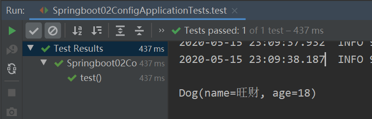

# yaml配置注入

## 配置文件

### 配置文件类型

SpringBoot 常用的配置文件类型有两种，分为 properties 和 yaml。先甭管什么文件，SpringBoot 都能正确加载读取里面的参数，配置文件的路径在：`src/main/resources` 

1. properties 为拓展名的文件，这种大家都比较熟悉了，比如：`jdbc.properties`，或 `log4j.properties`。
2. yaml 为拓展名的文件，YAML（Yet Another Markup Language）结构化的数据配置文件

### 配置文件的作用

SpringBoot 使用一个全局的配置文件 ， 该配置文件的名称是固定的：

- application.properties
  
  语法结构 ：`key=value`
  
- application.yaml
  
  语法结构 ：`key:空格value`


修改 SpringBoot 自动配置的默认值，因为 SpringBoot 在底层都给我们自动配置好了；

比如我们可以在配置文件中修改 Tomcat 默认启动的端口号！测试一下！

```properties
server.port=8081
```

## yaml 概述

YAML 是 "**Y**AML **A**in't a **M**arkup **L**anguage" （YAML不是一种标记语言）的递归缩写。在开发的这种语言时，YAML 的意思其实是："Yet Another Markup Language"（仍是一种标记语言）

**这种语言以数据作为中心，而不是以标记语言为重点！**

Spring Boot 为什么推荐用 yaml 而不是我们钟爱的 properties 来作为配置文件呢？

在回答这个问题前，我们先回顾一下，在传统开发模式里常见的配置文件有哪些格式：

- xml

- properties

- json

假设，我们现在需要配置两个 user 对象，每个 user 有两个属性（id，name），则不同格式下的配置内容如下：

- 使用 xml

  ```xml
  <users>
      <user> 
          <id>1</id> 
          <name>德华</name> 
      </user>
      <user> 
          <id>2</id> 
          <name>学友</name> 
      </user>
  </users>
  ```

  - 优点：层次结构清晰，允许重用

  - 缺点：数据冗余，不够精简

- 使用 properties

  ```properties
  user1.id=1
  user1.name=德华
  user2.id=2
  user2.name=学友
  ```

  - 优点：数据精简

  - 缺点：不能重用

- 使用 json

  ```json
  { 
      "users":[
          {
              "id": 1,
              "name": "德华" 
          },
          { 
              "id": 2, 
              "name": "学友" 
          }
      ]
  }
  ```

  - 优点：数据精简，允许重复

  - 缺点：和以上两种对比，未发现什么缺点


好了，了解了常见配置文件格式后，我们可以发现其实 yaml 和 json 类似，你可以将 yaml 理解为 json 的超集，json 所能表达的，yaml 也能表达，而且语法比 json 更简洁。

同样，如果用 yaml 来表达以上需求，则形式为：

```yaml
users:
 - user:
    username:
    password:
 - user:
	username:
	password:
```

可以看到 yaml 结合了 json，perperties，xml 等配置文件的所有优点，因此 spring boot 选中它也是合情合理的。

## yaml 基础语法

**注意：yaml对语法的要求很严格！**

1. 空格不能省略
2. 以缩进来控制层级关系，只要是左边对齐的一列数据都是同一个层级的
3. 属性和值的大小写都是十分敏感的

### 字面量：普通的值  [ 数字，布尔值，字符串  ]

字面量直接写在后面就可以 ， 字符串默认不用加上双引号或者单引号

```
k: v
```

**注意：**

- “ ” 双引号，不会转义字符串里面的特殊字符，特殊字符会作为本身想表示的意思；

  比如 ：name: "kuang \n shen"  输出 ：kuang 换行 shen

- ' ' 单引号，会转义特殊字符，特殊字符最终会变成和普通字符一样输出；

  比如 ：name: 'kuang \n shen' 输出 ：kuang  \n  shen

### 对象、Map（键值对）

```yaml
#对象、Map格式
k: 
	v1:
	v2:
```

在下一行来写对象的属性和值得关系，注意缩进，比如：

``` yaml
student:
    name: qinjiang
    age: 3
```

行内写法：

``` yaml
student: {name: qinjiang,age: 3}
```

### 数组（ List、set ）

用 - 值表示数组中的一个元素,比如：

```yaml
pets:
 - cat
 - dog
 - pig
```

行内写法：

```yaml
pets: [cat,dog,pig]
```

### 修改 SpringBoot 的默认端口号

配置文件中添加，端口号的参数，就可以切换端口：

``` yaml
server:
  port: 8082
```

## yaml 注入配置文件

yaml 文件更强大的地方在于，他可以给我们的实体类直接注入匹配值

1. 在 springboot 项目中的 resources 目录下新建一个文件 `application.yml`

2. 编写一个实体类 Dog：

   ```java
   package com.kuang.springboot.pojo;
   @Component  //注册bean到容器中
   public class Dog {    
       private String name;    
       private Integer age;
       //有参无参构造、get、set方法、toString()方法 
   }
   ```

3. 思考，我们原来是如何给bean注入属性值的！@Value，给狗狗类测试一下：

   ```java
   @Component //注册bean
   public class Dog {    
       @Value("旺财")    
       private String name;    
       @Value("18")    
       private Integer age;
   }
   ```

4. 在 SpringBoot 的测试类下注入狗狗输出一下：

   ```java
   @SpringBootTestclass DemoApplicationTests {
       @Autowired //将狗狗自动注入进来   
       Dog dog;
       @Test    
       public void contextLoads() { 
           System.out.println(dog); //打印，看下狗狗对象   
       }
   }
   ```

结果成功输出，@Value注入成功，这是我们原来的办法对吧：



5. 我们再编写一个复杂一点的实体类：Person 类

   ```java
   @Component //注册bean到容器中
   public class Person {
       private String name;
       private Integer age;
       private Boolean happy;
       private Date birth;
       private Map<String,Object> maps;
       private List<Object> lists;
       private Dog dog;
       
       //有参构造、无参构造、get方法、set方法、toString方法  
   }
   ```

6. 我们来使用 yaml 配置的方式进行注入，大家写的时候注意区别和优势，我们编写一个 yaml 配置：

   ```yaml
   person:
     name: qinjiang
     age: 3
     happy: false
     birth: 2000/01/01
     maps: {k1: v1,k2: v2}
     lists:
      - code
      - girl
      - music
     dog:
       name: 旺财
       age: 1
   ```

7. 我们刚才已经把 person 这个对象的所有值都写好了，我们现在来注入到我们的类中：

   ```java
   /*
   	@ConfigurationProperties 作用：
   		将配置文件中配置的每一个属性的值，映射到这个组件中；
   		告诉 SpringBoot 将本类中的所有属性和配置文件中相关的配置进行绑定
   		参数 prefix = “person” : 将配置文件中的 person 下面的所有属性一一对应
   */
   @Component //注册bean
   @ConfigurationProperties(prefix = "person")
   public class Person {
       private String name;
       private Integer age;
       private Boolean happy;
       private Date birth;
       private Map<String,Object> maps;
       private List<Object> lists;
       private Dog dog;
   }
   ```

8. IDEA 提示，springboot 配置注解处理器没有找到，让我们看文档，我们可以查看官方文档，找到一个依赖：

   ```xml
   <!-- 导入配置文件处理器，配置文件进行绑定就会有提示，需要重启 -->
   <dependency>
       <groupId>org.springframework.boot</groupId>
       <artifactId>spring-boot-configuration-processor</artifactId>
       <optional>true</optional>
   </dependency>
   ```

9. 确认以上配置都 OK 之后，我们去测试类中测试一下：

   ```java
   @SpringBootTest
   class DemoApplicationTests {
       
       @Autowired
       Person person; //将person自动注入进来
   
       @Test
       public void contextLoads() {
           System.out.println(person); //打印person信息
       }
   }
   ```

结果：所有值全部注入成功：


**yaml 配置注入到实体类完全OK！**

测试：

1. 将配置文件的 **key 值** 和 **属性的值** 设置为不一样的，则结果输出为 null，注入失败
2. 新配置一个 person2，然后将 **@ConfigurationProperties(prefix = "person2")** 指向我们的 person2

## 加载指定的配置文件

**@PropertySource**：加载指定的配置文件；

**@ConfigurationProperties**：默认从全局配置文件中获取值；

1、我们去在 resources 目录下新建一个 `person.properties` 文件

``` properties
name=SlovinG
```

2、然后在我们的代码中指定加载 `person.properties` 文件

``` java
@PropertySource(value = "classpath:person.properties")
@Component //注册bean
public class Person {

    @Value("${name}")
    private String name;

    ......  
}
```

3、再次输出测试一下：指定配置文件绑定成功


## 配置文件占位符

``` yaml
person:
    name: qinjiang${random.uuid} # 随机uuid
    age: ${random.int}  # 随机int
    happy: false
    birth: 2000/01/01
    maps: {k1: v1,k2: v2}
    lists:
      - code
      - girl
      - music
    dog:
      name: ${person.hello:other}_旺财
      age: 1
```

## 回顾 properties 配置

我们上面采用的 yaml 方法都是最简单的方式，开发中最常用的，也是 springboot 所推荐的！那我们来唠唠其他的实现方式，道理都是相同的，写还是那样写，配置文件除了 yml 还有我们之前常用的 properties

<font color='red'>**注意：properties 配置文件在写中文的时候，会有乱码 ， 我们需要去IDEA中设置编码格式为UTF-8**</font>

settings-->FileEncodings 中配置：


**测试步骤：**

1、新建一个实体类User

```java
@Component //注册bean
public class User {    
    private String name;    
    private int age;    
    private String sex;}
```

2、编辑配置文件 user.properties

```properties
user1.name=kuangshenuser1.age=18user1.sex=男
```

3、我们在 User 类上使用 @Value 来进行注入

```java
@Component //注册bean
@PropertySource(value = "classpath:user.properties")
public class User {    
    //直接使用@value    
    @Value("${user.name}") //从配置文件中取值    
    private String name;    
    @Value("#{9*2}")  // #{SPEL} Spring表达式    
    private int age;    
    @Value("男")  // 字面量    
    private String sex;}
```

4、Springboot 测试

```java
@SpringBootTest
class DemoApplicationTests {
    
    @Autowired    
    User user;
    
    @Test    
    public void contextLoads() { 
        System.out.println(user);  
    }
}
```

结果正常输出：


## 对比小结

### 功能对比

|                      | @ConfigurationProperties | @Value     |
| -------------------- | ------------------------ | ---------- |
| 功能                 | 批量注入配置文件中的属性 | 一个个指定 |
| 松散绑定（松散语法） | 支持                     | 不支持     |
| SpEL                 | 不支持                   | 支持       |
| JSR303数据校验       | 支持                     | 不支持     |
| 复杂类型封装         | 支持                     | 不支持     |

- @ConfigurationProperties 只需要写一次即可， @Value 则需要每个字段都添加，使用起来并不友好，我们需要为每个属性单独注解赋值，比较麻烦。
- 松散绑定：这个是什么意思呢？比如我的 yml 中写的 last-name，这个和 lastName 是一样的， - 后面跟着的字母默认是大写的。这就是松散绑定。可以测试一下。
- JSR（Java Specification Requests）303 数据校验 ， 这个就是我们可以在字段里增加一层过滤器验证 ， 可以保证数据的合法性。
- 复杂类型封装，yml 中可以封装对象 ， 使用 value 就不支持。

### 结论

1. 配置 yml 和配置 properties 都可以获取到值 ， 强烈推荐 yml
2. 如果我们在某个业务中，只需要获取配置文件中的某个值，可以使用一下 `@value`
3. 如果说，我们专门编写了一个 JavaBean 来和配置文件进行一一映射，就直接 `@configurationProperties`，不要犹豫
