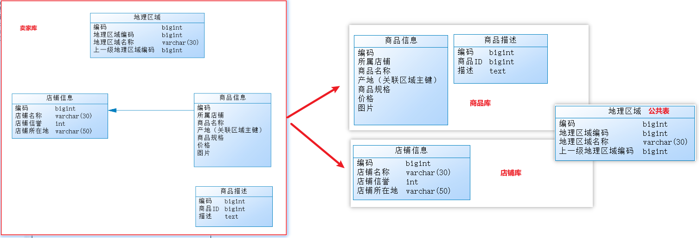
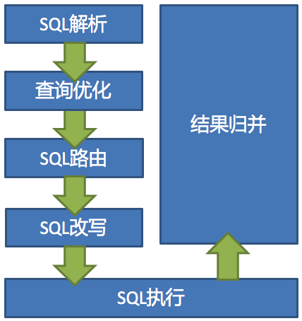

# 分库分表与Sharding-JDBC

## 为什么要分库分表

由于关系型数据库本身就比较容易成为系统瓶颈：单机存储容量、数据库连接数、处理能力都有限。所以，当单表的数据量达到 1000W 或 100G 以后，由于查询维度较多，即使做了优化索引等操作，查询性能仍然会下降严重。

为了解决由于数据量过大而导致的数据库性能降低问题，开发人员会将原来独立的数据库拆分成若干个数据库，将原来的大表（存储近千万数据的表）拆分成若干个小表。目的就是使单一数据库、单一数据表的数据量变小，从而达到提升数据库性能的目的，这就是 **分库分表**。

通过 **提升服务器硬件水平** 虽然也能提高数据处理能力，比如增加存储容量 、CPU等，但这种方案成本很高，并且如果瓶颈在 MySQL 本身，那么提高硬件水平能做到的优化也是有限的。

## 分库分表的方式

分库分表包括 **分库** 和 **分表** 两个部分，在生产中通常包括：**垂直分库、水平分库、垂直分表、水平分表** 四种方式。

### 垂直分表

#### 定义

将一张表按照字段分成多张表，每张表只存储原来一张表的一部分字段

#### 应用场景

通常在电商的商品列表展示页面中，不用显示商品的详情信息，如下图：


用户在浏览商品列表时，只有对某商品感兴趣时才会点进去查看该商品的详细描述。因此，商品信息中 **商品描述** 字段访问频次较低，且该字段占用存储空间较大，访问单个数据 I/O 时间较长，而商品信息中商品名称、商品图片、商品价格等其他字段数据访问频次较高。

那么，由于这两种数据的特性不一样，因此我们可以考虑将商品信息表进行拆分，将访问频次低的商品描述信息（冷数据）单独存放在一张表中，访问频次较高的商品描述信息（热点数据）单独放在一张表中：


#### 优势

- 避免了 I/O 过度争抢并减少锁表的几率，查看商品详情与浏览商品列表互不影响
- 充分发挥热门数据的操作效率，商品信息操作的高效率不会被商品描述的低效率所拖累（冷热数据分离）

#### 原则

- 把不常用的字段单独放在一张表
- 把 text（大文本存储），blob（图片、视频类存储）等大字段拆分出来放在附表中
- 经常组合查询的列放在一张表中（避免多表联查，增加效率）

### 垂直分库

#### 定义

指按照业务将表进行分类，分布到不同的数据库上面，每个库可以放在不同的服务器上，它的核心理念是 **专库专用**。

#### 应用场景

通过 **垂直分表**，性能确实得到了一定程度的提升，但是因为 **存储的数据始终限制在了一台服务器上**，服务器物理硬件存在性能瓶颈（比如：CPU、内存、网络IO、磁盘等），而通过库内垂直分表只解决了单一表数据量过大的问题，但没有将表分布到不同的服务器上，因此每个表还是在竞争同一个物理机的CPU、内存、网络IO、磁盘。

因此，我们可以将原有的卖家库，拆分为分为商品库和店铺库，并把这两个库分散到不同服务器上。




由于商品信息与商品描述业务耦合度较高，因此一起被存放在商品库（避免跨库联查）；而店铺信息相对独立，因此单独被存放在店铺库下；以上操作就可以称为垂直分库。

#### 优势

- 通过不同表的业务聚合（聚合为库），使得数据库维护更加清晰
- 能对不同业务的数据进行分级管理、维护、监控、扩展等
- 高并发场景下，垂直分库在一定程度上提高了磁盘 I/O 和数据库连接数，并改善了单机硬件资源的瓶颈问题：不同表分摊到不同的数据库，分摊了访问压力

 但是，垂直分库 **依然没有解决单表数据量过大的问题**。

### 水平分库

#### 定义

把同一个表的数据按一定规则拆到不同的数据库中，每个库可以放在不同的服务器上（解决单库数据量大的问题）。

#### 应用场景

经过 **垂直分库** 后，数据库性能问题得到一定程度的解决，但是随着业务量的增长，商品库单库存储数据已经超出预估。

假如当前有 8w 店铺，每个店铺平均 150 个不同规格的商品，那商品数量得往 1200w+上预估，并且商品库属于访问非常频繁的资源，**单台服务器已经无法支撑**。

目前情况是再次垂直分库已经无法解决数据瓶颈问题。我们可以尝试水平分库，将商品 ID 为单数的和商品 ID 为双数的商品信息分别放在两个不同库中（各个库下的表结构一致）。


如果商品 ID 为双数，将此操作映射至【商品库-1】；如果店铺 ID 为单数，将操作映射至【商品库-2】；此操作要访问数据库名称的表达式为：商品ID%2 + 1；这种操作就叫水平分库。

#### 优势

水平分库带来的提升是：

- 解决了单库大数据，高并发的性能瓶颈问题；
- 提高了系统的稳定性及可用性；

当一个应用难以再细粒度的垂直切分，或切分后数据量行数巨大，存在单库读写、存储性能瓶颈，这时候就需要进行 **水平分库** 了，经过水平切分的优化，往往能解决单库存储量及性能瓶颈。但由于同一个表被分配在不同的数据库，需要额外进行数据操作的路由工作，因此大大提升了系统复杂度。

### 水平分表

#### 定义

在同一个数据库内，把同一个表的数据按一定规则拆到多个表中（解决单表数据量大的问题）。

#### 应用场景

按照水平分库的思路，我们也可把商品库内的表也进行水平拆分，只不过拆分后的表在同一个库中，其目的也是为了解决 **单表数据量大** 的问题，如下图：


如果商品 ID 为双数，将此操作映射至商品信息1表；如果商品 ID 为单数，将操作映射至商品信息2表。此操作要访问表名称的表达式为商品信息 [商品ID%2 + 1]；这种操作就叫做：水平分表。

#### 优势

- 优化单一表数据量过大而产生的性能问题
- 避免 I/O 争抢并减少锁表的几率

## 分库分表带来的问题

分库分表能有效的缓解了单机和单库带来的性能瓶颈和压力，突破网络IO、硬件资源、连接数的瓶颈，同时也带来了一些问题。 

- 事务一致性问题
- 跨节点关联查询
- 跨节点分页、排序函数
- 主键避重
- 公共表（数据量小但经常使用的表，可能存在联查的情况）

## 分库分表的总结

**垂直分表**：可以把一个宽表的字段按访问频次、是否是大字段的原则拆分为多个表，这样既能使业务清晰，还能提升部分性能。拆分后，尽量从业务角度避免联查，否则性能方面将得不偿失。 

**垂直分库**：可以把多个表按业务耦合松紧归类，分别存放在不同的库，这些库可以分布在不同服务器，从而使访问压力被多服务器负载，大大提升性能，同时能提高整体架构的业务清晰度，不同的业务库可根据自身情况定制优化方案。但是它需要解决跨库带来的所有复杂问题。 

**水平分库**：可以把一个表的数据（按数据行）分到多个不同的库，每个库只有这个表的部分数据，这些库可以分布在不同服务器，从而使访问压力被多服务器负载，大大提升性能。它不仅需要解决跨库带来的所有复杂问题，还要解决数据路由的问题（数据路由问题后边介绍）。 

**水平分表**：可以把一个表的数据（按数据行）分到多个同一个数据库的多张表中，每个表只有这个表的部分数据，这样做能小幅提升性能，它仅仅作为水平分库的一个补充优化。

最佳实践：一般来说，在 **系统设计阶段** 就应该根据业务耦合松紧来确定 **垂直分库、垂直分表** 方案，在数据量及访问压力不是特别大的情况，首先考虑 **缓存、读写分离、索引技术** 等方案。若数据量极大，且持续增长，再考虑 **水平分库、水平分表** 方案。 

## Sharding-Jdbc 简介


Sharding-Jdbc 定位为轻量级 Java 框架，在 Java 的 JDBC 层提供的额外服务。 它使用客户端直连数据库，以 jar 包形式提供服务，无需额外部署和依赖，可理解为增强版的 JDBC 驱动，完全兼容 JDBC 和各种 ORM 框架。

Sharding-Jdbc 旨在充分合理地在分布式的场景下利用关系型数据库的计算和存储能力，注重在原有基础上提供增量，而并非实现一个全新的关系型数据库。

适用于任何基于 JDBC 的 ORM 框架，如：JPA, Hibernate, Mybatis, Spring JDBC Template 或直接使用 JDBC。

支持任何第三方的数据库连接池，如：DBCP, C3P0, BoneCP, Druid, HikariCP 等。

支持任意实现 JDBC 规范的数据库，目前支持 MySQL，Oracle，SQLServer，PostgreSQL 以及任何遵循 SQL92 标准的数据库。

**Sharding-Jdbc 最大的作用就是：简化对分库分表之后操作数据的相关操作。**

Sharding-Jdbc 在 3.0 以后就更改名成为了 ShardingSphere。

## Sharding-Jdbc 的功能架构图


## Sharding-Jdbc 数据分片的内核剖析

Sharding-Jdbc 数据分片的主要流程如下图：



- **SQL 解析**：分为词法解析和语法解析。 先通过词法解析器将 SQL 拆分为一个个不可再分的单词。再使用语法解析器对SQL进行理解，并最终提炼出解析上下文。 解析上下文包括表、选择项、排序项、分组项、聚合函数、分页信息、查询条件以及可能需要修改的占位符的标记。
- **执行器优化**：合并和优化分片条件，如 OR 等。
- **SQL 路由**：根据解析上下文匹配用户配置的分片策略，并生成路由路径。目前支持分片路由和广播路由。
- **SQL 改写**：将SQL改写为在真实数据库中可以正确执行的语句。SQL改写分为正确性改写和优化改写。
- **SQL 执行**：通过多线程执行器异步执行。
- **结果归并**：将多个执行结果集归并以便于通过统一的JDBC接口输出。结果归并包括流式归并、内存归并和使用装饰者模式的追加归并这几种方式。

## Sharding-Jdbc 的配置及读写分离

1. 在 `pom.xml` 中增加 Sharding-Jdbc 的 maven 坐标

   ```xml
   <dependency>
       <groupId>org.apache.shardingsphere</groupId>
       <artifactId>sharding-jdbc-spring-boot-starter</artifactId>
       <version>4.0.0-RC1</version>
   </dependency>
   ```

2. 在 `application.yml` 中增加数据源的配置和读写分离的规则

   ```yaml
   spring:
     shardingsphere:
       datasource:
         # 给每个数据源取别名，下面的master,slave可以任意取名字
         names:
           master,slave
         # 配置主数据源
         master:
           type: com.alibaba.druid.pool.DruidDataSource
           driver-class-name: com.mysql.cj.jdbc.Driver
           url: jdbc:mysql://192.168.200.200:3306/rw?characterEncoding=utf-8
           username: root
           password: root
         # 配置从数据源
         slave:
           type: com.alibaba.druid.pool.DruidDataSource
           driver-class-name: com.mysql.cj.jdbc.Driver
           url: jdbc:mysql://192.168.200.201:3306/rw?characterEncoding=utf-8
           username: root
           password: root
       # 配置数据源的读写分离，但是数据库一定要做主从复制
       masterslave:
         # 配置slave节点的负载均衡均衡策略，采用轮询机制
         load-balance-algorithm-type: round_robin 
         # 最终的数据源名称，可以任意取名字
         name: dataSource
         # 哪个是主库,哪个是从库是在下方配置的，和上述的数据源名字没关系
         # 配置主库数据源的名称，负责数据的写入
         master-data-source-name: master
         # 配置从库数据源名称列表，用逗号来分隔
         slave-data-source-names: slave
       # 参数配置，开启SQL显示，默认为false
       props:
         sql:
           show: true
   ```

3. 在 `application.yml` 中增加配置

   ```yaml
   spring:  
     main:
       # 允许bean定义覆盖
       allow-bean-definition-overriding: true
   ```

   该配置项的效果就是，如果当前项目中存在同名的 bean，后定义的 bean 会覆盖先定义的。

   如果不配置该项，项目启动之后将会报错。报错信息表明，在声明 `org.apache.shardingsphere.shardingjdbc.spring.boot` 包下的 `SpringBootConfiguration` 中的 `dataSource` 这个 bean 时出错，原因是有一个同名的 `dataSource` 的 bean 在 `com.alibaba.druid.spring.boot.autoconfigure` 包下的 `DruidDataSourceAutoConfigure` 类加载时已经声明了。

   而我们需要用到的是 Sharding-Jdbc 包下的 `dataSource`，所以我们需要配置上述属性，让后加载的 `dataSource` 覆盖先加载的。 

## 测试

使用 Sharding-Jdbc 来实现读写分离，直接通过上述简单的配置就可以了。

配置完毕之后，我们就可以重启服务，通过 postman 来访问 controller 的方法，来完成用户信息的增删改查，我们可以通过 debug 及日志的方式来查看每一次执行增删改查操作，使用的是哪个数据源，连接的是哪个数据库。

理论上，保存数据、修改数据和删除数据的操作都会使用主库，查询数据的操作则会使用从库。
