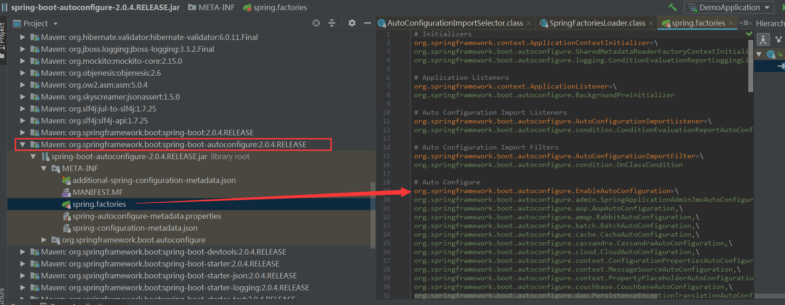

# 启动剖析之pom.xml、@SpringBootApplication

我们之前写的 HelloSpringBoot，到底是怎么运行的呢，Maven 项目，我们一般从 pom.xml 文件探究起；

## pom.xml

### 父依赖

其中它主要是继承了一个父项目的依赖，主要是管理项目的资源过滤及插件：

``` xml
<parent>
    <groupId>org.springframework.boot</groupId>
    <artifactId>spring-boot-starter-parent</artifactId>
    <version>2.7.0</version>
</parent>
```

点进去，发现还有一个父依赖：

``` xml
<parent>
    <groupId>org.springframework.boot</groupId>
    <artifactId>spring-boot-dependencies</artifactId>
    <version>2.7.0</version>
</parent>
```

这里才是真正管理 SpringBoot 应用里面所有依赖版本的地方，SpringBoot 的版本控制中心。

**以后我们导入依赖默认是不需要写版本的，但是如果导入的包没有在依赖中被管理着，那就需要手动配置版本号了。**

### 启动器 spring-boot-starter

``` xml
<dependency>
    <groupId>org.springframework.boot</groupId>
    <artifactId>spring-boot-starter-web</artifactId>
</dependency>
```

**spring-boot-starter-xxx**：就是 spring-boot 的场景启动器

**spring-boot-starter-web**：帮我们导入了 web 模块正常运行所依赖的组件

- SpringBoot 将所有的功能场景都抽取了出来，做成一个个的 starter（启动器），我们只需要在项目中引入这些 starter 即可，所有相关的依赖都会自动导入进来

- 我们要用什么功能就导入什么样的场景启动器即可 
- 我们未来也可以自己定义 starter；

分析完了 pom.xml 来看看这个 **默认的主启动类**

``` java
//@SpringBootApplication 来标注一个主程序类
//说明这是一个Spring Boot应用
@SpringBootApplication
public class SpringbootApplication {
    public static void main(String[] args) {
       //以为是启动了一个方法，没想到启动了一个服务
       SpringApplication.run(SpringbootApplication.class, args);
    }
}
```

这不就是个启动类嘛？从字面理解我都知道是 **Spring启动的入口**，但可别小瞧了这几行代码

从上面代码来看，`@SpringBootApplication` 和 `SpringApplication.run`长得很相似，比较诡异，所以我们从这两个开始分析，首先先看注解：

## @SpringBootApplication

作用：标注在某个类上说明这个类是 SpringBoot 的主配置类 ， SpringBoot 就会运行这个类的 main 方法来启动 SpringBoot 应用

进入这个注解，可以看到上面还有很多其他注解：

``` java
@Target({ElementType.TYPE})
@Retention(RetentionPolicy.RUNTIME)
@Documented
@Inherited
@SpringBootConfiguration
@EnableAutoConfiguration
@ComponentScan(
    excludeFilters = {@Filter(
    type = FilterType.CUSTOM,
    classes = {TypeExcludeFilter.class}
), @Filter(
    type = FilterType.CUSTOM,
    classes = {AutoConfigurationExcludeFilter.class}
)}
)
public @interface SpringBootApplication {
	...
}
```

仔细查看可以看出其中 **只有3个是最重要的注解**：

- @SpringBootConfiguration
- @EnableAutoConfiguration
- @ComponentScan

他们合体应该等价于 `@SpringBootApplication`

查询资料发现，Spring Boot 1.2版之前，真的是由这3个注解出面，之后才隐居幕后，由 `@SpringBootApplication` 出面

### @SpringBootConfiguration

作用：SpringBoot的配置类 ，标注在某个类上 ， 表示这是一个 SpringBoot 的配置类

我们继续进去这个注解查看：

``` java
// 点进去得到下面的 @Component
@Configuration
public @interface SpringBootConfiguration {}

@Component
public @interface Configuration {}
```

### @Configuration

说明这是一个配置类 ，配置类就是对应 Spring 的 xml 配置文件

用之前 Spring 的思维，我推断这个应该是解决当前 Class 的 XML 配置问题，凡是经过该注解修饰的，均被实例化到 Spring 应用程序上下文中，由 Spring 统一管理生命周期，我说 IoC 大家应该熟悉了吧

**举个例子：**

传统的 XML 配置对象的写法：

``` xml
<?xml version="1.0" encoding="UTF-8"?>
<beans xmlns="http://www.springframework.org/schema/beans"
       xmlns:xsi="http://www.w3.org/2001/XMLSchema-instance"
       xsi:schemaLocation="http://www.springframework.org/schema/beans 			http://www.springframework.org/schema/beans/spring-beans-3.0.xsd"
       default-lazy-init="true">
    <!--bean定义-->
  <bean id="userService" class="..UserServiceImpl">
      ...
  </bean>
</beans>
```

使用 `@Configuration` 之后的写法：

``` java
@Configuration
public class SpringConfiguration{
    @Bean
    public UserService userService(){
        return new UserServiceImpl();
    }
}
```

任何一个标注了 `@Configuration` 的 Java 类定义都是一个 JavaConfig 配置类

任何一个标注了 `@Bean` 的方法，其返回值将作为一个 bean 定义注册到 Spring 的 IoC 容器，方法名将默认成该 bean 定义的 id 属性

传统的 XML 表示依赖注入关系时：

```xml
<bean id="dependencyService" class="DependencyServiceImpl"></bean>

<bean id="userService" class="..UserServiceImpl">
    <propery name ="dependencyService" ref="dependencyService" />
</bean>
```

使用 `@Configuration` 之后的写法：

``` java
@Configuration
public class SpringConfiguration{
    @Bean
    public DependencyService dependencyService(){
        return new DependencyServiceImpl();
    }
   
    @Bean
    public UserService userService(){
        return new UserServiceImpl(dependencyService());
    }
}
```

如果一个 bean 的定义依赖其他 bean，则直接调用对应的 JavaConfig 类中依赖bean的创建方法即可，如上方的 `dependencyService()`

### @Component

@Component 说明，启动类本身也是 Spring 中的一个组件而已，负责启动应用。

我们回到 SpringBootApplication 注解中继续看：

### @ComponentScan

这个注解在 Spring 中很重要，它对应 XML 配置中的元素。

作用：自动扫描并加载符合条件的组件（比如 `@Component` 和 `@Repository` 等）或者 bean 定义，最终将这些 bean 定义加载到 IoC 容器中

我们可以通过 `basePackages` 等属性来细粒度的定制 `@ComponentScan` 自动扫描的范围，如果不指定，则默认 Spring 框架实现会从声明 `@ComponentScan` 所在类的 package 进行扫描。

以前 xml 中是这么定义的：

```xml
 <context:component-scan base-package="com.platform.fox.html.**.controller"/>
 <context:component-scan base-package="com.platform.fox.html.**.repository"/>
 <context:component-scan base-package="com.platform.fox.html.**.service"/>
 <context:component-scan base-package="com.platform.fox.html.**.wshandler"/>
```

注：所以 SpringBoot 的启动类最好是放在 root package 下，因为默认不指定 `basePackages` 

### @EnableAutoConfiguration

Enable，通常来说我们认为它一定是在开启或者支持什么功能，比如：`@EnableScheduling`、`@EnableCaching`，所以他们要做的事情应该都是相似的，根据源码判断，简单概括一下就是：**借助 @Import 的支持，收集和注册特定场景相关的 bean 定义，也就是开启自动配置功能**

``` java
@Target({ElementType.TYPE})
@Retention(RetentionPolicy.RUNTIME)
@Documented
@Inherited
@AutoConfigurationPackage
@Import({AutoConfigurationImportSelector.class})
public @interface EnableAutoConfiguration {
    String ENABLED_OVERRIDE_PROPERTY = "spring.boot.enableautoconfiguration";

    Class<?>[] exclude() default {};

    String[] excludeName() default {};
}
```

我理解就是要开船了， `EnableAutoConfigurationImportSelector` 根据名单把水手、舵手、安检员都统一叫过来各就各位。帮助 SpringBoot 应用将所有符合条件的 `@Configuration` 配置都加载到当前 SpringBoot 创建并使用的 IoC 容器，就像一个管理员一样

得力于 Spring 框架原有的一个工具类：`SpringFactoriesLoader` 的支持，`@EnableAutoConfiguration` 才可以实现非常智能的自动配置功能

**@AutoConfigurationPackage ：自动配置包**

```java
@Import({Registrar.class})
public @interface AutoConfigurationPackage {
    
}
```

**@import** ：Spring 底层注解 @import，给容器中导入一个组件

`Registrar.class` 的作用：**将主启动类的所在包及包下面所有子包里面的所有组件扫描到 Spring 容器** 

这个分析完了，退到上一步，继续看：

**@Import({AutoConfigurationImportSelector.class}) ：给容器导入组件** 

AutoConfigurationImportSelector ：自动配置导入选择器，那么它会导入哪些组件的选择器呢？我们点击去这个类看源码：

1、这个类中有一个这样的方法：

``` java
// 获得候选的配置
protected List<String> getCandidateConfigurations(AnnotationMetadata metadata, AnnotationAttributes attributes) {
    //这里的getSpringFactoriesLoaderFactoryClass（）方法
    //返回的就是我们最开始看的启动自动导入配置文件的注解类；EnableAutoConfiguration
    List<String> configurations = SpringFactoriesLoader.loadFactoryNames(this.getSpringFactoriesLoaderFactoryClass(), this.getBeanClassLoader());
    Assert.notEmpty(configurations, "No auto configuration classes found in META-INF/spring.factories. If you are using a custom packaging, make sure that file is correct.");
    return configurations;
}
```

2、这个方法又调用了 `SpringFactoriesLoader` 类的静态方法，`SpringFactoriesLoader` 属于Spring框架私有的一种扩展方案，其主要功能就是从指定的配置文件 `META-INF/spring.factories` 加载配置。点进`SpringFactoriesLoader` 类，看到 loadFactoryNames() 方法：

``` java
public static List<String> loadFactoryNames(Class<?> factoryClass, @Nullable ClassLoader classLoader) {
    String factoryClassName = factoryClass.getName();
    //这里它又调用了 loadSpringFactories 方法
    return (List)loadSpringFactories(classLoader).getOrDefault(factoryClassName, Collections.emptyList());
}
```

3、我们继续点击查看 loadSpringFactories 方法：

``` java
private static Map<String, List<String>> loadSpringFactories(@Nullable ClassLoader classLoader) {
    //获得classLoader，我们返回可以看到这里得到的就是EnableAutoConfiguration标注的类本身
    MultiValueMap<String, String> result = (MultiValueMap)cache.get(classLoader);
    if (result != null) {
        return result;
    } else {
        try {
            //去获取一个资源 "META-INF/spring.factories"
            Enumeration<URL> urls = classLoader != null ? classLoader.getResources("META-INF/spring.factories") : ClassLoader.getSystemResources("META-INF/spring.factories");
            LinkedMultiValueMap result = new LinkedMultiValueMap();

            //将读取到的资源遍历，封装成为一个Properties
            while(urls.hasMoreElements()) {
                URL url = (URL)urls.nextElement();
                UrlResource resource = new UrlResource(url);
                Properties properties = PropertiesLoaderUtils.loadProperties(resource);
                Iterator var6 = properties.entrySet().iterator();

                while(var6.hasNext()) {
                    Entry<?, ?> entry = (Entry)var6.next();
                    String factoryClassName = ((String)entry.getKey()).trim();
                    String[] var9 = StringUtils.commaDelimitedListToStringArray((String)entry.getValue());
                    int var10 = var9.length;

                    for(int var11 = 0; var11 < var10; ++var11) {
                        String factoryName = var9[var11];
                        result.add(factoryClassName, factoryName.trim());
                    }
                }
            }

            cache.put(classLoader, result);
            return result;
        } catch (IOException var13) {
            throw new IllegalArgumentException("Unable to load factories from location [META-INF/spring.factories]", var13);
        }
    }
}
```

4、发现一个多次出现的文件：spring.factories，全局搜索它

## spring.factories

我们根据源头打开spring.factories ， 看到了很多自动配置的文件；这就是自动配置根源所在！



我们在上面的自动配置类随便找一个打开看看，比如 ：WebMvcAutoConfiguration


可以看到这些一个个的都是 JavaConfig 配置类，而且都注入了一些Bean，可以找一些自己认识的类，看着熟悉一下

所以，自动配置真正实现是从 classpath 中搜寻所有的 `META-INF/spring.factories` 配置文件 ，并将其中对应的  `org.springframework.boot.autoconfigure. ` 包下的配置项，通过反射实例化为对应标注了 `@Configuration` 的 JavaConfig 形式的IOC容器配置类 ， 然后将这些都汇总成为一个实例并加载到IOC容器中

## 总结

1. SpringBoot 在启动的时候从类路径下的 META-INF/spring.factories 中获取 EnableAutoConfiguration 指定的值

2. 将这些值作为自动配置类导入容器，自动配置类就生效，帮我们进行自动配置工作
3. 整个 J2EE 的整体解决方案和自动配置都在 springboot-autoconfigure 的 jar 包中
4. 它会给容器中导入非常多的自动配置类 （xxxAutoConfiguration），就是给容器中导入这个场景需要的所有组件，并配置好这些组件 
5. 有了自动配置类，免去了我们手动编写配置注入功能组件等的工作
