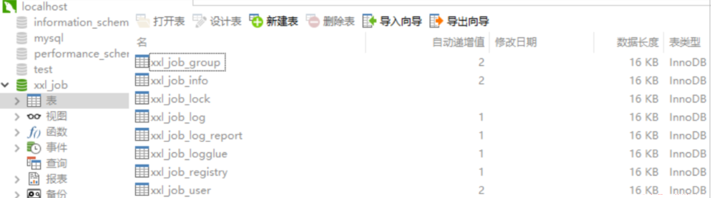
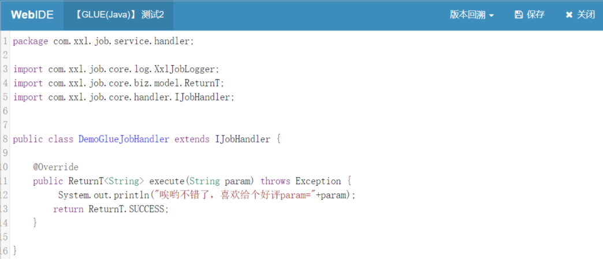

# 定时任务框架XXL-Job

## 定时任务概述

### 什么是定时任务

定时任务是按照指定的时间周期来运行任务。使用场景为在某个固定时间点执行，或者周期性的去执行某个任务，比如：每天晚上 24 点做数据汇总，定时发送短信等。

### 常见定时任务方案

- **While + Sleep** : 通过循环加休眠的方式定时执行
- **Timer 和 TimerTask** ：JDK自带的定时任务，可以实现简单的间隔执行任务（在指定时间点执行某一任务，也能定时的周期性执行），但无法实现按日历去调度执行任务。
- **ScheduledExecutorService** : Java 并发包下，自 JDK1.5 出现，是比较理想的定时任务实现方案。Eureka就使用的是它
- **QuartZ** : 使用 Quartz，它是一个异步任务调度框架，功能丰富，可以实现按日历调度,支持持久化。
- **使用 Spring Task**：Spring 3.0 后提供 Spring Task 实现任务调度，支持按日历调度，相比 Quartz 功能稍简单，但是在开发基本够用，支持注解编程方式。
- **SpringBoot 中的 Schedule** ： 通过 `@EnableScheduling` + `@Scheduled` 最实现定时任务，底层使用的是 Spring Task

### 分布式定时任务面临的问题

上述的定时任务都是集中式（单体项目使用）的定时任务，在分布式中将会面临一些问题或不足

- 业务量大，单机性能瓶颈需要扩展
- 多台机器部署如何保证定时任务不重复执行
- 定时任务时间需要可调整，可以暂停
- 机器发生故障宕机，定时任务依然可用，也就是如何实现故障转移
- 定时任务，执行日志是否可监控

### 分布式定时任务 XXL-Job

XXL-Job 是一个分布式任务调度平台，于 2015 问世，其核心设计目标是开发迅速、学习简单、轻量级、易扩展。现已开放源代码并接入多家公司线上产品线，开箱即用。其具备且不止如下能力：

- **简单**：支持通过 Web 页面对任务进行 CRUD 操作，操作简单，一分钟上手；
- **动态**：支持动态修改任务状态、启动/停止任务，以及终止运行中任务，即时生效；
- **调度中心HA（中心式）**：调度采用中心式设计，“调度中心”基于集群 Quartz 实现并支持集群部署，可保证调度中心 HA；
- **执行器HA（分布式）**：任务分布式执行，任务"执行器"支持集群部署，可保证任务执行HA；
- **弹性扩容缩容**：一旦有新执行器机器上线或者下线，下次调度时将会重新分配任务；
- **路由策略**：执行器集群部署时提供丰富的路由策略，包括：第一个、最后一个、轮询、随机、一致性HASH、最不经常使用、最近最久未使用、故障转移、忙碌转移等；
- **故障转移**：任务路由策略选择"故障转移"情况下，如果执行器集群中某一台机器故障，将会自动 Failover 切换到一台正常的执行器发送调度请求。
- **任务失败告警**：默认提供邮件方式失败告警，同时预留扩展接口，可方面的扩展短信、钉钉等告警方式；

>具体见：[https://github.com/xuxueli/xxl-job](https://github.com/xuxueli/xxl-job)

## xxl-job 架构设计

### 设计思想

将调度行为抽象形成“调度中心”公共平台，而平台自身并不承担业务逻辑，“调度中心”负责发起调度请求。

将任务抽象成分散的 JobHandler，交由“执行器”统一管理，“执行器”负责接收调度请求并执行对应的 JobHandler 中的业务逻辑。因此，“调度”和“任务”两部分可以相互解耦，提高系统整体的稳定性和可扩展性。

### 架构设计图

XXL-Job 分为 **调度中心** 和 **执行器** 两大模块

- **调度模块（调度中心）**

负责管理调度信息，按照调度配置发出调度请求，自身不承担业务代码。调度系统与任务解耦，提高了系统可用性和稳定性，同时调度系统性能不再受限于任务模块；

支持可视化、简单且动态的管理调度信息，包括任务新建，更新，删除，GLUE开发和任务报警等，所有上述操作都会实时生效，同时支持监控调度结果以及执行日志，支持执行器 Failover（故障转移）。

- **执行模块（执行器）**

负责接收调度请求并执行任务逻辑。任务模块专注于任务的执行等操作，开发和维护更加简单和高效；

接收“调度中心”的执行请求、终止请求和日志请求等。


- **调度中心高可用**

基于数据库的集群方案，数据库选用 Mysql；集群分布式并发环境中进行定时任务调度时，会在各个节点会上报任务，存到数据库中，执行时会从数据库中取出触发器来执行，如果触发器的名称和执行时间相同，则只有一个节点去执行此任务。

- **并行调度**

调度采用线程池方式实现，避免单线程因阻塞而引起任务调度延迟。XXL-JOB 调度模块默认采用并行机制，在多线程调度的情况下，调度模块被阻塞的几率很低，大大提高了调度系统的承载量。

XXL-JOB 的不同任务之间并行调度、并行执行。XXL-JO B的单个任务，针对多个执行器是并行运行的，针对单个执行器是串行执行的。同时支持任务终止。

- **执行器（任务）高可用**

执行器如若集群部署，调度中心将会感知到在线的所有执行器，如“`127.0.0.1:9997`, `127.0.0.1:9998`, `127.0.0.1:9999`”。多个执行器可以选择“路由策略”来采用轮询，随机等方式进行多机器调度。

当任务”路由策略”选择”故障转移(`FAILOVER`)”时，当调度中心每次发起调度请求时，会按照顺序对执行器发出心跳检测请求，第一个检测为存活状态的执行器将会被选定并发送调度请求。调度成功后，可在日志监控界面查看“调度备注”

## xxl-job 入门

### 下载源码

请下载 [项目源码]((https://github.com/xuxueli/xxl-job)) 并解压，使用 IDEA 工具导入项目。

项目代码结构如下：


- **doc**：文档，即 SQL 脚本所在目录
- **db**：“调度数据库”建表脚本
- **xxl-job-admin**：调度中心
- **xxl-job-core**：核心模块，公共依赖
- **xxl-job-executor-samples**：执行器，sample 示例项目（大家可以在该项目上进行开发，也可以将现有项目改造生成执行器项目）
  - **xxl-job-executor-sample-springboot**：Springboot 版本，通过 Springboot 管理执行器，推荐这种方式；
  - **xxl-job-executor-sample-frameless**：无框架版本；

### 导入数据库

打开项目代码，获取 “调度数据库初始化SQL脚本” 并执行即可。“调度数据库初始化SQL脚本” 位置为: `/xxl-job/doc/db/tables_xxl_job.sql` ，数据库名：`xxl_job`


数据库如下：



- **xxl_job_lock** ：任务调度锁表；
- **xxl_job_group** ：执行器信息表，维护任务执行器信息；
- **xxl_job_info** ：调度扩展信息表：用于保存 XXL-JOB 调度任务的扩展信息，如任务分组、任务名、机器地址、执行器、执行入参和报警邮件等等；
- **xxl_job_log** ：调度日志表：用于保存 XXL-JOB 任务调度的历史信息，如调度结果、执行结果、调度入参、调度机器和执行器等等；
- **xxl_job_log_report** ：调度日志报表：用户存储 XXL-JOB 任务调度日志的报表，调度中心报表功能页面会用到；
- **xxl_job_logglue** ：任务 GLUE 日志：用于保存 GLUE 更新历史，用于支持 GLUE 的版本回溯功能；
- **xxl_job_registry** ：执行器注册表，维护在线的执行器和调度中心机器地址信息；
- **xxl_job_user** ：系统用户表；

### 配置部署调度中心

#### 配置调度中心

打开 `xxl-job-admin` 的配置文件，`/xxl-job/xxl-job-admin/src/main/resources/application.properties` 对调度中心进行配置，重要配置如下：

- **server.port** : 服务端口
- **spring.datasource.url** ：指向刚才准备的数据库
- **spring.datasource.password** : 记得修改成自己的数据库密码
- **spring.mail.username** ：配置自己的邮件账号
- **spring.mail.password** ：邮件的授权码，我下面是以qq邮箱为例

下面根据自己的情况进行修改，**不要直接复制**

```properties
### 调度中心JDBC链接：链接地址请保持和 2.1 章节 所创建的调度数据库的地址一致
spring.datasource.url=jdbc:mysql://127.0.0.1:3306/xxl_job?useUnicode=true&characterEncoding=UTF-8&autoReconnect=true&serverTimezone=Asia/Shanghai
spring.datasource.username=root
spring.datasource.password=root_pwd
spring.datasource.driver-class-name=com.mysql.jdbc.Driver

### 报警邮箱
spring.mail.host=smtp.qq.com
spring.mail.port=25
spring.mail.username=xxx@qq.com
spring.mail.password=邮箱授权码，不是登录密码
spring.mail.properties.mail.smtp.auth=true
spring.mail.properties.mail.smtp.starttls.enable=true
spring.mail.properties.mail.smtp.starttls.required=true
spring.mail.properties.mail.smtp.socketFactory.class=javax.net.ssl.SSLSocketFactory

### 调度中心通讯TOKEN [选填]：非空时启用；
xxl.job.accessToken=

### 调度中心国际化配置 [必填]： 默认为 "zh_CN"/中文简体, 可选范围为 "zh_CN"/中文简体, "zh_TC"/中文繁体 and "en"/英文；
xxl.job.i18n=zh_CN

## 调度线程池最大线程配置[必填]
xxl.job.triggerpool.fast.max=200
xxl.job.triggerpool.slow.max=100

### 调度中心日志表数据保存天数 [必填]：过期日志自动清理；限制大于等于7时生效，否则, 如-1，关闭自动清理功能；
xxl.job.logretentiondays=30
```

#### 部署调度中心

然后启动调度中心 ，执行 `XxlJobAdminApplication#main` 方法 ， 启动之后，浏览器访问 `http://localhost:18080/xxl-job-admin/jobinfo?jobGroup=2` 

注意 URL 中有个上下文路径。默认登录账号 “`admin/123456`”，登录后运行界面如下图所示：


### 配置部署执行器项目

“执行器”项目：`xxl-job-executor-sample-springboot `（提供多种版本执行器供选择，现以 springboot 版本为例，可直接使用，也可以参考其并将现有项目改造成执行器）

作用：负责接收“调度中心”的调度并执行；可直接部署执行器，也可以将执行器集成到现有业务项目中。

#### 导入maven 依赖

确认 pom 文件中引入了 “xxl-job-core” 的 maven 依赖：

```xml
<!-- http://repo1.maven.org/maven2/com/xuxueli/xxl-job-core/ -->
<dependency>
    <groupId>com.xuxueli</groupId>
    <artifactId>xxl-job-core</artifactId>
    <version>${最新稳定版本}</version>
</dependency>
```

#### 配置执行器

修改配置：`/xxl-job/xxl-job-executor-samples/xxl-job-executor-sample-springboot/src/main/resources/application.properties`

- **xxl.job.admin.addresses**： 调度中心的地址，如果调度中心修改过端口，这里也要对应修改

```properties
### 调度中心部署根地址 [选填]：如调度中心集群部署存在多个地址则用逗号分隔。执行器将会使用该地址进行"执行器心跳注册"和"任务结果回调"；为空则关闭自动注册；
xxl.job.admin.addresses=http://127.0.0.1:8080/xxl-job-admin
### 执行器通讯TOKEN [选填]：非空时启用；
xxl.job.accessToken=
### 执行器AppName [选填]：执行器心跳注册分组依据；为空则关闭自动注册
xxl.job.executor.appname=xxl-job-executor-sample
### 执行器注册 [选填]：优先使用该配置作为注册地址，为空时使用内嵌服务 ”IP:PORT“ 作为注册地址。从而更灵活的支持容器类型执行器动态IP和动态映射端口问题。
xxl.job.executor.address=
### 执行器IP [选填]：默认为空表示自动获取IP，多网卡时可手动设置指定IP，该IP不会绑定Host仅作为通讯实用；地址信息用于 "执行器注册" 和 "调度中心请求并触发任务"；
xxl.job.executor.ip=
### 执行器端口号 [选填]：小于等于0则自动获取；默认端口为9999，单机部署多个执行器时，注意要配置不同执行器端口；
xxl.job.executor.port=9999
### 执行器运行日志文件存储磁盘路径 [选填] ：需要对该路径拥有读写权限；为空则使用默认路径；
xxl.job.executor.logpath=/data/applogs/xxl-job/jobhandler
### 执行器日志文件保存天数 [选填] ： 过期日志自动清理, 限制值大于等于3时生效; 否则, 如-1, 关闭自动清理功能；
xxl.job.executor.logretentiondays=30
```

#### 执行器组件配置

上面配置是为了在 Spring 容器中创建一个 `XxlJobSpringExecutor` 执行器 Bean，见：`com.xxl.job.executor.core.config.XxlJobConfig#xxlJobExecutor`

```java
@Bean
public XxlJobSpringExecutor xxlJobExecutor() {
    logger.info(">>>>>>>>>>> xxl-job config init.");
    XxlJobSpringExecutor xxlJobSpringExecutor = new XxlJobSpringExecutor();
    xxlJobSpringExecutor.setAdminAddresses(adminAddresses);
    xxlJobSpringExecutor.setAppname(appname);
    xxlJobSpringExecutor.setAddress(address);
    xxlJobSpringExecutor.setIp(ip);
    xxlJobSpringExecutor.setPort(port);
    xxlJobSpringExecutor.setAccessToken(accessToken);
    xxlJobSpringExecutor.setLogPath(logPath);
    xxlJobSpringExecutor.setLogRetentionDays(logRetentionDays);

    return xxlJobSpringExecutor;
}
```

如果已经正确进行上述配置，可将执行器项目编译打包部署。

## 配置定时任务

### BEAN模式（方法形式）

Bean 模式任务，支持基于方法的开发方式，每个任务对应一个方法。

- 优点：
  - 每个任务只需要开发一个方法，并添加”@XxlJob”注解即可，更加方便、快速。
  - 支持自动扫描任务并注入到执行器容器。
- 缺点：要求 Spring 容器环境；

在 `com.xxl.job.executor.service.jobhandler.SampleXxlJob` 中提供了简单的定时任务实例。

为方便用户参考与快速实用，示例执行器内原生提供多个 Bean 模式任务 Handler，可以直接配置实用，如下：

- **demoJobHandler** ：简单示例任务，任务内部模拟耗时任务逻辑，用户可在线体验 `Rolling Log` 等功能；
- **shardingJobHandler** ：分片示例任务，任务内部模拟处理分片参数，可参考熟悉分片任务；
- **httpJobHandler** ：通用 HTTP 任务Handler；业务方只需要提供HTTP链接等信息即可，不限制语言、平台。示例任务入参如下：

```java
/**
 * XxlJob开发示例（Bean模式）
 *
 * 开发步骤：
 * 1、在Spring Bean实例中，开发Job方法，方式格式要求为 "public ReturnT<String> execute(String param)"
 * 2、为Job方法添加注解 "@XxlJob(value="自定义jobhandler名称", init = "JobHandler初始化方法", destroy = "JobHandler销毁方法")"，注解value值对应的是调度中心新建任务的JobHandler属性的值。
 * 3、执行日志：需要通过 "XxlJobLogger.log" 打印执行日志；
 *
 * @author xuxueli 2019-12-11 21:52:51
 */
@Component
public class SampleXxlJob {
    private static Logger logger = LoggerFactory.getLogger(SampleXxlJob.class);
 /**
     * 1、简单任务示例（Bean模式）
     */
    @XxlJob("demoJobHandler")
    public ReturnT<String> demoJobHandler(String param) throws Exception {
        logger.info("XXL-JOB, Hello World. param={}",param);
        return ReturnT.SUCCESS;
    }
    //...省略...
}
```

**如果我们要写自己的定时任务，参照上面方法，在方法上注解一个`@XxlJob("任务名字")`，方法可以接受一个字符串参数，方法需要返回 ReturnT 格式。**

### 创建执行器

打开调度中心可视化界面，在执行器管理界面，添加新增执行器


- appName : 执行器的名字，可以任意填写
- 名称：任意填写
- 注册方式：调度中心是通过 RPC 的方式对执行器发起调度，所以这里需要的是执行器项目的 `ip:port` ，注意，该端口不是执行器项目的`server.port` ，而是：`xxl.job.executor.port` 端口。你可以选择自动注册，也可以手动录入。

### 创建任务

在 任务管理 界面，新增任务


- **路由策略** ：有轮询，随机，故障转移等等策略，是用在集群模式下的调度方式。
- **cron** : 定时任务的执行时间规则，时间表达式
- **JobHandler** : 这个是要对应 “执行器项目”中 `@XxlJob("demoJobHandler") `注解中的名字
- **运行模式** ：Bean ，使用内置代码方式，也可以执行在线执行代码方式
- **报警邮件** ：如果定时任务失败，会发送报警邮件到邮箱
- **任务参数** ：这个参数可以传递给 `@XxlJob("demoJobHandler")`所在方法的参数。

创建好任务之后就可以执行了：


调度日志：


IDEA工具控制台效果：

```
15:47:33.017 logback [Thread-16] INFO  c.x.j.e.s.jobhandler.SampleXxlJob - XXL-JOB, Hello World. param=
15:47:34.007 logback [Thread-16] INFO  c.x.j.e.s.jobhandler.SampleXxlJob - XXL-JOB, Hello World. param=
15:47:35.008 logback [Thread-16] INFO  c.x.j.e.s.jobhandler.SampleXxlJob - XXL-JOB, Hello World. param=
...省略...
```

### GLUE模式(Java)

#### 添加任务

该模式支持在线编辑定时任务的内容，立刻执行，无需再开发工具中编辑代码，也无需重启项目。

请点击任务右侧 “GLUE” 按钮，进入 “GLUE编辑器开发界面” ，见下图。“GLUE模式(Java)” 运行模式的任务默认已经初始化了示例任务代码，即打印Hello World。


任务以源码方式维护在调度中心，支持通过Web IDE在线更新，实时编译和生效，因此不需要指定JobHandler

#### 编写代码

保存之后可以在操作按钮里面去编写任务


(“GLUE模式(Java)” 运行模式的任务实际上是一段继承自`IJobHandler`的Java类代码，它在执行器项目中运行，可使用`@Resource/@Autowire`注入执行器里中的其他服务），比如我的定时任务如下，编辑好之后点击保存



保存好之后，启动定时任务，效果如下


## 总结

`xxl-job` 确实很强大，功能也很全，但是如果是一个小体量的单体项目，就不太建议使用它，Quzrtz 或者 SpringBoot Task 就足够 ，`xxl-job` 还是有些笨重。
