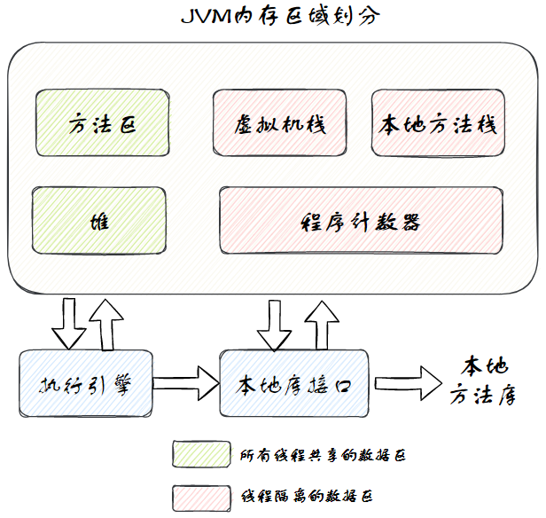
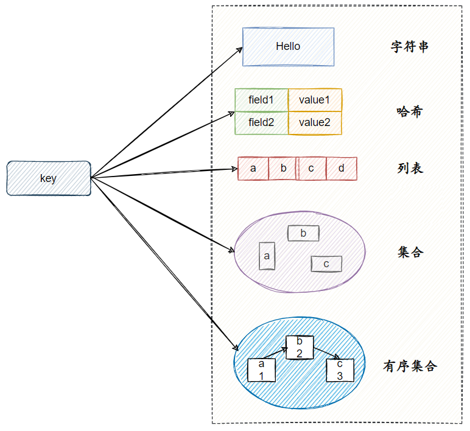

<LockedPage>

# 八股手册

## Java基础

### Object 类

#### Object 类的方法

Java 中所有的类都是 Object 类的子类，Object 类的方法大致可以分为 6 类，主要提供了 11 个方法：

- 对象比较：hashCode()、equals(Object obj)
- 对象拷贝：clone()
- 对象转字符串：toString()
- 多线程调度：wait()、wait(long timeout)、wait(long timeout, int nanos)、notify()、notifyAll()
- 反射：getClass()
- 垃圾回收：finalize()

### 集合框架

#### 有哪些集合

主要分为两条大的支线：

- **Collection 接口**：主要有三个子接口：
    - `List`：一个有序的集合，可以包含重复的元素。实现类包括 ArrayList、LinkedList 等。
    - `Set`：一个不包含重复元素的集合。实现类包括 HashSet、LinkedHashSet、TreeSet 等。
    - `Queue`：一个用于保持元素 **队列** 的集合。实现类包括 PriorityQueue、ArrayDeque 等。

- **Map 接口**：表示键值对的集合。实现类包括 HashMap、LinkedHashMap、TreeMap 等。

#### 有哪些是线程安全的集合

- **CopyOnWriteArrayList**

  CopyOnWriteArrayList 是线程安全的 **ArrayList**。

  它的名字叫 CopyOnWrite —— 写时复制，已经明示了它的原理。

  CopyOnWriteArrayList 允许并发读，读操作是无锁的，性能较高。

  至于写操作，比如向容器中添加一个元素，则首先将当前容器复制一份，然后在新容器上执行加锁的写操作，结束之后再将原容器的引用指向新容器。

- **Hashtable**

  Hashtable 是线程安全的 **HashMap**，它是直接在 HashMap 的方法上加 synchronized 关键字，但这样会降低性能，现在已经不推荐使用。

- **ConcurrentHashMap**

  ConcurrentHashmap 也是线程安全的 **HashMap**，是官方推荐使用的。

  在1.7 版本里它是基于 **分段锁**  实现的，在 1.8 之后是基于 CAS 和 synchronized 实现的。

#### ConcurrentHashmap 的实现

1.7 版本的 ConcurrentHashMap 采用分段锁机制，里面包含一个 **段数组**，每个段都是一个 HashMap，段和段之间相互不会受到并发影响，也就是说锁的细粒度更高了。

1.8 之后 ConcurrentHashMap 实现线程安全不是在数据结构上下功夫，它的数据结构和 HashMap 是一样的，都是：数组+链表+红黑树。

它实现线程安全的关键点在于 put 流程：

1. 如果 node 是空的话，就通过 **CAS + 自旋** 的方式写入
2. 其他情况下会采用 **CAS + synchronized** 实现
3. CAS 操作由处理器来保证原子性，它是一种乐观锁，不会阻塞线程，而是在更新时检查是否有其他线程已经修改了数据，如果没有就更新，如果有就重试。

### Stream 流

Stream 流提供了一种高级迭代模式，主要用于对集合进行复杂的筛选、转换和收集操作，并且流操作是延迟执行的，这意味着它们只在生成结果的时候才会真正进行计算。

同时 Stream 也支持并行操作，这样可以利用到多核处理器的能力，使得操作变得更加高效。

### Lambda 表达式

Lambda 表达式本质上是一段 **匿名内部类**，也可以是一段可以传递的代码。

比如我们以前使用 Runnable 创建并运行线程：

```java
new Thread(new Runnable() {
    @Override
    public void run () {
        System.out.println("Thread is running before Java8!");
    }
}).

start();
```

这是通过内部类的方式来重写 run 方法，使用 Lambda 表达式，可以 **使得代码可以更加简洁**：

```java
new Thread( () ->System.out.

println("Thread is running since Java8!") ).

start();
```

但是，只有那些函数式接口才能写成 Lambda 表示式，也就是说，接口里只能包含一个抽象方法。

### 反射机制

#### 反射是什么

我们经常利用 new 方式来创建对象实例，这种方式在 **编译** 时就确定了类型信息。

而如果，我们想在代码运行的时候动态地获取类信息、创建类实例、调用类方法，就要用到 **反射**。

通过反射我们可以获取到一个类的所有属性和方法，还可以调用这些方法和属性。

反射最核心的四个类：

- Class 类：获取类信息
- Field 类：获取类的属性信息
- Constructor 类：获取类的构造方法信息
- Method 类：获取类的其他方法信息

#### 反射的应用场景

一般我们在写业务代码的时候，很少会接触到直接使用反射机制的场景。

但是，这并不代表反射没有用。相反，正是因为反射，我们才能这么轻松地使用各种框架。像 Spring、MyBatis 等框架中都大量使用了反射机制。

Spring 里的很多 **注解** ，它真正的实现原理就是利用反射。

就像我们使用 Spring 的时候 ，一个 `@Component` 注解就声明了一个类为 Bean，一个  `@Value` 注解就读取到了配置文件中的值。

这些都是因为代码在运行过程中可以基于 **反射** 来获取到类，读取到 **类/属性/方法/方法参数** 上的注解，进而执行一些特定的操作。

注解这里就有两个作用：

- 一是 **标记** 我们要进行相应处理的类/属性/方法；

- 二是注解本身 **携带处理信息**，可以参与到处理逻辑中。

#### 反射的原理

Java 程序的执行分为 **编译** 和 **运行** 两步，编译之后会生成字节码(.class)文件，JVM
进行类加载的时候，会加载字节码文件，将类型相关的所有信息加载进方法区。反射就是在运行的时候，去获取这些方法区的类信息，然后进行各种操作。

#### 反射的优点和缺点

优点：

1. **灵活性**：反射提供了一种机制，允许程序在运行时动态地修改对象的属性和方法，从而提高了程序的灵活性和可扩展性，而不用写死代码。
1. **动态代理**：反射机制是实现动态代理的基础，使我们可以在代码运行时动态地创建代理对象，广泛用于 Spring AOP 的场景。

缺点：

1. **性能开销**：反射操作相比直接的 Java 方法调用要慢得多，因为它涉及到类型解析、方法调用等动态处理过程。
2. **安全风险**：反射可以访问类的私有成员和私有方法，这破坏了封装原则，增加了安全风险。

## 并发编程

### InheritableThreadLocal

ThreadLocal 是 Java 提供的一种用于实现 **线程局部变量** 的工具类。它允许每个线程都拥有自己的独立变量副本，从而实现线程隔离，用于解决多线程中共享对象的线程安全问题。

- 每个线程都拥有一个和 HashMap 结构类似的 ThreadLocalMap，用于存储与该线程相关的 ThreadLocal 变量。
- Map 内部维护着对象数组，key 是 ThreadLocal 的弱引用，value 是 ThreadLocal 的泛型值。
- 每个线程在往 ThreadLocal 里设置值的时候，都是往自己的 Map 里存，读也是以某个 ThreadLocal 作为引用，在自己的 Map 里找对应的
  key，从而实现了线程隔离。

但 ThreadLocal 不支持父线程和子线程之间的值传递。

为了解决这个问题，Java 扩展了 ThreadLocal 类，提供了 InheritableThreadLocal 类。

它在创建子线程时会将父线程的 **本地变量** 复制给子线程，这一特性使得父线程可以给子线程传递数据。

#### ThreadLocal 的缺点

ThreadLocal 最常见的问题是内存泄露。ThreadLocal 变量存储在每个线程对象的 ThreadLocalMap 中。如果线程执行完毕但线程未被回收，而
ThreadLocal 变量又未被移除，那么这些变量以及它们引用的对象就不会被垃圾回收器回收，从而导致内存泄露。

特别是在使用线程池时，由于线程经常会被重用，所以 ThreadLocal 变量可能会一直保留，增加内存泄露的风险。

### synchronized

synchronized 用于在多线程环境下对代码块进行同步，以保证在同一时刻只有一个线程可以执行该段代码，从而避免并发问题。

#### synchronized 的原理

每个使用 synchronized 同步的对象都关联着一个 **对象监视器**，当线程进入同步块时，它会自动获得该监视器的所有权，退出同步块时释放监视器。

如果其他线程已经持有了这个监视器，那么新的线程会被阻塞直到监视器被释放。

#### synchronized 的用法

- **修饰实例方法**：给当前对象实例加锁，进入同步代码前要获得 **当前对象实例的锁**

- **修饰静态方法**：给当前类加锁，会作⽤于类的所有对象实例，进⼊同步代码前要获得当前 **类对象** 的锁。因为静态成员不属于任何⼀个实例对象，是类成员。

- **修饰代码块** ：指定加锁对象，对给定对象/类加锁。 synchronized(this|object) 表示进⼊同步代码库前要获得给定对象的锁。
  synchronized(类.class) 表示进⼊同步代码前要获得当前 **类对象** 的锁

### 同步器 AQS

AbstractQueuedSynchronizer **抽象队列同步器**，简称 AQS ，它是 Java 并发包的根基，并发包中的锁就是基于 AQS 实现的。

#### AQS 核心思想

AQS 核心思想是：

- 如果目标资源可用，则将当前请求资源的线程设置为工作线程，并且将资源设置为锁定状态。
- 如果资源被占用，那么就需要一套 **线程阻塞等待以及分配锁** 的机制，这个机制 AQS 是基于一个 **双向队列** 和一个 **共享变量
  ** 实现的。

AQS 使用 volatile 修饰的 **int 变量 state 来控制同步状态**，用于展示当前资源的锁情况。

同时通过 **线程等待队列** 来展示线程的排队情况。

暂时获取不到锁的线程将被加入到该线程等待队列中，自旋一定次数后，会将线程阻塞，并等待锁的分配。

以 ReentrantLock 为例，state 初始值为 0，表示未锁定状态。

A 线程独占该锁时会将 state + 1。此后，其他线程再尝试获得锁就会失败，直到 A 线程释放锁，并令 state = 0 ，其它线程才有机会获取该锁。

此外，在释放锁之前，A 线程自己是可以重复获取此锁的（state 会累加），这就是 **可重入** 的概念。

但要注意，获取多少次就要释放多少次，这样才能保证 state 归零。

### ReentrantLock

#### ReentrantLock 是什么，实现原理

ReentrantLock 实现了 Lock 接口，是一个 **可重入且独占式** 的锁，和 synchronized 关键字类似。

可重入表示当前线程获取该锁后再次获取不会被阻塞，也就意味着同一个线程可以多次获得同一个锁而不会发生死锁。

相比 Synchronized，ReentrantLock 更灵活、更强大，增加了公平锁和非公平锁等高级功能。

在内部，ReentrantLock 利用了 AQS 框架来实现锁的功能。

此处讲【AQS 核心思想】。

#### synchronized 和 ReentrantLock 的对比

**两者都是可重入锁**

- **可重入锁** 也叫递归锁，指的是线程可以再次获取自己的内部锁。比如一个线程获得了某个对象的锁，此时这个对象锁还没有释放，当其再次想要获取这个对象的锁的时候还是可以获取的，如果是不可重入锁的话，就会造成死锁。

**synchronized 是隐式锁 而 ReentrantLock 是显式锁**

- `synchronized` 是依赖于 JVM 实现的，它对于对象监视器的加锁解锁都是在虚拟机层面实现的，并没有直接暴露给我们，属于 **隐式锁
  **。

- `ReentrantLock` 则需要手动执行 **加锁** 和 **解锁** 方法，属于 **显式锁**。

**ReentrantLock 比 synchronized 多一些高级功能**

- **等待可中断** : ReentrantLock 提供了一种能够中断等待锁的线程的机制，也就是说正在等待锁的线程可以选择放弃等待，改为处理其他事情，而synchronized
  不行。
- **可实现公平锁**：ReentrantLock 可以指定是公平锁还是非公平锁。而 synchronized 只能是非公平锁。
- **可实现选择性通知（锁可以绑定多个条件）**：synchronized 关键字与 `wait()`和`notify()`/`notifyAll()`方法相结合可以实现等待/通知机制。而
  ReentrantLock 借助于 `Condition` 接口可以创建更多的等待通知条件，细粒度更高。

#### 公平锁和非公平锁

- **公平锁** : 锁被释放之后，最先进入等待队列的线程才能先得到锁。性能较差一些，因为公平锁为了保证时间上的绝对顺序，时间片的切换会更频繁，但是可以避免线程饥饿的情况发生。
- **非公平锁** ：锁被释放之后，后请求锁的线程可能会先获取到锁，也就是可以插队。这种做法性能更好，因为它的吞吐量比较大，但可能会导致某些线程永远无法获取到锁。

#### 可中断锁和不可中断锁

- **可中断锁** ：获取锁的过程中可以被中断，不需要一直等到获取锁之后才能进行其他逻辑处理。ReentrantLock 就属于是可中断锁。
- **不可中断锁** ：一旦线程申请了锁，就只能等到拿到锁以后才能进行其他的逻辑处理。 synchronized 就属于是不可中断锁。

### 线程池

#### 使用线程池的好处

- **节约系统资源**：频繁地创建和销毁线程会消耗系统资源，线程池能够复用已创建的线程。
- **提高响应速度**：当任务到达时，任务可以不需要等待线程创建就立即执行。
- **功能丰富**：线程池支持定时执行、周期性执行、单线程执行和并发数控制等功能。

#### 线程池的主要参数

- **核心线程数**：即使这些线程处于空闲状态，它们也不会被回收。这是线程池保持在等待状态下的线程数。
- **最大线程数**：当 **等待队列** 满了之后，线程池会创建新线程来处理任务，直到线程数达到这个最大值。
- **非核心线程最大空闲存活时间**：如果线程池中的线程数量超过了 **最大线程数**，那么这些多余的线程在空闲时间超过这个值的时候会被回收。
- **非核心线程最大空闲存活时间的单位**：上一个参数的时间单位。
- **等待队列**：一个用于存放 **待处理任务** 的阻塞队列。当所有 **核心线程** 都忙碌的时候，新任务会被放在这个队列里等待执行。
- **线程创建工厂**：用于创建线程池中的线程。
- **拒绝策略**：定义了当线程已经达到 **最大线程数**，而 **工作队列**
  也已经饱和之后，对新任务的处理策略。常见的拒绝策略包括：抛出异常、直接丢弃、丢弃队列中最老的任务、由提交任务的线程来直接执行任务等。

#### 线程池的拒绝策略有哪些

- **抛出异常**：这是默认的拒绝策略。此时会抛出一个异常，并拒绝执行新任务。
- **直接丢弃**：该策略会默默地丢弃被拒绝的任务，不做任何处理也不抛出异常。
- **丢弃队列中最老的任务**：该策略会丢弃队列中等待最久的任务，然后尝试重新提交被拒绝的任务。
- **由提交任务的线程来直接执行任务**：该策略不会抛出异常，而是会让 **提交任务的线程** 自己来执行这个任务。

#### 线程池的工作流程

1. 线程池刚创建时，里面没有一个线程。**任务队列** 是作为参数传进来的。不过，就算队列里面有任务，线程池也不会马上执行它们。
2. 当往线程池中添加一个任务时，线程池会做一些判断：
    1. 如果正在运行的线程数量小于 **核心线程数**，那么 **线程创建工厂**  会创建 **核心线程**，来执行这个任务
    2. 如果正在运行的线程数量大于或等于 **核心线程数**，那么会将这个任务放入 **等待队列**
    3. 如果队列满了，而且正在运行的线程数量小于 **最大线程数**，那么就由 **线程创建工厂** 来创建 **非核心线程** 来立刻执行这个任务；
    4. 如果队列满了，而且正在运行的线程数量大于或等于 **最大线程数**，那么线程池会根据 **拒绝策略** 来对应处理。

## JVM

### JVM 运行时内存区域

JVM 在执行 Java 程序时，需要在内存中分配空间来处理各种数据，这些内存区域主要包括 **方法区**、**堆**、**栈**、**程序计数器** 和
**本地方法栈**。



其中 **方法区** 和 **堆** 是线程共享区，**虚拟机栈**、**本地方法栈** 和 **程序计数器** 是线程私有的。

**程序计数器**

- 程序计数器也被称为 PC 寄存器，是一块较小的内存空间。
- 它可以看作是 **当前线程** 所执行的字节码的 **行号指示器**，指向下一个将要执行的指令代码，由执行引擎来读取下一条指令。
- 更确切的说，**一个线程的执行，是通过字节码解释器改变当前线程的计数器的值，来获取下一条需要执行的字节码指令，从而确保线程的正确执行
  **。

**Java 虚拟机栈**

- Java 虚拟机栈，它的生命周期与线程相同。
- Java 虚拟机栈中存放一个个 **栈帧**，每个栈帧对应一个被调用的方法。
- 当线程执行一个方法时，会创建一个对应的栈帧，并将栈帧压入栈中，当方法执行完毕后，将栈帧从栈中移除。


**本地方法栈**

- 本地方法栈与虚拟机栈相似，区别在于虚拟机栈是为虚拟机执行 Java 方法服务的，而本地方法栈是为虚拟机使用到的本地（Native）方法服务的。

**Java 堆**

- Java 堆是虚拟机所管理的内存中最大的一块，被所有线程共享，在虚拟机启动时创建。
- 以前，Java 中“几乎”所有的对象都会在堆中分配，但随着编译器的发展和逃逸技术的逐渐成熟，所有的对象都分配到堆上渐渐变得不那么“绝对”了。
- 从 JDK 7 开始，Java 虚拟机已经默认开启逃逸分析了，意味着如果某些方法中的对象引用没有被返回或者未被外面使用（也就是未逃逸出去），那么对象可以直接在栈上分配内存。
- Java 堆是 **垃圾收集器** 管理的内存区域，因此一些资料中它也被称作“GC 堆”（Garbage Collected Heap）。
- 从回收内存的角度来看，由于垃圾收集器大部分都是基于分代收集理论设计的，所以 Java 堆中经常会出现 新生代
  、老年代、伊甸园、幸存者1区、幸存者2区 等名词。

**方法区**

- 方法区是一块比较特别的区域，和堆类似，也是各个线程共享的内存区域，用于存储已被虚拟机加载的类型信息、常量、静态变量、即时编译器编译后的代码缓存等。
- Java 虚拟机规范对它的约束非常宽松，所以方法区的具体实现历经了许多变迁，例如 JDK 1.7 时，方法区被永久代所代替，而在 JDK 1.8
  时，永久代被彻底移除，取而代之的是元空间。

#### **堆和栈的区别**

- 堆属于线程共享的内存区域，**几乎** 所有的对象都在堆上分配，生命周期不由单个方法调用所决定，可以在方法调用结束后继续存在，直到不在被任何变量引用，然后被
  **垃圾收集器** 回收。
- 栈就是前面提到的 JVM 栈（主要存储局部变量、方法参数、对象引用等），属于线程私有，通常随着方法调用的结束而消失，也就无需进行垃圾收集。

### 垃圾回收机制

#### 垃圾判断算法

JVM 在做垃圾回收之前，需要先搞清楚什么是垃圾，那么就需要一种垃圾判断算法，通常有 **引用计数算法** 和 **可达性分析算法**。

**引用计数算法**：是通过在对象头中分配一个空间来保存该对象当前被引用的次数，当次数为 0 的时候，说明此对象是可以回收的。

**可达性分析算法**：是通过一些被称为 **GC Roots** 的对象作为起点，然后向下搜索，当一个对象到 **GC Roots**
之间没有任何引用相连时，证明此对象不可达，是可以回收的。

在确定了哪些垃圾可以被回收后，垃圾收集器要做的事情就是进行回收，这里面就涉及到垃圾收集算法。

#### 垃圾收集有哪些算法，各自的特点

常见的垃圾收集算法主要分为 3 类：

1. **标记-清除算法**：首先标记出所有不需要回收的对象，在标记完成后统一回收掉所有没有被标记的对象。缺点是：*
   *标记清除后会产生大量不连续的内存碎片，造成空间浪费。**
2. **标记-复制算法**
   ：其中的标记过程仍然与“标记-清除”算法一样，但可用内存会划分为大小相等的两块，每次只使用其中的一块。当这一块的内存用完了，就将还存活着的对象复制到另外一块上面，然后再把已使用过的内存空间一次性清理掉。缺点是：
   **可用内存只有原来的一半，而且复制性能不佳**。
3. **标记-整理算法**：其中的标记过程仍然与“标记-清除”算法一样，但后续步骤是让所有存活的对象都向内存空间一端移动，然后直接清理掉边界以外的内存。缺点是：
   **由于多了整理这一步，因此效率也不高，适合老年代这种垃圾回收频率不是很高的场景。**

负责执行垃圾回收的组件叫做 **垃圾回收器**，不同的垃圾回收器适用于不同的场景。

#### 垃圾回收器

JVM 的垃圾收集器我主要了解的有 CMS 和 G1。

CMS 以获取最短 **回收停顿时间（Stop The World）** 为目标，采用了 **标记-清除算法**，它的运行过程分为 4 步，包括：

- **初始标记**（STW）：标记一下 GC Roots 能 **直接关联** 到的对象
- **并发标记**：对 **初始标记阶段** 标记的对象进行整个引用链的扫描，但会存在漏标和多标
- **最终标记**（STW）：对 **并发标记** 阶段出现的问题进行修正
- **并发清除**：将标记为垃圾的对象进行清除

其中初始标记和重新标记会 **暂停所有的用户线程（Stop The World）**。CMS 现在已经被弃用。

G1 将堆划分为多个大小相等的区域，每个区域可以是伊甸区、幸存者区或者老年代的一部分。这种划分使得 G1
能够更灵活地管理堆内存，可以根据每个区域的垃圾占比来决定回收的优先级，从而优化垃圾回收的性能。

### 类加载机制

#### 类加载的过程

类加载的过程主要包括 5 个阶段：**载入、验证、准备、解析、初始化**。

**载入**

载入过程主要做三件事：

1. 获取此类的二进制字节流
2. 将这个字节流所代表的 **静态存储结构** 转化为方法区的 **运行时数据结构**
3. 在内存中生成一个代表这个类的 **类对象**，作为方法区中这个类对象的访问入口。

**验证**

在该阶段对 class 文件中的字节流进行校验，只有符合字节码规范的才能被 JVM 正确执行。

**准备**

在该阶段对类变量（也称为静态变量，static 关键字修饰的）分配内存并初始化为系统默认值。

**解析**

解析阶段是虚拟机将常量池内的 **符号引用** 替换为 **直接引用** 的过程。

**初始化**

初始化阶段是执行类构造器方法的过程。

在准备阶段，类变量已经被赋过默认初始值，而在初始化阶段，类变量将被赋值为构造器期望赋的值。

#### 类加载器有哪些

主要有四种类加载器:

- **启动类加载器**：用来加载 java 核心类库，无法被 java 程序直接调用。
- **扩展类加载器**：用来加载 Java 的扩展库。JVM 会提供一个扩展库目录。该类加载器在此目录里面查找并加载 Java 类。
- **系统类加载器**：它根据 Java 应用的类路径（classpath）来加载 Java 类。一般来说，Java 应用的类都是由它来完成加载的。
- **用户自定义类加载器**：用户通过继承 java.lang.ClassLoader 类的方式自行实现的类加载器。

#### 双亲委派机制

指的是如果一个类加载器收到了类加载的请求，它首先不会自己去尝试加载这个类，而是把这个请求委派给父类加载器去完成，每一个层次的类加载器都是如此。

因此所有的加载请求最终都应该传送到最顶层的启动类加载器中，只有当父加载器反馈自己无法完成这个加载请求时，子加载器才会尝试自己去完成加载。

#### 为什么要用双亲委派机制

双亲委派机制是为了保证 Java 程序的稳定运行，**避免类的重复加载**。

如果没有使用双亲委派机制，而是每个类加载器自行加载类的话就会出现一些问题，比如如果我们编写了一个名为 `java.lang.Object`
类，那么程序运行的时候，系统就会出现两个不同的 `Object` 类。

双亲委派机制可以保证加载的是 Java 核心类库里的那个 `Object` 类，而不是我们写的 `Object` 类。

这是因为 **系统类加载器** 在加载此 `Object` 类时，会委托给 **扩展类加载器** 去加载，而 **扩展类加载器** 又会委托给 *
*启动类加载器**，而 **启动类加载器** 发现自己已经加载过了 `Object` 类，就会拒绝重复加载，以此来保证 `Object` 类 的一致性。

### 对象创建过程

1. **类加载检查**：首先检查这个对象所属的类是否已经被成功加载过。如果类还没有被加载到 JVM 中，那么 JVM 会先通过类加载器加载该类。
2. **分配内存**：一旦类检查通过，接下来 JVM 为新对象分配内存。内存分配方式主要有 **指针碰撞** 和 **空闲列表** 这两种。
3. **初始化零值**：内存分配完成后，JVM会将分配的内存空间都初始化为零值（不包括对象头），这样可以保证对象的成员变量在代码中可以不赋初始值直接使用，保证了安全性。
4. **设置对象头**：接下来设置对象头，对象头里包含了对象的元信息，比如它是哪个类的实例、如何才能找到类的元数据信息、对象的哈希码、对象的
   GC 分代年龄等信息。
5. **执行构造方法**：最后，JVM 会执行对象的构造函数，按要求对成员变量进行赋值。

#### 内存分配的方式

内存分配有两种方式，**指针碰撞**、**空闲列表**。

- **指针碰撞**：假设 Java
  堆中内存是绝对规整的，所有被使用过的内存都被放在一边，空闲的内存被放在另一边，中间放着一个指针作为分界点的指示器，那分配内存就只需要把那个指针向空闲空间的方向挪动一段与对象大小相等的距离，这种分配方式称为“指针碰撞”。
- **空闲列表**：如果 Java
  堆中的内存并不是规整的，已被使用的内存和空闲的内存相互交错在一起，那就没有办法简单地进行指针碰撞了，虚拟机就必须维护一个列表，记录哪些内存块是可用的，在分配内存的时候从列表中找到一块足够大的空间划分给对象，并更新列表上的记录，这种分配方式称为“空闲列表”。

#### 对象创建时，堆会发生抢占吗？如何保证线程安全？

为了处理并发情况下的内存分配，JVM可能会采用 **线程本地分配缓冲区**
（TLAB）机制，即为每个线程预先分配一小块内存，这样每个线程在创建新对象时可以在自己的缓冲区上分配，减少了线程之间的竞争。

## MySQL

### select 语句的执行流程


MySQL 的架构共分为两层：**服务层和存储引擎层**。服务器层负责建立连接、分析和执行 SQL，存储引擎层负责数据的存储和提取。

因此，执行一条 SQL 查询语句时：

1. 先由 **连接器** 来建立客户端的连接，验证用户的身份
2. 再 **查询缓存**，查询语句如果命中了缓存则直接返回数据，否则就继续往下执行。MySQL 现在已经删除了此模块。
3. 之后由 **解析器** 对 SQL 查询语句进行词法分析、语法分析，构建出语法树，方便后续模块读取表名、字段等数据
4. 紧接着开始 **执行 SQL**，这里又分为了三个阶段：
    1. 首先由 **预处理器** 检查表和字段是否存在，并且将语句中的星号扩展为表上的所有列。
    2. 然后由 **优化器** 基于查询成本的考虑来 **制订执行计划**，比如是否使用索引，以及使用哪个索引。
    3. 最后是 **执行器** 根据执行计划来执行语句，从存储引擎中读取数据，返回给客户端。

### 索引

#### 索引的分类

- 按 **数据结构** 分类：**B+树索引、全文索引**
- 按 **物理存储** 分类：**聚簇索引（主键索引）、二级索引**
- 按 **字段特性** 分类：**主键索引、唯一索引、普通索引、前缀索引**
- 按 **字段个数** 分类：**单列索引、联合索引**

#### 为什么使用索引会加快查询

因为数据库是存储在磁盘上的，而磁盘 I/O 是数据库操作中最耗时的部分之一。

没有索引时，数据库会进行 **全表扫描**，这意味着它必须读取表中的每一行数据来查找匹配的行。当表的数据量非常大时，就会导致大量的磁盘
I/O 操作。

有了索引，我们就可以直接跳到索引指示的数据位置，而不必扫描整张表，从而大大减少了磁盘 I/O 操作的次数。

这就像我们通过书的目录，去查找对应的章节一样方便。

而 MySQL 的 InnoDB 存储引擎默认使用 B+ 树来作为索引的数据结构，它的查询效率非常高，时间复杂度为 **O(logN)**。

#### 创建索引有哪些注意点

**选择合适的列作为索引**：

- **起不到定位的字段** 通常是不需要创建索引的，以免浪费物理空间
- **存在大量重复数据的字段** 不需要创建索引，比如性别，只有男女，那么无论搜索哪个值都可能得到一半的数据。在这些情况下，MySQL
  的 **查询优化器** 发现某个值出现的百分比很高的时候，它一般会忽略索引，直接全表扫描
- **经常更新的字段** 不用创建索引，因为索引字段频繁被修改，那么就需要频繁的重建索引，维护 B+ 树，这个过程会影响数据库的性能

**避免过多的索引**：

- 每个索引都需要占用额外的磁盘空间。而且更新表时，所有的索引都会被更新，频繁更新索引会影响数据库的性能。

**多利用前缀索引和多注意索引列的顺序**：

- 对于字符串类型、文本类型的列，可以考虑使用 **前缀索引** 来减少索引的大小。
- 在创建 **联合索引** 时，应该根据查询条件将 **最常用作过滤条件的列** 放在前面。

#### 索引哪些情况下会失效

- 查询条件包含 or，可能会导致索引失效
- 如果字段类型是字符串，where 时一定要用引号括起来，否则会因为 **隐式类型转换**，索引失效
- like 通配符可能会导致索引失效。
- 联合索引，查询时的条件列不是联合索引中的第一个列，因为 **违反最左匹配原则** 而导致索引失效。
- 在索引列上使用 mysql 的内置函数时，索引失效。
- 对索引列运算（如，+、-、*、/），索引失效。
- 索引字段上使用 != 或者 <>，not in 时，可能会导致索引失效。
- 索引字段上使用 is null， is not null，可能导致索引失效。
- MySQL 优化器估计使用全表扫描要比使用索引快的时候，会不使用索引。

#### 索引不适合哪些场景，为什么

- 如果 **起不到定位的字段** 通常是不需要创建索引的，因为索引的价值是快速定位，而且会占用物理空间的
- **存在大量重复数据的字段** 不需要创建索引，比如性别字段，只有男女，如果数据库表中，男女的记录分布均匀，那么无论搜索哪个值都可能得到一半的数据。在这些情况下，还不如不要索引，因为
  MySQL 还有一个查询优化器，查询优化器发现某个值出现在表的数据行中的百分比很高的时候，它一般会忽略索引，进行全表扫描
- **表数据太少** 的时候，不需要创建索引
- **经常更新的字段** 不用创建索引，因为索引字段频繁修改，由于要维护 B+树的有序性，那么就需要频繁的重建索引，这个过程会影响数据库性能

#### MySQL 索引用的什么数据结构了解吗

MySQL 的默认存储引擎是 InnoDB，它采用的是 B+ 树索引，这是一种 **多叉平衡查找树**，是 B 数的一种变体。它的特征有：

1. **所有的值都在叶子节点**：B+ 树的所有数据指针和值都存在于叶子节点，内部节点不存储真正的记录数据。这种结构使得在叶子节点的数据之间可以进行快速的顺序访问。
2. **叶子节点之间是双向连接的**：这样可以通过指针在叶子节点之间顺序遍历，这对范围查询非常高效。
3. **高利用率**：由于内部节点不存储数据，B+ 树的每个内部节点可以拥有更多的子节点，这使得 B+
   树通常更加“矮胖”，树的高度较低，可以减少访问磁盘的次数，从而提高查询效率。

#### 为什么要用 B+ 树，而不用二叉查找树

二叉查找树由于存在退化成链表的可能性，会使得查询操作的时间复杂度从 O(logn) 升为 O(n)。

而且会随着插入的元素越多，树的高度也越高，意味着 IO 操作的次数就越多，这会导致查询性能的严重下降，再加上不能方便地进行范围查询，所以不适合作为数据库的索引结构。

#### 为什么用 B+ 树而不用 B 树呢

B 树的每个节点都包含数据，而用户的记录数据的大小很有可能远远超过了索引数据，这导致 B
树一方面占用了太多的内存资源，另一方面在查找目标数据的时候我们会读到太多不需要的数据。

另外，如果使用 B 树来做范围查询的话，需要使用中序遍历，这会涉及多个节点的磁盘 I/O 问题，从而导致整体速度的下降。

#### 聚簇索引与非聚簇索引的区别

这是从物理存储的角度来区分的索引。

- 聚簇索引就是主键索引，它的 B+ 树的叶子节点存放的是完整的实际数据
- 而二级索引的 B+ 树的叶子节点存放的是主键值，而不是实际数据

所以，如果我们查询的数据能在二级索引里直接查询到，那么就不需要回表，这个过程就是 **覆盖索引**。

如果查询的数据不在二级索引里，就会先检索二级索引，找到对应的叶子节点，获取到主键值后，然后再检索主键索引，才能查询到数据，这个过程就是
**回表**。

#### 回表

如果查询的数据不在二级索引里，就会先检索二级索引，找到对应的叶子节点，获取到主键值后，然后再检索主键索引，才能查询到数据，这个过程就是
**回表**。

#### 覆盖索引

在二级索引里面，不管是单列索引还是联合索引，如果查询数据列只用二级索引中就能够取得，不用再去查主键索引，这时候使用的索引就叫做
**覆盖索引**，这样就避免了回表，大大提高了效率。

#### 什么是最左前缀原则/最左匹配原则

在 InnoDB 的 **联合索引** 中，查询的时候只有匹配到了前一个，才能开始匹配下一个。

根本原因是像 (a,b,c) 这样的 **联合索引** ，它的建树规则是先按 a 排序，在 a 相同的情况再按 b 排序，在 b 相同的情况再按 c 排序。

也就是说，**b 和 c 是全局无序，局部相对有序的**，这导致在没有遵循最左匹配原则的情况下，是无法利用到索引的。

因此我们平时使用或者建立联合索引的时候，要尽可能满足最左匹配原则，避免索引失效。

#### 什么是索引下推

我们知道，对于联合索引（a, b），在执行 `where a > 1 and b = 2` 查询条件的时候，只有 a 字段能用到索引，那在联合索引的 B+
树找到第一个满足条件的主键值（ID 为 2）后，还需要判断其他条件是否满足（看 b 是否等于 2），那是在联合索引里判断？还是回主键索引去判断呢？

- MySQL 以前，只能从 ID2 （主键值）开始一个个回表，到 **主键索引** 上找出数据行，再对比 b 字段值。
- 后来引入的 **索引下推优化**， **可以在联合索引遍历过程中，对联合索引中包含的字段先做判断，直接过滤掉不满足条件的记录，减少回表次数
  **。

索引下推是用于优化对 **联合索引** 的数据查询的，可以有效避免一些多余的回表操作。

### 事务

#### MySQL 事务的四大特性

**原子性**：

- 原子性子性意味着事务中的所有操作要么全部完成，要么全部不完成，它是不可分割的单位。如果事务中的任何一个操作失败了，整个事务都会通过
  **回滚日志** 来回滚到事务开始之前的状态，如同这些操作从未被执行过一样。

**一致性**：

- 一致性确保事务从一个一致的状态转换到另一个一致的状态。
- 比如在银行转账事务中，无论发生什么，转账前后两个账户的总金额应保持不变。假如 A 账户给 B 账户转了 10 块钱，不管成功与否，A 和
  B 的总金额都不应该发生改变。

**隔离性**：

- 隔离性意味着并发执行的事务是彼此隔离的，一个事务的执行不会被其他事务干扰。事务之间是井水不犯河水的。
- 隔离性主要是为了解决事务并发执行时可能出现的问题，如 **脏读**、**不可重复读**、**幻读** 等。
- InnoDB 通过设置 **事务隔离级别**（如读未提交、读已提交、可重复读、串行化）来实现事务的隔离性。

**持久性**：

- 持久性确保事务一旦提交，它对数据库所做的更改就是永久性的，即使发生系统崩溃，数据库也能恢复到最近一次提交的状态。通常，持久性是通过数据库的
  **二进制日志** 和 **重做日志** 来实现的，确保提交的事务更改不会丢失。

#### ACID 靠什么保证

**原子性**

- 主要是依靠 **回滚日志** 来保证：
- 当事务开始修改数据时，InnoDB 首先会在 **回滚日志** 中记录修改前的值。
- 如果事务中的某个操作失败或者事务被明确地回滚，InnoDB 会使用 **回滚日志** 中的信息来撤销所有更改，原理是对执行的语句进行一次反操作，以确保数据的原子性。

**一致性**

- 是 ACID 的目的，也就是说，只要保证了原子性、隔离性和持久性，自然也就保证了数据的一致性。

**隔离性**

- 是数据库通过设置 **事务隔离级别**（如读未提交、读已提交、可重复读、串行化）来控制事务间的交互来保证，可以防止诸如脏读、不可重复读和幻读等并发问题。
- 比如 InnoDB 存储引擎使用 MVCC 机制来处理并发事务，确保每个事务都有自己的数据版本，可以有效确保事务的隔离性。

**持久性**

- 由存储引擎写入磁盘来确保。即使在系统崩溃之后，已提交事务的更改也不会丢失。
- InnoDB 使用 **重做日志** 来记录数据的更改。当事务进行写操作时，InnoDB 首先会将修改写入 **重做日志**
  ，而并不会立即修改磁盘上的数据文件，这种写入方式被称为 **日志预写技术**。
- 系统崩溃时，由于数据可能还没有被真正写入数据文件，但修改操作已经写入了 **重做日志**，因此系统可以在启动时会检查 **重做日志
  ** 和 **二进制日志** 的区别，来重新执行这些更改或者回滚这些更改，以确保数据的持久性。

#### 事务的隔离级别有哪些？MySQL 的默认隔离级别呢

事务的隔离级别有四种，分别是读未提交、读已提交、可重复读、串行化，其中：

- **读未提交**：指一个事务可以读取到别的事务还没提交的更改，这种情况下，可能发生脏读、不可重复读和幻读现象；
- **读已提交**：指一个事务只能读取到别的事务已经提交的更改，这种情况下，脏读的问题被解决了，但仍可能发生不可重复读和幻读现象；
- **可重复读**：指一个事务执行过程中看到的数据，跟这个事务启动时看到的数据永远是一致的，不管别的事务是否对数据做了修改，这种情况下，脏读和不可重复读的问题被解决了，但仍可能发生幻读现象。
- **串行化**：会对数据加上读写锁，在多个事务对这条数据进行读写操作时，如果发生了冲突，后访问的事务必须等前一个事务执行完成，才能继续执行，这种情况下，脏读、不可重复读和幻读现象都被解决了。

上述几种隔离机制，级别越高，安全性就越强，但性能就越低。

InnoDB 的默认隔离级别是 **可重复读**。

#### 四种隔离机制的实现

对于 **读未提交** 隔离级别的事务来说，因为可以读到未提交事务修改的数据，所以直接读取最新的数据就好了。

对于 **串行化** 隔离级别的事务来说，通过加读写锁的方式来避免并行访问。

对于 **读已提交** 和 **可重复读** 隔离级别的事务来说，它们是通过 MVCC（多版本并发控制）和 Read View （一致性视图）来实现的，区别在于创建
Read View 的时机不同。

**读提交** 是在事务期间 **每个语句执行前** 都会重新生成一个 Read View，这样就能保证自己每次都能读到其它事务提交的数据。

而 **可重复读** 是 **启动事务时** 生成一个 Read View，然后整个事务期间都在用这一个 Read View，这样就能保证后续读取的结果完全一致。

#### 什么是脏读，不可重复读，幻读呢

- **脏读**：如果事务 A 和 B 交替执行，事务 A 读取到了事务 B 未提交的数据，这就是 **脏读**。在这种情况下，如果事务 B 回滚了，那么
  A 所读到的数据就是不合法的。
- **不可重复读**：在一个事务内多次读取同一条数据，如果出现前后两次读到的数据不一样的情况，就意味着发生了 **不可重复读** 现象。
- **幻读**：事务 A 查询一个范围的结果集，之后另一个并发事务 B 往这个范围中插入或者删除了数据，并悄悄地提交。然后事务 A
  再次查询相同的范围，两次读取得到的结果集就不一样了，这就是 **幻读**。

#### MVCC 了解吗？怎么实现的？

MVCC 也就是是多版本并发控制，简单来说就是通过 **维护数据历史版本**，从而解决并发访问情况下的 **读一致性** 问题。

关于它的实现，主要依赖于四个机制：**隐式字段、回滚日志、版本链和 Read View（一致性视图）**：

- 在 InnoDB 存储引擎中，每个聚簇索引记录中都有两个隐藏的列： **事务 ID** 和 **回滚指针**
    - 在当前事务对某条聚簇索引记录进行修改时，就会 **把当前事务的 id 记录在新记录的事务 ID 隐藏列里**；
    - 同时会把旧版本的记录写入到 **回滚日志** 中，然后 **令新记录的回滚指针指向每一个旧记录**，使我们可以通过它来找到修改前的记录。
- 通过这种机制，我们等于是把这条记录的回滚日志串联了起来，形成了一个 **版本链**，版本链的头节点就是当前记录最新的值。

但这样还不够。

InnoDB 为了确定在 **读已提交** 和 **可重复读** 隔离级别下，版本链中哪个版本是能被当前事务读取的，就引入了 Read View。

Read View 有四个重要的字段：

- 活跃事务 id 列表：保存的就在创建当前 Read View 时，数据库中 **已启动但没提交** 的 **事务 id 列表**
- 活跃事务列表中最小的事务 id
- 全局事务中最大的事务 id + 1
- 创建该 Read View 的事务的 id

有了 ReadView ，这样在访问某条记录时，就可以 **按照一定的规则** 来判断记录的某个版本是否对当前事务可见，这些规则中最重要的是
**活跃事务所修改的版本应该是不可见的**。

如果某个版本对当前事务不可见的话，那就顺着版本链继续寻找、继续判断，直到找到可见的版本。

对于 **读已提交** 和 **可重复读** 隔离级别的事务来说，它们是通过 MVCC（多版本并发控制）和 Read View （一致性视图）来实现的，区别在于创建
Read View 的时机不同。

**读提交** 是在事务期间 **每个语句执行前** 都会重新生成一个 Read View，这样就能保证自己每次都能读到其它事务提交的数据。

而 **可重复读** 是 **启动事务时** 生成一个 Read View，然后整个事务期间都在用这一个 Read View，这样就能保证后续读取的结果完全一致。

### 存储引擎

#### MySQL 有哪些常见存储引擎，区别是什么

MySQL 之前的默认存储引擎是 MylSAM，现在改成了 InnoDB。

MyISAM 只有表 **锁**，而 InnoDB 除了表锁还支持行锁，在并发情况下性能更好。

MyISAM 不提供 **事务** 支持，而InnoDB 提供事务支持，实现了四种隔离级别。

MyISAM 不支持 **外键**，而 InnoDB 支持外键，一定程度上可以维护数据一致性，但对性能有一定损耗。

### 锁

#### MySQL 中有哪几种锁

如果按细粒度划分，主要有两种：

- 表锁：细粒度大，发生锁冲突概率高，并发度低
- 行锁：细粒度小，发生锁冲突的概率低，并发度高，行锁中又分为三种：
    - 记录锁：用来锁定单个行记录
    - 间隙锁：锁定一个 **开区间** 范围，不包括行记录本身。
    - 临键锁：是 **记录锁和间隙锁的结合**，锁定一个 **左开右闭区间** 范围，包含行记录本身
    - 间隙锁和临键锁由于可以锁范围，所以可以解决 **幻读** 问题

如果按照兼容性，主要有两种：

- 共享锁：也叫读锁，事务在读取记录的时候获取共享锁，允许多个事务同时获取
- 排他锁：也叫写锁，排他锁是阻塞的，事务在修改记录的时候获取排他锁，不允许多个事务同时获取。如果一个记录已经被加了排他锁，那其他事务不能再对这条事务加任何类型的锁

此外还有意向锁和插入意向锁。

#### MySQL 的乐观锁和悲观锁

- **悲观锁 **认为被它保护的数据是极其不安全的，每时每刻都有可能被改动，一个事务拿到悲观锁后，其他任何事务都不能对该数据进行修改，只能等待锁被释放才可以执行。

  MySQL 数据库中的行锁，表锁，读锁，写锁均为悲观锁。

- **乐观锁** 认为数据的变动不会太频繁。

  乐观锁通常是通过在表中增加一个 **版本号(version)** 或 **时间戳(timestamp)** 来实现，其中，版本号最为常用。

  事务在从数据库中取数据时，会将该数据的 **版本号** 也取出来，当事务对数据变动完毕想要将其更新到表中时，会将之前取出的**版本号
  **与数据中最新的 **版本号** 相对比：

    - 如果二者相同，那么说明在数据变动期间，没有其他事务对数据进行过修改，此时，就允许将数据更新到表中，并且修改时 **版本号**
      会加 1，以此来表明数据已经变动。
    - 如果二者不相同，那么说明在数据变动期间，数据被其他事务修改了，此时不允许将数据更新到表中，一般的处理办法是通知用户让其重新操作。

**不同于悲观锁，乐观锁通常是由开发者自己实现的**。

### 两阶段提交

两阶段提交把单个事务的提交分为了 **准备阶段** 和 **提交阶段**：

1. 先写入 **重做日志**，并将记录标记为 **准备状态**。
2. 再写入二进制日志。
3. 最后修改 **重做日志**，并将记录标记为 **提交状态**。

为什么要采用两阶段提交呢，因为事务提交时，**重做日志** 和 **二进制日志** 都要持久化到磁盘，但是这两个是独立的操作。

如果不采用两阶段提交的方式，而是采用“单阶段”进行提交，也就是要么先写入 **重做日志**，后写入 **二进制日志**；要么先写入 *
*二进制日志**，后写入 **重做日志**。

那么这两种方式都会导致原先数据库的状态和被恢复后的数据库的状态不一致。

举个例子：

- **如果在写入重做日志后系统崩溃了，而二进制日志还没来得及写入**。MySQL 重启后，通过 **重做日志** 能将数据库中更新为新值，但在
  **二进制日志** 里没有记录这条更新语句，这会导致在 **主从架构** 中，二进制日志会被复制到从库，从库中只会有旧值，与主库的值会不一致；

- **如果在写入二进制日志后系统崩溃了，而重做日志还没有来得及写入**。MySQL 重启后，此事务无效，所以回滚后数据库中依然是旧值，而
  **二进制日志** 里面记录了这条更新语句，这会导致在 **主从架构** 中，二进制日志会被复制到从库，从库中只会有新值，与主库的值也会不一致；

综上所述，MySQL 为了避免出现两份日志之间的逻辑不一致的问题，使用了 **两阶段提交** 来解决。

在这种方案下：

- 写入 **重做日志**，处于 **准备状态** 的时候系统崩溃了，此时由于二进制日志还没写，**重做日志** 处于准备状态，所以崩溃恢复的时候，这个事务会回滚，此时
  **二进制日志** 还没写，所以也不会传到备库。
- 假设写完 **二进制日志** 之后崩溃了，此时 **重做日志** 中的日志处于准备状态，那么恢复的时候，首先检查 **二进制日志**
  中的事务是否存在并且完整，如果存在且完整，则直接提交事务，如果不存在或者不完整，则回滚事务。
- 假设 **重做日志** 处于 **提交状态** 的时候崩溃了，那么重启后的处理方案跟刚才一样。

由此可见，两阶段提交确实能够确保数据的一致性。

## Redis

### Redis 为什么快

Redis 的快主要有 4 个原因：

1. **基于内存的数据存储**：Redis 将数据存储在内存中，使得数据的读写操作避开了 **磁盘 I/O**。而内存的访问速度远超硬盘，这是
   Redis 读写速度快的根本原因。
2. **单线程模型**：Redis 使用单线程模型来处理客户端的请求，这意味着在任何时刻只有一个命令在执行。这样就避免了 **线程切换**
   和 **锁竞争** 带来的消耗。
3. **IO 多路复⽤**：Redis 通过 **IO 多路复用程序** 来监听多个 socket，一旦有请求到达，就会交给 Redis 处理，让 Redis
   不需要额外创建多余的线程来监听大量连接，降低了资源的消耗。
4. **高效的数据结构**：Redis 提供了多种高效的数据结构，如字符串（String）、哈希（Hash）、列表（List）、集合（Set）、有序集合（ZSet）等，这些数据结构经过了高度优化，能够支持快速的数据操作。

### Redis 的缓存作用

用户的数据一般都是存储于数据库里，也就是落在磁盘上的，磁盘的读写速度是很慢的。

当用户的请求，都访问数据库的话，一旦请求数量多了，数据库就很容易奔溃，所以为了避免用户频繁访问数据库，我们一般会用 Redis
作为缓存层。

因为 Redis 是内存数据库，内存的读写速度比硬盘快好几个数量级，我们可以将数据库的一些数据缓存在 Redis 里，这样可以大大提高系统性能。

### 常见数据类型和应用场景

Redis 常见的有五种数据类型：**String（字符串），Hash（哈希），List（列表），Set（集合）、Zset（有序集合）**。



**字符串** 是最基础的数据结构，value 可以是：字符串、数字、甚至是二进制（图片、音频、视频）数据

String 常用于：

- 缓存对象
- 计数功能
- 共享 Session 信息
- 分布式锁

**哈希** 的 value 是一个 Map 集合

Hash 常用于：

- 缓存对象

**List** 是一个简单的字符串列表，按照插入顺序排序。可以添加一个元素到列表的头部（左边）或者尾部（右边）。

List 常用于：

- 消息队列

**Set** 是字符串的集合，它的特点是无序、不可重复、**支持并集、交集、差集操作**。

Set 常用于：

- 点赞
- 共同关注

**Zset** 是有序集合，比 Set 多了一个按 **分值** 排序的功能。

Zset 常用于：

- 排行榜
- 姓名排序
- 电话排序

### Redis 如何实现数据不丢失

Redis 的读写操作都是在内存中，所以性能才会高，但是当 Redis 重启后，内存中的数据就会丢失。为了保证 Redis 的数据不会丢失，Redis
采用了 **数据持久化** 的机制，它会把数据存储到磁盘里，这样在 Redis 重启时就能恢复原有的数据。

### 持久化

Redis 主要有两种数据持久化的方式：

- **AOF 日志**：每执行一条写操作命令，就把该命令以追加的方式写入到一个 AOF 文件中。在 Redis 重启时，会读取该文件中记录的命令，然后逐个执行来进行数据恢复。
- **RDB 快照**：每隔一段时间将 Redis 在某一时刻的数据状态保存到磁盘的一个 RDB 文件中。在 Redis 重启时，直接将 RDB
  文件读入内存就可以了。

#### RDB 和 AOF 各自有什么优缺点

RDB：

1. **文件小**：只有一个紧凑的二进制文件，非常适合备份、全量复制的场景。
2. **恢复速度快**：把 RDB 读进内存就可以了。
3. **实时性低**：RDB 是间隔一段时间进行持久化，没法做到实时持久化。如果在这一间隔内发生故障，数据会丢失。

AOF：

1. **文件大**
2. **恢复速度慢**：需要执行命令，而 RDB 不用。
3. **实时性强**：AOF 是每执行一条写操作命令就追加到文件中，实时性会强一些。

### 内存淘汰策略

在 Redis 的运行内存达到了 **最大限制** 时，就会触发 **内存淘汰机制**。

Redis 的内存淘汰策略共有 8 种，这八种策略大体分为 **不进行数据淘汰** 和 **进行数据淘汰** 两类。

**不进行数据淘汰的策略**：

- 当内存不足以容纳新写入数据时会返回错误，但允许读数据和删除数据。

**进行数据淘汰的策略**：

针对 **进行数据淘汰** 这一类策略，又可以细分为 **在设置了过期时间的数据中进行淘汰** 和 **在所有数据范围内进行淘汰** 这两类。

在设置了过期时间的数据中进行淘汰：

- **随机** 淘汰设置了过期时间的任意数据；
- 淘汰最早过期的数据。
- 淘汰所有设置了过期时间的数据中，**最久没使用** 的数据；
- 淘汰所有设置了过期时间的数据中，**最少使用** 的数据；

在所有数据范围内进行淘汰：

- **随机** 淘汰任意数据;
- 淘汰所有数据中 **最久没使用** 的数据；
- 淘汰所有数据中 **最少使用** 的数据。

### 缓存雪崩

通常我们为了保证缓存中的数据与数据库中的数据一致性，会给 Redis
里的数据设置过期时间，当缓存数据过期后，用户访问的数据如果不在缓存里，业务系统需要重新生成缓存，此时就会访问数据库，并将数据更新到
Redis 里。

那么，当 **大量缓存数据在同一时间过期或者 Redis 故障宕机** 时，如果此时有大量的用户请求，都无法在 Redis
中处理，那么全部的请求都将直接访问数据库，从而导致数据库的压力骤增，严重的会造成数据库宕机，从而形成一系列连锁反应，甚至整个系统都会崩溃，这就是
**缓存雪崩** 的问题。

**处理措施**：

针对大量数据同时过期而引发的缓存雪崩问题，常见的应对方法有两种：

- **均匀设置过期时间**：可以把不同的 key 过期时间随机生成，避免大量的缓存在同一时间集中过期。
- **后台更新缓存**：保证数据一直不会过期，并将更新缓存的工作交由后台线程定时执行。

针对 Redis 故障宕机而引发的缓存雪崩问题，常见的应对方法有三种：

- **服务熔断**：也就是暂时停止业务服务访问缓存系统，直接返回错误，防止数据库宕机。
- **请求限流**：只将少部分请求发送到数据库进行处理，其余的请求直接拒绝服务。
- **构建 Redis 集群**：如果 Redis 缓存的主节点故障宕机，**从节点** 可以切换成为 **主节点**，继续提供缓存服务。

### 缓存击穿

我们的业务通常会有几个数据会被频繁地访问，这类被频地访问的数据被称为热点数据。

如果缓存中的 **某个热点数据过期**
了，此时大量的请求访问了该热点数据，就无法从缓存中读取，直接访问数据库，数据库很容易就被高并发的请求冲垮，这就是**缓存击穿 **
的问题。

**处理措施**：

应对缓存击穿可以采取两种方案：

- **互斥锁方案**：⽐如请求查询 A，发现缓存中没有，对 A 这个 key 加锁，同时去数据库查询数据，写⼊缓存，再返回给⽤户，这样后⾯的请求就可以从缓存中拿到数据了。
- **后台更新缓存**：保证数据一直不会过期，并将更新缓存的工作交由后台线程定时执行。

### 缓存穿透

当用户要要查询一个 **既不在缓存中，也不在数据库中** 的数据，这样的请求每次都会直接打到数据库，就好像缓存不存在一样，导致数据库的压力骤增，这就是
**缓存穿透** 的问题。

缓存穿透的发生一般有这两种情况：

- **业务代码问题**：缓存中的数据和数据库中的数据都被误删除了，所以导致缓存和数据库中都没有数据；
- **黑客恶意攻击**：故意大量访问某些读取不存在数据的业务；

应对缓存穿透，常见的方案有三种。

- **限制非法请求**：如果判断出是恶意请求就直接返回错误，避免进一步访问缓存和数据库。
- **缓存空值或者默认值**：可以针对查询的数据，在缓存中设置一个空值或者默认值，这样后续请求就可以从缓存中读取到空值或者默认值，而不会继续查询数据库。
- **使用布隆过滤器**
  ：可以在写入数据库数据时，使用布隆过滤器做个标记，然后在用户请求到来时，业务线程确认缓存失效后，可以查询布隆过滤器来快速判断数据是否存在，如果不存在，就不用查询数据库了。这样即使发生了缓存穿透，请求只会查询
  Redis 和布隆过滤器，而不会查询数据库，保证了数据库能正常运行，Redis 自身也是支持布隆过滤器的。

### 分布式锁

分布式锁是用于分布式环境下并发控制的一种机制，用于控制某个资源在同一时刻只能被一个应用所使用。

Redis 本身可以被多个客户端共享访问，正好可以用来保存分布式锁，而且 Redis 的读写性能高，可以应对高并发的锁操作场景。

Redis 的 SET 命令有个 NX 参数可以实现 **key不存在才插入**，这是一个原子操作，所以可以用它来实现分布式锁：

- 如果 key 不存在，则插入成功，可以用来表示加锁成功；
- 如果 key 存在，则插入失败，可以用来表示加锁失败。

锁变量需要设置过期时间，以免客户端拿到锁后发生异常，导致锁一直无法释放，所以在执行 SET 命令时要设置其 **过期时间**；

锁变量的值需要能区分来自不同客户端的加锁操作，以免在释放锁时，出现误释放操作，所以在执行 SET 命令时，要设置一个 **客户端 id**；

解锁的时候，先判断锁的客户端 id 是否为当前客户端，是的话，就将此键删除，表示解锁成功。

解锁过程包含两个操作，所以需要 Lua 脚本来保证解锁操作的原子性。

**这样一来，就通过使用 SET 命令和 Lua 脚本在 Redis 单节点上完成了分布式锁的加锁和解锁。**

## Spring

### IoC

**IoC**，也就是 **控制反转**，指的是由容器来控制对象的生命周期。

以前是我们想要什么就自己创建什么，现在是我们需要什么容器就帮我们送来什么。

控制对象生命周期的不再是引用它的对象，而是容器，这就叫 **控制反转**。

之所以要用 IoC，是为了降低对象之间的 **耦合度**，**提升开发效率**。

在实际项目中一个 Service 类可能依赖了很多其他的类，假如我们需要实例化这个 Service，可能需要手动创建 Service
类依赖的每个对象及其依赖的对象，这个过程通常是递归和繁琐的。

对于复杂的依赖关系，手动管理这些依赖将会非常困难和容易出错。

而且如果多处都需要实例化同一个 Service 类，我们可能不得不重复相同的依赖实例化代码，这降低了代码的可维护性。

相比之下，使用 IoC 的话，容器可以自动管理这些依赖关系，开发者只需声明依赖项，由 IoC 容器负责实例化并注入所需的依赖。

开发者在需要的地方直接引用就行了，这样就可以将更多的精力集中在 **业务逻辑** 上，而不用花费时间来处理对象的创建和依赖的管理上。

### AOP

AOP，也就是面向切面编程。

简单说，就是把一些业务逻辑中的相同代码抽取到一个独立的模块中，让业务逻辑更加清爽。

举个例子，假如我们现在需要在业务代码开始前进行参数校验，在结束后打印日志，该怎么办呢？

我们可以把 **日志记录** 和 **数据校验** 这两个功能抽取出来，形成一个切面，然后在业务代码中引入这个切面，业务代码不用关心这些通用逻辑，只需要关心自己的业务实现，这样就可以实现业务逻辑和通用逻辑的分离。

Spring 的 AOP 是通过 **动态代理** 来实现的，它允许我们在运行时动态地创建代理对象，而无需在编译时就确定代理对象的类型。

动态代理主要有两种方式：JDK 动态代理和 CGLIB 代理。

### 动态代理

Spring 的 AOP 是通过 **动态代理** 来实现的，它允许我们在运行时动态地创建代理对象，而无需在编译时就确定代理对象的类型。

动态代理主要有两种方式：JDK 动态代理和 CGLIB 代理。

**JDK 动态代理**

JDK 动态代理是基于 **接口** 的代理方式：它要求 **目标对象必须实现一个或多个接口**，代理对象不是直接继承自目标对象，而是实现了与目标对象相同的接口。

**CGLIB 动态代理**

CGLIB 动态代理是基于 **继承** 的代理方式：它不需要接口，而是通过在运行时生成目标对象的 **子类** 来创建代理对象，并在子类中覆盖方法。

在这两种方式的选择上，

- **基于接口还是类**：如果被代理的对象没有实现任何接口，则只能使用 CGLIB 代理。如果目标对象实现了接口，则推荐使用 JDK 动态代理。
- **性能考虑**：如果性能是一个重要因素，而你的使用场景主要是调用代理方法，则 CGLIB
  可能是更好的选择。虽然CGLIB在创建代理对象时比JDK动态代理慢，但在调用代理方法时通常会更快。
- **依赖考虑**：如果不想引入额外的库，那么JDK动态代理是更好的选择，因为它是基于Java原生API实现的。

### 循环依赖

在 Spring 中，循环依赖是指两个或多个bean相互依赖对方，形成了一个闭环。

这种情况在Spring的依赖注入过程中可能会引发问题，因为在创建这些 bean 的实例时，每个 bean 的实例化又依赖于其他 bean
的创建，导致无法完成任何一个 bean 的实例化过程。

循环依赖主要在以下三种场景中出现：

1. **构造器注入**：当两个或多个 bean 通过构造函数相互注入对方时，会直接导致循环依赖的问题。因为在调用构造函数创建 bean
   实例之前，需要先实例化其依赖的 bean，这在循环依赖的情况下是不可能完成的。
2. **Setter注入**：当 bean 通过 setter 方法或字段注入相互依赖时，Spring 可以通过三级缓存来解决循环依赖的问题，因为 bean
   可以在设置完最初的属性后被部分初始化，然后提供给其他 bean 使用，最后完成其余的依赖注入。
3. **方法注入**：当 bean 之间的依赖关系通过方法调用来实现时，循环依赖也可能出现，但这种情况比较少见。

Spring 容器通过使用三级缓存处理单例作用域 bean 的循环依赖：

1. **一级缓存**：用于存储 **完全初始化完成** 的 bean 实例。
2. **二级缓存**：存储早期的 bean 引用，即 **已经实例化但尚未填充属性** 的 bean。
3. **三级缓存**：存储 bean 工厂对象，用于 **生成 bean 的早期引用**。

当 Spring 创建一个 bean 时，它首先创建一个原始的 bean 实例，然后将一个指向这个实例的引用放入三级缓存中。如果在填充属性的过程中遇到了对另一个
bean 的依赖，并且这个依赖又间接或直接依赖于原始 bean，Spring 会使用三级缓存中的引用来解决这个循环依赖。一旦原始 bean
实例的所有属性都被填充完毕，它就会被移动到一级缓存中，供应用程序使用。

注意：

- Spring 只能解决单例 bean 之间的循环依赖问题。
- 对于原型作用域的 bean，Spring 不处理循环依赖，因为每次请求原型 bean 都会创建一个新实例。
- 构造器注入的循环依赖不能被 Spring 解决，因为它需要在构造器调用之前解决依赖，这在循环依赖的情况下是做不到的。因此，推荐使用
  setter 注入或者字段注入来避免这种情况。

避免循环依赖的最好方法是在代码编写的时候就注意，不要引入循环依赖。

</LockedPage>