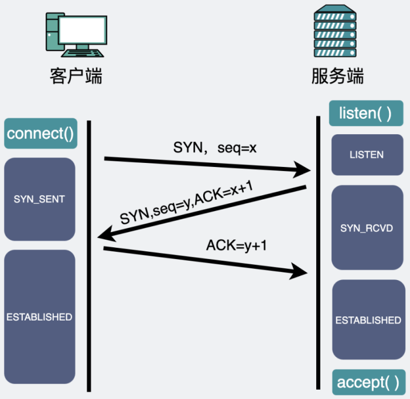
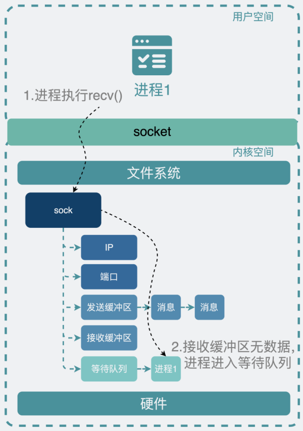
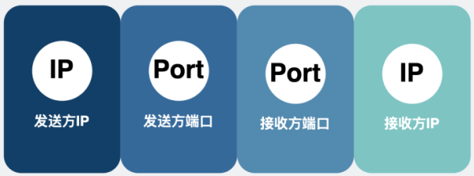
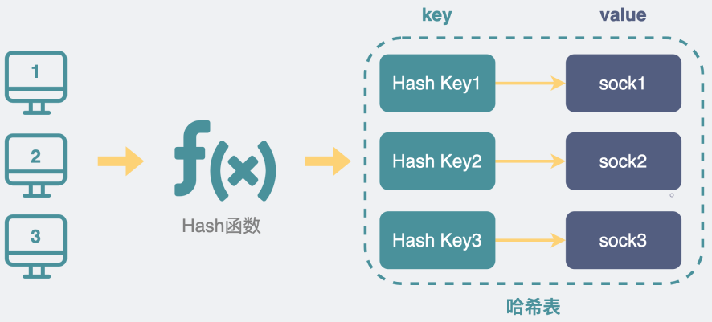

# 一文详解Socket

## Socket 概念

故事要从一个 **插头** 说起。


当我将 **插头** 插入 **插座**，那看起来就像是将两者连起来了。


而插座的英文，又叫 `Socket`。

巧了，我们搞网络编程时也会用到一个叫 `Socket` 的东西。

其实两者非常相似。通过 `Socket`，我们可以与某台机子建立"**连接**"，建立"连接"的过程，就像是将插口插入插槽一样。


到这里其实我们对 `Socket` 还是很模糊。

从我们最熟悉的 **使用场景** 开始说起。

## Socket 使用场景

我们想要将数据从 A 电脑的某个进程发送到 B 电脑的某个进程里。

这时候我们需要选择将数据发过去的 **方式**，如果需要确保数据能完整发给对方，那就选可靠的 `TCP` 协议，如果数据丢了也没关系，那就选择不可靠的 `UDP` 协议。

初学者毫无疑问，首选 `TCP`。


那这时候就需要用 `Socket` 进行编程。

于是第一步就是创建一个关于 TCP 的 `Socket`，就像下面这样。

```java
sock_fd = Socket(AF_INET, SOCK_STREAM, IPPROTO_TCP);
```

这个方法会返回 `Socket_fd`，它是 Socket 文件的 **句柄**（用来标识对象或者项目的标识符），是个数字，相当于Socket的身份证号。

得到了 `Socket_fd` 之后，对于服务端，就可以依次执行 `bind()`, `listen()`, `accept()` 方法，然后坐等客户端的连接请求。

对于客户端，得到 `Socket_fd` 之后，你就可以执行 `connect()` 方法向服务端发起建立连接的请求，此时就会发生 TCP 三次握手。


连接建立完成后，**客户端** 可以执行 `send()` 方法发送消息，**服务端**可以执行 `recv()` 方法接收消息，反过来，**服务器** 也可以执行`send()`，**客户端** 执行 `recv()` 方法。

到这里为止，就是我们大部分程序员最熟悉的使用场景。

## Socket 设计

现在，Socket 我们见过，也用过，但对大部分程序员来说，它是个 **黑盒**。

那既然是黑盒，我们索性假设我们忘了 Socket，重新设计一个内核网络传输功能。

网络传输，从操作上来看，无非就是，发数据和远端之间 **互相** 收发数据，也就是对应着 **写数据** 和 **读数据**。


但显然，事情没那么简单，这里还有两个问题：

1. 接收端和发送端可能不止一个，因此我们需要一些信息做下区分，这个大家肯定很熟悉，可以用 IP 和端口。**IP 用来定位是哪台电脑，端口用来定位是这台电脑上的哪个进程。**
2. 发送端和接收端的传输方式有很多区别，可以是可靠的 `TCP协议`，也可以是不可靠的 `UDP协议`，甚至还需要支持基于 `icmp协议` 的`ping命令`。

### sock 是什么

写过代码的都知道，为了支持这些功能，我们需要定义一个 **数据结构** 去支持这些功能。

这个数据结构，叫 `sock`。

为了解决上面的第一个问题，我们可以在 `sock` 里加入 **IP和端口** 字段。


而第二个问题，我们会发现这些协议虽然各不相同，但还是有一些功能相似的地方，比如收发数据时的一些逻辑完全可以复用。按面向对象编程的思想，我们可以将不同的协议当成是不同的 **对象类（或结构体）**，将公共的部分提取出来，通过"**继承**"的方式，复用功能。

### 基于各种 sock 实现网络传输功能

于是，我们将功能 **重新划分** 下，定义了一些数据结构。


`sock` 是 **最基础** 的结构，维护一些任何协议都有可能会用到的收发数据缓冲区。

`inet_sock` 特指用了 **网络传输** 功能的 `sock`，在 `sock` 的基础上还加入了 `TTL`，**端口，IP地址** 这些跟网络传输相关的字段信息。说到这里大家就懵了，难道还有不是用网络传输的？有，比如 `Unix domain Socket`，用于本机进程之间的通信，直接读写文件，不需要经过网络协议栈。这是个非常有用的东西，我以后一定讲讲（画饼）。

`inet_connection_sock` 是指 **面向连接** 的 `sock`，在 `inet_sock` 的基础上加入面向连接的协议里相关字段，比如 `accept队列`，数据包分片大小，握手失败重试次数等。虽然我们现在提到面向连接的协议就是指 TCP，但设计上 Linux 需要支持扩展 **其他** 面向连接的 **新协议**，

`tcp_sock` 就是正儿八经的 **tcp协议** 专用的 `sock` 结构了，在 `inet_connection_sock` 基础上还加入了 TCP 特有的 **滑动窗口**、**拥塞避免** 等功能。同样 UDP 协议也会有一个专用的数据结构，叫 `udp_sock`。

好了，现在有了这套数据结构，我们将它们跟 **硬件** 网卡对接一下，就实现了网络传输的功能。

### 提供 Socket 层

可以想象得到，这里面的代码肯定非常复杂，同时还操作了网卡硬件，需要比较高的 **操作系统权限**，再考虑到性能和安全，于是决定将它放在 **操作系统内核** 里。

既然网络传输功能做在内核里，那用户空间的应用程序想要用这部分功能的话，该怎么办呢？

这个好办，本着不重复造轮子的原则，我们将这部分功能抽象成一个个 **简单的接口**。以后别人只需要调用这些接口，就可以驱动我们写好的这一大堆复杂的数据结构去发送数据。

那么问题来了，**怎么样将这部分功能暴露出去呢？让其他程序员更方便的使用呢？**

既然跟远端服务端进程收发数据可以抽象为“**读和写**”，操作文件也可以抽象为"**读和写**"，正好有句话叫，"**linux里一切皆是文件**"，那我们索性，**将内核的 sock 封装成文件**就好了。创建 `sock` 的同时也创建一个**文件**，**文件有个句柄fd**，说白了就是个 **文件系统** 里的 **身份证号码**，通过它可以 **唯一确定** 是哪个`sock`。

> 这个文件句柄fd其实就是 `sock_fd = Socket(AF_INET, SOCK_STREAM, IPPROTO_TCP)` 里的 `sock_fd`

将句柄暴露给用户，之后用户就可以像操作 **文件句柄** 那样去操作这个 **sock句柄**。在用户空间里操作这个句柄，**文件系统** 就会将操作 **指向** 内核`sock`结构。

是的，操作这个特殊的 **文件** 就相当于操作内核里对应的 `sock`。


有了 `sock_fd句柄` 之后，我们就需要提供一些接口方法，让用户更方便的实现特定的网络编程功能。这些接口，我们列了一下，发现需要有 `send()`，`recv()`，`bind()`, `listen()`，`connect()` 这些。到这里，我们的内核网络传输功能就算设计完成了。

现在是不是眼熟了，**上面这些接口方法其实就是 Socket 提供出来的接口**。

所以说，Socket 其实就是个 **代码库** or **接口层**，它介于 **内核和应用程序之间**，提供了一些 **高度封装过** 的接口，让我们去使用 **内核网络传输功能**。


到这里，我们应该明白了。我们平时写的应用程序里代码里虽然用了 Socket 实现了收发数据包的功能，但其实真正执行网络通信功能的，不是应用程序，而是 **Linux 内核**。相当于应用程序通过 Socket 提供的接口，将网络传输的这部分工作 **外包** 给了 **Linux内核**。

这听起来像不像我们最熟悉的 **前后端分离** 的服务架构，**虽然这么说不太严谨**，但看上去 Linux 就像是被分成了 **应用程序和内核两个服务**。内核就像是 **后端**，暴露了好多个 **api接口**，其中一类就是 Socket 的 `send()` 和 `recv()` 这些方法。应用程序就像是 **前端**，负责调用内核提供的接口来实现想要的功能。


看到这里，我担心大家会有点混乱，来做个小的**总结**。

**在操作系统内核空间里，实现网络传输功能的结构是 sock，基于不同的协议和应用场景，会被泛化为各种类型的 xx_sock，它们结合硬件，共同实现了网络传输功能。为了将这部分功能暴露给用户空间的应用程序使用，于是引入了 Socket 层，同时将 sock 嵌入到文件系统的框架里，sock 就变成了一个特殊的文件，用户就可以在用户空间使用文件句柄，也就是 Socket_fd 来操作内核 sock 的网络传输能力。**

这个 `Socket_fd` 是一个 **int类型的数字**。现在回去看 `Socket` 的中文翻译，**套接字**，**我** 将它理解为一 **套** 用于连 **接** 的数 **字**，是不是就觉得特别合理了。


## Socket 如何实现网络通信

上面关于怎么实现网络通信功能这一块一笔带过了，现在我们来聊聊。

这套 sock 的结构其实非常复杂。我们以最常用的 TCP 协议为例，简单了解下它是怎么实现网络传输功能的。

我将它分为两阶段，分别是 **建立连接** 和 **数据传输**。

### 建立连接

对于 TCP，要传数据，就得先在客户端和服务端中间 **建立连接**。

在客户端，代码执行 Socket 提供的 `connect(sockfd, "ip:port")` 方法时，会通过 **sockfd 句柄** 找到对应的 **文件**，再根据文件里的信息 **指向** 内核的 `sock` 结构。通过这个 sock 结构主动发起三次握手。



在服务端握手次数还没达到"三次"的连接，叫 **半连接**，完成好三次握手的连接，叫 **全连接**。它们分别会用 **半连接队列** 和 **全连接队列** 来存放，这两个队列会在你执行 `listen()`方法的时候创建好。当服务端执行 `accept()`方法时，就会从全连接队列里拿出一条全连接。


至此，连接就算准备好了，之后，就可以**开始传输数据**。

> 虽然都叫队列，但半连接队列其实是个 hash 表，而全连接队列其实是个链表。
>
> 那么问题来了，为什么半连接队列要设计成哈希表而全连接队列是个链表？详见此文：[《没有accept，能建立TCP连接吗？》](https://mp.weixin.qq.com/s?__biz=Mzg5NDY2MDk4Mw==&mid=2247487062&idx=1&sn=fa75a39e60f13e2275ff9ef7c96866de&scene=21#wechat_redirect) 

### 数据传输

为了实现发送和接收数据的功能，sock 结构体里带了 **一个发送缓冲区和一个接收缓冲区**，说是 **缓冲区**，但其实就是个 **链表**，上面挂着一个个准备要发送或接收的数据。

当应用执行 `send()` 方法 **发送数据** 时，同样也会通过 `sock_fd` 句柄找到对应的文件，根据文件指向的 `sock` 结构，找到这个 `sock` 结构里带的 **发送缓冲区**，将数据会放到发送缓冲区，然后结束流程，内核看心情决定什么时候将这份数据发送出去。

**接收数据** 流程也类似，当数据送到 Linux 内核后，数据不是立马给到应用程序的，而是先放在接收缓冲区中，数据静静躺着，卑微的等待 **应用程序** 什么时候执行 `recv()` 方法来拿一下。


> IP和端口其实不在 sock 下，而在 inet_sock 下，上面这么画只是为了简化。。。

那么问题来了，发送数据是应用程序主动发起，这个大家都没问题。

**那接收数据呢？数据从远端发过来了，怎么通知并给到应用程序呢？**

这就需要用到 **等待队列**。


当你的应用进程执行 `recv()` 方法尝试获取（阻塞场景下）接收缓冲区的数据时。

- 如果有数据，那正好，取走就好了。这点没啥疑问。
- 但如果没数据，就会将自己的 **进程** 信息注册到这个 sock 用的 **等待队列** 里，然后进程 **休眠**。如果这时候有数据从远端发过来了，数据进入到接收缓冲区时，内核就会取出 sock 的等待队列里的进程，**唤醒 **进程来取数据。



有时候，你会看到 **多个进程** 通过 `fork` 的方式，`listen` 了同一个 `Socket_fd`。在内核，它们都是 **同一个sock**，多个进程执行 `listen()` 之后，都嗷嗷等待连接进来，所以都会将自身的进程信息注册到这个 `Socket_fd` 对应的内核 sock 的**等待队列**中。如果这时真来了一个连接，是该唤醒等待队列里的哪个进程来接收连接呢？这个问题的答案比较有趣。

- 在 Linux 2.6 以前，会唤醒等待队列里的所有进程。但最后其实只有一个进程会处理这个连接请求，其他进程又重新进入休眠，这些被唤醒了又无事可做最后只能重新回去休眠的进程会消耗一定的资源。就好像你在广东的街头，想问路，叫一声靓仔，几十个人同时回头，但你其实只需要其中一个靓仔告诉你路该怎么走。你这种一不小心 **惊** 动这 **群** 靓仔的场景，在计算机领域中，就叫 **惊群效应**。
- 在 Linux 2.6 之后，只会唤醒等待队列里的其中一个进程。是的，Socket 监听的惊群效应问题被修复了。


看到这里，问题又来了。

**服务端 listen 的时候，那么多数据到一个 Socket 怎么区分多个客户端的？**

以 TCP 为例，服务端执行 listen 方法后，会等待客户端发送数据来。客户端发来的数据包上会有 **源IP地址和端口**，以及 **目的IP地址和端口**，这四个元素构成一个 **四元组**，可以用于唯一标记一个客户端。

> 其实说四元组并不严谨，因为过程中还有很多其他信息，也可以说是五元组。。。但大概理解就好，就这样吧。。。



服务端会创建一个新的内核sock，并用四元组生成一个`hash key`，将它放入到一个 `hash表` 中。


下次再有消息进来的时候，通过消息自带的四元组生成 `hash key` 再到这个 `hash表` 里重新取出 **对应的sock** 就好了。所以说 **服务端是通过四元组来区分多个客户端的**。



## sock 怎么实现"继承"

最后遗留一个问题。

大家都知道 Linux 内核是C语言实现的，而 **C语言没有类也没有继承的特性，是怎么做到"继承"的效果的呢？**

在C语言里，结构体里的内存是 **连续** 的，将要继承的"父类"，放到结构体的 **第一位**，就像下面这样。

```c
struct tcp_sock {
    /* inet_connection_sock has to be the first member of tcp_sock */
    struct inet_connection_sock inet_conn;
        // 其他字段
}

struct inet_connection_sock {
    /* inet_sock has to be the first member! */
    struct inet_sock   icsk_inet;
        // 其他字段
}
```

然后我们就可以通过结构体名的长度来强行截取内存，这样就能转换结构体，从而实现类似"继承"的效果。

```c
// sock 转为 tcp_sock
static inline struct tcp_sock *tcp_sk(const struct sock *sk)
{
    return (struct tcp_sock *)sk;
}
```


## 总结

- Socket 中文套接字，我理解为一 **套** 用于连 **接** 的数 **字**。
- sock 在内核，Socket_fd 在用户空间，Socket 层介于内核和用户空间之间。
- 在操作系统内核空间里，实现网络传输功能的结构是 sock，基于不同的协议和应用场景，会被泛化为各种类型的 xx_sock，它们结合硬件，共同实现了网络传输功能。为了将这部分功能暴露给用户空间的应用程序使用，于是引入了 Socket 层，同时将 sock 嵌入到文件系统的框架里，sock 就变成了一个特殊的文件，用户就可以在用户空间使用文件句柄，也就是 Socket_fd 来操作内核 sock 的网络传输能力。
- 服务端可以通过四元组来区分多个客户端。
- 内核通过 c 语言"结构体里的内存是连续的"这一特点实现了类似继承的效果。
