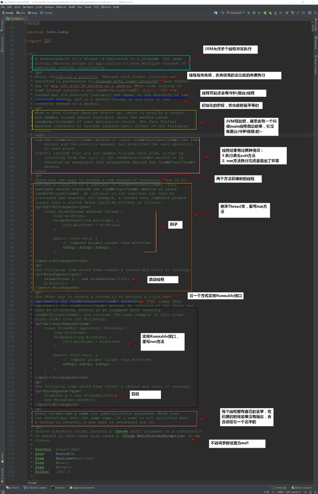

# 初识多线程

## 什么是多线程

讲到线程，就不得不提进程了~

在 Windows 下打开任务管理器，可以发现我们在操作系统上运行的程序其实都是进程：


## 什么是进程

进程是程序的⼀次执行，进程是⼀个程序及其数据在处理机上顺序执行时所发生的活动，进程是具有独立功能的程序在一个数据集合上运行的过程，它是系统进行资源分配和调度的一个独立单位。

**进程是系统进行资源分配和调度的独立单位，每⼀个进程都有它自己的内存空间和系统资源。**

## 回到线程

那系统有了进程这么⼀个概念了，进程已经是可以进行资源分配和调度了，为什么还要线程呢？

为使程序能并发执行，系统必须进行以下的⼀系列操作：

1. **创建进程**，系统在创建⼀个进程时，必须为它分配其所必需的、除处理机以外的所有资源，如内存空间、I/O 设备，以及建立相应的 PCB
2. **撤消进程**，系统在撤消进程时，⼜必须先对其所占有的资源执行回收操作，然后再撤消 PCB；
3. **进程切换**，对进程进行上下⽂切换时，需要保留当前进程的 CPU 环境，设置新选中进程的 CPU 环境，因而须花费不少的处理机时间。


可以看到进程实现多处理机环境下的进程调度、分派、切换时，都需要花费较⼤的时间和空间开销。

引入线程主要是为了 **提高系统的执行效率**，**减少处理机的空转时间和调度切换的时间**，以及便于系统管理。使 OS 具有更好的并发性。

简单来说：**进程实现多处理** 非常耗费 CPU 的资源，⽽我们引⼊线程是作为调度和分派的基本单位（取代进程的部分基本功能【**调度**】）。

那么线程在哪呢？举个例⼦：


也就是说：**在同⼀个进程内又可以执行多个任务，而这每⼀个任务我就可以看成是⼀个线程。**

所以说：**一个进程一般可以有 1 个或多个线程。**

## 进程与线程

于是我们可以总结出：

- 进程作为资源 **分配** 的基本单位
- 线程作为资源 **调度** 的基本单位，**是程序的执行单元，执行路径**（单线程：一条执行路径；多线程：多条执行路径）。是程序使用CPU的最基本单位。

线程有 **3 个基本状态**：

- 执行、就绪、阻塞

线程有 **5 种基本操作**：

- 派生、阻塞、激活、调度、结束

## 线程的属性

- 轻型实体
- 独立调度和分派的基本单位
- 可并发执行
- 共享进程资源

线程有 **两个基本类型**：

- **用户级线程**：管理过程全部由用户程序完成，**操作系统内核心只对进程进行管理**。
- **系统级线程**（核心级线程）：**由操作系统内核进行管理**。操作系统内核给应用程序提供相应的系统调用和应用程序接口 API，以使用户程序可以创建、执行以及撤消线程。


值得注意的是：多线程的存在，不是提高程序的执行速度。其实是 **为了提高应用程序的使用率**，程序的执行其实都是在 **抢CPU的资源**，CPU的执行权。多个进程是在抢这个资源，**而其中的某⼀个进程如果执行路径比较多**，就会有 **更高的几率** 抢到CPU的执行权

## 并行与并发

**并行**：

- 并行性是指 **同一时刻内** 发生两个或多个事件。
- 并行是在 **不同实体上** 的多个事件

**并发**：

- 并发性是指 **同一时间间隔内** 发生两个或多个事件。
- 并发是在 **同一实体上** 的多个事件

由此可见：并行是针对进程的，**并发是针对线程** 的。

## Java实现多线程

java实现多线程靠的是 `Thread` 类，顶部注释如下：



**创建多线程有 3 种方法**

- 继承 Thread，重写 run() 方法
- 实现 Runnable 接口，重写 run() 方法
- 实现 Callable 接口，重写 run() 方法

### 1. 继承 Thread 类，重写 run() 方法

```java
public class MyThread extends Thread {
	@Override
	public void run() {
		for (int x = 0; x < 200; x++) {
			System.out.println(x);
		}
	}
}
```

调用方法

```java
public class MyThreadDemo {
	public static void main(String[] args) {
		// 创建两个线程对象
		MyThread my1 = new MyThread();
		MyThread my2 = new MyThread();
		// 启动线程
        my1.start();
		my2.start();
	}
}
```

### 2. 实现 Runnable 接口，重写 run() 方法

```java
public class MyRunnable implements Runnable {
	@Override
	public void run() {
		for (int x = 0; x < 100; x++) {
		System.out.println(x);
		}
	}
}
```

调用方法

```java
public class MyRunnableDemo {
	public static void main(String[] args) {
		// 创建MyRunnable类的对象
		MyRunnable my = new MyRunnable();
		Thread t1 = new Thread(my);
		Thread t2 = new Thread(my);
		t1.start();
		t2.start();
	}
}
```

## Java 实现多线程需要注意的细节

不要将 `run()` 和 `start()` 搞混了

**run()和start()方法的区别：**

- `run()`：仅仅是 **封装被线程执行的代码**，直接调用的话就成了普通方法
- `start()`：首先 **启动了线程**，然后 **再由 jvm 去调用该线程的 run() 方法**

**jvm 虚拟机的启动是单线程的还是多线程的?**

- 是多线程的。不仅仅是启动 main 线程，还至少会启动垃圾回收线程的，不然谁帮你回收不用的内存~

**那么，既然有两种方式实现多线程，我们使用哪一种？**

- **⼀般我们使用实现 Runnable 接口**
- **可以避免 Java 中的单继承的限制**
- 应该将 **并发运行任务和运行机制解耦**，因此我们选择实现 Runnable 接口这种方式
