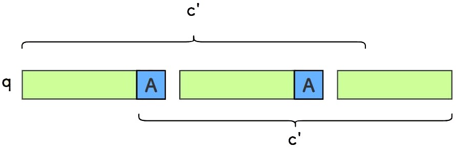
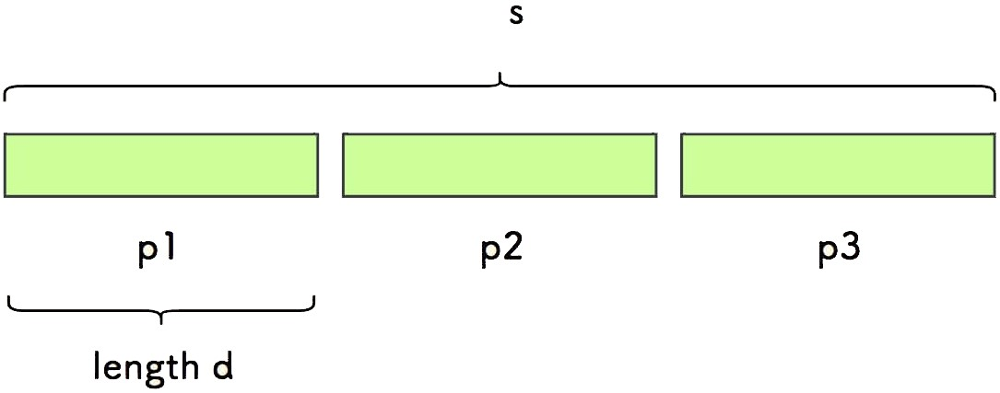
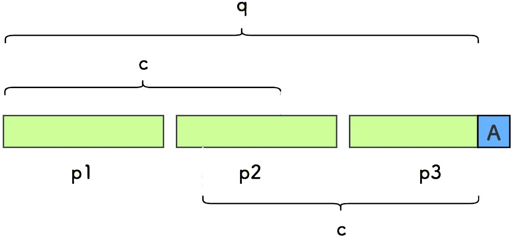

# 459.重复的子字符串

**难度：容易**

给定一个非空的字符串 `s` ，检查是否可以通过由它的一个子串重复多次构成。

**示例 1:**

```
输入: s = "abab"
输出: true
解释: 可由子串 "ab" 重复两次构成。
```

**示例 2:**

```
输入: s = "aba"
输出: false
```

**示例 3:**

```
输入: s = "abcabcabcabc"
输出: true
解释: 可由子串 "abc" 重复四次构成。 (或子串 "abcabc" 重复两次构成。)
```

**提示：**

- `1 <= s.length <= 10^4`
- `s` 由小写英文字母组成

## 解题思路（暴力枚举）

4. 通过外层循环遍历所有可能的子串长度，但只考虑那些能被整个字符串长度整除的子串长度。
2. 对于每一个这样的子串长度，函数检查整个字符串是否可以被这个子串完整地、重复地覆盖。
3. 这种检查是通过内层循环实现的，该循环遍历字符串的每个字符，并将其与假定的重复子串中的对应字符进行比较。
4. 如果在任何时候字符不匹配，内层循环会提前终止，并且外层循环继续尝试下一个子串长度。
5. 如果找到了完全匹配的子串，则函数返回 `true`，否则，遍历完所有可能的子串长度后返回 `false`。

## 代码展示

```java
public boolean repeatedSubstringPattern(String s) {
    // 获取字符串的长度
    int ls = s.length();
    // 外层循环：尝试每一个可能的子串长度
    for (int i = 1; i <= ls / 2; i++) {
        // 如果i是字符串长度的因子，则进行检查
        if (ls % i == 0) {
            int j = i;
            // 内层循环：遍历字符串，从第i个字符开始
            // 将每个字符与它应该匹配的字符（即它在重复子串中的对应字符）进行比较
            while (j < ls) {
                // 一旦发现不匹配，立即跳出循环
                if (s.charAt(j) != s.charAt(j % i)) {
                    break;
                }
                j++;
            }
            // 如果整个字符串匹配了重复的子串模式，则返回true
            if (j == ls) {
                return true;
            }
        }
    }
    // 如果没有找到任何重复的子串模式，则返回false
    return false;
}
```

时间复杂度: O(n^2)

空间复杂度: O(1)

## 双倍字符串法

**算法原理：把字符串翻倍，掐头去尾，如果原字符串在其中，那么原字符串就是周期串 。**

### 证明匹配意味着周期性

假设我们有字符串 `s` ，把它的头尾字符分别染上黄色和蓝色：


把字符串 `s` 接到自身后面，然后掐头去尾，形成新字符串 `s'`：


**如果原字符串 `s` 在新字符串 `s'` 中真的存在，能说明 `s` 是一个周期串吗**？答案是能。

不妨设右边匹配的少一些。对其中的任一字符 `A` ，可以按照如下的规则推演：


推演说明：

- 由于上下字符串匹配，所以有 ① 号推演。
- 由于和左上方的自身相等，所以有 ② 号推演。
- 如此反复。

如此，任一此区间上的字符 `A` 会在 `s` 中周期性出现，即说明字符串 `s` 是周期串。

### 证明周期性意味着匹配

**反过来，如果一个字符串 `s` 是周期串，那么它一定在对应的 `s'` 中吗？**答案也是肯定的，证明过程：

任何一个周期串可以表达为： 由某个模式子串的重复多次构成。


将周期串 `s` 的头字符对齐在第一个模式串后面， 每次右移一个模式串的长度。

可知，`s` 会在 `s'` 中有匹配，且可以有多个匹配。


图中可看出， 因为模式串重复 `n` 次，所以会有 `n` 次匹配 。

构造双倍串 `s'` 时，移除头尾字符， 正是 **为了剔除最左和最右的两次必然匹配**，确保只有中间的 `n` 次匹配才用到了周期串重复模式串的性质。

### 结论

综上两方面说明了充分性和必要性，结论：**如果字符串在其掐头去尾的双倍字符串中，它就是周期串**。

### 代码展示

```java
public boolean repeatedSubstringPattern(String s) {
    String str = s + s;
    str = str.substring(1, str.length() - 1);
    return str.contains(s);
}
```

本方法的实现，依赖语言自建的字符串搜索方法，故不做复杂度分析。

## KMP 法

假设要判断的字符串为 `s` ，将其尾部字符标记为蓝色，取字符串 `q` 为不包含 `s` 尾部字符的部分，取 `c` 为 `q` 的 **最长相等前后缀**。


相等前后缀的意思是，它是既出现在字符串最前面、也出现在字符串最后面的真子串，比如如果 `s` 是字符串串 `"abcabcabc"` ，则 `q` 是 `"abcabcab"` ，`q` 的最长相等前后缀 `c` 是 `"abcab"` ：


使用 kmp 法求解此题的原理是：**`s` 是周期串等价于 `len(s)` 是 `len(q) - len(c)` 的倍数**

### 证明 s 是周期串意味着 len(s) 是 len(q) - len(c) 的倍数

假设字符串 `s` 是一个周期串，它由模式串 `p` 重复多次构成：


取字符串 `q` 为不包含 `s` 尾部字符的部分， 取 `c_1` 为 `q` 中剔去开头第一个模式串 `p` 后的部分：


显然，字符串 `c_1` 是 `q` 的一个 **相等前后缀**，比如周期串 `"abcabcabc"` ，对应的 `c_1` 则是 `"abcab"` ：


实际上，`c_1` 就是 `q` 最长的前后公共缀 `c`，由此可知周期长度是 `len(p) = len(q)-len(c)` 。

证明了：若字符串 `s` 是周期串，所以其长度一定是周期长度的倍数。

### c_1 就是 q 最长的前后公共缀 c 的证明

我们采用反证法，假设存在一个字符串 `c'` 也是 `q` 的前后公共缀，而且它比 `c_1` 长一位，另外，假设尾部字符为 `A` 。



现在有两条性质：

- 周期性质：字符串 `s` 的周期性。
- 相等前后缀性质：`c'` 是 `q` 的相等前后缀。

我们反复利用这两条性质：

1. 由于「相等前后缀性质」，`q` 的第一个字符也是 `A`。

   

2. 由于「周期性质」，后续的循环子串中的第一个字符也是 `A` 。

   

3. 由于「前后公共缀性质」，`q` 的第二个字符也是 `A`。

   

4. 由于「周期性质」，后续的循环子串中的第二个字符也是 `A` 。

   

   

5. 如上反复进行，最终，推断整个 `q` 以及 `s` 都由字符 `A` 构成。

   

此时的模式串 `p` 即单个字符 `A` ，`c_1` 如上图，长度是 `len(q)-1` 。

相等前后缀是真子串，显然，不会存在比它更长的前后公共缀，造成矛盾。因此，所定义的 `c_1` 就是 `q` 的最长前后公共缀 `c` 。

### 证明 len(s) 是 len(q) - len(c) 的倍数意味着 s 是周期串

令 `d = len(q)-len(c)` ， 如果字符串 `s` 的长度是 `d` 的倍数，是否 `s` 一定是周期串？

此时字符串 `s` 一定可以按照每 `d` 个字符一份，切分为整数个小串：



同样假设尾巴字符是蓝色的 `A` ， 剔除尾巴字符后 `q` 和 其最长前后公共缀 `c` 如下所示：



根据  `d = len(q) - len(c)` ， 我们知道 `len(c) + 1 = len(q) - d + 1` 。

又因 `len(q) = len(s) - 1` ，且 `len(s)` 可以写作 `len(s) = k * d` 。

所以 `len(c) + 1 = k * d - d = (k - 1) * d` ，说明 `len(c) + 1` 是 `d` 的倍数。

因此，在下图中， `c` 必然上下对齐于某个小串的开头。

又因 `len(c) + 1 = (k - 1) * d` ，所以 `c` 就是 `q` 中剔除第一个小份串 `p1` 的部分。


下面将说明，`s` 是一个周期串。

在最后一个小份串，从尾部取倒数第 `j` 个字符 `B` ，反复推演， 可以知道前面的所有小份串的相同位置，都是字符 `B` 。


上面的图中：

1. ① 号推演，由于上面后缀和下面前缀相等。
2. ② 号推演，由于下面的小份串和上面的自身相等。
3. 如此，反复进行。

对最后一个小份串上的所有字符， 都会在前面的小份串相同位置重复，那么 `s` 是一个周期串。

**上面推演中的一个细节是，无法推演小份串的倒数第一个字符。**


原因在于，尾端字符不在最长前后公共缀的范围内。

细节处理就是，需要判断一次尾巴字符 `A` 是否和上一个小串对应位置的字符相等。

一旦此细节满足，即可完成整体推演过程，`s` 就一定是一个周期串。


### 代码展示

```java
public boolean repeatedSubstringPattern(String s) {
    int ls = s.length();
    if (ls <= 1) {
        return false;
    }
    int lq = ls - 1;
    int[] next = getNext(s);
    int lc = next[ls - 1];
    if (s.charAt(lc) == s.charAt(ls - 1) && ls % (lq - lc) == 0) {
        return true;
    }
    return false;
}

public int[] getNext(String p) {
    // 构建 next 数组，数组长度为匹配串的长度（next 数组是和匹配串相关的）
    int lp = p.length();
    int[] next = new int[lp];
    next[0] = -1;
    if (lp > 1) {
        next[1] = 0;
        //i: 当前要求解next[i]
        //m: cn始终记录next[i - 1]的值
        int i = 2;
        int m = next[i - 1];
        while (i < lp) {
            if (p.charAt(i - 1) == p.charAt(m)) {// p[m] == p[i-1]
                next[i] = m + 1;
                i++;
                m = next[i - 1];
            } else if (m != 0 && p.charAt(i - 1) != p.charAt(m)) {// p[m] != p[i-1]但前后缀还有匹配的可能
                m = next[m];
            } else if (m == 0 && p.charAt(i - 1) != p.charAt(m)) {// p[m] != p[i-1]且前后缀没有匹配的可能
                next[i] = 0;
                i++;
            }
        }
    }
    return next;
}
```

时间复杂度：O(n)

空间复杂度：O(n) 

## 总结

- 打基础的时候，不要太迷恋于库函数。
- 如果库函数仅仅是 解题过程中的一小部分，并且你已经很清楚这个库函数的内部实现原理的话，可以考虑使用库函数。
- 双指针法在数组，链表和字符串中很常用。
- 当需要固定规律一段一段去处理字符串的时候，要想想在在 for 循环的表达式上做做文章。

- KMP算法是字符串查找最重要的算法
