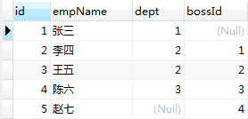

::: tip 为什么要使用关联查询
在使用数据库查询语句时，单表的查询有时候不能满足项目的业务需求，在项目开发过程中，有很多需求都是要涉及到多表的联合查询，因此，这里总结一下MySQL中的多表关联查询
:::

# MySQL中的关联查询（内连接、外连接、自连接）

## 一、关联查询sql的基本思路

**1、先确定所连接的表**

**2、再确定所要查询的字段**

**3、确定连接条件以及连接方式**

## 二、内连接查询

**内连接查询是指所有查询出的结果都是能够在连接的表中有对应记录的**

以t_employee（员工表）和t_dept（部门表）为例。dept代表该员工所在的部门，bossId表示该员工的上司，则t_employee表中的记录如下：



t_dept表中的记录如下：


可以发现，其中人力资源部里没有员工，而赵七没有对应的部门，现在假如我们想要查询出员工姓名以及其对应的部门名称，此时，就要使用**内连接查询**，关键字为 **inner join**

演示代码：

```sql
select e.empName,d.deptName from t_employee e inner join t_dept d on e.dept = d.id;
```

查询结果：


注意，输出结果中**没有部门的人员**和**没有员工的部门**都没有被查询出来，这就是<font color="red">**内连接的特点：只查询在连接的表中能够有对应的记录，其中 `e.dept = d.id` 是连接条件**</font>

## 三、左外连接查询

**左外连接查询就是以左边的表的数据为基准，去匹配右边的表的数据，如果匹配到就显示，匹配不到就显示为null**

在关联查询中，做外连接查询就是左连接查询，两者是一个概念

在上一步内连接查询中，我们得到了部分员工的姓名以及他所在的部门名称，其中赵七没有被查出来，因为他没有对应的部门，现在如果我们想要把赵七也查出来，就要使用**左外连接查询**，关键字为 **left outer join**，等效于 **left join**

演示代码：

```sql
select e.empName,d.deptName from t_employee e left outer join t_dept d on d.id = e.dept;
```

查询结果：


注意，此处t_employee就是左表，也就是**基准表**，用基准表的数据去匹配右表的数据，所以左表的记录是全部会查询出来的，如果右表没有记录对应的话就显示null

## 四、右外连接查询

**右外连接查询和左外连接同理，只是基准表从左边改成了右边**

例如，查询所有的部门和对应的员工时，可以试用**右外连接查询**，关键字为 **right outer join**，等效于 **right join**

演示代码：

```sql
select e.empName,d.deptName from t_employee e right outer join t_dept d on d.id=e.dept;
```

查询结果：


注意，这里只是把left修改成了right，但是基准表变化了，是以右表的数据去匹配左表，所以左外连接能做到的查询，右外连接也能做到

## 五、全外连接查询

**顾名思义，全外连接查询就是把两张表的字段都查出来，没有对应的值就显示null**

但是MySQL是没有全外连接的，MySQL中也没有 `full outer join` 关键字，想要达到全外连接的效果，可以使用 **union** 关键字连接左外连接和右外连接

演示代码：

```sql
select e.empName,d.deptName from t_employee e left join t_dept d on d.id=e.dept
union
select e.empName,d.deptName from t_employee e right join t_dept d on d.id=e.dept
```

查询结果：


注意，如果在Oracle数据库中，直接使用 **full outer join** 关键字连接两表就行了

## 六、自连接查询

**自连接查询就是当前表与自身的连接查询，关键点在于虚拟化出一张表给一个别名**

例如，假如我们要查询员工以及他的上司的名称，由于上司也是员工，所以这里会虚拟化出一张上司表

演示代码：

```sql
select e.empName,b.empName from t_employee e left join t_employee b on e.boddId=b.id;
```

查询结果：


注意，这里的b表是**虚拟化出的表**，我们可以通过查询了解b表的记录：

```sql
select e.empName,b.empName,b.* from t_employee e left join t_employee b on e.bossId=b.id; 
```

查询结果


后面的四个字段就是虚拟化出的b表的所有记录，但这四个字段其实就是记录的所有**本身是上司的员工**的信息

所以，自连接查询一般用作表中的某个字段的值是引用另一个字段的值，比如权限表中，父权限也属于权限
