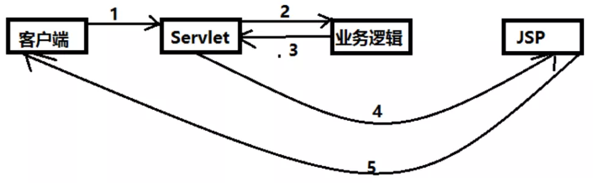

::: tip 什么是 SpringMVC

Spring MVC 是 Spring Framework 的一部分，是基于 Java 实现 MVC 的轻量级 Web 框架

:::

# 初识SpringMVC

## 一、回顾 MVC 架构

### 1、什么是 MVC

- MVC是模型（Model）、视图（View）、控制器（Controller）的简写，是一种软件设计规范。
- 是将业务逻辑、数据、显示分离的方法来组织代码。
- MVC 主要作用是 **降低了视图与业务逻辑间的双向偶合**。
- MVC 不是一种设计模式，**MVC 是一种架构模式**。当然不同的 MVC 存在差异。

**Model（模型）**：数据模型，提供要展示的数据，因此包含数据和行为，可以认为是领域模型或JavaBean组件（包含数据和行为），不过现在一般都分离开来：Value Object（数据Dao） 和 服务层（行为Service）。也就是模型提供了模型数据查询和模型数据的状态更新等功能，包括数据和业务。

**View（视图）**：负责进行模型的展示，一般就是我们见到的用户界面，客户想看到的东西。

**Controller（控制器）**：接收用户请求，委托给模型进行处理（状态改变），处理完毕后把返回的模型数据返回给视图，由视图负责展示。也就是说控制器做了个调度员的工作。

**最典型的MVC就是 JSP + servlet + javabean 的模式。**


### 2、Model1 时代

- 在web早期的开发中，通常采用的都是 Model1。
- Model1中，主要分为两层，视图层和模型层。


Model1优点：架构简单，比较适合小型项目开发；

Model1缺点：JSP职责不单一，职责过重，不便于维护；

### 3、Model2 时代

Model2把一个项目分成三部分，包括 **视图、控制、模型。**



1. 用户发请求
   
2. Servlet 接收请求数据，并调用对应的业务逻辑方法

3. 业务处理完毕，返回更新后的数据给servlet

4. servlet转向到JSP，由JSP来渲染页面

5. 响应给前端更新后的页面

#### **职责分析**：

**Controller：控制器**

1. 取得表单数据
2. 调用业务逻辑
3. 转向指定的页面

**Model：模型**

1. 业务逻辑
2. 保存数据的状态

**View：视图**

1. 显示页面

**Model2 这样不仅提高的代码的复用率与项目的扩展性，且大大降低了项目的维护成本**。Model1 模式的实现比较简单，适用于快速开发小规模项目，Model1 中 JSP 页面身兼 View 和 Controller 两种角色，将控制逻辑和表现逻辑混杂在一起，从而导致代码的重用性非常低，增加了应用的扩展性和维护的难度。Model2 消除了 Model1的缺点。

### 4、回顾Servlet

1. 新建一个Maven工程当做父工程！pom依赖！

   ```xml
   <dependencies>
      <dependency>
          <groupId>junit</groupId>
          <artifactId>junit</artifactId>
          <version>4.12</version>
      </dependency>
      <dependency>
          <groupId>org.springframework</groupId>
          <artifactId>spring-webmvc</artifactId>
          <version>5.1.9.RELEASE</version>
      </dependency>
      <dependency>
          <groupId>javax.servlet</groupId>
          <artifactId>servlet-api</artifactId>
          <version>2.5</version>
      </dependency>
      <dependency>
          <groupId>javax.servlet.jsp</groupId>
          <artifactId>jsp-api</artifactId>
          <version>2.2</version>
      </dependency>
      <dependency>
          <groupId>javax.servlet</groupId>
          <artifactId>jstl</artifactId>
          <version>1.2</version>
      </dependency>
   </dependencies>
   ```

2. 建立一个Moudle：`springmvc-01-servlet` ， 添加 `Web app` 的支持！

3. 导入 servlet 和 jsp 的 jar 依赖

   ```xml
   <dependency>
      <groupId>javax.servlet</groupId>
      <artifactId>servlet-api</artifactId>
      <version>2.5</version>
   </dependency>
   <dependency>
      <groupId>javax.servlet.jsp</groupId>
      <artifactId>jsp-api</artifactId>
      <version>2.2</version>
   </dependency>
   ```

4. 编写一个Servlet类，用来处理用户的请求

   ```java
   package com.kuang.servlet;
   
   //实现Servlet接口
   public class HelloServlet extends HttpServlet {
      @Override
      protected void doGet(HttpServletRequest req, HttpServletResponse resp) throws ServletException, IOException {
          //取得参数
          String method = req.getParameter("method");
          if (method.equals("add")){
              req.getSession().setAttribute("msg","执行了add方法");
         }
          if (method.equals("delete")){
              req.getSession().setAttribute("msg","执行了delete方法");
         }
          //业务逻辑
          //视图跳转
          req.getRequestDispatcher("/WEB-INF/jsp/hello.jsp").forward(req,resp);
     }
   
      @Override
      protected void doPost(HttpServletRequest req, HttpServletResponse resp) throws ServletException, IOException {
          doGet(req,resp);
     }
   }
   ```

5. 编写Hello.jsp，在WEB-INF目录下新建一个jsp的文件夹，新建hello.jsp

   ```jsp
   <%@ page contentType="text/html;charset=UTF-8" language="java" %>
   <html>
   	<head>
      	<title>Kuangshen</title>
   	</head>
   	<body>
   		${msg}
   	</body>
   </html>
   ```

6. 在web.xml中注册Servlet

   ```xml
   <?xml version="1.0" encoding="UTF-8"?>
   <web-app xmlns="http://xmlns.jcp.org/xml/ns/javaee"
           xmlns:xsi="http://www.w3.org/2001/XMLSchema-instance"
           xsi:schemaLocation="http://xmlns.jcp.org/xml/ns/javaee http://xmlns.jcp.org/xml/ns/javaee/web-app_4_0.xsd"
           version="4.0">
      <servlet>
          <servlet-name>HelloServlet</servlet-name>
          <servlet-class>com.kuang.servlet.HelloServlet</servlet-class>
      </servlet>
      <servlet-mapping>
          <servlet-name>HelloServlet</servlet-name>
          <url-pattern>/user</url-pattern>
      </servlet-mapping>
   
   </web-app>
   ```

7. 配置Tomcat，并启动测试

   - localhost:8080/user?method=add

   - localhost:8080/user?method=delete

## 二、 MVC框架要做哪些事情

1. 将 url 映射到 java 类或 java 类的方法 .

2. 封装用户提交的数据 .

3. 处理请求--调用相关的业务处理--封装响应数据 .

4. 将响应的数据进行渲染 . jsp / html 等表示层数据 .

**说明：**

常见的服务器端 MVC 框架有：Struts、Spring MVC、ASP.NET MVC、Zend Framework、JSF；

常见前端 MVC 框架：vue、angularjs、react、backbone；

由MVC演化出了另外一些模式如：MVP、MVVM 等等....

## 三、什么是SpringMVC

### 1、概述


<font color='red'>**Spring MVC是Spring Framework的一部分，是基于Java实现MVC的轻量级Web框架**。</font>

此处查看 [**官方文档**](https://docs.spring.io/spring/docs/5.2.0.RELEASE/spring-framework-reference/web.html#spring-web)

**我们为什么要学习SpringMVC呢?**

 Spring MVC的特点：

1. 轻量级，简单易学
2. 高效 , 基于请求响应的MVC框架
3. 与 Spring 兼容性好，无缝结合
4. 约定优于配置
5. 功能强大：RESTful、数据验证、格式化、本地化、主题等
6. 简洁灵活

Spring的 web 框架围绕 **DispatcherServlet** [ 调度Servlet ] 设计。

DispatcherServlet 的作用是将请求分发到不同的处理器。从Spring 2.5开始，使用 Java 5或者以上版本的用户可以采用基于注解形式进行开发，十分简洁；

正因为 SpringMVC 好 , 简单 , 便捷 , 易学 , 天生和 Spring 无缝集成(使用SpringIoC和Aop) , 使用约定优于配置。能够进行简单的 junit 测试 . 支持 Restful 风格 .异常处理 , 本地化 , 国际化 , 数据验证 , 类型转换 , 拦截器 等等......所以我们要学习。

**最重要的一点还是用的人多 , 使用的公司多 .** 

### 2、中心控制器

Spring 的 web 框架围绕 DispatcherServlet 设计。DispatcherServlet 的作用是将请求分发到不同的处理器。从Spring 2.5开始，使用Java 5或者以上版本的用户可以采用基于注解的 controller 声明方式。

Spring MVC 框架像许多其他 MVC 框架一样, **以请求为驱动，围绕一个中心Servlet分派请求及提供其他功能，DispatcherServlet是一个实际的 Servlet (它继承自 HttpServlet 基类)**。


SpringMVC 的原理如下图所示：

当发起请求时被前置的控制器拦截到请求，根据请求参数生成代理请求，找到请求对应的实际控制器，控制器处理请求，创建数据模型，访问数据库，将模型响应给中心控制器，控制器使用模型与视图渲染视图结果，将结果返回给中心控制器，再将结果返回给请求者。


### 3、SpringMVC执行原理


图为 SpringMVC 的一个较完整的流程图，实线表示SpringMVC框架提供的技术，不需要开发者实现，虚线表示需要开发者实现。

简要分析执行流程：


1. `DispatcherServlet` 表示前置控制器，是整个SpringMVC的控制中心。用户发出请求，`DispatcherServlet`接收请求并拦截请求。

   - 我们假设请求的url为 : `http://localhost:8080/SpringMVC/hello`

   **如上url拆分成三部分：**

   - `http://localhost:8080` 服务器域名

   - `SpringMVC` 部署在服务器上的web站点

   - `hello` 表示控制器

   通过分析，如上url表示为：请求位于服务器 `localhost:8080` 上的SpringMVC站点的hello控制器。

2. `HandlerMapping` 为处理器映射。`DispatcherServlet` 调用 `HandlerMapping`，`HandlerMapping` 根据请求 url 查找 Handler。

3. `HandlerExecution` 表示具体的 Handler，其主要作用是根据url查找控制器，如上 url 被查找控制器为：hello。

4. `HandlerExecution` 将解析后的信息传递给 `DispatcherServlet` ，如解析控制器映射等。

5. `HandlerAdapter` 表示处理器适配器，其按照特定的规则去执行 Handler。

6. `Handler` 让具体的 Controller 执行。

7. `Controller` 将具体的执行信息返回给 `HandlerAdapter` ，如 `ModelAndView`。

8. `HandlerAdapter` 将视图逻辑名或模型传递给 `DispatcherServlet`。

9. `DispatcherServlet` 调用视图解析器( `ViewResolver` )来解析 `HandlerAdapter` 传递的逻辑视图名。

10. 视图解析器将解析的逻辑视图名传给 `DispatcherServlet` 。

11. `DispatcherServlet` 根据视图解析器解析的视图结果，调用具体的视图。

12. 最终视图呈现给用户。
