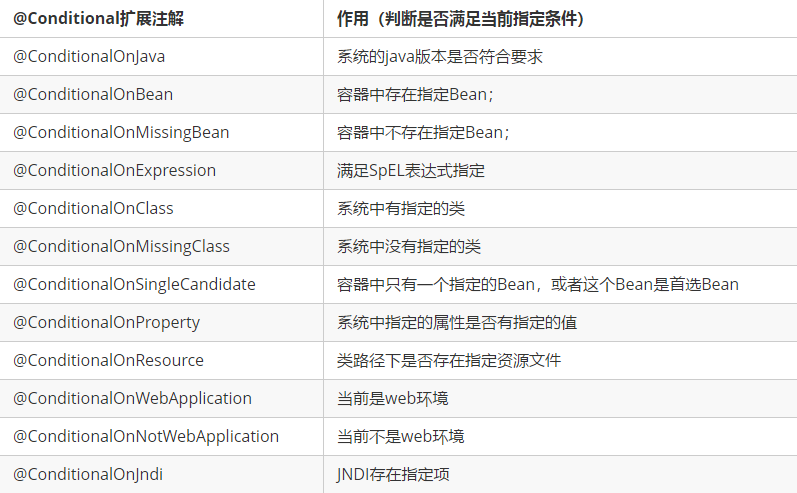

# 自动配置原理

配置文件到底能写什么？怎么写？

[SpringBoot官方文档中介绍了大量的配置属性](https://docs.spring.io/spring-boot/docs/2.3.0.RELEASE/reference/html/appendix-application-properties.html#common-application-properties)，我们无法全部记住


## 分析自动配置原理

我们以 **HttpEncodingAutoConfiguration（Http编码自动配置）** 为例解释自动配置原理

```java
//表示这是一个配置类，和以前编写的配置文件一样，也可以给容器中添加组件；
@Configuration 

//启动指定类的ConfigurationProperties功能；
  //进入这个HttpProperties查看，将配置文件中对应的值和HttpProperties绑定起来；
  //并把HttpProperties加入到ioc容器中
@EnableConfigurationProperties({HttpProperties.class}) 

//Spring底层@Conditional注解
  //根据不同的条件判断，如果满足指定的条件，整个配置类里面的配置就会生效；
  //这里的意思就是判断当前应用是否是web应用，如果是，当前配置类生效
@ConditionalOnWebApplication(
    type = Type.SERVLET
)

//判断当前项目有没有这个类CharacterEncodingFilter；SpringMVC中进行乱码解决的过滤器；
@ConditionalOnClass({CharacterEncodingFilter.class})

//判断配置文件中是否存在某个配置：spring.http.encoding.enabled；
  //如果不存在，判断也是成立的
  //即使我们配置文件中不配置pring.http.encoding.enabled=true，也是默认生效的；
@ConditionalOnProperty(
    prefix = "spring.http.encoding",
    value = {"enabled"},
    matchIfMissing = true
)

public class HttpEncodingAutoConfiguration {
    //他已经和SpringBoot的配置文件映射了
    private final Encoding properties;
    //只有一个有参构造器的情况下，参数的值就会从容器中拿
    public HttpEncodingAutoConfiguration(HttpProperties properties) {
        this.properties = properties.getEncoding();
    }
    
    //给容器中添加一个组件，这个组件的某些值需要从properties中获取
    @Bean
    @ConditionalOnMissingBean //判断容器没有这个组件？
    public CharacterEncodingFilter characterEncodingFilter() {
        CharacterEncodingFilter filter = new OrderedCharacterEncodingFilter();
        filter.setEncoding(this.properties.getCharset().name());
        filter.setForceRequestEncoding(this.properties.shouldForce(org.springframework.boot.autoconfigure.http.HttpProperties.Encoding.Type.REQUEST));
        filter.setForceResponseEncoding(this.properties.shouldForce(org.springframework.boot.autoconfigure.http.HttpProperties.Encoding.Type.RESPONSE));
        return filter;
    }
    //。。。。。。。
}
```

**一句话总结：根据当前不同的条件判断，决定这个配置类是否生效！**

- 一但这个配置类生效；这个配置类就会给容器中添加各种组件；
- 这些组件的属性是从对应的properties类中获取的，这些类里面的每一个属性又是和配置文件绑定的；
- 所有在配置文件中能配置的属性都是在xxxxProperties类中封装着；
- 配置文件能配置什么就可以参照某个功能对应的这个属性类

 ``` java
//从配置文件中获取指定的值和bean的属性进行绑定
@ConfigurationProperties(prefix = "spring.http") 
public class HttpProperties {
    // .....
}
 ```

我们去配置文件里面试试前缀，看提示：


**这就是自动装配的原理！**

## 精髓

1、SpringBoot启动会加载大量的自动配置类

2、我们看我们需要的功能有没有在SpringBoot默认写好的自动配置类当中

3、我们再来看这个自动配置类中到底配置了哪些组件；（只要我们要用的组件存在在其中，我们就不需要再手动配置了）

4、给容器中自动配置类添加组件的时候，会从properties类中获取某些属性。我们只需要在配置文件中指定这些属性的值即可

**xxxxAutoConfigurartion：自动配置类**；给容器中添加组件

**xxxxProperties：封装配置文件中相关属性；**

## 了解：@Conditional

了解完自动装配的原理后，我们来关注一个细节问题，**自动配置类必须在一定的条件下才能生效；**

**@Conditional派生注解（Spring注解版原生的@Conditional作用）**

作用：必须是@Conditional指定的条件成立，才给容器中添加组件，配置配里面的所有内容才生效；



**那么多的自动配置类，必须在一定的条件下才能生效；也就是说，我们加载了这么多的配置类，但不是所有的都生效了。**

我们怎么知道哪些自动配置类生效？

**我们可以通过启用 debug=true属性；来让控制台打印自动配置报告，这样我们就可以很方便的知道哪些自动配置类生效：**

``` properties
#开启springboot的调试类
debug=true
```

**Positive matches:（自动配置类启用的：正匹配）**

**Negative matches:（没有启动，没有匹配成功的自动配置类：负匹配）**

**Unconditional classes: （没有条件的类）**

演示，查看输出的日志：


**掌握吸收理解原理，即可以以不变应万变！**
