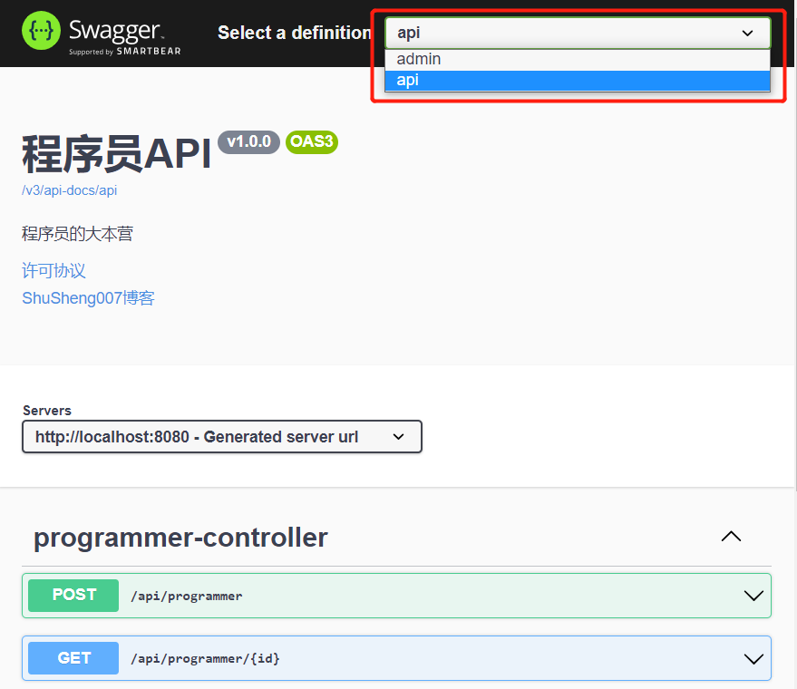

# 集成Swagger与Springdoc

## Swagger 简介

Spring boot是目前非常流行的微服务框架，我们很多情况下使用它来提供 Rest API。而对于 Rest API 来说很重要的一部分内容就是 API 文档，Swagger 为我们提供了一套通过代码和注解自动生成我文档的方法，这一点对于保证 API 文档的及时性将有很大的帮助。

Swagger是一套基于 OpenAPI 规范构建的开源工具，可以帮助我们设计、构建、记录以及使用 Rest API。

## 为什么要使用 Swagger

当下很多公司都采用前后端分离的开发模式，前端和后端的工作由不同的工程师完成。在这种开发模式下，维持一份及时更新且完整的 Rest API 文档将会极大的提高我们的工作效率。传统意义上的文档都是由后端开发人员手动编写的，但是这种方式很难保证文档的及时性和完整性，这种文档久而久之也就会失去其参考意义，反而还会加大我们沟通的成本。而 Swagger 给我们提供了一个全新的维护 API 文档的方式，下面我们来了解一下它的优点：

- 代码变，文档变。只需要少量注解，Swagger 就会根据代码自动生成 API 文档，很好的保证了文档的时效性。
- 跨语言性，支持四十多种语言。
- Swagger UI 呈现出来的是一份可交互是的API文档，我们可以直接在API页面尝试API的调用，省去了准备复杂调用参数的过程。
- 还可以将文档规范导入相关的工具(例如SoapUI)，这些工具将会为我们自动的创建自动化测试。

## 概念补充

- **OpenAPI**：是一个组织（OpenAPI Initiative），他们制定了一个如何描述 HTTP API 的规范（OpenAPI Specification）。既然是规范，那么谁想实现都可以，只要符合规范即可。
- **Swagger**：是 SmartBear 公司的一个开源项目，里面提供了一系列工具，包括著名的 swagger-ui。swagger 是早于 OpenApi 的，某一天 swagger 将自己的 API 设计贡献给了 OpenApi，然后由其标准化了。
- **Springfox**：是Spring生态的一个开源库，是 Swagger 与 OpenApi 规范的具体实现。我们使用它就可以在 Spring 中生成 API 文档。以前基本上是行业标准，目前最新版本可以支持 Swagger2、Swagger3 以及 OpenAPI3 三种格式。但是其从 2020 年 7 月 14 号就不再更新了，不支持 Springboot3，所以业界开始转向我们今天要谈论的另一个库 Springdoc。
- **Springdoc**：后起之秀，带着继任 Springfox 的使命而来。其支持OpenApi规范，支持 Springboot3，新项目都应该使用这个。

## SpringBoot 集成 Springdoc

### 准备一个 web 项目

1. 添加 web 依赖

   ```xml
   <dependency>
       <groupId>org.springframework.boot</groupId>
       <artifactId>spring-boot-starter-web</artifactId>
   </dependency>
   ```

2. 编写 api 接口

   - 首先我们创建三个包 controller、testController、model

   - 在 controller 包中创建 UserController 类，在 testControoler 包中创建 TestController 类，在 model 包下创建 User 类

   - UserController 提供了用户的增、删、改、查四个接口，TestController 提供了一个测试接口

     ```java
     @RestController
     @RequestMapping("/user")
     public class UserController {
         @PostMapping("/add")
         public boolean addUser(@RequestBody User user) {
             return false;
         }
         @GetMapping("/find/{id}")
         public User findById(@PathVariable("id") int id) {
             return new User();
         }
         @PutMapping("/update")
         public boolean update(@RequestBody User user) {
             return true;
         }
         @DeleteMapping("/delete/{id}")
         public boolean delete(@PathVariable("id") int id) {
             return true;
         }
     }
     ```

     ```java
     @RestController
     @RequestMapping("/test")
     public class TestController {
         @GetMapping("/test")
         public void test() {
             System.out.println("test");
         }
     }
     ```

### 添加 Springdoc 依赖

```xml
<dependency>
    <groupId>org.springdoc</groupId>
    <artifactId>springdoc-openapi-starter-webmvc-ui</artifactId>
    <version>2.2.0</version>
</dependency>
```

运行项目后访问下面的链接即可：

```
http://server:port/context-path/swagger-ui.html 
```

例如：

```
http://localhost:8080/swagger-ui.html 
```

效果：


可以看到已经有了基本的接口展示列表，但是对于接口的信息描述还不是特别清楚，接下来我们通过一些高级配置，让这份文档变得更加易读。

### 配置文档信息

Springdoc 提供了一个OpenAPI对象，我们可以通过这个对象来灵活地配置 Swagger 的各项属性，比如配置文档名称等，下面我们在 config 包下新建一个 SpringDocConfig 配置类：

```java
@Configuration
public class SpringDocConfig {
    @Bean
    public OpenAPI myOpenAPI() {
        return new OpenAPI()
                .info(new Info()
                        .title("程序员API")
                        .description("程序员的大本营")
                        .version("v1.0.0")
                        .license(new License()
                                .name("许可协议")
                                .url("https://shusheng007.top"))
                        .contact(new Contact()
                                .name("书生007")
                                .email("wangben850115@gmail.com")))
                .externalDocs(new ExternalDocumentation()
                        .description("ShuSheng007博客")
                        .url("https://shusheng007.top"));
    }
 }
```

### 配置文档分组和扫描接口

假如你有两类 controller，一类以 `/api` 为前缀，一类以 `/admin` 为前缀，就可以将其配置为两个分组

很多时候我们只有一个分组，如果没有配置分组，默认是 default

**分组是因为，工作中不同的模块往往对应着不同的开发小组**

```java
@Configuration
public class SpringDocConfig {
   ...
    @Bean
    public GroupedOpenApi publicApi() {
       return GroupedOpenApi.builder()
           .group("api")
           .displayName("api")
           .packagesToScan("com.ujcms.cms.core.web.api")
           .pathsToMatch("/api/**")
           .build();
    }

    @Bean
    public GroupedOpenApi adminApi() {
        return GroupedOpenApi.builder()
            .group("admin")
            .displayName("admin")
            .packagesToScan("com.ujcms.cms.core.web.admin")
            .pathsToMatch("/admin/**")
            .build();
    }
}
```

也可在配置文件中设置分组：

```yaml
springdoc.group-configs:
  - group: api
    displayName: api
    packagesToScan: com.ujcms.cms.core.web.api
    pathsToMatch: /api/**
  - group: admin
    displayName: admin
    packagesToScan: com.ujcms.cms.core.web.admin
    pathsToMatch: /admin/**
```

可以通过右上角的下拉框选择要展示的 group，效果：



### 常用注解

OpenApi 规范提供了很多注解，下面是一些常用的：

| 注解          | 含义                                       |
| ------------- | ------------------------------------------ |
| @Tag          | 用在控制器类上，描述此控制器的信息         |
| @Operation    | 用在控制器类的方法里，描述此 api 的信息    |
| @Parameter    | 用在控制器类的方法里的参数上，描述参数信息 |
| @Parameters   | 用在控制器类的方法里的参数上               |
| @Schema       | 用于实体类，以及实体类的属性上             |
| @ApiResponse  | 用在控制器类的方法的返回值上               |
| @ApiResponses | 用在控制器类的方法的返回值上               |
| @Hidden       | 用在各种地方，用于隐藏该 api               |

通过在 **控制器类** 上添加 `@Tag` 注解，可以给控制器增加 **标签** 和 **描述信息**。

```java
@Tag(name = "用户相关接口", description = "提供用户相关的 Rest API")
public class UserController{
}
```

通过在 **接口方法** 上添加 `@Operation` 注解来展开对接口的描述，当然这个注解还可以指定很多内容。

```java
@Operation("新增用户接口")
@PostMapping("/add")
public boolean addUser(@RequestBody User user) { 
    return false;
}
```

| 注解属性    | 类型     | 描述                                                     |
| ----------- | -------- | -------------------------------------------------------- |
| summary     | String   | 接口的简要说明                                           |
| description | String   | 接口的详细描述                                           |
| tags        | String[] | 标签列表，可用于按资源或任何其他限定符对接口进行逻辑分组 |
| responses   | Class<?> | 接口的返回类型                                           |
| method      | String   | 接口的请求方式                                           |

通过在 **实体类及其属性** 上添加 `@Schema` 注解来对我们的 API 所涉及到的对象做描述。

同时，Springdoc 还支持 Java Bean Validation API 的注解，例如 `@NotNull`  等：

```java
@Schema("用户实体")
public class User {
    @Schema("用户 id", example = "10001")  
    private int id;
    
    @NotNull
    @Schema(description = "名称", example = "王二狗")
    private String name;
    
    @NotNull
    @Min(18)
    @Max(35)
    @Schema(description = "年龄", example = "35")
    private Integer age;
    
    @Schema(description = "掌握的编程语言", type = "List", example = "[\"Java\",\"Sql\"]")
    private List<String> programmingLang;
}
```

效果：


注意红框中的内容，name 和 age 右上角都有出现了一个红色的星星，表示是必填的，age也被限制了范围。

通过在 **接口方法的参数列表里** 添加 `@Parameter` 注解来描述接口的参数信息：

```java
@GetMapping("/{id}")
public User getUser(@Parameter(description = "用户id") @PathVariable Integer id) {
}
```

`@Parameters`与`@Parameter`作用一样，但是可以批量添加，不用一个一个的写在参数前面：

```java
@Parameters(value = {
        @Parameter(name = "name", description = "姓名", in = ParameterIn.PATH),
        @Parameter(name = "age", description = "年龄", in = ParameterIn.QUERY)
})
@GetMapping("/{name}")
public List<User> getUsers(@PathVariable("name") String name, @RequestParam("age") Integer age) { 
}
```

`@parameters` 里的 `@parameter` 使用 name 来找到方法中的入参，这块要对应上。

`@ApiResponses` 和 `@ApiResponse` 则用来描述返回值的注解：

```java
@ApiResponses(value = {
    @ApiResponse(responseCode = "200", 
                 description = "成功",
                 content = {@Content(mediaType = "application/json",schema = @Schema(implementation = Programmer.class))}),
    @ApiResponse(responseCode = "405",
                 description = "非法输入",
                 content = @Content)
})
@PostMapping()
public User createUser(@RequestBody CreateUserRequest request) {
}
```
这里我们成功配置了两种情况的返回值。但是我们一般不会手动给每个 API 写上一堆 ` @ApiResponse`，那得多烦啊。

所以一般我们的项目里面都会有一个 **统一的返回类型** 和 **全局的异常处理类**。

因此，只要我们使用 `@ResponseStatus` 来标记对应的异常处理方法，而不用在接口上标注 `@ApiResponses` 和 `@ApiResponse` 注解，Springdoc 会自动生成相应的文档：

```java
@RestControllerAdvice
public class GlobalExceptionHandler {

    @ExceptionHandler(value = Exception.class)
    @ResponseStatus(HttpStatus.INTERNAL_SERVER_ERROR)
    public Result handleException(HttpServletRequest httpServletRequest, Exception e) {
        return new Result(StatusCode.FAILED.getCode(), StatusCode.FAILED.getMessage(), null);
    }

    @ExceptionHandler(value = ApiException.class)
    @ResponseStatus(HttpStatus.BAD_REQUEST)
    public Result handleBusinessException(HttpServletRequest httpServletRequest, ApiException e) {
        return new Result(e.getCode(), e.getMessage(), null);
    }
}
```
效果：


## 总结

相较于传统的 Postman 或 Curl 方式测试接口，使用 swagger 简直就是傻瓜式操作，不需要额外说明文档（写得好本身就是文档）而且更不容易出错，只需要录入数据然后点击 Execute，如果再配合自动化框架，可以说基本就不需要人为操作了。

Swagger 是个优秀的工具，现在国内已经有很多的中小型互联网公司都在使用它，相较于传统的要先出 Word 接口文档再测试的方式，显然这样也更符合现在的快速迭代开发行情。

当然了，提醒下大家在正式环境要记得关闭 Swagger，一来出于安全考虑，二来也可以节省运行时的内存。
